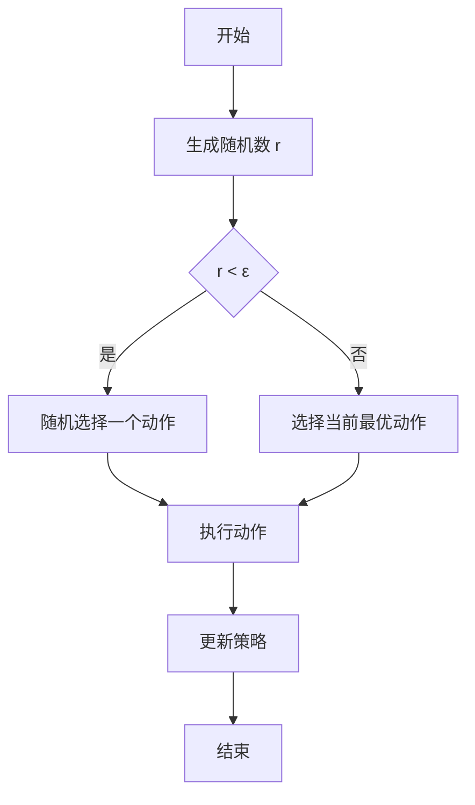
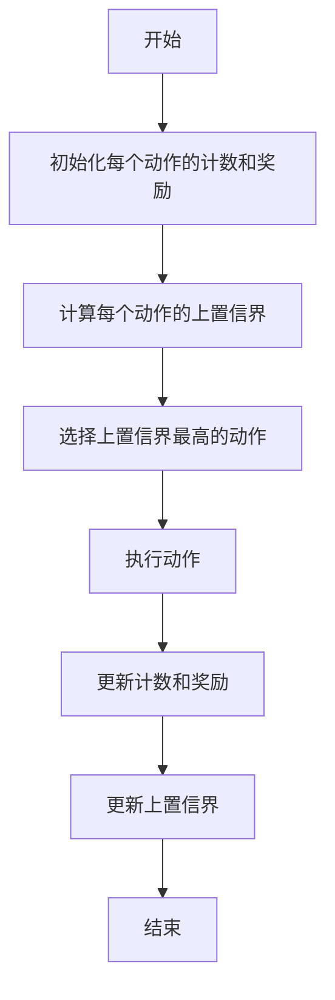

# 探索与利用 (Exploration and Exploitation)

## 1.背景介绍

在计算机科学和人工智能领域，探索（Exploration）与利用（Exploitation）是两个核心概念，尤其在强化学习、搜索算法和优化问题中尤为重要。探索指的是尝试新的策略或路径，以期发现更优的解决方案；而利用则是指使用当前已知的最佳策略或路径，以最大化当前的收益。这两者之间的平衡是许多算法和系统设计中的关键问题。

## 2.核心概念与联系

### 2.1 探索（Exploration）

探索是指在未知或部分已知的环境中，尝试不同的策略或路径，以期发现新的信息或更优的解决方案。探索的目的是增加对环境的了解，从而在未来的决策中做出更好的选择。

### 2.2 利用（Exploitation）

利用是指在已知的环境中，使用当前已知的最佳策略或路径，以最大化当前的收益。利用的目的是在当前的决策中获得最大的回报。

### 2.3 探索与利用的平衡

在实际应用中，探索与利用之间的平衡是一个关键问题。如果过度探索，可能会浪费大量资源在不必要的尝试上；如果过度利用，可能会错过更优的解决方案。这个平衡问题在强化学习、搜索算法和优化问题中尤为重要。

## 3.核心算法原理具体操作步骤

### 3.1 ε-贪婪算法

ε-贪婪算法是一种简单而有效的平衡探索与利用的方法。在每一步决策中，以概率 ε 进行探索，以概率 1-ε 进行利用。



### 3.2 上置信界（UCB）算法

上置信界（Upper Confidence Bound, UCB）算法通过计算每个动作的上置信界来平衡探索与利用。选择上置信界最高的动作进行执行。



## 4.数学模型和公式详细讲解举例说明

### 4.1 ε-贪婪算法

在 ε-贪婪算法中，选择动作的概率公式如下：

$$
P(a) = 
\begin{cases} 
\frac{ε}{|A|} + (1 - ε) & \text{if } a = a^* \\
\frac{ε}{|A|} & \text{otherwise}
\end{cases}
$$

其中，$a^*$ 是当前最优动作，$|A|$ 是动作的总数。

### 4.2 上置信界（UCB）算法

在 UCB 算法中，上置信界的计算公式如下：

$$
UCB(a) = \hat{Q}(a) + c \sqrt{\frac{\ln t}{N(a)}}
$$

其中，$\hat{Q}(a)$ 是动作 $a$ 的平均奖励，$c$ 是一个常数，$t$ 是当前的时间步，$N(a)$ 是动作 $a$ 被选择的次数。

## 5.项目实践：代码实例和详细解释说明

### 5.1 ε-贪婪算法的实现

以下是一个简单的 ε-贪婪算法的 Python 实现：

```python
import numpy as np

class EpsilonGreedy:
    def __init__(self, n_actions, epsilon):
        self.n_actions = n_actions
        self.epsilon = epsilon
        self.q_values = np.zeros(n_actions)
        self.action_counts = np.zeros(n_actions)

    def select_action(self):
        if np.random.rand() < self.epsilon:
            return np.random.randint(self.n_actions)
        else:
            return np.argmax(self.q_values)

    def update(self, action, reward):
        self.action_counts[action] += 1
        self.q_values[action] += (reward - self.q_values[action]) / self.action_counts[action]

# 使用示例
n_actions = 10
epsilon = 0.1
agent = EpsilonGreedy(n_actions, epsilon)

for _ in range(1000):
    action = agent.select_action()
    reward = np.random.randn()  # 假设奖励是一个随机数
    agent.update(action, reward)
```

### 5.2 上置信界（UCB）算法的实现

以下是一个简单的 UCB 算法的 Python 实现：

```python
import numpy as np

class UCB:
    def __init__(self, n_actions, c):
        self.n_actions = n_actions
        self.c = c
        self.q_values = np.zeros(n_actions)
        self.action_counts = np.zeros(n_actions)
        self.total_count = 0

    def select_action(self):
        self.total_count += 1
        ucb_values = self.q_values + self.c * np.sqrt(np.log(self.total_count) / (self.action_counts + 1e-5))
        return np.argmax(ucb_values)

    def update(self, action, reward):
        self.action_counts[action] += 1
        self.q_values[action] += (reward - self.q_values[action]) / self.action_counts[action]

# 使用示例
n_actions = 10
c = 1.0
agent = UCB(n_actions, c)

for _ in range(1000):
    action = agent.select_action()
    reward = np.random.randn()  # 假设奖励是一个随机数
    agent.update(action, reward)
```

## 6.实际应用场景

### 6.1 强化学习

在强化学习中，探索与利用的平衡是一个核心问题。通过适当的探索，智能体可以发现新的策略，从而在长期内获得更高的回报；通过适当的利用，智能体可以在当前的决策中获得最大的回报。

### 6.2 搜索算法

在搜索算法中，探索与利用的平衡同样重要。例如，在启发式搜索算法中，启发式函数的设计需要平衡探索新的路径和利用已知的最佳路径。

### 6.3 优化问题

在优化问题中，探索与利用的平衡可以帮助找到全局最优解，而不是局部最优解。例如，在遗传算法中，通过适当的变异操作，可以增加探索的能力，从而避免陷入局部最优解。

## 7.工具和资源推荐

### 7.1 强化学习库

- OpenAI Gym: 一个用于开发和比较强化学习算法的工具包。
- Stable Baselines: 一个基于 TensorFlow 的强化学习库，提供了多种常用的强化学习算法。

### 7.2 搜索算法库

- NetworkX: 一个用于创建、操作和研究复杂网络结构的 Python 库，支持多种搜索算法。
- AIMA: 一个用于人工智能的 Python 库，包含了多种搜索算法的实现。

### 7.3 优化问题库

- SciPy: 一个用于科学计算的 Python 库，包含了多种优化算法的实现。
- DEAP: 一个用于遗传算法和进化计算的 Python 库。

## 8.总结：未来发展趋势与挑战

探索与利用的平衡问题在计算机科学和人工智能领域中具有广泛的应用前景。随着技术的不断发展，新的算法和方法不断涌现，探索与利用的平衡问题将继续成为研究的热点。同时，如何在大规模数据和复杂环境中实现高效的探索与利用平衡，也是一个重要的挑战。

## 9.附录：常见问题与解答

### 9.1 为什么探索与利用的平衡如此重要？

探索与利用的平衡是许多算法和系统设计中的关键问题。如果过度探索，可能会浪费大量资源在不必要的尝试上；如果过度利用，可能会错过更优的解决方案。

### 9.2 如何选择 ε-贪婪算法中的 ε 值？

ε 值的选择需要根据具体问题进行调整。一般来说，ε 值较大时，探索的能力较强；ε 值较小时，利用的能力较强。可以通过实验和调参来选择合适的 ε 值。

### 9.3 UCB 算法中的常数 c 如何选择？

常数 c 的选择同样需要根据具体问题进行调整。一般来说，c 值较大时，探索的能力较强；c 值较小时，利用的能力较强。可以通过实验和调参来选择合适的 c 值。

---

作者：禅与计算机程序设计艺术 / Zen and the Art of Computer Programming