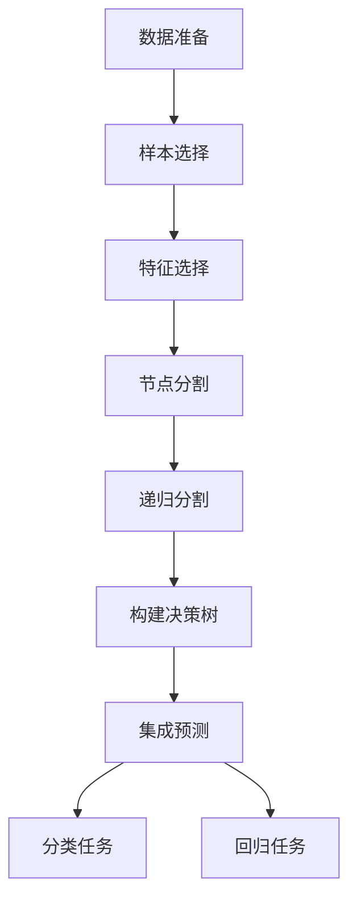

# 随机森林(Random Forests) - 原理与代码实例讲解

## 1.背景介绍

随机森林（Random Forests）是一种集成学习方法，广泛应用于分类和回归任务中。它通过构建多个决策树并结合其预测结果来提高模型的准确性和鲁棒性。随机森林由Leo Breiman和Adele Cutler在2001年提出，迅速成为机器学习领域的重要工具。

### 1.1 什么是随机森林

随机森林是一种基于决策树的集成学习方法。它通过构建多个决策树，并在预测时结合这些树的结果来提高模型的性能。每棵树都是在一个随机子集上训练的，这种随机性使得模型具有更好的泛化能力。

### 1.2 随机森林的优势

- **高准确性**：通过集成多个决策树，随机森林通常比单一决策树具有更高的准确性。
- **抗过拟合**：随机森林通过随机选择样本和特征，减少了过拟合的风险。
- **处理高维数据**：随机森林能够处理大量特征，并且在特征选择上具有内在的能力。
- **易于并行化**：由于每棵树是独立训练的，随机森林非常适合并行计算。

## 2.核心概念与联系

### 2.1 决策树

决策树是随机森林的基本构建单元。决策树通过递归地分割数据集，构建一个树状结构来进行预测。每个节点根据某个特征的阈值将数据分割成两个子集，直到满足停止条件。

### 2.2 Bagging（Bootstrap Aggregating）

Bagging是一种集成学习技术，通过在不同的样本子集上训练多个模型，并将它们的预测结果结合起来。随机森林使用Bagging来构建多个决策树，每棵树在一个随机样本子集上训练。

### 2.3 随机特征选择

在构建每棵决策树时，随机森林在每个节点分割时随机选择一部分特征。这种随机特征选择进一步增加了模型的多样性，减少了过拟合的风险。

### 2.4 集成预测

随机森林通过结合所有决策树的预测结果来进行最终预测。对于分类任务，通常采用多数投票法；对于回归任务，采用平均法。

## 3.核心算法原理具体操作步骤

### 3.1 数据准备

首先，准备好训练数据集和测试数据集。数据集应包含特征和标签。

### 3.2 构建决策树

1. **样本选择**：从训练数据集中随机选择一个子集（有放回抽样）。
2. **特征选择**：在每个节点分割时，随机选择一部分特征。
3. **节点分割**：根据选定的特征和阈值，将数据分割成两个子集。
4. **递归分割**：对每个子集递归地重复上述步骤，直到满足停止条件（如最大深度或最小样本数）。

### 3.3 集成预测

1. **分类任务**：对每棵树的预测结果进行多数投票，选择出现次数最多的类别。
2. **回归任务**：对每棵树的预测结果进行平均，得到最终预测值。

以下是随机森林算法的Mermaid流程图：



## 4.数学模型和公式详细讲解举例说明

### 4.1 决策树的构建

决策树通过最大化信息增益或最小化基尼不纯度来选择最佳分割特征和阈值。

#### 信息增益

信息增益用于衡量某个特征在分割数据集时带来的不确定性减少量。信息增益的公式为：

$$
IG(D, A) = H(D) - \sum_{v \in \text{Values}(A)} \frac{|D_v|}{|D|} H(D_v)
$$

其中，$H(D)$ 是数据集 $D$ 的熵，$D_v$ 是特征 $A$ 取值为 $v$ 的子集。

#### 基尼不纯度

基尼不纯度用于衡量数据集的不纯度。基尼不纯度的公式为：

$$
G(D) = 1 - \sum_{i=1}^{C} p_i^2
$$

其中，$p_i$ 是类别 $i$ 在数据集 $D$ 中的概率，$C$ 是类别的总数。

### 4.2 Bagging

Bagging通过在不同的样本子集上训练多个模型，并将它们的预测结果结合起来。假设有 $N$ 个样本，Bagging的样本选择过程为：

$$
D_i = \{(x_1, y_1), (x_2, y_2), \ldots, (x_N, y_N)\}
$$

其中，$D_i$ 是第 $i$ 个样本子集，$x_j$ 和 $y_j$ 分别是样本的特征和标签。

### 4.3 随机特征选择

在构建每棵决策树时，随机森林在每个节点分割时随机选择 $m$ 个特征。假设有 $M$ 个特征，随机特征选择的过程为：

$$
\text{FeatureSubset} = \{f_1, f_2, \ldots, f_m\}
$$

其中，$f_i$ 是随机选择的特征。

### 4.4 集成预测

随机森林通过结合所有决策树的预测结果来进行最终预测。

#### 分类任务

对于分类任务，采用多数投票法：

$$
\hat{y} = \text{mode}(\{h_1(x), h_2(x), \ldots, h_T(x)\})
$$

其中，$h_i(x)$ 是第 $i$ 棵树对样本 $x$ 的预测结果，$T$ 是决策树的总数。

#### 回归任务

对于回归任务，采用平均法：

$$
\hat{y} = \frac{1}{T} \sum_{i=1}^{T} h_i(x)
$$

其中，$h_i(x)$ 是第 $i$ 棵树对样本 $x$ 的预测结果，$T$ 是决策树的总数。

## 5.项目实践：代码实例和详细解释说明

### 5.1 数据集准备

我们将使用经典的Iris数据集进行分类任务的演示。Iris数据集包含150个样本，每个样本有4个特征和1个标签。

```python
from sklearn.datasets import load_iris
from sklearn.model_selection import train_test_split

# 加载数据集
iris = load_iris()
X = iris.data
y = iris.target

# 划分训练集和测试集
X_train, X_test, y_train, y_test = train_test_split(X, y, test_size=0.3, random_state=42)
```

### 5.2 构建随机森林模型

我们将使用Scikit-learn库中的RandomForestClassifier来构建随机森林模型。

```python
from sklearn.ensemble import RandomForestClassifier
from sklearn.metrics import accuracy_score

# 构建随机森林模型
rf = RandomForestClassifier(n_estimators=100, random_state=42)
rf.fit(X_train, y_train)

# 预测
y_pred = rf.predict(X_test)

# 计算准确率
accuracy = accuracy_score(y_test, y_pred)
print(f'准确率: {accuracy:.2f}')
```

### 5.3 解释模型结果

我们可以通过查看特征重要性来解释模型结果。

```python
import matplotlib.pyplot as plt
import numpy as np

# 获取特征重要性
feature_importances = rf.feature_importances_
features = iris.feature_names

# 可视化特征重要性
indices = np.argsort(feature_importances)[::-1]
plt.figure()
plt.title("Feature Importances")
plt.bar(range(X.shape[1]), feature_importances[indices], color="r", align="center")
plt.xticks(range(X.shape[1]), [features[i] for i in indices], rotation=90)
plt.xlim([-1, X.shape[1]])
plt.show()
```

## 6.实际应用场景

### 6.1 医疗诊断

随机森林在医疗诊断中广泛应用，例如预测疾病的发生、分类病症等。其高准确性和抗过拟合能力使其成为医疗领域的理想选择。

### 6.2 金融风控

在金融领域，随机森林用于信用评分、欺诈检测等任务。通过分析大量的金融数据，随机森林能够有效地识别潜在风险。

### 6.3 营销分析

随机森林在营销分析中用于客户细分、预测客户行为等。通过分析客户数据，企业可以制定更有效的营销策略。

### 6.4 图像识别

在图像识别任务中，随机森林用于特征提取和分类。其高效的特征选择能力使其在图像处理领域表现出色。

## 7.工具和资源推荐

### 7.1 Scikit-learn

Scikit-learn是一个强大的Python机器学习库，提供了随机森林的实现。它易于使用，适合初学者和专业人士。

### 7.2 XGBoost

XGBoost是一个高效的梯度提升库，虽然不是随机森林，但在许多任务中表现优异。它提供了丰富的参数和功能，适合高级用户。

### 7.3 LightGBM

LightGBM是一个高效的梯度提升框架，适用于大规模数据集。它的速度和性能使其在许多实际应用中得到广泛使用。

### 7.4 书籍推荐

- 《集成学习：基础与算法》：详细介绍了集成学习的基础知识和算法，包括随机森林。
- 《机器学习实战》：提供了丰富的机器学习算法实例和代码，包括随机森林的应用。

## 8.总结：未来发展趋势与挑战

### 8.1 未来发展趋势

随机森林作为一种经典的机器学习算法，仍然在不断发展。未来的发展趋势包括：

- **更高效的算法**：研究人员正在开发更高效的随机森林算法，以处理更大规模的数据集。
- **集成深度学习**：将随机森林与深度学习结合，利用两者的优势，提升模型性能。
- **自动化机器学习**：自动化机器学习（AutoML）正在兴起，随机森林作为其中的重要组成部分，将在自动化建模中发挥更大作用。

### 8.2 挑战

尽管随机森林具有许多优点，但也面临一些挑战：

- **计算复杂度**：随机森林的计算复杂度较高，尤其是在处理大规模数据集时。
- **模型解释性**：虽然随机森林具有较好的性能，但其模型解释性较差，难以理解每个特征对预测结果的影响。
- **参数调优**：随机森林的参数较多，调优过程复杂，需要大量的实验和经验。

## 9.附录：常见问题与解答

### 9.1 随机森林与决策树的区别是什么？

随机森林是由多个决策树组成的集成模型，通过结合多个决策树的预测结果来提高模型的准确性和鲁棒性。决策树是随机森林的基本构建单元。

### 9.2 随机森林如何防止过拟合？

随机森林通过Bagging和随机特征选择来防止过拟合。Bagging通过在不同的样本子集上训练多个模型，增加了模型的多样性；随机特征选择通过在每个节点分割时随机选择一部分特征，减少了模型的复杂度。

### 9.3 随机森林的参数如何调优？

随机森林的主要参数包括树的数量（n_estimators）、最大深度（max_depth）、最小样本数（min_samples_split）等。可以通过网格搜索（Grid Search）或随机搜索（Random Search）来调优这些参数。

### 9.4 随机森林适用于哪些类型的数据？

随机森林适用于各种类型的数据，包括分类数据和回归数据。它在处理高维数据和缺失值方面表现出色，适用于医疗、金融、营销、图像识别等多个领域。

### 9.5 随机森林的缺点是什么？

随机森林的主要缺点包括计算复杂度较高、模型解释性较差、参数调优复杂等。尽管如此，随机森林在许多实际应用中仍然表现出色，是一种非常有用的机器学习算法。

---

作者：禅与计算机程序设计艺术 / Zen and the Art of Computer Programming