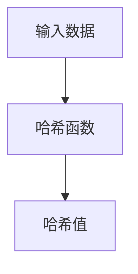
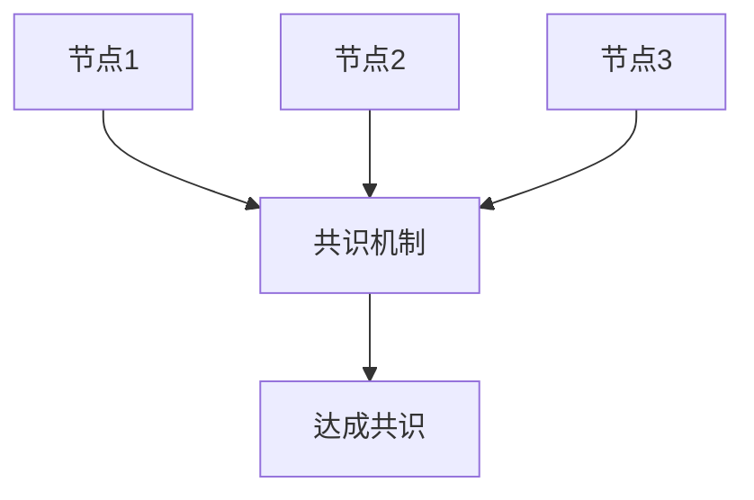
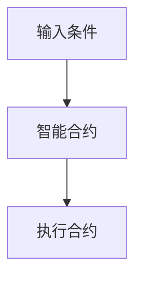

# 区块链与数据可信原理与代码实战案例讲解

## 1.背景介绍

区块链技术自2008年比特币白皮书发布以来，迅速成为技术界和商业界的热门话题。其去中心化、不可篡改和透明的特性，使其在金融、供应链管理、医疗等多个领域展现出巨大的潜力。本文将深入探讨区块链技术的核心概念、算法原理、数学模型，并通过实际代码实例展示其应用。

## 2.核心概念与联系

### 2.1 区块链的定义

区块链是一种分布式账本技术，通过密码学手段确保数据的安全性和一致性。每个区块包含若干交易记录，并通过哈希函数与前一个区块相连，形成链式结构。

### 2.2 数据可信的定义

数据可信是指数据的真实性、完整性和不可篡改性。区块链通过去中心化和密码学技术，确保数据在传输和存储过程中的可信性。

### 2.3 区块链与数据可信的联系

区块链的去中心化和不可篡改特性，使其成为实现数据可信的理想技术。通过分布式账本和共识机制，区块链确保了数据的透明性和一致性。

## 3.核心算法原理具体操作步骤

### 3.1 哈希函数

哈希函数是区块链的基础，通过将任意长度的数据映射为固定长度的哈希值，确保数据的唯一性和不可篡改性。



### 3.2 共识机制

共识机制是区块链网络中节点达成一致的协议。常见的共识机制包括工作量证明（PoW）、权益证明（PoS）和拜占庭容错（BFT）。



### 3.3 智能合约

智能合约是运行在区块链上的自动化协议，能够在满足特定条件时自动执行合约条款。



## 4.数学模型和公式详细讲解举例说明

### 4.1 哈希函数的数学模型

哈希函数 $H$ 将输入 $x$ 映射为固定长度的输出 $H(x)$，满足以下性质：
1. 碰撞抗性：对于任意不同的 $x_1$ 和 $x_2$，$H(x_1) \neq H(x_2)$。
2. 单向性：给定 $H(x)$，难以反推出 $x$。

### 4.2 工作量证明（PoW）

工作量证明通过计算哈希值满足特定条件来达成共识。其数学模型为：
$$
H(nonce + data) < target
$$
其中，$nonce$ 是随机数，$data$ 是区块数据，$target$ 是难度目标。

### 4.3 拜占庭容错（BFT）

拜占庭容错通过多轮投票机制达成共识，确保在存在恶意节点的情况下，系统仍能正常运行。其数学模型为：
$$
f < \frac{n-1}{3}
$$
其中，$f$ 是恶意节点数，$n$ 是总节点数。

## 5.项目实践：代码实例和详细解释说明

### 5.1 创建区块

以下是一个简单的Python代码示例，用于创建区块并计算其哈希值：

```python
import hashlib
import time

class Block:
    def __init__(self, index, previous_hash, timestamp, data):
        self.index = index
        self.previous_hash = previous_hash
        self.timestamp = timestamp
        self.data = data
        self.hash = self.calculate_hash()

    def calculate_hash(self):
        block_string = f"{self.index}{self.previous_hash}{self.timestamp}{self.data}"
        return hashlib.sha256(block_string.encode()).hexdigest()

# 创建创世区块
genesis_block = Block(0, "0", time.time(), "Genesis Block")
print(f"Hash of genesis block: {genesis_block.hash}")
```

### 5.2 实现工作量证明

以下是一个实现工作量证明的Python代码示例：

```python
class Block:
    def __init__(self, index, previous_hash, timestamp, data, difficulty):
        self.index = index
        self.previous_hash = previous_hash
        self.timestamp = timestamp
        self.data = data
        self.difficulty = difficulty
        self.nonce = 0
        self.hash = self.calculate_hash()

    def calculate_hash(self):
        block_string = f"{self.index}{self.previous_hash}{self.timestamp}{self.data}{self.nonce}"
        return hashlib.sha256(block_string.encode()).hexdigest()

    def mine_block(self):
        target = '0' * self.difficulty
        while self.hash[:self.difficulty] != target:
            self.nonce += 1
            self.hash = self.calculate_hash()
        print(f"Block mined: {self.hash}")

# 创建并挖掘区块
block = Block(1, genesis_block.hash, time.time(), "Some data", 4)
block.mine_block()
```

## 6.实际应用场景

### 6.1 金融领域

区块链在金融领域的应用包括跨境支付、证券交易和智能合约。其去中心化和透明性，能够降低交易成本，提高交易效率。

### 6.2 供应链管理

区块链在供应链管理中的应用包括产品溯源、防伪和物流管理。通过区块链技术，可以实现供应链的全程透明，确保产品的真实性和安全性。

### 6.3 医疗健康

区块链在医疗健康领域的应用包括电子病历管理、药品追溯和临床试验数据管理。区块链技术能够确保医疗数据的安全性和隐私性，提高医疗服务的质量。

## 7.工具和资源推荐

### 7.1 开发工具

- **Ethereum**：一个开源的区块链平台，支持智能合约和去中心化应用（DApps）。
- **Hyperledger Fabric**：一个模块化的区块链框架，适用于企业级应用。
- **Truffle**：一个开发、测试和部署智能合约的工具套件。

### 7.2 学习资源

- **《Mastering Bitcoin》**：一本深入讲解比特币和区块链技术的经典书籍。
- **Coursera区块链课程**：提供区块链技术的在线课程，涵盖基础知识和高级应用。
- **GitHub**：大量开源的区块链项目和代码示例，适合学习和实践。

## 8.总结：未来发展趋势与挑战

区块链技术在未来有着广阔的发展前景，但也面临着诸多挑战。随着技术的不断进步，区块链在数据可信、隐私保护和性能优化等方面将取得更大的突破。然而，区块链的广泛应用仍需解决监管、标准化和互操作性等问题。

## 9.附录：常见问题与解答

### 9.1 区块链的性能问题如何解决？

区块链的性能问题可以通过分片技术、侧链和Layer 2解决方案来解决。这些技术能够提高区块链的交易处理能力和扩展性。

### 9.2 区块链如何确保数据的隐私性？

区块链通过零知识证明、同态加密和环签名等密码学技术，确保数据在传输和存储过程中的隐私性。

### 9.3 区块链的去中心化特性如何实现？

区块链的去中心化特性通过分布式账本和共识机制来实现。每个节点都持有完整的账本副本，通过共识机制达成一致，确保数据的一致性和安全性。

---

作者：禅与计算机程序设计艺术 / Zen and the Art of Computer Programming