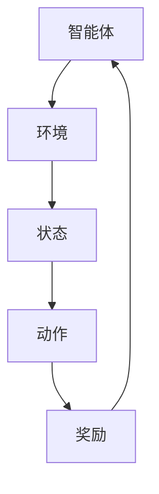

# 强化学习(Reinforcement Learning) - 原理与代码实例讲解

## 1.背景介绍

强化学习（Reinforcement Learning，简称RL）是机器学习的一个重要分支，近年来在人工智能领域取得了显著的进展。与监督学习和无监督学习不同，强化学习通过与环境的交互来学习策略，以最大化累积奖励。RL在游戏、机器人控制、自动驾驶等领域有着广泛的应用。

## 2.核心概念与联系

### 2.1 强化学习的基本要素

强化学习的基本要素包括：

- **智能体（Agent）**：执行动作并与环境交互的主体。
- **环境（Environment）**：智能体所处的外部世界。
- **状态（State）**：环境在某一时刻的具体情况。
- **动作（Action）**：智能体在某一状态下可以执行的操作。
- **奖励（Reward）**：智能体执行动作后从环境获得的反馈。
- **策略（Policy）**：智能体在各个状态下选择动作的规则。
- **价值函数（Value Function）**：评估某一状态或状态-动作对的好坏程度。

### 2.2 强化学习的工作流程

强化学习的工作流程可以用以下Mermaid流程图表示：



## 3.核心算法原理具体操作步骤

### 3.1 Q-Learning

Q-Learning是一种基于值函数的强化学习算法。其核心思想是通过更新Q值来学习最优策略。具体操作步骤如下：

1. 初始化Q表，Q值设为任意值（通常为0）。
2. 在每个时间步t，智能体在状态$s_t$选择动作$a_t$，并执行该动作。
3. 智能体从环境中获得奖励$r_t$，并观察到新的状态$s_{t+1}$。
4. 更新Q值：
   $$
   Q(s_t, a_t) \leftarrow Q(s_t, a_t) + \alpha [r_t + \gamma \max_{a} Q(s_{t+1}, a) - Q(s_t, a_t)]
   $$
5. 重复步骤2-4，直到满足终止条件。

### 3.2 深度Q网络（DQN）

DQN是Q-Learning的扩展，使用神经网络来近似Q值函数。其主要步骤如下：

1. 使用神经网络初始化Q值函数。
2. 在每个时间步t，智能体在状态$s_t$选择动作$a_t$，并执行该动作。
3. 智能体从环境中获得奖励$r_t$，并观察到新的状态$s_{t+1}$。
4. 存储经验回放（state, action, reward, next_state）到经验池。
5. 从经验池中随机抽取小批量样本，计算目标Q值：
   $$
   y = r_t + \gamma \max_{a'} Q(s_{t+1}, a')
   $$
6. 使用梯度下降法更新神经网络参数，使得预测Q值接近目标Q值。
7. 重复步骤2-6，直到满足终止条件。

## 4.数学模型和公式详细讲解举例说明

### 4.1 马尔可夫决策过程（MDP）

强化学习通常建模为马尔可夫决策过程（MDP），其定义为一个五元组 $(S, A, P, R, \gamma)$：

- $S$：状态空间。
- $A$：动作空间。
- $P$：状态转移概率矩阵，$P(s'|s, a)$ 表示在状态$s$执行动作$a$后转移到状态$s'$的概率。
- $R$：奖励函数，$R(s, a)$ 表示在状态$s$执行动作$a$后获得的奖励。
- $\gamma$：折扣因子，$0 \leq \gamma \leq 1$，用于权衡未来奖励的影响。

### 4.2 贝尔曼方程

贝尔曼方程是强化学习中的核心公式，用于描述价值函数的递归关系。对于状态价值函数$V(s)$，贝尔曼方程为：

$$
V(s) = \max_{a} \left[ R(s, a) + \gamma \sum_{s'} P(s'|s, a) V(s') \right]
$$

对于状态-动作价值函数$Q(s, a)$，贝尔曼方程为：

$$
Q(s, a) = R(s, a) + \gamma \sum_{s'} P(s'|s, a) \max_{a'} Q(s', a')
$$

### 4.3 举例说明

假设有一个简单的迷宫环境，智能体需要从起点到达终点。状态$s$表示智能体在迷宫中的位置，动作$a$表示智能体的移动方向（上、下、左、右）。奖励$r$为-1（每移动一步），到达终点的奖励为+10。

在这种情况下，智能体需要通过不断尝试和更新Q值，找到一条最优路径，使得累积奖励最大。

## 5.项目实践：代码实例和详细解释说明

### 5.1 Q-Learning代码实例

以下是一个使用Q-Learning解决迷宫问题的Python代码示例：

```python
import numpy as np

# 定义迷宫环境
class Maze:
    def __init__(self):
        self.state_space = [(i, j) for i in range(5) for j in range(5)]
        self.action_space = ['up', 'down', 'left', 'right']
        self.terminal_state = (4, 4)
        self.reset()

    def reset(self):
        self.state = (0, 0)
        return self.state

    def step(self, action):
        i, j = self.state
        if action == 'up':
            i = max(0, i - 1)
        elif action == 'down':
            i = min(4, i + 1)
        elif action == 'left':
            j = max(0, j - 1)
        elif action == 'right':
            j = min(4, j + 1)
        self.state = (i, j)
        reward = -1
        done = self.state == self.terminal_state
        if done:
            reward = 10
        return self.state, reward, done

# 初始化Q表
Q = {}
for state in Maze().state_space:
    Q[state] = {action: 0 for action in Maze().action_space}

# Q-Learning算法
def q_learning(env, episodes, alpha, gamma, epsilon):
    for _ in range(episodes):
        state = env.reset()
        while True:
            if np.random.rand() < epsilon:
                action = np.random.choice(env.action_space)
            else:
                action = max(Q[state], key=Q[state].get)
            next_state, reward, done = env.step(action)
            best_next_action = max(Q[next_state], key=Q[next_state].get)
            Q[state][action] += alpha * (reward + gamma * Q[next_state][best_next_action] - Q[state][action])
            state = next_state
            if done:
                break

# 训练智能体
env = Maze()
q_learning(env, episodes=1000, alpha=0.1, gamma=0.9, epsilon=0.1)

# 打印Q表
for state in Q:
    print(state, Q[state])
```

### 5.2 DQN代码实例

以下是一个使用DQN解决CartPole问题的Python代码示例：

```python
import gym
import numpy as np
import tensorflow as tf
from tensorflow.keras import layers

# 创建CartPole环境
env = gym.make('CartPole-v1')

# 定义DQN模型
def create_model(state_shape, action_shape):
    model = tf.keras.Sequential()
    model.add(layers.Dense(24, input_shape=state_shape, activation='relu'))
    model.add(layers.Dense(24, activation='relu'))
    model.add(layers.Dense(action_shape, activation='linear'))
    model.compile(optimizer=tf.keras.optimizers.Adam(learning_rate=0.001), loss='mse')
    return model

# 初始化DQN参数
state_shape = env.observation_space.shape
action_shape = env.action_space.n
model = create_model(state_shape, action_shape)
target_model = create_model(state_shape, action_shape)
target_model.set_weights(model.get_weights())

# 经验回放
class ReplayBuffer:
    def __init__(self, size):
        self.buffer = []
        self.size = size

    def add(self, experience):
        if len(self.buffer) >= self.size:
            self.buffer.pop(0)
        self.buffer.append(experience)

    def sample(self, batch_size):
        return np.random.choice(self.buffer, batch_size)

# DQN算法
def dqn(env, episodes, gamma, epsilon, epsilon_min, epsilon_decay, batch_size, target_update):
    replay_buffer = ReplayBuffer(2000)
    for episode in range(episodes):
        state = env.reset()
        state = np.reshape(state, [1, state_shape[0]])
        total_reward = 0
        for time in range(500):
            if np.random.rand() < epsilon:
                action = np.random.choice(action_shape)
            else:
                action = np.argmax(model.predict(state))
            next_state, reward, done, _ = env.step(action)
            next_state = np.reshape(next_state, [1, state_shape[0]])
            replay_buffer.add((state, action, reward, next_state, done))
            state = next_state
            total_reward += reward
            if done:
                print(f"Episode: {episode+1}/{episodes}, Score: {total_reward}")
                break
            if len(replay_buffer.buffer) > batch_size:
                minibatch = replay_buffer.sample(batch_size)
                for state, action, reward, next_state, done in minibatch:
                    target = reward
                    if not done:
                        target += gamma * np.amax(target_model.predict(next_state))
                    target_f = model.predict(state)
                    target_f[0][action] = target
                    model.fit(state, target_f, epochs=1, verbose=0)
            if epsilon > epsilon_min:
                epsilon *= epsilon_decay
        if episode % target_update == 0:
            target_model.set_weights(model.get_weights())

# 训练智能体
dqn(env, episodes=1000, gamma=0.95, epsilon=1.0, epsilon_min=0.01, epsilon_decay=0.995, batch_size=64, target_update=10)
```

## 6.实际应用场景

### 6.1 游戏AI

强化学习在游戏AI中有着广泛的应用。例如，AlphaGo使用强化学习击败了世界顶级围棋选手。通过不断与自己对弈，AlphaGo学会了复杂的围棋策略。

### 6.2 机器人控制

在机器人控制领域，强化学习可以帮助机器人学会复杂的操作任务。例如，使用强化学习算法，机器人可以学会如何抓取物体、行走、甚至跳跃。

### 6.3 自动驾驶

自动驾驶汽车需要在复杂的交通环境中做出实时决策。强化学习可以帮助自动驾驶系统学会如何在不同的交通状况下做出最优决策，从而提高行车安全性和效率。

### 6.4 金融交易

在金融交易中，强化学习可以用于优化交易策略。通过不断学习市场数据，智能体可以找到最优的买卖时机，从而最大化投资回报。

## 7.工具和资源推荐

### 7.1 开源库

- **OpenAI Gym**：一个用于开发和比较强化学习算法的工具包。
- **TensorFlow**：一个用于机器学习和深度学习的开源库，支持DQN等强化学习算法。
- **PyTorch**：另一个流行的深度学习框架，广泛用于强化学习研究。

### 7.2 在线课程

- **Coursera**：提供多门关于强化学习的在线课程，例如“Reinforcement Learning Specialization”。
- **Udacity**：提供“Deep Reinforcement Learning Nanodegree”课程，涵盖DQN、A3C等先进算法。

### 7.3 书籍推荐

- **《Reinforcement Learning: An Introduction》**：Richard S. Sutton和Andrew G. Barto所著，是强化学习领域的经典教材。
- **《Deep Reinforcement Learning Hands-On》**：Maxim Lapan所著，详细介绍了深度强化学习的实战技巧。

## 8.总结：未来发展趋势与挑战

### 8.1 未来发展趋势

强化学习在未来有着广阔的发展前景。随着计算能力的提升和算法的改进，强化学习将在更多领域得到应用。例如，在医疗领域，强化学习可以用于个性化治疗方案的优化；在能源管理中，强化学习可以帮助优化能源分配和使用。

### 8.2 挑战

尽管强化学习有着巨大的潜力，但仍面临一些挑战：

- **样本效率**：强化学习算法通常需要大量的样本进行训练，这在实际应用中可能不现实。
- **稳定性**：一些强化学习算法在训练过程中可能会出现不稳定的情况，导致训练失败。
- **可解释性**：强化学习模型通常是黑箱模型，难以解释其决策过程，这在某些应用场景中是不可接受的。

## 9.附录：常见问题与解答

### 9.1 强化学习与监督学习的区别是什么？

强化学习通过与环境的交互来学习策略，以最大化累积奖励；而监督学习通过已标注的数据进行训练，以最小化预测误差。

### 9.2 什么是折扣因子$\gamma$？

折扣因子$\gamma$用于权衡未来奖励的影响，取值范围为0到1。$\gamma$越大，智能体越重视未来的奖励。

### 9.3 如何选择合适的学习率$\alpha$？

学习率$\alpha$决定了Q值更新的步长。$\alpha$过大可能导致训练不稳定，$\alpha$过小可能导致收敛速度慢。通常通过实验调整$\alpha$的值。

### 9.4 什么是经验回放？

经验回放是一种存储和重用智能体与环境交互经验的方法。通过从经验池中随机抽取小批量样本进行训练，可以提高训练的稳定性和效率。

### 9.5 如何处理强化学习中的探索与利用问题？

探索与利用问题是指智能体在选择动作时需要在探索新动作和利用已知最优动作之间进行权衡。常用的方法包括$\epsilon$-贪婪策略和UCB（Upper Confidence Bound）算法。

---

作者：禅与计算机程序设计艺术 / Zen and the Art of Computer Programming