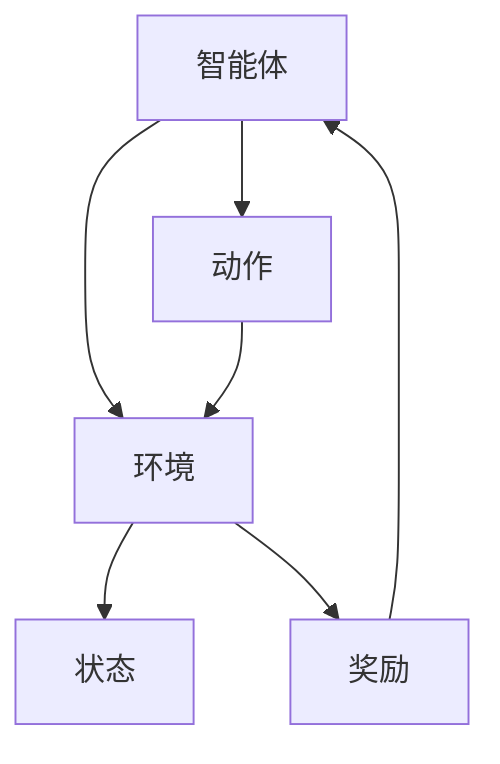

# 强化学习Reinforcement Learning在自动化控制系统中的运用

## 1.背景介绍

在现代工业和科技领域，自动化控制系统已经成为不可或缺的一部分。传统的控制系统依赖于预先设定的规则和模型，然而，这些系统在面对复杂和动态环境时往往表现出局限性。强化学习（Reinforcement Learning, RL）作为一种自适应的学习方法，能够在与环境的交互中不断优化自身策略，因而在自动化控制系统中展现出巨大的潜力。

强化学习的核心思想是通过试错法（Trial and Error）来学习最优策略，使得智能体（Agent）在给定环境（Environment）中获得最大化的累积奖励（Cumulative Reward）。这种方法不仅适用于静态环境，还能在动态和不确定的环境中表现出色。

## 2.核心概念与联系

### 2.1 强化学习的基本概念

强化学习的基本概念包括智能体（Agent）、环境（Environment）、状态（State）、动作（Action）、奖励（Reward）和策略（Policy）。这些概念之间的关系可以用以下Mermaid图表示：



### 2.2 强化学习与自动化控制的联系

在自动化控制系统中，控制器可以视为智能体，系统的状态和输出可以视为环境。控制器通过执行动作（如调整阀门开度、改变电机速度等）来影响环境，并根据环境反馈的奖励信号来调整策略。强化学习通过不断优化策略，使得控制器能够在复杂和动态的环境中实现最优控制。

## 3.核心算法原理具体操作步骤

### 3.1 Q-Learning算法

Q-Learning是一种无模型（Model-Free）的强化学习算法，其核心思想是通过学习状态-动作值函数（Q函数）来指导智能体的行为。Q-Learning的具体操作步骤如下：

1. 初始化Q表格，所有状态-动作对的Q值设为零。
2. 在每个时间步，智能体根据当前状态选择一个动作（通常使用ε-贪婪策略）。
3. 执行动作，观察新的状态和奖励。
4. 更新Q值：
   $$
   Q(s, a) \leftarrow Q(s, a) + \alpha [r + \gamma \max_{a'} Q(s', a') - Q(s, a)]
   $$
   其中，$\alpha$是学习率，$\gamma$是折扣因子。
5. 重复步骤2-4，直到收敛。

### 3.2 深度Q网络（DQN）

深度Q网络（Deep Q-Network, DQN）结合了深度学习和Q-Learning，通过神经网络来近似Q函数。DQN的具体操作步骤如下：

1. 使用神经网络初始化Q函数。
2. 在每个时间步，智能体根据当前状态选择一个动作（通常使用ε-贪婪策略）。
3. 执行动作，观察新的状态和奖励。
4. 存储经验（状态、动作、奖励、新状态）到经验回放池。
5. 从经验回放池中随机抽取小批量样本，更新神经网络参数：
   $$
   L(\theta) = \mathbb{E}[(r + \gamma \max_{a'} Q(s', a'; \theta^-) - Q(s, a; \theta))^2]
   $$
   其中，$\theta$是当前网络参数，$\theta^-$是目标网络参数。
6. 定期更新目标网络参数。
7. 重复步骤2-6，直到收敛。

## 4.数学模型和公式详细讲解举例说明

### 4.1 马尔可夫决策过程（MDP）

强化学习问题通常可以建模为马尔可夫决策过程（Markov Decision Process, MDP）。MDP由五元组$(S, A, P, R, \gamma)$组成：

- $S$：状态空间
- $A$：动作空间
- $P$：状态转移概率矩阵，$P(s'|s, a)$表示在状态$s$执行动作$a$后转移到状态$s'$的概率
- $R$：奖励函数，$R(s, a)$表示在状态$s$执行动作$a$后获得的奖励
- $\gamma$：折扣因子，$0 \leq \gamma \leq 1$

### 4.2 贝尔曼方程

贝尔曼方程是强化学习中的核心公式，用于描述状态值函数和状态-动作值函数的关系。状态值函数$V(s)$表示在状态$s$下执行最优策略所能获得的期望累积奖励：

$$
V(s) = \max_{a} \left[ R(s, a) + \gamma \sum_{s'} P(s'|s, a) V(s') \right]
$$

状态-动作值函数$Q(s, a)$表示在状态$s$下执行动作$a$并随后按照最优策略所能获得的期望累积奖励：

$$
Q(s, a) = R(s, a) + \gamma \sum_{s'} P(s'|s, a) \max_{a'} Q(s', a')
$$

### 4.3 举例说明

假设我们有一个简单的自动化温控系统，状态$s$表示当前温度，动作$a$表示加热或冷却，奖励$r$表示温度接近目标值的程度。我们可以使用Q-Learning算法来优化温控策略。

1. 初始化Q表格，所有状态-动作对的Q值设为零。
2. 在每个时间步，根据当前温度选择加热或冷却。
3. 执行动作，观察新的温度和奖励。
4. 更新Q值：
   $$
   Q(s, a) \leftarrow Q(s, a) + \alpha [r + \gamma \max_{a'} Q(s', a') - Q(s, a)]
   $$
5. 重复步骤2-4，直到温控策略收敛。

## 5.项目实践：代码实例和详细解释说明

### 5.1 环境搭建

首先，我们需要安装必要的Python库：

```bash
pip install numpy gym
```

### 5.2 Q-Learning代码实例

以下是一个使用Q-Learning算法优化温控策略的代码实例：

```python
import numpy as np
import gym

# 创建环境
env = gym.make('CartPole-v1')

# 初始化Q表格
state_space = env.observation_space.shape[0]
action_space = env.action_space.n
Q = np.zeros((state_space, action_space))

# 超参数
alpha = 0.1
gamma = 0.99
epsilon = 0.1
episodes = 1000

# Q-Learning算法
for episode in range(episodes):
    state = env.reset()
    done = False
    while not done:
        if np.random.rand() < epsilon:
            action = env.action_space.sample()
        else:
            action = np.argmax(Q[state])
        
        next_state, reward, done, _ = env.step(action)
        Q[state, action] = Q[state, action] + alpha * (reward + gamma * np.max(Q[next_state]) - Q[state, action])
        state = next_state

print("训练完成后的Q表格：")
print(Q)
```

### 5.3 代码解释

1. 创建环境：使用OpenAI Gym库创建一个CartPole环境。
2. 初始化Q表格：根据状态空间和动作空间的大小初始化Q表格。
3. 设置超参数：包括学习率（alpha）、折扣因子（gamma）、探索率（epsilon）和训练轮数（episodes）。
4. Q-Learning算法：在每个时间步，根据ε-贪婪策略选择动作，执行动作并观察新的状态和奖励，更新Q值，直到策略收敛。

## 6.实际应用场景

### 6.1 机器人控制

强化学习在机器人控制中的应用非常广泛。例如，机器人可以通过强化学习来学习行走、抓取物体、避障等复杂任务。通过与环境的不断交互，机器人能够自适应地调整策略，实现高效的控制。

### 6.2 智能交通系统

在智能交通系统中，强化学习可以用于优化交通信号灯的控制策略，以减少交通拥堵和提高交通流量。智能体可以通过观察交通流量数据，学习最优的信号灯切换策略，从而实现交通系统的智能化管理。

### 6.3 能源管理

强化学习在能源管理中的应用也非常广泛。例如，在智能电网中，强化学习可以用于优化电力分配策略，以最大化能源利用效率和减少能源浪费。智能体可以通过观察电力需求和供应情况，学习最优的电力分配策略。

## 7.工具和资源推荐

### 7.1 开源库

- **OpenAI Gym**：一个用于开发和比较强化学习算法的工具包，提供了多种环境和接口。
- **TensorFlow**：一个开源的机器学习框架，支持深度学习和强化学习。
- **PyTorch**：另一个流行的开源深度学习框架，支持动态计算图和强化学习。

### 7.2 在线课程

- **Coursera**：提供多门关于强化学习的在线课程，如“Reinforcement Learning Specialization”。
- **edX**：提供多门关于强化学习和机器学习的在线课程，如“Artificial Intelligence: Reinforcement Learning”。

### 7.3 书籍推荐

- **《强化学习：原理与实践》**：一本详细介绍强化学习理论和实践的书籍，适合初学者和进阶读者。
- **《深度强化学习》**：一本专注于深度强化学习的书籍，介绍了DQN、A3C等先进算法。

## 8.总结：未来发展趋势与挑战

### 8.1 未来发展趋势

强化学习在自动化控制系统中的应用前景广阔。随着计算能力的提升和算法的不断改进，强化学习将在更多复杂和动态的环境中展现出强大的适应能力。未来，强化学习有望在智能制造、无人驾驶、智能家居等领域实现更广泛的应用。

### 8.2 挑战

尽管强化学习在自动化控制系统中展现出巨大的潜力，但仍面临一些挑战。例如，训练过程中的高计算成本、样本效率低、策略的稳定性和鲁棒性等问题。解决这些挑战需要进一步的研究和技术创新。

## 9.附录：常见问题与解答

### 9.1 强化学习与监督学习的区别是什么？

强化学习和监督学习的主要区别在于数据的获取方式。监督学习依赖于标注数据，通过学习输入和输出之间的映射关系来进行预测。而强化学习通过与环境的交互，基于奖励信号来优化策略，不需要预先标注的数据。

### 9.2 如何选择合适的强化学习算法？

选择合适的强化学习算法取决于具体的应用场景和问题特点。对于状态空间和动作空间较小的问题，可以选择Q-Learning等简单算法。对于状态空间和动作空间较大的问题，可以选择DQN、A3C等深度强化学习算法。

### 9.3 强化学习在实际应用中有哪些成功案例？

强化学习在实际应用中已经取得了一些成功案例。例如，AlphaGo通过强化学习击败了人类围棋冠军；DeepMind的强化学习算法在Atari游戏中表现出色；Uber通过强化学习优化了其自动驾驶系统。

---

作者：禅与计算机程序设计艺术 / Zen and the Art of Computer Programming