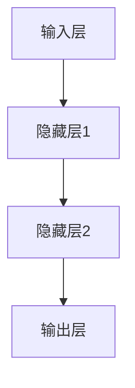
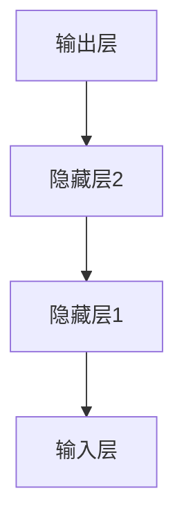

# 深度学习原理与代码实例讲解

## 1.背景介绍

深度学习（Deep Learning）作为人工智能（AI）和机器学习（Machine Learning）领域的一个重要分支，近年来取得了显著的进展。它通过模拟人脑的神经网络结构，能够在图像识别、自然语言处理、语音识别等多个领域实现突破性的成果。深度学习的核心在于其多层神经网络结构，这使得它能够从大量数据中自动提取特征并进行复杂的模式识别。

## 2.核心概念与联系

### 2.1 神经网络

神经网络是深度学习的基础结构。它由多个层（Layer）组成，每一层包含若干个神经元（Neuron）。神经网络的基本单元是感知器（Perceptron），它模拟了生物神经元的工作原理。

### 2.2 深度神经网络

深度神经网络（DNN）是指具有多个隐藏层的神经网络。每一层的输出作为下一层的输入，通过层层传递，最终得到输出结果。深度神经网络能够捕捉数据中的复杂模式和特征。

### 2.3 激活函数

激活函数（Activation Function）是神经网络中的一个重要组件，它引入了非线性因素，使得神经网络能够处理复杂的非线性问题。常见的激活函数包括ReLU、Sigmoid和Tanh等。

### 2.4 损失函数

损失函数（Loss Function）用于衡量模型预测值与真实值之间的差距。通过最小化损失函数，模型能够不断优化其参数，提高预测精度。常见的损失函数有均方误差（MSE）和交叉熵（Cross-Entropy）等。

### 2.5 反向传播

反向传播（Backpropagation）是训练神经网络的核心算法。它通过计算损失函数的梯度，逐层更新网络的权重和偏置，从而使得模型的预测结果逐步逼近真实值。

### 2.6 优化算法

优化算法用于调整神经网络的参数，以最小化损失函数。常见的优化算法包括梯度下降（Gradient Descent）、随机梯度下降（SGD）和Adam等。

## 3.核心算法原理具体操作步骤

### 3.1 前向传播

前向传播（Forward Propagation）是指数据从输入层经过各个隐藏层，最终到达输出层的过程。在每一层，输入数据通过权重和偏置进行线性变换，然后通过激活函数引入非线性因素，最终得到输出结果。



### 3.2 计算损失

在前向传播得到输出结果后，计算损失函数的值，以衡量模型预测结果与真实值之间的差距。

### 3.3 反向传播

反向传播通过计算损失函数对每一层参数的梯度，逐层更新网络的权重和偏置。具体步骤如下：

1. 计算输出层的梯度。
2. 逐层向前计算隐藏层的梯度。
3. 更新每一层的权重和偏置。



### 3.4 参数更新

使用优化算法，根据计算得到的梯度，更新神经网络的参数。常见的优化算法有梯度下降和Adam等。

## 4.数学模型和公式详细讲解举例说明

### 4.1 感知器模型

感知器的数学模型可以表示为：

$$
y = f(\sum_{i=1}^{n} w_i x_i + b)
$$

其中，$w_i$ 是权重，$x_i$ 是输入，$b$ 是偏置，$f$ 是激活函数。

### 4.2 损失函数

以均方误差（MSE）为例，其公式为：

$$
L = \frac{1}{2m} \sum_{i=1}^{m} (y_i - \hat{y}_i)^2
$$

其中，$m$ 是样本数量，$y_i$ 是真实值，$\hat{y}_i$ 是预测值。

### 4.3 反向传播

反向传播的核心在于链式法则（Chain Rule），其公式为：

$$
\frac{\partial L}{\partial w} = \frac{\partial L}{\partial y} \cdot \frac{\partial y}{\partial z} \cdot \frac{\partial z}{\partial w}
$$

其中，$L$ 是损失函数，$y$ 是输出，$z$ 是线性变换结果，$w$ 是权重。

## 5.项目实践：代码实例和详细解释说明

### 5.1 数据准备

首先，我们需要准备数据集。以MNIST手写数字识别数据集为例：

```python
import tensorflow as tf
from tensorflow.keras.datasets import mnist

# 加载数据集
(x_train, y_train), (x_test, y_test) = mnist.load_data()

# 数据预处理
x_train = x_train.reshape(-1, 28*28) / 255.0
x_test = x_test.reshape(-1, 28*28) / 255.0
```

### 5.2 构建模型

使用Keras构建一个简单的全连接神经网络：

```python
from tensorflow.keras.models import Sequential
from tensorflow.keras.layers import Dense

# 构建模型
model = Sequential([
    Dense(128, activation='relu', input_shape=(784,)),
    Dense(64, activation='relu'),
    Dense(10, activation='softmax')
])

# 编译模型
model.compile(optimizer='adam', loss='sparse_categorical_crossentropy', metrics=['accuracy'])
```

### 5.3 训练模型

使用训练数据训练模型：

```python
# 训练模型
model.fit(x_train, y_train, epochs=10, batch_size=32, validation_split=0.2)
```

### 5.4 评估模型

使用测试数据评估模型性能：

```python
# 评估模型
loss, accuracy = model.evaluate(x_test, y_test)
print(f'Test accuracy: {accuracy}')
```

## 6.实际应用场景

### 6.1 图像识别

深度学习在图像识别领域取得了显著的成果。通过卷积神经网络（CNN），可以实现高精度的图像分类、目标检测和图像分割等任务。

### 6.2 自然语言处理

在自然语言处理（NLP）领域，深度学习模型如循环神经网络（RNN）和Transformer被广泛应用于机器翻译、文本生成和情感分析等任务。

### 6.3 语音识别

深度学习在语音识别领域也有广泛应用。通过长短期记忆网络（LSTM）和卷积神经网络（CNN），可以实现高精度的语音识别和语音合成。

## 7.工具和资源推荐

### 7.1 深度学习框架

- TensorFlow：谷歌开发的开源深度学习框架，支持多种平台和设备。
- PyTorch：Facebook开发的开源深度学习框架，具有灵活的动态计算图和强大的社区支持。

### 7.2 数据集

- MNIST：手写数字识别数据集，常用于深度学习模型的入门练习。
- ImageNet：大规模图像数据集，广泛用于图像分类和目标检测任务。

### 7.3 在线资源

- Coursera：提供多门深度学习相关的在线课程。
- GitHub：丰富的开源项目和代码示例，便于学习和参考。

## 8.总结：未来发展趋势与挑战

深度学习在多个领域取得了显著的成果，但仍面临一些挑战。未来的发展趋势包括：

### 8.1 模型可解释性

深度学习模型的黑箱特性使得其决策过程难以解释。未来的研究将致力于提高模型的可解释性，使得其应用更加透明和可信。

### 8.2 数据隐私与安全

随着数据量的增加，数据隐私和安全问题变得愈发重要。未来的研究将关注如何在保护数据隐私的前提下，充分利用数据进行模型训练。

### 8.3 计算资源与效率

深度学习模型的训练和推理过程需要大量的计算资源。未来的研究将致力于提高模型的计算效率，降低资源消耗。

## 9.附录：常见问题与解答

### 9.1 深度学习与传统机器学习的区别是什么？

深度学习通过多层神经网络自动提取特征，而传统机器学习通常需要手工设计特征。深度学习在处理复杂数据和大规模数据时表现更优。

### 9.2 如何选择合适的激活函数？

不同的激活函数适用于不同的场景。ReLU常用于隐藏层，Sigmoid和Softmax常用于输出层。选择激活函数时需要考虑模型的具体任务和数据特性。

### 9.3 如何防止过拟合？

防止过拟合的方法包括使用正则化（如L2正则化）、Dropout、数据增强和交叉验证等。

### 9.4 深度学习模型的训练时间为什么这么长？

深度学习模型通常具有大量的参数，需要处理大规模数据，训练过程涉及大量的矩阵运算，因此训练时间较长。可以通过使用GPU加速和分布式训练来缩短训练时间。

### 9.5 如何调试深度学习模型？

调试深度学习模型的方法包括检查数据预处理、可视化训练过程、调整超参数和使用调试工具（如TensorBoard）等。

---

作者：禅与计算机程序设计艺术 / Zen and the Art of Computer Programming