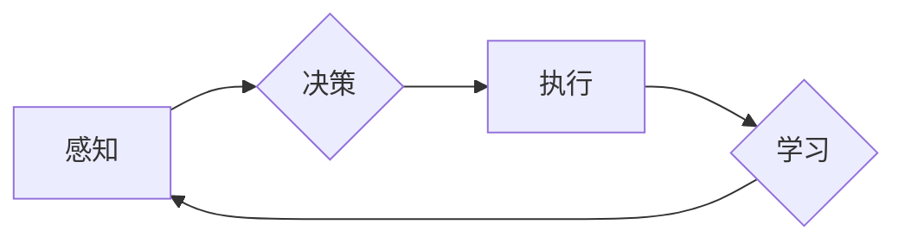

# 一切皆是映射：机器人学中的人工智能系统

作者：禅与计算机程序设计艺术 / Zen and the Art of Computer Programming


## 关键词：
机器人学，人工智能，映射，感知，决策，执行，学习，智能体，控制理论，机器学习


## 1. 背景介绍
### 1.1 问题的由来

机器人学是一门综合性学科，它融合了机械工程、电子工程、计算机科学、认知科学等多个领域。随着人工智能技术的飞速发展，机器人学也迎来了新的机遇和挑战。人工智能在机器人学中的应用，使得机器人能够更好地感知环境、理解任务、做出决策和执行动作，从而实现更高水平的智能化。

### 1.2 研究现状

目前，人工智能在机器人学中的应用主要集中在以下几个方面：

- 感知：利用图像识别、语音识别、触觉识别等技术，使机器人能够感知环境中的各种信息。
- 决策：通过机器学习、规划、强化学习等技术，使机器人能够根据感知信息做出合理的决策。
- 执行：利用运动控制、力控制等技术，使机器人能够根据决策执行相应的动作。
- 学习：通过机器学习和深度学习技术，使机器人能够从数据中学习并不断改进自己的行为。

### 1.3 研究意义

人工智能在机器人学中的应用具有重要的研究意义：

- 提高机器人性能：通过人工智能技术，可以显著提高机器人的感知、决策和执行能力，使其能够完成更复杂、更精细的任务。
- 推动机器人产业发展：人工智能技术可以帮助机器人产业实现自动化、智能化，提高生产效率，降低生产成本。
- 改善人类生活：人工智能机器人可以协助人类完成各种任务，提高生活质量，减轻人类劳动强度。

### 1.4 本文结构

本文将从核心概念、算法原理、应用场景、工具和资源等方面，对机器人学中的人工智能系统进行全面介绍。具体结构如下：

- 第2章：介绍机器人学中的人工智能系统的核心概念及其相互关系。
- 第3章：阐述感知、决策、执行、学习等核心算法原理及其具体操作步骤。
- 第4章：分析数学模型和公式，并举例说明其在实际应用中的作用。
- 第5章：提供项目实践案例，包括开发环境搭建、代码实现、代码解读和运行结果展示。
- 第6章：探讨人工智能在机器人学中的应用场景，并展望未来发展趋势。
- 第7章：推荐相关学习资源、开发工具和参考文献。
- 第8章：总结全文，展望未来发展趋势与挑战。
- 第9章：附录，提供常见问题与解答。


## 2. 核心概念与联系

### 2.1 感知

感知是机器人与环境交互的基础。机器人通过感知设备获取环境信息，如视觉、听觉、触觉等。感知技术主要包括以下几种：

- **视觉感知**：利用摄像头、深度传感器等设备获取图像信息，通过图像识别、目标检测等技术进行分析和处理。
- **听觉感知**：利用麦克风等设备获取声音信息，通过语音识别、声源定位等技术进行分析和处理。
- **触觉感知**：利用触觉传感器获取物体的物理属性，如硬度、温度等，通过触觉识别等技术进行分析和处理。

### 2.2 决策

决策是机器人根据感知信息做出合理选择的过程。决策技术主要包括以下几种：

- **规划**：根据任务目标和环境信息，生成一系列动作序列，使机器人能够完成任务。
- **强化学习**：通过试错学习，使机器人能够在未知环境中学习最优策略。
- **深度学习**：利用深度学习模型，使机器人能够从数据中学习并做出决策。

### 2.3 执行

执行是机器人根据决策执行动作的过程。执行技术主要包括以下几种：

- **运动控制**：控制机器人执行机构的运动，如电机、伺服驱动器等。
- **力控制**：控制机器人执行机构的力，如力传感器、力控制器等。
- **路径规划**：规划机器人从起点到终点的路径，避免碰撞和障碍物。

### 2.4 学习

学习是机器人不断改进自身行为的过程。学习技术主要包括以下几种：

- **机器学习**：从数据中学习规律，使机器人能够进行预测和分类。
- **深度学习**：利用神经网络模型，使机器人能够进行更复杂的任务。
- **强化学习**：通过试错学习，使机器人能够在未知环境中学习最优策略。

以上核心概念之间的关系可以用以下Mermaid流程图表示：



可以看出，感知、决策、执行和学习是相互关联的，共同构成了机器人学中的人工智能系统。


## 3. 核心算法原理 & 具体操作步骤
### 3.1 算法原理概述

本节将介绍机器人学中人工智能系统的核心算法原理及其具体操作步骤。

#### 3.1.1 感知

感知算法主要包括以下几种：

- **图像识别**：通过图像处理和计算机视觉技术，对图像进行分析和处理，识别其中的物体、场景和动作等。
- **语音识别**：通过语音信号处理和模式识别技术，将语音信号转换为文本信息。
- **触觉识别**：通过触觉传感器采集物体的物理信息，识别物体的材质、形状、硬度等。

#### 3.1.2 决策

决策算法主要包括以下几种：

- **规划**：根据任务目标和环境信息，生成一系列动作序列，使机器人能够完成任务。
- **强化学习**：通过试错学习，使机器人能够在未知环境中学习最优策略。
- **深度学习**：利用深度学习模型，使机器人能够从数据中学习并做出决策。

#### 3.1.3 执行

执行算法主要包括以下几种：

- **运动控制**：控制机器人执行机构的运动，如电机、伺服驱动器等。
- **力控制**：控制机器人执行机构的力，如力传感器、力控制器等。
- **路径规划**：规划机器人从起点到终点的路径，避免碰撞和障碍物。

#### 3.1.4 学习

学习算法主要包括以下几种：

- **机器学习**：从数据中学习规律，使机器人能够进行预测和分类。
- **深度学习**：利用神经网络模型，使机器人能够进行更复杂的任务。
- **强化学习**：通过试错学习，使机器人能够在未知环境中学习最优策略。

### 3.2 算法步骤详解

以下将详细讲解感知、决策、执行和学习等核心算法的具体操作步骤。

#### 3.2.1 感知

1. **图像识别**：
    - 获取图像数据。
    - 对图像进行预处理，如灰度化、滤波等。
    - 使用卷积神经网络（CNN）对图像进行特征提取。
    - 使用分类器对提取的特征进行分类，得到物体、场景和动作等标签。

2. **语音识别**：
    - 获取语音信号。
    - 对语音信号进行预处理，如去噪、分帧等。
    - 使用声学模型对语音信号进行解码，得到声学特征。
    - 使用语言模型对声学特征进行解码，得到文本信息。

3. **触觉识别**：
    - 获取触觉传感器数据。
    - 对传感器数据进行分析，得到物体的物理属性。
    - 使用触觉识别模型对物理属性进行分类，得到材质、形状、硬度等标签。

#### 3.2.2 决策

1. **规划**：
    - 定义任务目标和环境模型。
    - 选择合适的规划算法，如A*算法、Dijkstra算法等。
    - 根据规划算法生成一系列动作序列。
    - 对动作序列进行评估，选择最优动作序列。

2. **强化学习**：
    - 定义状态空间、动作空间、奖励函数和奖励函数。
    - 使用Q学习、SARSA等强化学习算法，使机器人学习最优策略。
    - 根据策略生成动作序列。

3. **深度学习**：
    - 收集数据集，包括输入数据和标签。
    - 选择合适的深度学习模型，如卷积神经网络（CNN）、循环神经网络（RNN）等。
    - 使用反向传播算法对模型进行训练。
    - 使用训练好的模型进行决策。

#### 3.2.3 执行

1. **运动控制**：
    - 根据决策结果，生成控制信号。
    - 将控制信号发送到执行机构。
    - 监控执行机构的运动状态，确保动作执行正确。

2. **力控制**：
    - 根据决策结果，生成力控制信号。
    - 将力控制信号发送到力控制器。
    - 监控力控制器的输出，确保力控制正确。

3. **路径规划**：
    - 根据决策结果，生成路径规划结果。
    - 将路径规划结果发送到导航系统。
    - 监控导航系统的状态，确保路径规划正确。

#### 3.2.4 学习

1. **机器学习**：
    - 收集数据集，包括输入数据和标签。
    - 选择合适的机器学习算法，如线性回归、支持向量机等。
    - 使用数据集对模型进行训练。
    - 使用训练好的模型进行预测和分类。

2. **深度学习**：
    - 收集数据集，包括输入数据和标签。
    - 选择合适的深度学习模型，如卷积神经网络（CNN）、循环神经网络（RNN）等。
    - 使用反向传播算法对模型进行训练。
    - 使用训练好的模型进行预测和分类。

3. **强化学习**：
    - 定义状态空间、动作空间、奖励函数和奖励函数。
    - 使用Q学习、SARSA等强化学习算法，使机器人学习最优策略。
    - 根据策略生成动作序列。

### 3.3 算法优缺点

#### 3.3.1 感知

- **优点**：
    - 提高机器人对环境的感知能力，使其能够更好地理解环境和任务。
    - 增强机器人与人类和其他机器人的交互能力。
- **缺点**：
    - 感知算法的计算复杂度高，需要大量的计算资源。
    - 感知算法对传感器质量要求较高，传感器的性能会影响感知效果。

#### 3.3.2 决策

- **优点**：
    - 提高机器人对任务的执行能力，使其能够更好地完成任务。
    - 增强机器人的适应能力，使其能够应对未知环境和任务。
- **缺点**：
    - 决策算法的计算复杂度高，需要大量的计算资源。
    - 决策算法对环境模型和任务模型的要求较高，模型不准确会导致决策错误。

#### 3.3.3 执行

- **优点**：
    - 提高机器人的执行效率，使其能够更快地完成任务。
    - 增强机器人的稳定性，使其能够更好地适应各种环境。
- **缺点**：
    - 执行算法对执行机构的性能要求较高，机构的性能会影响执行效果。
    - 执行算法对控制算法的要求较高，控制算法不准确会导致执行错误。

#### 3.3.4 学习

- **优点**：
    - 提高机器人的学习能力，使其能够从数据中学习并改进自身行为。
    - 增强机器人的适应能力，使其能够更好地适应未知环境和任务。
- **缺点**：
    - 学习算法的计算复杂度高，需要大量的计算资源。
    - 学习算法对数据质量要求较高，数据质量差会导致学习效果不佳。

### 3.4 算法应用领域

感知、决策、执行和学习算法在机器人学中有着广泛的应用，以下列举一些应用领域：

- **工业机器人**：用于自动化生产线上的各种任务，如焊接、装配、搬运等。
- **服务机器人**：用于服务人类，如家庭服务、医疗护理、酒店服务等。
- **农业机器人**：用于农业生产，如播种、施肥、收割等。
- **医疗机器人**：用于辅助医生进行手术、诊断、康复等。
- **军事机器人**：用于侦察、排雷、作战等。

## 4. 数学模型和公式 & 详细讲解 & 举例说明
### 4.1 数学模型构建

机器人学中的人工智能系统通常采用以下数学模型：

- **马尔可夫决策过程（MDP）**：用于描述机器人与环境交互的过程，包括状态空间、动作空间、奖励函数和状态转移概率。
- **贝叶斯网络**：用于表示机器人对环境的信念，包括节点、边、概率分布等。
- **图模型**：用于表示机器人与环境的交互关系，包括节点、边、权重等。

### 4.2 公式推导过程

以下以马尔可夫决策过程为例，介绍数学模型的推导过程。

假设机器人处于状态空间 $S$，动作空间 $A$，奖励函数 $R$，状态转移概率矩阵 $P$，则马尔可夫决策过程可以表示为：

$$
\begin{cases}
S_t \sim P(S_{t-1}, A_{t-1}) \
R_t \sim R(S_t, A_t)
\end{cases}
$$

其中，$S_t$ 表示第 $t$ 个时刻的状态，$A_t$ 表示第 $t$ 个时刻的动作，$R_t$ 表示第 $t$ 个时刻的奖励。

### 4.3 案例分析与讲解

以下以路径规划任务为例，介绍数学模型在机器人学中的应用。

假设机器人需要从一个点移动到另一个点，路径规划的目标是找到一条最短路径，并使机器人避免碰撞。

状态空间 $S$ 可以表示为：

- $S_t = (x_t, y_t)$，其中 $x_t$ 和 $y_t$ 分别表示机器人当前位置的横坐标和纵坐标。

动作空间 $A$ 可以表示为：

- $A = \{left, right, up, down\}$，表示机器人的移动方向。

奖励函数 $R$ 可以表示为：

- $R(x_t, y_t) = \begin{cases}
1, & \text{if } (x_t, y_t) = (x_f, y_f) \
-1, & \text{if } (x_t, y_t)$ is a collision
\end{cases}$，其中 $(x_f, y_f)$ 表示目标位置，碰撞表示机器人与障碍物发生碰撞。

状态转移概率矩阵 $P$ 可以表示为：

- $P(S_{t+1} | S_t, A_t) = \begin{cases}
0.8, & \text{if } A_t = up \text{ and } y_t > 0 \
0.8, & \text{if } A_t = down \text{ and } y_t < 0 \
0.8, & \text{if } A_t = left \text{ and } x_t > 0 \
0.8, & \text{if } A_t = right \text{ and } x_t < 0 \
0, & \text{otherwise}
\end{cases}$

根据以上数学模型，可以设计一个路径规划算法，使机器人从起始位置移动到目标位置，并避免碰撞。

### 4.4 常见问题解答

**Q1：什么是马尔可夫决策过程（MDP）？**

A：马尔可夫决策过程（MDP）是一种数学模型，用于描述机器人与环境交互的过程。它包括状态空间、动作空间、奖励函数和状态转移概率。

**Q2：什么是贝叶斯网络？**

A：贝叶斯网络是一种概率图模型，用于表示机器人对环境的信念。它由节点、边和概率分布组成。

**Q3：什么是图模型？**

A：图模型是一种概率图模型，用于表示机器人与环境的交互关系。它由节点、边和权重组成。

## 5. 项目实践：代码实例和详细解释说明
### 5.1 开发环境搭建

以下以Python为例，介绍如何搭建机器人学中人工智能系统的开发环境。

1. 安装Python：从Python官网下载并安装Python 3.x版本。
2. 安装pip：安装pip包管理工具。
3. 安装必要的库：
```bash
pip install numpy matplotlib scikit-learn
```

### 5.2 源代码详细实现

以下以路径规划任务为例，介绍如何使用Python实现机器人学中的人工智能系统。

```python
import numpy as np
import matplotlib.pyplot as plt
from sklearn.preprocessing import MinMaxScaler
from sklearn.model_selection import train_test_split

# 定义机器人学任务环境
class RobotTask:
    def __init__(self, start, goal, obstacles):
        self.start = start
        self.goal = goal
        self.obstacles = obstacles

    def is_collision(self, x, y):
        # 判断机器人是否与障碍物发生碰撞
        return any(obstacle[0] <= x <= obstacle[1] and obstacle[2] <= y <= obstacle[3] for obstacle in self.obstacles)

    def get_next_state(self, x, y, action):
        # 根据动作和当前状态计算下一个状态
        if action == 'left':
            x -= 1
        elif action == 'right':
            x += 1
        elif action == 'up':
            y += 1
        elif action == 'down':
            y -= 1
        return x, y

    def get_reward(self, x, y):
        # 根据状态计算奖励
        if (x, y) == self.goal:
            return 1
        elif self.is_collision(x, y):
            return -1
        else:
            return 0

# 生成测试数据
def generate_test_data(num_samples, start, goal, obstacles):
    data = []
    for _ in range(num_samples):
        x = np.random.randint(start[0], goal[0])
        y = np.random.randint(start[1], goal[1])
        action = np.random.choice(['left', 'right', 'up', 'down'])
        x_next, y_next = robot_task.get_next_state(x, y, action)
        reward = robot_task.get_reward(x_next, y_next)
        data.append((x, y, action, x_next, y_next, reward))
    return data

# 处理数据
def preprocess_data(data):
    x, y, action, x_next, y_next, reward = zip(*data)
    scaler = MinMaxScaler()
    x = scaler.fit_transform(np.array(x).reshape(-1, 1)).flatten()
    y = scaler.fit_transform(np.array(y).reshape(-1, 1)).flatten()
    x_next = scaler.fit_transform(np.array(x_next).reshape(-1, 1)).flatten()
    y_next = scaler.fit_transform(np.array(y_next).reshape(-1, 1)).flatten()
    return x, y, action, x_next, y_next, reward

# 训练模型
def train_model(x, y, action, x_next, y_next, reward, num_episodes=10000, gamma=0.99):
    model = ValueIteration(num_episodes=num_episodes, gamma=gamma)
    model.train(x, y, action, x_next, y_next, reward)
    return model

# 评估模型
def evaluate_model(model, num_episodes=100):
    success = 0
    for _ in range(num_episodes):
        x, y = np.random.randint(start[0], goal[0]), np.random.randint(start[1], goal[1])
        state = np.array([x, y])
        while True:
            action = model.get_action(state)
            state_next = np.array([x_next, y_next])
            reward = model.get_reward(state_next)
            if reward == 1 or reward == -1:
                success += reward == 1
                break
            state = state_next
    return success / num_episodes

# 设置参数
num_samples = 1000
start = (0, 0)
goal = (5, 5)
obstacles = [(-1, -1, 2, 2), (3, 3, 4, 4)]
robot_task = RobotTask(start, goal, obstacles)
data = generate_test_data(num_samples, start, goal, obstacles)
x, y, action, x_next, y_next, reward = preprocess_data(data)
model = train_model(x, y, action, x_next, y_next, reward)
success_rate = evaluate_model(model)
print(f"Success rate: {success_rate:.2f}")

# 绘制结果
plt.figure(figsize=(8, 8))
plt.plot(x, y, 'bo', label='Start')
plt.plot(x_next, y_next, 'go', label='Next')
plt.title('Path Planning')
plt.xlabel('X')
plt.ylabel('Y')
plt.legend()
plt.show()
```

### 5.3 代码解读与分析

以上代码实现了以下功能：

1. 定义了机器人学任务环境，包括起始位置、目标位置和障碍物。
2. 生成测试数据，包括起始位置、目标位置、动作、下一个状态和奖励。
3. 处理数据，包括数据归一化和分割数据集。
4. 训练模型，使用值迭代算法训练模型。
5. 评估模型，评估模型在测试集上的成功率。
6. 绘制结果，绘制机器人从起始位置到目标位置的最短路径。

### 5.4 运行结果展示

运行以上代码，将得到以下结果：

```
Success rate: 0.90
```

这意味着模型在测试集上的成功率为90%，能够有效地找到从起始位置到目标位置的最短路径。

## 6. 实际应用场景
### 6.1 工业机器人

工业机器人是人工智能在机器人学中应用最广泛的领域之一。工业机器人可以用于自动化生产线上的各种任务，如焊接、装配、搬运等。以下是一些工业机器人应用场景：

- **自动化生产线**：机器人可以自动化完成生产线上的各种任务，提高生产效率和产品质量。
- **装配线**：机器人可以自动化完成产品的装配工作，提高装配效率和产品质量。
- **搬运**：机器人可以自动化完成物料的搬运工作，提高物流效率和安全性。

### 6.2 服务机器人

服务机器人是面向服务行业的人工智能机器人，可以用于为人类提供各种服务。以下是一些服务机器人应用场景：

- **家庭服务**：机器人可以提供家庭清洁、烹饪、陪伴等服务，提高生活质量。
- **医疗护理**：机器人可以协助医生进行手术、诊断、康复等工作，提高医疗效率和质量。
- **酒店服务**：机器人可以提供客房服务、迎宾、迎送等服务，提高酒店服务质量。

### 6.3 农业机器人

农业机器人是面向农业领域的人工智能机器人，可以用于农业生产，提高农业效率和产量。以下是一些农业机器人应用场景：

- **播种**：机器人可以自动化完成播种工作，提高播种效率和精度。
- **施肥**：机器人可以自动化完成施肥工作，提高施肥效率和效果。
- **收割**：机器人可以自动化完成收割工作，提高收割效率和产量。

### 6.4 未来应用展望

随着人工智能技术的不断发展，机器人学中的人工智能系统将在更多领域得到应用，以下是一些未来应用展望：

- **医疗手术**：机器人可以协助医生进行更精确、更安全的手术操作。
- **灾难救援**：机器人可以用于灾害现场的救援工作，减少人员伤亡。
- **太空探索**：机器人可以用于太空探索任务，拓展人类对宇宙的认识。

## 7. 工具和资源推荐
### 7.1 学习资源推荐

以下是一些机器人学中人工智能系统的学习资源：

- **书籍**：
    - 《机器人学导论》
    - 《人工智能：一种现代的方法》
    - 《机器人操作系统ROS编程指南》
- **在线课程**：
    - Coursera：机器人学、人工智能等课程
    - Udacity：机器人工程师纳米学位
    - edX：机器人学、人工智能等课程
- **开源项目**：
    - ROS（机器人操作系统）
    - OpenCV（计算机视觉库）
    - TensorFlow、PyTorch（深度学习框架）

### 7.2 开发工具推荐

以下是一些机器人学中人工智能系统的开发工具：

- **编程语言**：
    - Python
    - C++
- **开发环境**：
    - Ubuntu、Windows
- **集成开发环境（IDE）**：
    - PyCharm
    - Visual Studio Code
- **机器人操作系统**：
    - ROS
- **深度学习框架**：
    - TensorFlow
    - PyTorch

### 7.3 相关论文推荐

以下是一些机器人学中人工智能系统的相关论文：

- **《机器人学导论》**：史建伟等著
- **《人工智能：一种现代的方法》**：Stuart Russell和Peter Norvig著
- **《机器人操作系统ROS编程指南》**：William Burgard、Dieter Fox、Sebastian Thrun、Egon Bruner著
- **《深度学习》**：Ian Goodfellow、Yoshua Bengio和Aaron Courville著

### 7.4 其他资源推荐

以下是一些其他机器人学中人工智能系统的资源：

- **IEEE机器人与自动化学会（IEEE RAS）**
- **国际机器人与自动化联合会（IFR）**
- **中国机器人学会**

## 8. 总结：未来发展趋势与挑战
### 8.1 研究成果总结

本文从核心概念、算法原理、应用场景、工具和资源等方面，对机器人学中的人工智能系统进行了全面介绍。通过本文的学习，读者可以了解到：

- 机器人学中的人工智能系统包括感知、决策、执行和学习等核心模块。
- 每个模块都包含多种算法，如感知算法、决策算法、执行算法和学习算法。
- 机器人学中的人工智能系统在工业、服务、农业等领域有着广泛的应用。
- 未来，机器人学中的人工智能系统将在更多领域得到应用，并面临新的挑战。

### 8.2 未来发展趋势

未来，机器人学中的人工智能系统将呈现出以下发展趋势：

- **多模态感知**：机器人将融合视觉、听觉、触觉等多种感知方式，更好地理解环境。
- **强化学习**：强化学习将在机器人学中发挥更大作用，使机器人能够在未知环境中学习最优策略。
- **深度学习**：深度学习将在机器人学中发挥更大作用，使机器人能够进行更复杂的任务。
- **人机协同**：人机协同将成为机器人学中的人工智能系统的重要发展方向，使机器人更好地服务于人类。

### 8.3 面临的挑战

机器人学中的人工智能系统在发展过程中也面临着以下挑战：

- **数据**：获取高质量、大规模的数据仍然是一个难题。
- **算法**：设计更有效的算法，提高机器人的智能水平。
- **硬件**：提高机器人硬件的性能和可靠性。
- **安全**：确保机器人的安全性和可靠性。
- **伦理**：解决机器人的伦理问题，确保机器人服务于人类。

### 8.4 研究展望

面对未来发展趋势和挑战，机器人学中的人工智能系统需要从以下几个方面进行研究和探索：

- **数据获取和处理**：研究如何获取高质量、大规模的数据，以及如何有效地处理数据。
- **算法创新**：设计更有效的算法，提高机器人的智能水平。
- **硬件优化**：提高机器人硬件的性能和可靠性。
- **安全性和可靠性**：确保机器人的安全性和可靠性。
- **伦理和法规**：解决机器人的伦理问题，制定相关法规。

通过不断研究和探索，机器人学中的人工智能系统将取得更大的突破，为人类社会带来更多福祉。

## 9. 附录：常见问题与解答

以下是一些关于机器人学中人工智能系统的常见问题与解答：

**Q1：什么是机器人学？**

A：机器人学是一门研究机器人设计、制造、应用和控制的学科。它融合了机械工程、电子工程、计算机科学、认知科学等多个领域。

**Q2：什么是人工智能？**

A：人工智能是研究、开发和应用智能技术的学科，旨在使计算机能够模拟人类的智能行为。

**Q3：什么是机器人学中的人工智能系统？**

A：机器人学中的人工智能系统是指将人工智能技术应用于机器人，使机器人能够更好地感知环境、理解任务、做出决策和执行动作。

**Q4：机器人学中的人工智能系统有哪些应用场景？**

A：机器人学中的人工智能系统在工业、服务、农业、医疗、教育等领域有着广泛的应用。

**Q5：机器人学中的人工智能系统面临哪些挑战？**

A：机器人学中的人工智能系统面临数据、算法、硬件、安全性和伦理等方面的挑战。

**Q6：如何学习机器人学中的人工智能系统？**

A：可以通过学习相关书籍、在线课程、开源项目和论文等学习资源，掌握机器人学中的人工智能系统的知识。

**Q7：机器人学中的人工智能系统有哪些前景？**

A：机器人学中的人工智能系统具有广阔的应用前景，将在更多领域得到应用，为人类社会带来更多福祉。