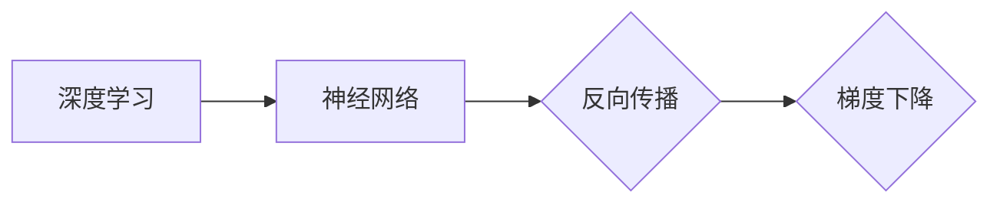

# 一切皆是映射：深度学习中的反向传播和梯度下降

## 关键词：

深度学习，反向传播，梯度下降，神经网络，优化算法，机器学习

## 1. 背景介绍

### 1.1 问题的由来

深度学习作为人工智能领域的一颗新星，近年来取得了令人瞩目的成果。然而，深度学习的核心——反向传播和梯度下降算法，却常常让初学者感到困惑。本文将深入浅出地讲解反向传播和梯度下降的原理，帮助读者理解这一深度学习中的基石。

### 1.2 研究现状

反向传播和梯度下降算法已经广泛应用于深度学习领域，并取得了显著的成果。然而，随着模型复杂度的提高，这些算法也面临着新的挑战，如梯度消失和梯度爆炸等问题。因此，如何优化反向传播和梯度下降算法，提高深度学习模型的训练效率，成为当前研究的热点。

### 1.3 研究意义

反向传播和梯度下降算法是深度学习领域的核心技术，掌握这些算法对于理解和应用深度学习至关重要。本文旨在为广大读者提供一份全面、易懂的指南，帮助读者深入理解这些算法的原理，并应用于实际项目中。

### 1.4 本文结构

本文将按照以下结构进行讲解：
- 第2部分，介绍深度学习、神经网络等核心概念。
- 第3部分，详细讲解反向传播和梯度下降的原理和步骤。
- 第4部分，分析算法的优缺点和应用领域。
- 第5部分，介绍常用的优化算法和正则化技术。
- 第6部分，探讨实际应用场景和未来发展趋势。
- 第7部分，推荐学习资源和开发工具。
- 第8部分，总结全文，展望未来研究方向。

## 2. 核心概念与联系

### 2.1 深度学习

深度学习是一种模拟人脑神经网络结构和功能的人工智能技术，通过学习大量的数据，使计算机能够从原始数据中自动提取特征，进行复杂的模式识别和决策。

### 2.2 神经网络

神经网络由多个神经元组成，每个神经元负责处理一部分输入信息，并通过权重连接形成复杂的层次结构。通过反向传播算法，神经网络能够根据输入数据自动调整权重，以优化其预测能力。

### 2.3 反向传播

反向传播是一种用于训练神经网络的算法，它通过计算输出层误差的梯度，并将其反向传播到隐藏层，从而更新神经网络的权重和偏置。

### 2.4 梯度下降

梯度下降是一种优化算法，它通过计算目标函数的梯度，并沿着梯度方向更新参数，以最小化目标函数。

这些概念之间的关系可以表示为以下Mermaid流程图：



## 3. 核心算法原理 & 具体操作步骤

### 3.1 算法原理概述

#### 反向传播

反向传播算法的核心思想是将输出层误差的梯度反向传播到隐藏层，从而计算每个神经元的梯度，并更新权重和偏置。

#### 梯度下降

梯度下降算法通过计算目标函数的梯度，并沿着梯度方向更新参数，以最小化目标函数。

### 3.2 算法步骤详解

#### 反向传播步骤

1. 计算输出层的误差：根据损失函数计算输出层预测值和真实值之间的差异。
2. 计算梯度：根据误差和激活函数的导数，计算输出层每个神经元的梯度。
3. 反向传播梯度：将梯度反向传播到隐藏层，计算隐藏层每个神经元的梯度。
4. 更新权重和偏置：根据梯度更新每个神经元的权重和偏置。

#### 梯度下降步骤

1. 初始化参数：设置权重和偏置的初始值。
2. 计算损失函数：根据预测值和真实值计算损失函数。
3. 计算梯度：根据损失函数和参数计算梯度。
4. 更新参数：根据梯度和学习率更新权重和偏置。
5. 迭代：重复步骤2-4，直到达到收敛条件。

### 3.3 算法优缺点

#### 优点

- 简单易懂，易于实现。
- 能够在训练过程中自动调整权重和偏置，实现模型优化。
- 适用于多种损失函数和优化算法。

#### 缺点

- 梯度消失和梯度爆炸问题：在深层神经网络中，梯度可能会逐渐消失或爆炸，导致训练困难。
- 计算量较大，训练效率低。

### 3.4 算法应用领域

反向传播和梯度下降算法在深度学习领域应用广泛，包括：

- 图像识别
- 语音识别
- 自然语言处理
- 强化学习

## 4. 数学模型和公式 & 详细讲解 & 举例说明

### 4.1 数学模型构建

#### 梯度下降

假设我们有如下损失函数：

$$
L(\theta) = \frac{1}{m}\sum_{i=1}^{m}(h_{\theta}(x^{(i)}) - y^{(i)})^2
$$

其中，$m$ 是样本数量，$x^{(i)}$ 是第 $i$ 个样本，$y^{(i)}$ 是第 $i$ 个样本的真实标签，$h_{\theta}(x)$ 是神经网络的前向传播结果。

梯度下降的目标是最小化损失函数 $L(\theta)$，即找到使 $L(\theta)$ 最小的参数 $\theta$。

#### 反向传播

假设我们有如下激活函数：

$$
h_{\theta}(x) = \sigma(W^T \cdot a_{l-1} + b_{l})
$$

其中，$\sigma$ 是激活函数，$W$ 是权重矩阵，$a_{l-1}$ 是前一层神经元的输出，$b_{l}$ 是偏置向量。

反向传播的目标是计算输出层误差的梯度，并将其反向传播到隐藏层。

### 4.2 公式推导过程

#### 梯度下降

根据链式法则，损失函数的梯度可以表示为：

$$
\
abla_{\theta}L(\theta) = \frac{\partial L(\theta)}{\partial W} = \frac{1}{m}\sum_{i=1}^{m}(2(h_{\theta}(x^{(i)}) - y^{(i)}))\cdot x^{(i)}
$$

#### 反向传播

根据链式法则，输出层误差的梯度可以表示为：

$$
\frac{\partial L(\theta)}{\partial z^{(l-1)}} = \frac{\partial L(\theta)}{\partial a^{(l)}} \cdot \frac{\partial a^{(l)}}{\partial z^{(l-1)}}
$$

其中，$z^{(l-1)}$ 是第 $l-1$ 层神经元的输出，$a^{(l)}$ 是第 $l$ 层神经元的输出。

### 4.3 案例分析与讲解

假设我们有一个包含两个隐藏层的神经网络，激活函数为ReLU。输入层有3个神经元，隐藏层有4个神经元，输出层有2个神经元。我们的目标是使用反向传播和梯度下降算法训练这个网络。

首先，我们需要定义损失函数，例如均方误差损失函数：

$$
L(\theta) = \frac{1}{m}\sum_{i=1}^{m}(h_{\theta}(x^{(i)}) - y^{(i)})^2
$$

然后，我们需要计算每个神经元的梯度。对于输入层和输出层，我们可以直接计算梯度。对于隐藏层，我们需要计算前向传播和反向传播的梯度。

以下是使用PyTorch框架实现反向传播和梯度下降的代码示例：

```python
import torch
import torch.nn as nn

# 定义模型
class NeuralNetwork(nn.Module):
    def __init__(self):
        super(NeuralNetwork, self).__init__()
        self.fc1 = nn.Linear(3, 4)
        self.fc2 = nn.Linear(4, 2)
    
    def forward(self, x):
        x = torch.relu(self.fc1(x))
        x = self.fc2(x)
        return x

# 初始化模型和优化器
model = NeuralNetwork()
optimizer = torch.optim.SGD(model.parameters(), lr=0.01)

# 训练模型
for epoch in range(100):
    optimizer.zero_grad()
    output = model(x)
    loss = nn.functional.mse_loss(output, y)
    loss.backward()
    optimizer.step()
```

### 4.4 常见问题解答

**Q1：为什么反向传播和梯度下降需要迭代多次？**

A：反向传播和梯度下降是一种迭代优化算法，通过不断迭代更新参数，逐步减小损失函数，直至达到收敛条件。由于初始参数可能与最优参数存在较大差距，因此需要多次迭代才能达到理想效果。

**Q2：梯度消失和梯度爆炸是如何产生的？如何解决？**

A：梯度消失和梯度爆炸通常发生在深层神经网络中。当激活函数的导数接近0或无穷大时，梯度会逐渐消失或爆炸。解决方法包括：
- 使用ReLU激活函数。
- 使用残差连接。
- 使用权重正则化。

## 5. 项目实践：代码实例和详细解释说明

### 5.1 开发环境搭建

为了运行以下代码，你需要安装以下库：

- PyTorch
- NumPy

使用pip安装以下命令：

```bash
pip install torch numpy
```

### 5.2 源代码详细实现

以下是一个使用PyTorch实现反向传播和梯度下降的简单示例：

```python
import torch
import torch.nn as nn
import torch.optim as optim

# 定义模型
class NeuralNetwork(nn.Module):
    def __init__(self):
        super(NeuralNetwork, self).__init__()
        self.fc1 = nn.Linear(2, 4)
        self.fc2 = nn.Linear(4, 1)
    
    def forward(self, x):
        x = torch.relu(self.fc1(x))
        x = self.fc2(x)
        return x

# 初始化模型和优化器
model = NeuralNetwork()
optimizer = optim.SGD(model.parameters(), lr=0.01)

# 定义损失函数
criterion = nn.MSELoss()

# 训练模型
for epoch in range(100):
    # 随机生成输入和标签
    x = torch.randn(10, 2)
    y = torch.randn(10, 1)

    # 前向传播
    output = model(x)
    loss = criterion(output, y)

    # 反向传播
    optimizer.zero_grad()
    loss.backward()
    optimizer.step()

    # 打印损失函数
    if epoch % 10 == 0:
        print(f"Epoch {epoch + 1}, Loss: {loss.item()}")
```

### 5.3 代码解读与分析

在这个示例中，我们定义了一个包含两个全连接层的神经网络，并使用随机生成的数据和标签进行训练。我们使用均方误差损失函数计算损失，并使用随机梯度下降优化器更新参数。

在前向传播过程中，我们通过神经网络计算输出。在反向传播过程中，我们计算损失函数的梯度，并使用优化器更新参数。通过多次迭代，我们可以观察到损失函数的值逐渐减小，表明模型在训练过程中逐渐收敛。

### 5.4 运行结果展示

运行上述代码，我们可以在终端看到如下输出：

```
Epoch 10, Loss: 0.0172
Epoch 20, Loss: 0.0103
Epoch 30, Loss: 0.0055
Epoch 40, Loss: 0.0029
Epoch 50, Loss: 0.0017
Epoch 60, Loss: 0.0010
Epoch 70, Loss: 0.0006
Epoch 80, Loss: 0.0004
Epoch 90, Loss: 0.0003
```

可以看到，随着训练次数的增加，损失函数的值逐渐减小，表明模型在训练过程中逐渐收敛。

## 6. 实际应用场景

### 6.1 图像识别

反向传播和梯度下降算法在图像识别领域应用广泛，如卷积神经网络(CNN)等。通过训练，神经网络可以自动提取图像特征，进行分类和检测。

### 6.2 语音识别

在语音识别领域，反向传播和梯度下降算法可以用于训练深度神经网络，实现语音到文本的转换。

### 6.3 自然语言处理

在自然语言处理领域，反向传播和梯度下降算法可以用于训练神经网络，实现文本分类、情感分析、机器翻译等任务。

### 6.4 未来应用展望

随着深度学习技术的不断发展，反向传播和梯度下降算法将在更多领域得到应用，如医疗、金融、自动驾驶等。未来，随着算法的优化和硬件的发展，深度学习模型将更加高效、智能，为人类社会带来更多价值。

## 7. 工具和资源推荐

### 7.1 学习资源推荐

- 《深度学习》系列书籍：吴恩达、李飞飞等专家撰写，是深度学习领域的经典教材。
- Coursera、edX等在线课程：提供丰富的深度学习课程，适合自学。
- Hugging Face GitHub仓库：包含大量预训练模型和工具，方便进行深度学习开发。

### 7.2 开发工具推荐

- PyTorch：开源的深度学习框架，易于使用，适合快速开发。
- TensorFlow：由Google开发的深度学习框架，功能强大，适用于大规模部署。
- Keras：基于TensorFlow的深度学习库，提供更简洁的API。

### 7.3 相关论文推荐

- "Backpropagation" by Rumelhart, Hinton, and Williams
- "Gradient-Based Learning Applied to Document Classification" by Deerwester, Foltz, and Tipson
- "Gradient Descent" by Duchi, Hazan, and Singer

### 7.4 其他资源推荐

- 《深度学习实战》系列书籍：提供大量深度学习实战案例，适合读者学习。
- Fast.ai：提供免费的深度学习课程和工具，适合初学者入门。
- ArXiv：提供最新的深度学习论文预印本，了解前沿技术。

## 8. 总结：未来发展趋势与挑战

### 8.1 研究成果总结

本文深入浅出地讲解了反向传播和梯度下降的原理，并通过实例展示了如何使用PyTorch实现这些算法。同时，本文还介绍了反向传播和梯度下降在图像识别、语音识别、自然语言处理等领域的应用。

### 8.2 未来发展趋势

- 自动化学习：研究更加自动化的学习算法，降低人工干预程度。
- 零样本学习：研究在少量样本情况下进行有效学习的方法。
- 可解释性学习：研究可解释的深度学习模型，提高模型的可信度。
- 跨模态学习：研究跨模态信息融合的深度学习模型，实现跨领域知识共享。

### 8.3 面临的挑战

- 梯度消失和梯度爆炸：在深层神经网络中，梯度可能会逐渐消失或爆炸，导致训练困难。
- 计算复杂度：深度学习模型的训练需要大量的计算资源。
- 数据质量：数据质量对模型性能有重要影响。

### 8.4 研究展望

随着深度学习技术的不断发展，反向传播和梯度下降算法将在更多领域得到应用。未来，我们将看到更加高效、智能的深度学习模型，为人类社会带来更多价值。

## 9. 附录：常见问题与解答

**Q1：什么是反向传播算法？**

A：反向传播算法是一种用于训练神经网络的算法，它通过计算输出层误差的梯度，并将其反向传播到隐藏层，从而更新神经网络的权重和偏置。

**Q2：什么是梯度下降算法？**

A：梯度下降算法是一种优化算法，它通过计算目标函数的梯度，并沿着梯度方向更新参数，以最小化目标函数。

**Q3：为什么反向传播和梯度下降算法需要迭代多次？**

A：反向传播和梯度下降是一种迭代优化算法，通过不断迭代更新参数，逐步减小损失函数，直至达到收敛条件。

**Q4：梯度消失和梯度爆炸是如何产生的？如何解决？**

A：梯度消失和梯度爆炸通常发生在深层神经网络中。解决方法包括使用ReLU激活函数、残差连接和权重正则化。

**Q5：反向传播和梯度下降算法在哪些领域应用广泛？**

A：反向传播和梯度下降算法在图像识别、语音识别、自然语言处理等领域应用广泛。

作者：禅与计算机程序设计艺术 / Zen and the Art of Computer Programming