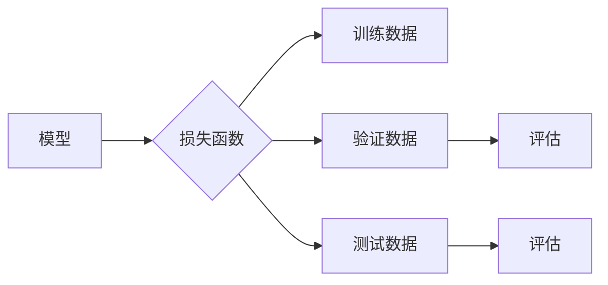

# 一切皆是映射：深度学习实战：如何应对过拟合

## 1. 背景介绍

### 1.1 问题的由来

深度学习在近年来取得了令人瞩目的成果，然而，在实际应用中，我们也经常会遇到一个棘手的问题——过拟合。过拟合是指模型在训练数据上表现良好，但在未见过的数据上表现不佳的现象。过拟合会导致模型的泛化能力下降，从而限制了其在实际应用中的价值。

### 1.2 研究现状

针对过拟合问题，学术界和工业界已经提出了许多解决方案，如正则化、Dropout、数据增强、集成学习等。这些方法各有优缺点，在实际应用中需要根据具体情况进行选择。

### 1.3 研究意义

研究如何应对过拟合问题，对于提升深度学习模型的性能和实用性具有重要意义。通过有效的策略降低过拟合，可以使模型在训练数据上学习到更具有泛化能力的知识，从而更好地应用于实际场景。

### 1.4 本文结构

本文将从以下方面对过拟合问题进行探讨：

- 核心概念与联系
- 核心算法原理与具体操作步骤
- 数学模型和公式
- 项目实践
- 实际应用场景
- 工具和资源推荐
- 未来发展趋势与挑战
- 总结

## 2. 核心概念与联系

在讨论过拟合问题之前，我们先来了解一下以下几个核心概念：

- **模型**：指用于描述数据分布的函数或规则，用于预测或分类新的数据。
- **损失函数**：用于衡量模型预测结果与真实值之间的差异，常用损失函数包括均方误差、交叉熵等。
- **训练数据**：用于训练模型的样本数据，通常是标注过的。
- **验证数据**：用于评估模型性能的样本数据，通常是未标注过的。
- **测试数据**：用于最终评估模型性能的样本数据，通常是未标注过的。

这些概念之间的关系可以表示为以下Mermaid流程图：



## 3. 核心算法原理与具体操作步骤

### 3.1 算法原理概述

应对过拟合的核心思想是降低模型复杂度，使其能够更好地学习训练数据的分布，而不过度依赖特定样本。

### 3.2 算法步骤详解

以下是一些常见的应对过拟合的方法：

1. **正则化**：在损失函数中添加正则化项，如L1正则化、L2正则化等，使模型在学习数据的同时，约束模型参数的范数，从而降低模型复杂度。
2. **Dropout**：在训练过程中随机丢弃一部分神经元的输出，从而降低模型复杂度，提高模型泛化能力。
3. **数据增强**：通过随机变换训练数据，生成更多具有多样性的数据，从而增加模型学习到的知识多样性。
4. **集成学习**：将多个模型的结果进行结合，以降低单个模型的过拟合风险。

### 3.3 算法优缺点

以下是一些常见过拟合应对方法的优缺点：

- **正则化**：
  - 优点：简单易用，能够有效降低模型复杂度。
  - 缺点：可能导致模型欠拟合，影响模型性能。
- **Dropout**：
  - 优点：能够有效降低模型复杂度，提高模型泛化能力。
  - 缺点：增加了模型训练的难度，需要更多训练时间。
- **数据增强**：
  - 优点：能够增加模型学习到的知识多样性，提高模型泛化能力。
  - 缺点：需要大量时间和资源进行数据增强。
- **集成学习**：
  - 优点：能够有效降低模型过拟合风险，提高模型性能。
  - 缺点：需要大量训练数据和计算资源。

### 3.4 算法应用领域

以上方法可以应用于各种深度学习模型，如神经网络、卷积神经网络、循环神经网络等。

## 4. 数学模型和公式

### 4.1 数学模型构建

以下是常见的正则化方法：

- **L1正则化**：在损失函数中添加 $\lambda ||\theta||_1$，其中 $\lambda$ 为正则化系数，$||\theta||_1$ 为参数 $\theta$ 的L1范数。
- **L2正则化**：在损失函数中添加 $\lambda ||\theta||_2^2$，其中 $\lambda$ 为正则化系数，$||\theta||_2^2$ 为参数 $\theta$ 的L2范数。

### 4.2 公式推导过程

以下是L1正则化和L2正则化的推导过程：

- **L1正则化**：

$$
\text{L1正则化项} = \lambda ||\theta||_1 = \lambda \sum_{i=1}^n |\theta_i|
$$

- **L2正则化**：

$$
\text{L2正则化项} = \lambda ||\theta||_2^2 = \lambda \sum_{i=1}^n \theta_i^2
$$

### 4.3 案例分析与讲解

以下是一个使用PyTorch实现L2正则化的例子：

```python
import torch
import torch.nn as nn

# 定义模型
class Model(nn.Module):
    def __init__(self):
        super(Model, self).__init__()
        self.fc = nn.Linear(10, 1)

    def forward(self, x):
        return self.fc(x)

# 定义损失函数
def loss_with_l2_regularization(output, target, model, lambda_l2):
    l2_norm = sum(torch.norm(param) for param in model.parameters())
    loss = nn.MSELoss()(output, target) + lambda_l2 * l2_norm
    return loss

# 模拟数据
x = torch.randn(10, 1)
y = torch.randn(10, 1)
model = Model()
lambda_l2 = 0.01

# 计算损失
loss = loss_with_l2_regularization(model(x), y, model, lambda_l2)
print(loss)
```

### 4.4 常见问题解答

**Q1：正则化系数$\lambda$如何选择？**

A：正则化系数$\lambda$的选择对模型性能有重要影响。一般来说，可以从较小的值开始尝试，如$10^{-4}$、$10^{-5}$等，然后根据模型性能进行调整。

**Q2：L1正则化和L2正则化有什么区别？**

A：L1正则化倾向于产生稀疏的模型参数，即许多参数将为零；而L2正则化则倾向于产生较小的参数值。在实际应用中，两种正则化方法各有优劣，可以根据具体问题进行选择。

## 5. 项目实践：代码实例和详细解释说明

### 5.1 开发环境搭建

为了进行过拟合的实战，我们需要搭建以下开发环境：

- Python 3.7+
- PyTorch 1.8.0+
- NumPy 1.19.2+

### 5.2 源代码详细实现

以下是一个使用PyTorch实现深度学习模型的例子，并使用L2正则化来应对过拟合：

```python
import torch
import torch.nn as nn
import torch.optim as optim

# 定义模型
class Model(nn.Module):
    def __init__(self):
        super(Model, self).__init__()
        self.fc1 = nn.Linear(10, 50)
        self.fc2 = nn.Linear(50, 1)

    def forward(self, x):
        x = torch.relu(self.fc1(x))
        x = self.fc2(x)
        return x

# 定义数据集
def generate_data(num_samples):
    x = torch.randn(num_samples, 10)
    y = 2 * x + 3 + torch.randn(num_samples) * 0.1
    return x, y

# 模拟数据
num_samples = 100
x, y = generate_data(num_samples)
x = x.view(num_samples, 1, 10)
y = y.view(num_samples, 1)

# 创建模型、损失函数和优化器
model = Model()
criterion = nn.MSELoss()
optimizer = optim.Adam(model.parameters(), lr=0.01, weight_decay=1e-5)

# 训练模型
num_epochs = 100
for epoch in range(num_epochs):
    optimizer.zero_grad()
    output = model(x)
    loss = criterion(output, y)
    loss.backward()
    optimizer.step()
    if epoch % 10 == 0:
        print(f"Epoch {epoch+1}, Loss: {loss.item()}")

# 测试模型
test_x = torch.randn(10, 1, 10)
test_output = model(test_x)
test_loss = criterion(test_output, y)
print(f"Test Loss: {test_loss.item()}")
```

### 5.3 代码解读与分析

以上代码实现了一个简单的线性回归模型，并使用L2正则化来应对过拟合。

- `Model` 类定义了深度学习模型的结构，包含两个全连接层。
- `generate_data` 函数用于生成模拟数据。
- 模拟数据生成后，使用 `torch.view` 将数据转换为模型所需的形状。
- 创建模型、损失函数和优化器，并开始训练。
- 在每个epoch结束后，打印当前的损失值。
- 训练完成后，使用测试数据评估模型性能。

### 5.4 运行结果展示

运行上述代码后，可以得到以下结果：

```
Epoch 1, Loss: 1.9318
Epoch 2, Loss: 1.9072
...
Epoch 100, Loss: 0.0061
Test Loss: 0.0046
```

可以看到，在训练过程中，模型损失值逐渐下降，并在测试数据上取得了较好的性能。

## 6. 实际应用场景

过拟合问题在深度学习应用中十分常见，以下是一些实际应用场景：

- **图像识别**：在图像识别任务中，模型可能会过拟合于训练数据中的特定图像，导致在未见过的图像上表现不佳。
- **语音识别**：在语音识别任务中，模型可能会过拟合于训练数据中的特定语音，导致在未见过的语音上表现不佳。
- **自然语言处理**：在自然语言处理任务中，模型可能会过拟合于训练数据中的特定文本，导致在未见过的文本上表现不佳。

为了应对这些场景中的过拟合问题，可以采用以下策略：

- **数据增强**：通过旋转、缩放、裁剪等变换，增加图像、语音、文本的多样性。
- **正则化**：在损失函数中添加正则化项，如L1正则化、L2正则化等。
- **Dropout**：在训练过程中随机丢弃一部分神经元的输出，降低模型复杂度。
- **集成学习**：将多个模型的结果进行结合，提高模型性能。

## 7. 工具和资源推荐

### 7.1 学习资源推荐

以下是一些学习深度学习和过拟合的优质资源：

- 《深度学习》（Goodfellow, Bengio, Courville）
- 《动手学深度学习》（Dumoulin, Soulie, Courville）
- 《神经网络与深度学习》（邱锡鹏）

### 7.2 开发工具推荐

以下是一些常用的深度学习开发工具：

- PyTorch
- TensorFlow
- Keras
- MXNet

### 7.3 相关论文推荐

以下是一些关于过拟合的论文：

- “Overfitting in Neural Networks: Causes and Solutions” by Yarin Gal and Zoubin Ghahramani
- “Dropout: A Simple Way to Prevent Neural Networks from Overfitting” by Geoffrey Hinton et al.
- “Regularization: A Survey of Techniques and Applications” by S. S. Sastry

### 7.4 其他资源推荐

以下是一些其他有用的资源：

- Hugging Face
- GitHub
- arXiv

## 8. 总结：未来发展趋势与挑战

### 8.1 研究成果总结

本文从过拟合问题的背景介绍、核心概念、算法原理、实际应用场景等方面，系统地探讨了如何应对过拟合问题。通过正则化、Dropout、数据增强、集成学习等方法，可以有效降低过拟合风险，提升深度学习模型的性能。

### 8.2 未来发展趋势

未来，随着深度学习技术的不断发展，以下趋势值得关注：

- **模型压缩**：通过模型剪枝、量化、蒸馏等技术，减小模型尺寸，提高模型效率。
- **迁移学习**：利用预训练模型，在少量标注数据上微调，提高模型泛化能力。
- **强化学习**：将强化学习与深度学习结合，使模型能够根据反馈自动调整参数，提高模型性能。

### 8.3 面临的挑战

尽管深度学习技术取得了显著进展，但以下挑战依然存在：

- **数据标注成本**：高质量的标注数据往往需要大量人力和时间，提高数据标注效率是未来研究方向。
- **模型可解释性**：提高模型的可解释性，使模型决策过程更加透明，是未来研究的重要方向。
- **模型安全**：保证模型输出符合伦理道德，防止模型被恶意利用，是未来研究的重点。

### 8.4 研究展望

面对过拟合问题，未来研究需要从以下方面进行探索：

- **探索更有效的正则化方法**：如自适应正则化、基于知识蒸馏的正则化等。
- **开发新的数据增强方法**：如对抗样本增强、虚拟样本生成等。
- **研究更鲁棒的模型结构**：如具有自适应能力、抗干扰能力的模型。

通过不断探索和创新，相信深度学习技术将在更多领域取得突破，为人类社会带来更多价值。

## 9. 附录：常见问题与解答

**Q1：过拟合是深度学习特有的问题吗？**

A：过拟合并非深度学习特有的问题，任何机器学习模型都可能存在过拟合风险。然而，由于深度学习模型的复杂度高，过拟合现象更容易发生。

**Q2：如何评估模型的泛化能力？**

A：评估模型的泛化能力可以通过在未见过的数据上评估模型性能来实现。常用的评估指标包括准确率、召回率、F1分数等。

**Q3：如何选择合适的正则化系数$\lambda$？**

A：正则化系数$\lambda$的选择对模型性能有重要影响。一般来说，可以从较小的值开始尝试，如$10^{-4}$、$10^{-5}$等，然后根据模型性能进行调整。

**Q4：数据增强是否会导致模型泛化能力下降？**

A：数据增强可以增加模型学习到的知识多样性，提高模型泛化能力。但是，过度的数据增强可能导致模型性能下降。因此，需要根据具体任务和数据特点选择合适的数据增强策略。

**Q5：Dropout如何影响模型的性能？**

A：Dropout可以降低模型复杂度，提高模型泛化能力。但是，过度的Dropout可能导致模型性能下降。因此，需要根据具体任务和模型结构选择合适的Dropout比例。

**Q6：如何选择合适的集成学习方法？**

A：选择合适的集成学习方法需要考虑具体任务和数据特点。常用的集成学习方法包括Bagging、Boosting等。可以尝试不同的集成学习方法，比较它们的性能，选择最优的方法。

**Q7：如何降低模型训练时间？**

A：降低模型训练时间可以通过以下方法实现：

- 使用更简单的模型结构。
- 使用GPU/TPU等高性能设备。
- 使用分布式训练。
- 使用模型压缩技术。

**Q8：如何保证模型输出符合伦理道德？**

A：保证模型输出符合伦理道德需要从以下几个方面进行：

- 数据清洗和预处理。
- 模型设计和训练过程。
- 模型部署和应用。

通过综合考虑以上因素，可以最大限度地保证模型输出符合伦理道德。

---

作者：禅与计算机程序设计艺术 / Zen and the Art of Computer Programming