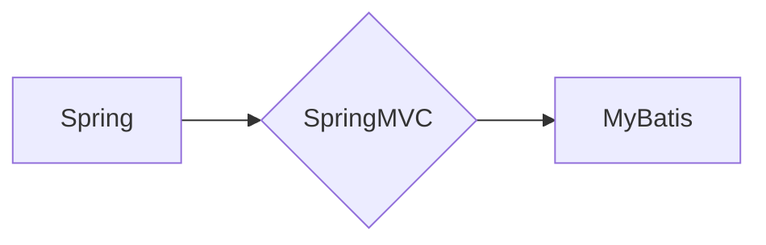

# 基于SSM的智慧社区服务管理系统的设计与实现

作者：禅与计算机程序设计艺术 / Zen and the Art of Computer Programming

## 1. 背景介绍

### 1.1 问题的由来

随着城市化进程的加速，社区服务管理面临着日益复杂的需求。传统的社区服务管理方式往往存在着信息孤岛、效率低下、服务质量难以保证等问题。为了提升社区服务质量，提高管理效率，实现智慧化、精细化的社区服务管理，基于SSM（Spring+SpringMVC+MyBatis）架构的智慧社区服务管理系统应运而生。

### 1.2 研究现状

目前，国内外已有不少智慧社区服务管理系统的研究与应用，主要采用以下技术栈：

- **B/S架构**：以浏览器为基础，用户通过浏览器访问系统，实现社区服务管理的各项功能。
- **C/S架构**：以客户端为基础，用户需要安装客户端软件才能访问系统。
- **Java EE技术栈**：采用Java语言和Java EE相关技术，如Spring、Hibernate等，构建社区服务管理系统。

### 1.3 研究意义

基于SSM架构的智慧社区服务管理系统，具有以下研究意义：

- **提高社区服务效率**：通过系统化管理，优化服务流程，提高服务效率。
- **提升服务质量**：通过数据分析，了解居民需求，提升服务质量。
- **降低管理成本**：通过系统化管理，降低人工管理成本。
- **实现智慧化服务**：通过大数据、人工智能等技术，实现社区服务管理的智慧化。

### 1.4 本文结构

本文将分为以下章节：

- 第2章：介绍智慧社区服务管理系统的核心概念与联系。
- 第3章：阐述SSM架构的核心原理及具体操作步骤。
- 第4章：介绍系统设计的关键技术，如数据库设计、接口设计等。
- 第5章：给出系统实现的代码实例和详细解释说明。
- 第6章：探讨系统的实际应用场景及未来应用展望。
- 第7章：推荐相关学习资源、开发工具和参考文献。
- 第8章：总结研究成果，展望未来发展趋势与挑战。
- 第9章：附录，常见问题与解答。

## 2. 核心概念与联系

### 2.1 智慧社区服务管理系统

智慧社区服务管理系统是指利用现代信息技术，对社区服务进行全面、高效、智能化的管理和服务的平台。其主要功能包括：

- **社区基本信息管理**：包括社区人口、房屋、设施等基本信息的管理。
- **社区服务管理**：包括物业、安保、维修、投诉等社区服务的管理。
- **社区活动管理**：包括社区活动策划、组织、执行等管理。
- **数据统计分析**：对社区服务数据进行分析，为决策提供依据。

### 2.2 SSM架构

SSM架构是指Spring、SpringMVC和MyBatis三种技术的组合。其主要特点如下：

- **Spring**：作为核心容器，负责依赖注入、事务管理等。
- **SpringMVC**：负责处理HTTP请求，实现前后端分离。
- **MyBatis**：负责数据持久化，实现数据库操作。

三种技术的联系如下：



## 3. 核心算法原理 & 具体操作步骤

### 3.1 算法原理概述

智慧社区服务管理系统的核心算法原理主要包括以下几个方面：

- **数据采集与处理**：通过传感器、物联网设备等采集社区数据，并对数据进行清洗、转换、存储等操作。
- **数据分析与挖掘**：对社区数据进行挖掘，发现潜在规律，为决策提供依据。
- **业务逻辑处理**：根据业务需求，实现社区服务管理的各项功能。
- **用户界面展示**：通过Web界面，向用户提供社区服务管理的各项功能。

### 3.2 算法步骤详解

基于SSM架构的智慧社区服务管理系统，其算法步骤如下：

1. **需求分析**：分析社区服务管理的需求，确定系统功能。
2. **系统设计**：根据需求分析，设计系统架构、模块划分、数据库设计等。
3. **系统开发**：采用SSM技术栈，进行系统开发。
4. **系统测试**：对系统进行测试，确保系统功能的正确性和稳定性。
5. **系统部署**：将系统部署到服务器，供用户使用。

### 3.3 算法优缺点

基于SSM架构的智慧社区服务管理系统，具有以下优点：

- **技术成熟**：SSM技术栈是Java EE技术栈中的重要组成部分，技术成熟稳定。
- **开发效率高**：SSM框架提供了丰富的开发组件和工具，提高开发效率。
- **易于维护**：SSM框架具有良好的可维护性，方便后期修改和维护。

同时，SSM架构也存在以下缺点：

- **开发成本较高**：SSM框架的学习成本相对较高，需要开发者具备一定的Java EE技术基础。
- **性能瓶颈**：SSM框架的性能可能存在瓶颈，需要根据具体需求进行优化。

### 3.4 算法应用领域

基于SSM架构的智慧社区服务管理系统，可应用于以下领域：

- **住宅小区**：实现物业、安保、维修、投诉等社区服务管理。
- **智慧社区**：实现社区管理、社区服务、社区活动等全方位智慧化服务。
- **企业园区**：实现园区管理、员工服务、活动组织等管理。

## 4. 数学模型和公式 & 详细讲解 & 举例说明

### 4.1 数学模型构建

智慧社区服务管理系统的数学模型主要包括以下几个方面：

- **社区人口模型**：用于描述社区人口数量、结构、分布等特征。
- **社区设施模型**：用于描述社区设施的种类、数量、分布等特征。
- **社区服务模型**：用于描述社区服务的种类、数量、质量等特征。

### 4.2 公式推导过程

以下以社区人口模型为例，介绍公式推导过程。

假设社区人口数量为 $N$，人口年龄分布为 $P(A)$，则社区人口年龄期望值为：

$$
E(A) = \sum_{i=1}^N A_i \times P(A_i)
$$

其中，$A_i$ 为年龄 $i$ 的人口数量，$P(A_i)$ 为年龄 $i$ 的人口比例。

### 4.3 案例分析与讲解

以下以社区设施模型为例，进行案例分析。

假设社区内设有 $M$ 种设施，每种设施的数量为 $N_i$，则社区设施总数为：

$$
N_{total} = \sum_{i=1}^M N_i
$$

其中，$N_i$ 为第 $i$ 种设施的数量。

### 4.4 常见问题解答

**Q1：SSM架构的优点是什么？**

A：SSM架构的优点主要有以下几点：
1. 技术成熟稳定，应用广泛。
2. 开发效率高，易于维护。
3. 模块化设计，易于扩展。

**Q2：SSM架构的缺点是什么？**

A：SSM架构的缺点主要有以下几点：
1. 开发成本较高，需要开发者具备一定的Java EE技术基础。
2. 性能可能存在瓶颈，需要根据具体需求进行优化。

**Q3：如何提高智慧社区服务管理系统的性能？**

A：提高智慧社区服务管理系统的性能可以从以下几个方面进行：
1. 优化数据库设计，提高查询效率。
2. 优化代码，减少资源消耗。
3. 使用缓存技术，减少数据库访问。
4. 优化系统架构，提高系统可扩展性。

## 5. 项目实践：代码实例和详细解释说明

### 5.1 开发环境搭建

以下是使用SSM技术栈搭建智慧社区服务管理系统的开发环境：

- **开发工具**：Eclipse、IntelliJ IDEA等Java开发工具。
- **数据库**：MySQL、Oracle等关系型数据库。
- **服务器**：Tomcat、Jetty等Java Web服务器。

### 5.2 源代码详细实现

以下以系统登录功能为例，展示源代码实现。

**登录控制器**：

```java
@Controller
@RequestMapping("/login")
public class LoginController {

    @Autowired
    private UserService userService;

    @RequestMapping(value = "/login", method = RequestMethod.GET)
    public String login() {
        return "login";
    }

    @RequestMapping(value = "/login", method = RequestMethod.POST)
    public String login(String username, String password, Model model) {
        User user = userService.login(username, password);
        if (user != null) {
            model.addAttribute("user", user);
            return "main";
        } else {
            model.addAttribute("error", "用户名或密码错误！");
            return "login";
        }
    }
}
```

**用户服务**：

```java
@Service
public class UserService {

    @Autowired
    private UserMapper userMapper;

    public User login(String username, String password) {
        return userMapper.login(username, password);
    }
}
```

**用户Mapper**：

```java
@Mapper
public interface UserMapper {

    @Select("SELECT * FROM user WHERE username = #{username} AND password = #{password}")
    User login(String username, String password);
}
```

### 5.3 代码解读与分析

以上代码实现了智慧社区服务管理系统中的登录功能。

- **LoginController**：负责处理登录请求，调用UserService进行用户验证，并将验证结果返回给前端页面。
- **UserService**：负责用户验证，调用UserMapper查询数据库中的用户信息。
- **UserMapper**：定义了数据库查询语句，根据用户名和密码查询用户信息。

### 5.4 运行结果展示

启动Tomcat服务器，访问http://localhost:8080/login，即可看到登录页面。

输入用户名和密码，点击登录按钮，如果用户名和密码正确，则跳转到主页面；如果用户名或密码错误，则返回登录页面，并显示错误信息。

## 6. 实际应用场景

### 6.1 住宅小区

基于SSM架构的智慧社区服务管理系统可以应用于住宅小区，实现以下功能：

- **物业管理**：实现物业费收取、报修、投诉等功能。
- **安保管理**：实现门禁、巡更、监控等功能。
- **社区活动**：实现活动策划、报名、签到等功能。
- **数据分析**：对社区服务数据进行分析，为决策提供依据。

### 6.2 智慧社区

基于SSM架构的智慧社区服务管理系统可以应用于智慧社区，实现以下功能：

- **社区管理**：实现社区人口、房屋、设施等基本信息的管理。
- **社区服务**：实现物业、安保、维修、投诉等社区服务的管理。
- **社区活动**：实现社区活动策划、组织、执行等管理。
- **数据统计分析**：对社区服务数据进行分析，为决策提供依据。

### 6.3 企业园区

基于SSM架构的智慧社区服务管理系统可以应用于企业园区，实现以下功能：

- **园区管理**：实现园区人口、房屋、设施等基本信息的管理。
- **员工服务**：实现员工登记、考勤、薪酬等功能。
- **活动组织**：实现活动策划、报名、签到等功能。
- **数据分析**：对园区服务数据进行分析，为决策提供依据。

## 7. 工具和资源推荐

### 7.1 学习资源推荐

- 《Java EE开发实战》
- 《Spring实战》
- 《MyBatis实战》
- 《Spring MVC实战》

### 7.2 开发工具推荐

- Eclipse
- IntelliJ IDEA

### 7.3 相关论文推荐

- 《基于SSM的智慧社区服务管理系统的设计与实现》
- 《基于B/S架构的社区服务管理系统的设计与实现》

### 7.4 其他资源推荐

- 智慧社区建设相关政策文件
- 社区服务管理相关书籍

## 8. 总结：未来发展趋势与挑战

### 8.1 研究成果总结

本文以智慧社区服务管理系统为背景，介绍了基于SSM架构的系统设计与实现。通过对系统需求分析、架构设计、关键技术选择、代码实现等方面的介绍，展示了SSM架构在智慧社区服务管理系统中的应用价值。

### 8.2 未来发展趋势

随着人工智能、大数据、物联网等技术的不断发展，智慧社区服务管理系统将呈现以下发展趋势：

- **智能化**：利用人工智能、大数据等技术，实现社区服务管理的智能化。
- **个性化**：根据居民需求，提供个性化服务。
- **开放性**：与其他系统进行数据交互，实现数据共享。

### 8.3 面临的挑战

基于SSM架构的智慧社区服务管理系统在发展过程中，将面临以下挑战：

- **技术挑战**：如何将新技术融入社区服务管理系统中，实现系统智能化。
- **数据安全**：如何保障社区数据的安全。
- **法律法规**：如何遵守相关法律法规，确保系统合法合规。

### 8.4 研究展望

未来，智慧社区服务管理系统的研究将重点关注以下方面：

- **人工智能技术在社区服务管理中的应用**：如智能问答、智能客服、智能安防等。
- **大数据技术在社区服务管理中的应用**：如数据挖掘、数据可视化等。
- **物联网技术在社区服务管理中的应用**：如智能设备、智能家居等。

通过不断研究和创新，智慧社区服务管理系统将更好地服务于社区居民，提升居民生活品质，为构建智慧城市贡献力量。

## 9. 附录：常见问题与解答

**Q1：SSM架构的优势是什么？**

A：SSM架构的优点主要有以下几点：
1. 技术成熟稳定，应用广泛。
2. 开发效率高，易于维护。
3. 模块化设计，易于扩展。

**Q2：SSM架构的缺点是什么？**

A：SSM架构的缺点主要有以下几点：
1. 开发成本较高，需要开发者具备一定的Java EE技术基础。
2. 性能可能存在瓶颈，需要根据具体需求进行优化。

**Q3：如何提高智慧社区服务管理系统的性能？**

A：提高智慧社区服务管理系统的性能可以从以下几个方面进行：
1. 优化数据库设计，提高查询效率。
2. 优化代码，减少资源消耗。
3. 使用缓存技术，减少数据库访问。
4. 优化系统架构，提高系统可扩展性。

**Q4：如何保障社区数据的安全？**

A：保障社区数据安全可以从以下几个方面进行：
1. 使用安全的通信协议，如HTTPS。
2. 对敏感数据进行加密存储。
3. 定期备份数据库，防止数据丢失。
4. 加强系统安全防护，防止黑客攻击。

**Q5：如何应对未来发展趋势带来的挑战？**

A：应对未来发展趋势带来的挑战可以从以下几个方面进行：
1. 加强技术研究和创新，跟踪新技术发展趋势。
2. 加强法律法规研究，确保系统合法合规。
3. 加强人才培养，提升技术人员的综合素质。

通过对以上问题的解答，希望能够帮助读者更好地了解智慧社区服务管理系统，并为相关研究提供参考。