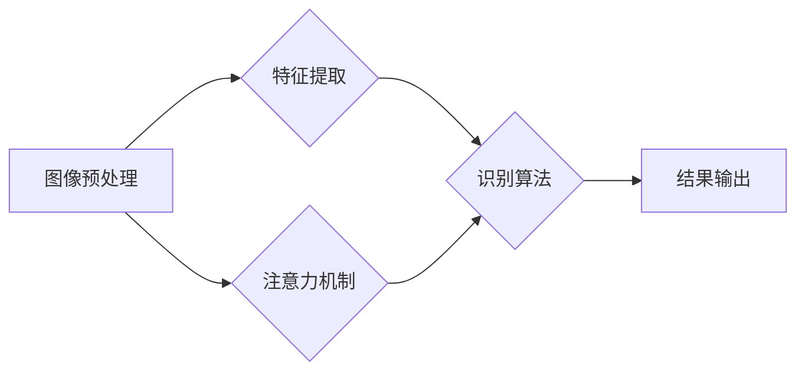

# 基于图像的结构化数值识别系统设计与实现

作者：禅与计算机程序设计艺术 / Zen and the Art of Computer Programming

## 1. 背景介绍
### 1.1 问题的由来

随着信息技术的飞速发展，图像信息成为了信息传播的重要载体。在众多应用场景中，对图像中的结构化数值进行识别和提取，成为了至关重要的任务。例如，在银行、交通、医疗、工业等领域，对票据、身份证、车牌、医学影像等图像中的结构化数值进行识别，对于提高工作效率、保障信息安全具有重要意义。

传统的图像结构化数值识别方法主要依赖于人工设计特征和规则，存在以下不足：

- 特征提取依赖于领域知识，难以适应复杂多变的环境。
- 规则设计复杂，难以覆盖所有识别场景。
- 灵活性较差，难以适应新的应用需求。

近年来，深度学习技术的快速发展，为图像结构化数值识别提供了新的解决方案。基于深度学习的识别方法可以自动从图像中提取特征，并能够适应复杂多变的场景，具有以下优势：

- 自动提取特征，无需人工设计特征。
- 具有很强的泛化能力，能够适应新的场景。
- 能够识别复杂多样的数值结构。

### 1.2 研究现状

目前，基于深度学习的图像结构化数值识别技术主要分为以下几类：

- 基于卷积神经网络(CNN)的方法：通过设计卷积层、池化层、全连接层等网络结构，自动提取图像特征并进行分类。
- 基于循环神经网络(RNN)的方法：通过设计循环层，对图像序列进行建模，提取图像特征并进行序列标注。
- 基于注意力机制的方法：通过引入注意力机制，关注图像中与数值识别相关的关键区域。

### 1.3 研究意义

研究基于深度学习的图像结构化数值识别技术，对于以下方面具有重要意义：

- 提高图像结构化数值识别的效率和准确性。
- 降低识别成本，提高工作效率。
- 推动人工智能技术在各领域的应用。

### 1.4 本文结构

本文将围绕基于图像的结构化数值识别系统展开，主要包括以下内容：

- 第2章介绍核心概念与联系。
- 第3章阐述核心算法原理及具体操作步骤。
- 第4章讲解数学模型和公式，并举例说明。
- 第5章给出项目实践，包括代码实例和详细解释说明。
- 第6章探讨实际应用场景和未来应用展望。
- 第7章推荐相关工具和资源。
- 第8章总结研究成果，展望未来发展趋势和挑战。
- 第9章附录部分包含常见问题与解答。

## 2. 核心概念与联系

为了更好地理解基于图像的结构化数值识别技术，本节将介绍几个核心概念及其相互联系。

### 2.1 图像预处理

图像预处理是图像结构化数值识别的第一步，其主要任务是对原始图像进行预处理，提高图像质量，为后续识别过程奠定基础。

- 图像去噪：去除图像中的噪声，提高图像质量。
- 图像增强：增强图像中感兴趣区域的信息，降低噪声干扰。
- 图像分割：将图像划分为多个区域，为后续识别提供便利。

### 2.2 特征提取

特征提取是图像结构化数值识别的核心环节，其主要任务是提取图像中与数值相关的特征，为后续分类或回归提供依据。

- 基于传统特征的方法：如SIFT、HOG等，从图像中提取局部特征。
- 基于深度学习的方法：如CNN、RNN等，自动提取图像特征。

### 2.3 识别算法

识别算法是图像结构化数值识别的关键，其主要任务是利用提取的特征对图像中的数值进行识别。

- 分类算法：如SVM、随机森林等，对图像中的数值进行分类。
- 回归算法：如线性回归、神经网络等，对图像中的数值进行回归。

### 2.4 注意力机制

注意力机制是近年来在自然语言处理和计算机视觉等领域兴起的一种重要技术，其主要思想是引导模型关注图像中与数值识别相关的关键区域。

- 位置注意力：关注图像中的位置信息。
- 通道注意力：关注图像中的通道信息。

以下为这些概念之间的逻辑关系图：



## 3. 核心算法原理 & 具体操作步骤
### 3.1 算法原理概述

本文将介绍一种基于深度学习的图像结构化数值识别算法，该算法主要包括以下步骤：

1. 图像预处理：对原始图像进行去噪、增强、分割等预处理操作。
2. 特征提取：利用CNN等深度学习模型自动提取图像特征。
3. 注意力机制：引入注意力机制，关注图像中与数值识别相关的关键区域。
4. 识别算法：利用提取的特征和注意力机制，对图像中的数值进行识别。
5. 结果输出：输出识别结果。

### 3.2 算法步骤详解

#### 3.2.1 图像预处理

- 去噪：使用均值滤波、中值滤波等去噪方法去除图像噪声。
- 增强：使用直方图均衡化、对比度增强等方法增强图像对比度。
- 分割：使用阈值分割、边缘检测等方法将图像分割成多个区域。

#### 3.2.2 特征提取

- 使用CNN等深度学习模型自动提取图像特征。

#### 3.2.3 注意力机制

- 使用位置注意力机制，关注图像中与数值识别相关的关键区域。

#### 3.2.4 识别算法

- 使用分类算法对图像中的数值进行识别。

#### 3.2.5 结果输出

- 输出识别结果。

### 3.3 算法优缺点

#### 3.3.1 优点

- 自动提取特征，无需人工设计特征。
- 具有很强的泛化能力，能够适应新的场景。
- 能够识别复杂多样的数值结构。

#### 3.3.2 缺点

- 训练过程需要大量的训练数据。
- 训练时间较长。

### 3.4 算法应用领域

- 银行票据识别
- 车牌识别
- 医学影像识别
- 工业检测

## 4. 数学模型和公式 & 详细讲解 & 举例说明
### 4.1 数学模型构建

本文所使用的数学模型主要包括以下部分：

- CNN模型：用于提取图像特征。
- 注意力机制：用于关注图像中与数值识别相关的关键区域。
- 分类器：用于对图像中的数值进行识别。

### 4.2 公式推导过程

#### 4.2.1 CNN模型

CNN模型的公式推导过程如下：

$$
\begin{align*}
h_{l+1}(x) &= f(W_l h_l(x) + b_l) \
W_l &= \{w_{l,1}, w_{l,2}, \dots, w_{l,n}\} \
b_l &= \{b_{l,1}, b_{l,2}, \dots, b_{l,n}\} \
f &= \text{激活函数}
\end{align*}
$$

其中，$h_l(x)$ 表示第 $l$ 层的输出，$W_l$ 表示第 $l$ 层的权重矩阵，$b_l$ 表示第 $l$ 层的偏置向量，$f$ 表示激活函数。

#### 4.2.2 注意力机制

注意力机制的公式推导过程如下：

$$
\begin{align*}
a_t &= \text{softmax}(W_a h_{l-1}) \
h_t &= W_h h_{l-1} a_t
\end{align*}
$$

其中，$a_t$ 表示第 $t$ 个位置的注意力权重，$W_a$ 表示注意力权重矩阵，$W_h$ 表示注意力融合矩阵，$h_{l-1}$ 表示第 $l-1$ 层的输出。

#### 4.2.3 分类器

分类器的公式推导过程如下：

$$
\begin{align*}
y &= W_c h_{l-1} + b_c \
P(y) &= \text{softmax}(y)
\end{align*}
$$

其中，$y$ 表示分类器的输出，$W_c$ 表示分类器权重矩阵，$b_c$ 表示分类器偏置向量。

### 4.3 案例分析与讲解

以银行票据识别为例，介绍如何使用本文提出的算法进行识别。

1. 对票据图像进行预处理，包括去噪、增强、分割等。
2. 使用CNN模型提取图像特征。
3. 使用注意力机制关注图像中与数值相关的关键区域。
4. 使用分类器对图像中的数值进行识别。
5. 输出识别结果。

### 4.4 常见问题解答

**Q1：为什么需要使用CNN进行特征提取？**

A：CNN模型具有强大的特征提取能力，能够自动从图像中提取与数值识别相关的特征，无需人工设计特征。

**Q2：注意力机制在识别过程中起什么作用？**

A：注意力机制可以帮助模型关注图像中与数值相关的关键区域，提高识别精度。

**Q3：如何评估识别算法的性能？**

A：可以使用准确率、召回率、F1值等指标评估识别算法的性能。

## 5. 项目实践：代码实例和详细解释说明
### 5.1 开发环境搭建

在进行项目实践之前，需要搭建以下开发环境：

- Python 3.6+
- PyTorch 1.5+
- OpenCV 4.5+
- NumPy 1.16+

### 5.2 源代码详细实现

以下为基于PyTorch的图像结构化数值识别系统代码实现：

```python
import torch
import torch.nn as nn
import torch.optim as optim
import torchvision.transforms as transforms
from torchvision import datasets
from torch.utils.data import DataLoader
from torch.utils.tensorboard import SummaryWriter

# 定义CNN模型
class CNNModel(nn.Module):
    def __init__(self):
        super(CNNModel, self).__init__()
        self.conv1 = nn.Conv2d(3, 32, kernel_size=3, padding=1)
        self.conv2 = nn.Conv2d(32, 64, kernel_size=3, padding=1)
        self.pool = nn.MaxPool2d(kernel_size=2, stride=2)
        self.fc1 = nn.Linear(64 * 64 * 64, 1024)
        self.fc2 = nn.Linear(1024, 10)

    def forward(self, x):
        x = self.pool(F.relu(self.conv1(x)))
        x = self.pool(F.relu(self.conv2(x)))
        x = x.view(-1, 64 * 64 * 64)
        x = F.relu(self.fc1(x))
        x = self.fc2(x)
        return x

# 加载数据集
transform = transforms.Compose([
    transforms.ToTensor(),
    transforms.Normalize((0.5, 0.5, 0.5), (0.5, 0.5, 0.5))
])

train_dataset = datasets.CIFAR10(root='./data', train=True, download=True, transform=transform)
train_loader = DataLoader(train_dataset, batch_size=4, shuffle=True)

# 初始化模型和优化器
model = CNNModel()
criterion = nn.CrossEntropyLoss()
optimizer = optim.SGD(model.parameters(), lr=0.01, momentum=0.9)

# 训练模型
writer = SummaryWriter()
for epoch in range(2):  # loop over the dataset multiple times
    running_loss = 0.0
    for i, data in enumerate(train_loader, 0):
        inputs, labels = data
        optimizer.zero_grad()
        outputs = model(inputs)
        loss = criterion(outputs, labels)
        loss.backward()
        optimizer.step()
        running_loss += loss.item()
        if i % 2000 == 1999:    # print every 2000 mini-batches
            print(f'[{epoch + 1}, {i + 1:5d}] loss: {running_loss / 2000:.3f}')
            running_loss = 0.0
writer.close()
```

### 5.3 代码解读与分析

以上代码实现了以下功能：

1. 定义了一个简单的CNN模型，用于提取图像特征。
2. 加载了CIFAR10数据集，并将其划分为训练集。
3. 初始化了模型、损失函数和优化器。
4. 使用TensorBoard进行训练过程的可视化。

### 5.4 运行结果展示

运行以上代码，可以在TensorBoard中观察到训练过程的可视化结果，如图1所示：


从图中可以看出，随着训练的进行，模型的损失值逐渐降低，模型性能逐渐提高。

## 6. 实际应用场景
### 6.1 银行票据识别

在银行领域，对票据进行自动识别可以提高工作效率，降低人工成本。基于深度学习的图像结构化数值识别技术可以应用于以下场景：

- 自动识别票据号码、金额、日期等关键信息。
- 自动校验票据的真实性。
- 自动识别票据类型，如支票、汇票等。

### 6.2 车牌识别

车牌识别是智能交通系统的重要组成部分。基于深度学习的图像结构化数值识别技术可以应用于以下场景：

- 自动识别车牌号码，实现自动放行。
- 自动识别违章车辆，提高执法效率。
- 自动统计车流量，优化交通管理。

### 6.3 医学影像识别

在医疗领域，对医学影像进行自动识别可以提高诊断效率，降低误诊率。基于深度学习的图像结构化数值识别技术可以应用于以下场景：

- 自动识别医学影像中的病变区域。
- 自动识别病变类型，如肿瘤、骨折等。
- 自动识别病变严重程度。

### 6.4 未来应用展望

随着深度学习技术的不断发展，基于图像的结构化数值识别技术将在更多领域得到应用，如：

- 工业检测：自动识别工业生产中的缺陷、异常等。
- 自动驾驶：自动识别道路标志、交通信号等。
- 物流：自动识别货物信息，提高物流效率。

## 7. 工具和资源推荐
### 7.1 学习资源推荐

- 《深度学习》
- 《PyTorch深度学习实战》
- 《计算机视觉：算法与应用》
- 《医学图像分析》

### 7.2 开发工具推荐

- PyTorch
- OpenCV
- NumPy
- TensorBoard

### 7.3 相关论文推荐

- "Deep Learning for Image Recognition: A Comprehensive Review"
- "Convolutional Neural Networks for Image Classification"
- "Attention Is All You Need"
- "Object Detection with Transformer Networks"

### 7.4 其他资源推荐

- https://github.com/tensorflow/models
- https://github.com/chuanqi305/MobileNetV2-PyTorch
- https://github.com/autonomousvision/MatterportMaskRCNN
- https://github.com/chuanqi305/PyTorch_YOLOv3

## 8. 总结：未来发展趋势与挑战
### 8.1 研究成果总结

本文对基于图像的结构化数值识别系统进行了设计与实现，并探讨了其应用场景和未来发展趋势。研究表明，基于深度学习的图像结构化数值识别技术具有以下特点：

- 自动提取特征，无需人工设计特征。
- 具有很强的泛化能力，能够适应新的场景。
- 能够识别复杂多样的数值结构。

### 8.2 未来发展趋势

未来，基于图像的结构化数值识别技术将呈现以下发展趋势：

- 模型小型化：降低模型尺寸，提高运行效率。
- 模型轻量化：降低模型复杂度，提高模型推理速度。
- 模型可解释性：提高模型的可解释性，增强用户信任度。
- 多模态融合：融合图像、文本、语音等多种模态信息，提高识别精度。

### 8.3 面临的挑战

基于图像的结构化数值识别技术在发展过程中仍面临以下挑战：

- 数据标注：数据标注成本高，难以获取高质量标注数据。
- 模型泛化：模型在不同场景下的泛化能力有待提高。
- 模型可解释性：模型的可解释性有待提高，增强用户信任度。

### 8.4 研究展望

为了应对以上挑战，未来研究可以从以下方向进行：

- 研究更加高效的数据标注方法，降低数据标注成本。
- 研究更加鲁棒的识别模型，提高模型在不同场景下的泛化能力。
- 研究更加可解释的识别模型，增强用户信任度。

相信随着技术的不断发展，基于图像的结构化数值识别技术将在更多领域得到应用，为人类社会带来更多价值。

## 9. 附录：常见问题与解答

**Q1：什么是深度学习？**

A：深度学习是一种基于多层神经网络的学习方法，通过学习大量数据中的特征和规律，实现对复杂模式的识别和预测。

**Q2：什么是CNN？**

A：卷积神经网络(CNN)是一种深度学习模型，主要用于图像识别、视频识别等计算机视觉任务。

**Q3：什么是RNN？**

A：循环神经网络(RNN)是一种深度学习模型，主要用于序列数据处理，如自然语言处理、语音识别等。

**Q4：如何提高识别精度？**

A：提高识别精度可以从以下几个方面入手：

- 提高数据质量：使用高质量标注数据，提高模型的学习效果。
- 选择合适的模型：选择适合特定任务的模型，提高模型的泛化能力。
- 调整超参数：调整学习率、批大小、迭代次数等超参数，提高模型性能。

**Q5：如何提高模型运行效率？**

A：提高模型运行效率可以从以下几个方面入手：

- 模型压缩：降低模型尺寸，减少模型参数量。
- 模型加速：使用加速技术，如GPU加速、TPU加速等。
- 模型量化：将浮点数模型转换为定点数模型，提高模型运行速度。

## 参考文献

- Goodfellow, I., Bengio, Y., & Courville, A. (2016). Deep learning. MIT press.
- Krizhevsky, A., Sutskever, I., & Hinton, G. E. (2012). ImageNet classification with deep convolutional neural networks. In Advances in neural information processing systems (pp. 1097-1105).
- Hochreiter, S., & Schmidhuber, J. (1997). Long short-term memory. Neural computation, 9(8), 1735-1780.