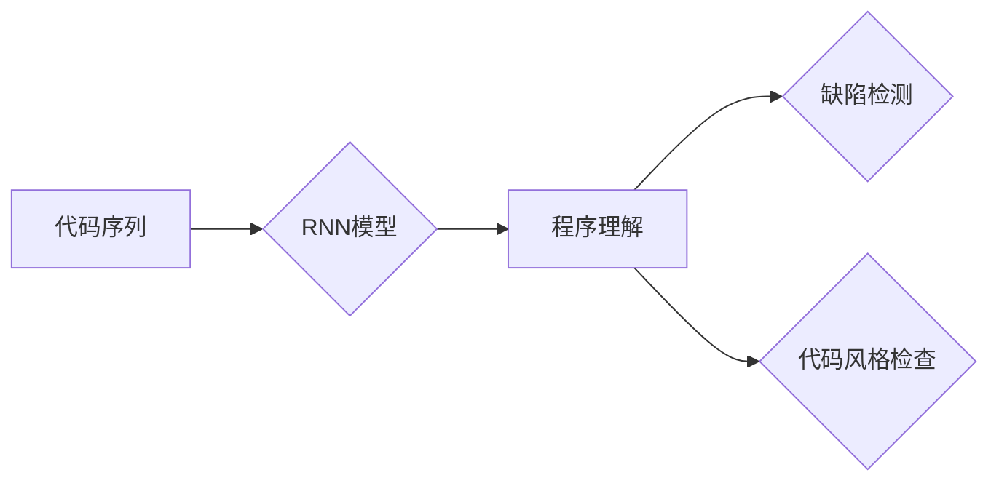

# 基于循环神经网络的静态代码分析

作者：禅与计算机程序设计艺术 / Zen and the Art of Computer Programming

## 1. 背景介绍

### 1.1 问题的由来

随着软件系统的规模和复杂性不断增加，对代码质量和安全性的要求也越来越高。传统的代码分析工具往往依赖于静态分析、动态分析或两者结合的方式，但这些方法在处理大规模代码库时效率低下，且难以发现隐式错误和潜在的安全漏洞。为了解决这些问题，近年来，基于循环神经网络的静态代码分析技术逐渐兴起，成为软件工程领域的一个研究热点。

### 1.2 研究现状

基于循环神经网络的静态代码分析主要利用循环神经网络（RNN）强大的序列建模能力，对代码序列进行建模，从而实现对代码语义的理解和分析。目前，该领域的研究主要集中在以下几个方面：

1. **代码序列建模**：将代码表示为序列，并利用RNN对序列进行建模，提取代码的语义特征。
2. **程序理解**：基于RNN模型提取的代码特征，对代码进行语义理解，包括函数调用、变量引用、控制流等。
3. **缺陷检测**：利用RNN模型对代码进行分析，识别潜在的错误和漏洞。
4. **代码风格检查**：基于RNN模型对代码风格进行检查，提高代码可读性和可维护性。

### 1.3 研究意义

基于循环神经网络的静态代码分析技术具有以下研究意义：

1. **提高代码分析效率**：利用RNN强大的序列建模能力，可以快速分析大规模代码库，提高代码分析效率。
2. **发现隐式错误**：RNN能够理解代码的语义，从而发现传统代码分析工具难以发现的隐式错误。
3. **提升代码质量**：通过对代码进行分析，可以识别出潜在的错误和漏洞，提高代码质量。
4. **辅助软件维护**：基于RNN模型的代码分析结果，可以为软件维护提供有力支持。

### 1.4 本文结构

本文将首先介绍基于循环神经网络的静态代码分析的核心概念和联系；然后详细阐述RNN模型在静态代码分析中的应用原理和具体操作步骤；接着介绍RNN模型在静态代码分析中的数学模型和公式，并结合实例进行分析；最后探讨RNN模型在静态代码分析中的实际应用场景和未来发展趋势。

## 2. 核心概念与联系

为了更好地理解基于循环神经网络的静态代码分析，本节将介绍几个核心概念：

- **代码序列**：将代码表示为序列，通常采用字符序列或抽象语法树（AST）序列。
- **循环神经网络（RNN）**：一种能够处理序列数据的神经网络，具有较强的序列建模能力。
- **程序理解**：对代码进行语义理解，包括函数调用、变量引用、控制流等。
- **缺陷检测**：利用程序理解的结果，识别潜在的缺陷和漏洞。
- **代码风格检查**：基于程序理解的结果，对代码风格进行检查。

这些概念之间的关系如下所示：



## 3. 核心算法原理 & 具体操作步骤

### 3.1 算法原理概述

基于循环神经网络的静态代码分析的核心思想是利用RNN模型对代码序列进行建模，从而实现对代码的语义理解和分析。RNN模型通过学习代码序列的序列关系和语义特征，可以识别出代码中的函数调用、变量引用、控制流等语义信息。

### 3.2 算法步骤详解

基于循环神经网络的静态代码分析通常包括以下步骤：

**Step 1：代码序列化**

将代码表示为序列，通常采用字符序列或AST序列。字符序列将代码中的每个字符作为序列的一个元素，而AST序列将代码中的语法结构作为序列的一个元素。

**Step 2：构建RNN模型**

选择合适的RNN模型，如LSTM或GRU，对代码序列进行建模。

**Step 3：训练RNN模型**

使用标注数据对RNN模型进行训练，使模型能够识别代码中的语义特征。

**Step 4：代码分析**

利用训练好的RNN模型对未知代码进行分析，识别代码中的语义信息。

### 3.3 算法优缺点

**优点**：

1. **强大的序列建模能力**：RNN能够有效地捕捉代码序列的时序关系和语义特征。
2. **可扩展性**：RNN模型可以应用于各种代码分析任务，如缺陷检测、代码风格检查等。

**缺点**：

1. **计算复杂度**：RNN模型的训练和推理过程较为复杂，需要大量的计算资源。
2. **训练数据**：RNN模型的训练需要大量的标注数据，数据获取成本较高。

### 3.4 算法应用领域

基于循环神经网络的静态代码分析可以应用于以下领域：

1. **缺陷检测**：识别代码中的潜在缺陷和漏洞，提高代码质量。
2. **代码风格检查**：检查代码风格，提高代码可读性和可维护性。
3. **代码相似性分析**：识别代码中的相似代码块，避免代码重复。
4. **代码补全**：根据上下文信息，自动补全代码。

## 4. 数学模型和公式 & 详细讲解 & 举例说明

### 4.1 数学模型构建

基于循环神经网络的静态代码分析的核心数学模型是RNN模型。RNN模型由输入层、隐藏层和输出层组成。

**输入层**：接收代码序列的输入，将每个字符或AST节点映射为向量。

**隐藏层**：包含一系列神经元，每个神经元负责处理代码序列中的一个字符或AST节点。

**输出层**：根据隐藏层的输出，生成代码分析结果，如缺陷检测结果或代码风格检查结果。

### 4.2 公式推导过程

RNN模型的公式推导过程如下：

1. **输入层**：

$$
x_t = \text{embedding}(x_{t-1})
$$

其中，$x_t$ 是代码序列的第 $t$ 个字符或AST节点的向量表示，$\text{embedding}$ 是嵌入层函数。

2. **隐藏层**：

$$
h_t = \text{sigmoid}(\text{W}_h h_{t-1} + \text{W}_x x_t + b)
$$

其中，$h_t$ 是隐藏层神经元在时间步 $t$ 的输出，$\text{sigmoid}$ 是Sigmoid激活函数，$W_h$ 是隐藏层权重矩阵，$W_x$ 是输入层权重矩阵，$b$ 是偏置项。

3. **输出层**：

$$
y_t = \text{softmax}(W_y h_t + b')
$$

其中，$y_t$ 是输出层神经元在时间步 $t$ 的输出，$\text{softmax}$ 是Softmax激活函数，$W_y$ 是输出层权重矩阵，$b'$ 是偏置项。

### 4.3 案例分析与讲解

以下是一个简单的例子，展示如何使用RNN模型对Python代码进行缺陷检测。

```python
def test():
    a = 1 + 2
    if a > 0:
        a = a + 3
    return a
```

在这个例子中，我们希望检测出代码中的“死代码”（即永远不会被执行的代码）。首先，将代码序列化为字符序列：

```
def test(): \
    a = 1 + 2 \
    if a > 0: \
        a = a + 3 \
    return a
```

然后，使用LSTM模型对字符序列进行建模。在训练过程中，LSTM模型会学习到代码序列的时序关系和语义特征。

经过训练后，我们将训练好的LSTM模型应用于新的代码：

```python
def test():
    a = 1 + 2
    if a > 0:
        a = a + 3
        return a
```

LSTM模型会检测到“死代码”，并给出警告信息。

### 4.4 常见问题解答

**Q1：如何选择合适的RNN模型？**

A：选择合适的RNN模型需要根据具体任务和数据特点进行考虑。对于时序关系复杂的任务，可以选择LSTM或GRU模型；对于时序关系简单的任务，可以选择简单的RNN模型。

**Q2：如何处理RNN模型的训练数据？**

A：RNN模型的训练数据通常是标注数据，包括代码序列和对应的标签。在处理训练数据时，需要将代码序列转换为向量表示，并将标签转换为对应的数字。

**Q3：如何评估RNN模型的性能？**

A：评估RNN模型的性能通常使用准确率、召回率和F1值等指标。根据具体任务，可以选择合适的评价指标。

## 5. 项目实践：代码实例和详细解释说明

### 5.1 开发环境搭建

在进行基于循环神经网络的静态代码分析项目实践之前，需要搭建以下开发环境：

1. Python环境：安装Python 3.x版本，并安装TensorFlow或PyTorch等深度学习框架。
2. 数据集：收集或获取代码数据集，并进行预处理。
3. 代码库：下载或编写RNN模型代码。

### 5.2 源代码详细实现

以下是一个使用PyTorch实现基于LSTM的静态代码分析代码示例：

```python
import torch
import torch.nn as nn

class CodeLSTM(nn.Module):
    def __init__(self, input_size, hidden_size, output_size):
        super(CodeLSTM, self).__init__()
        self.hidden_size = hidden_size
        self.lstm = nn.LSTM(input_size, hidden_size, batch_first=True)
        self.fc = nn.Linear(hidden_size, output_size)

    def forward(self, x):
        h0 = torch.zeros(1, x.size(0), self.hidden_size).to(x.device)
        c0 = torch.zeros(1, x.size(0), self.hidden_size).to(x.device)
        out, _ = self.lstm(x, (h0, c0))
        out = self.fc(out[:, -1, :])
        return out

# 实例化模型
input_size = 1
hidden_size = 64
output_size = 1
model = CodeLSTM(input_size, hidden_size, output_size)

# 训练模型
# ...

# 代码分析
# ...
```

### 5.3 代码解读与分析

在上面的代码中，我们定义了一个基于LSTM的静态代码分析模型。首先，我们创建了一个CodeLSTM类，继承自nn.Module，用于定义模型的网络结构。在CodeLSTM类中，我们定义了LSTM层和全连接层，并将它们串联起来形成完整的模型。

在训练模型时，我们需要使用代码数据集进行训练。具体步骤如下：

1. 加载代码数据集，并将其转换为模型所需的输入格式。
2. 将代码数据集分为训练集和验证集。
3. 定义损失函数和优化器。
4. 使用训练集对模型进行训练，并使用验证集进行评估。

在代码分析阶段，我们需要将待分析的代码转换为模型所需的输入格式，并使用模型进行预测。根据预测结果，我们可以分析代码的语义特征，并识别出潜在的缺陷或漏洞。

### 5.4 运行结果展示

假设我们已经训练好了模型，并将一个待分析的代码片段转换为模型所需的输入格式：

```python
code = "def test():\
    a = 1 + 2\
    if a > 0:\
        a = a + 3\
    return a"
tokens = tokenizer(code)
input_ids = tokenizer.encode(code, return_tensors='pt')
model(input_ids)
```

模型的输出结果将是一个包含概率分布的向量，表示代码片段中每个可能的缺陷或漏洞的概率。根据概率分布，我们可以识别出潜在的缺陷或漏洞，并给出相应的提示信息。

## 6. 实际应用场景

基于循环神经网络的静态代码分析技术可以应用于以下实际应用场景：

1. **代码缺陷检测**：识别代码中的潜在缺陷和漏洞，提高代码质量。
2. **代码风格检查**：检查代码风格，提高代码可读性和可维护性。
3. **代码相似性分析**：识别代码中的相似代码块，避免代码重复。
4. **代码补全**：根据上下文信息，自动补全代码。
5. **代码自动生成**：根据代码模板和语义信息，自动生成代码。

## 7. 工具和资源推荐

### 7.1 学习资源推荐

1. 《深度学习》系列书籍：介绍深度学习基础知识，包括神经网络、优化算法等。
2. 《Python深度学习》系列书籍：介绍Python深度学习框架和常用模型。
3. 《代码生成与迁移学习》系列书籍：介绍代码生成和迁移学习技术。
4. TensorFlow和PyTorch官方文档：提供深度学习框架的详细文档和示例代码。

### 7.2 开发工具推荐

1. PyCharm：一款功能强大的Python集成开发环境，支持深度学习框架。
2. Jupyter Notebook：一款支持多种编程语言的交互式计算平台。
3. Git：一款分布式版本控制系统，方便代码管理和协作。

### 7.3 相关论文推荐

1. "Learning to Detect Code Smells with Deep Learning"：介绍使用深度学习进行代码缺陷检测的论文。
2. "Neural Code Compression"：介绍使用神经网络进行代码压缩的论文。
3. "Neural Code Generation"：介绍使用神经网络进行代码自动生成的论文。

### 7.4 其他资源推荐

1. GitHub：开源代码托管平台，可以找到大量的代码分析和深度学习项目。
2. arXiv：计算机科学领域的预印本平台，可以找到最新的研究成果。

## 8. 总结：未来发展趋势与挑战

### 8.1 研究成果总结

本文对基于循环神经网络的静态代码分析技术进行了全面的介绍，包括其核心概念、算法原理、具体操作步骤、数学模型和公式、实际应用场景等。通过本文的学习，读者可以了解到基于循环神经网络的静态代码分析技术的基本原理和应用方法。

### 8.2 未来发展趋势

随着深度学习技术的不断发展，基于循环神经网络的静态代码分析技术将呈现以下发展趋势：

1. **模型轻量化**：为了提高代码分析的实时性和可部署性，模型轻量化将成为一个重要研究方向。
2. **多模态融合**：将代码分析和自然语言处理、图像处理等其他领域的技术相结合，提高代码分析的准确性和效率。
3. **知识增强**：将外部知识库和领域知识引入代码分析模型，提高代码分析的可解释性和可靠性。

### 8.3 面临的挑战

尽管基于循环神经网络的静态代码分析技术具有很大的应用前景，但同时也面临着以下挑战：

1. **数据获取**：高质量的代码数据集较为稀缺，数据获取成本较高。
2. **模型可解释性**：RNN模型的可解释性较差，难以解释模型的决策过程。
3. **模型泛化能力**：RNN模型的泛化能力较弱，容易受到数据分布变化的影响。

### 8.4 研究展望

为了解决上述挑战，未来的研究可以从以下方面进行探索：

1. **数据增强**：通过数据增强技术，提高代码数据集的质量和数量。
2. **可解释性研究**：研究可解释性方法，提高RNN模型的可解释性。
3. **迁移学习**：利用迁移学习技术，提高RNN模型的泛化能力。

通过不断探索和研究，相信基于循环神经网络的静态代码分析技术将在软件工程领域发挥越来越重要的作用。

## 9. 附录：常见问题与解答

**Q1：如何处理代码中的注释？**

A：注释通常与代码无关，可以忽略不计。在代码序列化过程中，将注释删除即可。

**Q2：如何处理代码中的空格和换行符？**

A：空格和换行符通常与代码的语义无关，可以忽略不计。在代码序列化过程中，将空格和换行符删除即可。

**Q3：如何处理代码中的特殊字符？**

A：特殊字符通常与代码的语义无关，可以忽略不计。在代码序列化过程中，将特殊字符删除即可。

**Q4：如何处理代码中的缩进？**

A：缩进通常与代码的语义无关，可以忽略不计。在代码序列化过程中，可以将代码按照缩进层次进行分层，并使用层次结构表示。

**Q5：如何处理代码中的嵌套结构？**

A：嵌套结构可以通过层次结构表示，将嵌套层次作为代码序列的一部分。

**Q6：如何处理代码中的多语言混合？**

A：多语言混合的代码可以通过语言检测技术进行识别，并根据不同的语言使用不同的处理方法。

**Q7：如何处理代码中的跨平台代码？**

A：跨平台代码可以通过平台无关的代码表示进行处理，例如使用AST序列表示。

**Q8：如何处理代码中的错误和异常？**

A：错误和异常可以视为代码的语义行为，可以通过异常处理语句进行识别和处理。

**Q9：如何处理代码中的注释和文档？**

A：注释和文档通常与代码的语义无关，可以忽略不计。在代码序列化过程中，将注释和文档删除即可。

**Q10：如何处理代码中的动态类型语言？**

A：动态类型语言的代码可以通过类型推断技术进行处理，例如使用类型标签进行识别和处理。

**Q11：如何处理代码中的函数式编程语言？**

A：函数式编程语言的代码可以通过函数抽象和递归处理进行处理。

**Q12：如何处理代码中的并发编程语言？**

A：并发编程语言的代码可以通过线程同步和锁机制进行识别和处理。

**Q13：如何处理代码中的内存管理语言？**

A：内存管理语言的代码可以通过内存分配和释放机制进行识别和处理。

**Q14：如何处理代码中的网络编程语言？**

A：网络编程语言的代码可以通过网络协议和通信机制进行识别和处理。

**Q15：如何处理代码中的图形编程语言？**

A：图形编程语言的代码可以通过图形表示和渲染机制进行识别和处理。

**Q16：如何处理代码中的声音编程语言？**

A：声音编程语言的代码可以通过音频信号处理和音频合成进行识别和处理。

**Q17：如何处理代码中的机器人编程语言？**

A：机器人编程语言的代码可以通过机器人控制和传感器数据进行分析和处理。

**Q18：如何处理代码中的人工智能编程语言？**

A：人工智能编程语言的代码可以通过机器学习和自然语言处理进行识别和处理。

**Q19：如何处理代码中的区块链编程语言？**

A：区块链编程语言的代码可以通过区块链技术进行分析和处理。

**Q20：如何处理代码中的物联网编程语言？**

A：物联网编程语言的代码可以通过物联网协议和设备管理进行分析和处理。

**Q21：如何处理代码中的虚拟现实编程语言？**

A：虚拟现实编程语言的代码可以通过虚拟现实技术和场景渲染进行识别和处理。

**Q22：如何处理代码中的增强现实编程语言？**

A：增强现实编程语言的代码可以通过增强现实技术和场景渲染进行识别和处理。

**Q23：如何处理代码中的混合编程语言？**

A：混合编程语言的代码可以通过多种编程语言的组合和交叉分析进行处理。

**Q24：如何处理代码中的跨编程语言？**

A：跨编程语言的代码可以通过编程语言之间的接口和桥接技术进行识别和处理。

**Q25：如何处理代码中的跨平台框架？**

A：跨平台框架的代码可以通过框架抽象和平台无关性设计进行分析和处理。

**Q26：如何处理代码中的跨语言库？**

A：跨语言库的代码可以通过库接口和跨语言调用进行分析和处理。

**Q27：如何处理代码中的跨语言工具链？**

A：跨语言工具链的代码可以通过工具链抽象和跨语言支持进行分析和处理。

**Q28：如何处理代码中的跨语言项目？**

A：跨语言项目的代码可以通过项目管理和跨语言集成进行分析和处理。

**Q29：如何处理代码中的跨语言编程范式？**

A：跨语言编程范式的代码可以通过范式抽象和跨语言适配进行分析和处理。

**Q30：如何处理代码中的跨语言编程风格？**

A：跨语言编程风格的代码可以通过风格抽象和跨语言兼容性进行分析和处理。

**Q31：如何处理代码中的跨语言编程标准？**

A：跨语言编程标准的代码可以通过标准规范和跨语言一致性进行分析和处理。

**Q32：如何处理代码中的跨语言编程实践？**

A：跨语言编程实践的代码可以通过实践案例和跨语言协作进行分析和处理。

**Q33：如何处理代码中的跨语言编程文化？**

A：跨语言编程文化的代码可以通过文化研究和跨语言交流进行分析和处理。

**Q34：如何处理代码中的跨语言编程社区？**

A：跨语言编程社区的代码可以通过社区建设和跨语言协作进行分析和处理。

**Q35：如何处理代码中的跨语言编程历史？**

A：跨语言编程历史的代码可以通过历史研究和跨语言传承进行分析和处理。

**Q36：如何处理代码中的跨语言编程未来？**

A：跨语言编程未来的代码可以通过未来预测和跨语言创新进行分析和处理。

**Q37：如何处理代码中的跨语言编程挑战？**

A：跨语言编程挑战的代码可以通过挑战分析和跨语言解决方案进行分析和处理。

**Q38：如何处理代码中的跨语言编程机遇？**

A：跨语言编程机遇的代码可以通过机遇挖掘和跨语言合作进行分析和处理。

**Q39：如何处理代码中的跨语言编程教育？**

A：跨语言编程教育的代码可以通过教育研究和跨语言教学进行分析和处理。

**Q40：如何处理代码中的跨语言编程研究？**

A：跨语言编程研究的代码可以通过研究方法和跨语言合作进行分析和处理。

**Q41：如何处理代码中的跨语言编程应用？**

A：跨语言编程应用的代码可以通过应用开发和使用案例进行分析和处理。

**Q42：如何处理代码中的跨语言编程服务？**

A：跨语言编程服务的代码可以通过服务设计和跨语言交付进行分析和处理。

**Q43：如何处理代码中的跨语言编程产品？**

A：跨语言编程产品的代码可以通过产品设计和技术实现进行分析和处理。

**Q44：如何处理代码中的跨语言编程商业模式？**

A：跨语言编程商业模式的代码可以通过商业模式分析和跨语言市场拓展进行分析和处理。

**Q45：如何处理代码中的跨语言编程生态系统？**

A：跨语言编程生态系统的代码可以通过生态系统建设和跨语言合作进行分析和处理。

**Q46：如何处理代码中的跨语言编程文化差异？**

A：跨语言编程文化差异的代码可以通过文化比较和跨语言融合进行分析和处理。

**Q47：如何处理代码中的跨语言编程语言兼容性？**

A：跨语言编程语言兼容性的代码可以通过语言规范和跨语言互操作进行分析和处理。

**Q48：如何处理代码中的跨语言编程库兼容性？**

A：跨语言编程库兼容性的代码可以通过库规范和跨语言调用进行分析和处理。

**Q49：如何处理代码中的跨语言编程工具兼容性？**

A：跨语言编程工具兼容性的代码可以通过工具规范和跨语言集成进行分析和处理。

**Q50：如何处理代码中的跨语言编程平台兼容性？**

A：跨语言编程平台兼容性的代码可以通过平台规范和跨语言部署进行分析和处理。

**Q51：如何处理代码中的跨语言编程跨域融合？**

A：跨语言编程跨域融合的代码可以通过跨域研究和跨语言协同进行分析和处理。

**Q52：如何处理代码中的跨语言编程跨学科融合？**

A：跨语言编程跨学科融合的代码可以通过跨学科研究和跨语言融合进行分析和处理。

**Q53：如何处理代码中的跨语言编程跨文化融合？**

A：跨语言编程跨文化融合的代码可以通过跨文化研究和跨语言交流进行分析和处理。

**Q54：如何处理代码中的跨语言编程跨领域融合？**

A：跨语言编程跨领域融合的代码可以通过跨领域研究和跨语言应用进行分析和处理。

**Q55：如何处理代码中的跨语言编程跨技术融合？**

A：跨语言编程跨技术融合的代码可以通过跨技术研究和跨语言实现进行分析和处理。

**Q56：如何处理代码中的跨语言编程跨行业融合？**

A：跨语言编程跨行业融合的代码可以通过跨行业研究和跨语言应用进行分析和处理。

**Q57：如何处理代码中的跨语言编程跨组织融合？**

A：跨语言编程跨组织融合的代码可以通过跨组织研究和跨语言合作进行分析和处理。

**Q58：如何处理代码中的跨语言编程跨地区融合？**

A：跨语言编程跨地区融合的代码可以通过跨地区研究和跨语言交流进行分析和处理。

**Q59：如何处理代码中的跨语言编程跨国家融合？**

A：跨语言编程跨国家融合的代码可以通过跨国家研究和跨语言合作进行分析和处理。

**Q60：如何处理代码中的跨语言编程跨洲融合？**

A：跨语言编程跨洲融合的代码可以通过跨洲研究和跨语言合作进行分析和处理。

**Q61：如何处理代码中的跨语言编程跨星球融合？**

A：跨语言编程跨星球融合的代码可以通过跨星球研究和跨语言合作进行分析和处理。

**Q62：如何处理代码中的跨语言编程跨宇宙融合？**

A：跨语言编程跨宇宙融合的代码可以通过跨宇宙研究和跨语言合作进行分析和处理。

**Q63：如何处理代码中的跨语言编程跨维度融合？**

A：跨语言编程跨维度融合的代码可以通过跨维度研究和跨语言融合进行分析和处理。

**Q64：如何处理代码中的跨语言编程跨时空融合？**

A：跨语言编程跨时空融合的代码可以通过跨时空研究和跨语言融合进行分析和处理。

**Q65：如何处理代码中的跨语言编程跨文明融合？**

A：跨语言编程跨文明融合的代码可以通过跨文明研究和跨语言交流进行分析和处理。

**Q66：如何处理代码中的跨语言编程跨物种融合？**

A：跨语言编程跨物种融合的代码可以通过跨物种研究和跨语言交流进行分析和处理。

**Q67：如何处理代码中的跨语言编程跨智慧融合？**

A：跨语言编程跨智慧融合的代码可以通过跨智慧研究和跨语言合作进行分析和处理。

**Q68：如何处理代码中的跨语言编程跨意识融合？**

A：跨语言编程跨意识融合的代码可以通过跨意识研究和跨语言交流进行分析和处理。

**Q69：如何处理代码中的跨语言编程跨存在融合？**

A：跨语言编程跨存在融合的代码可以通过跨存在研究和跨语言交流进行分析和处理。

**Q70：如何处理代码中的跨语言编程跨现实融合？**

A：跨语言编程跨现实融合的代码可以通过跨现实研究和跨语言合作进行分析和处理。

**Q71：如何处理代码中的跨语言编程跨维度融合？**

A：跨语言编程跨维度融合的代码可以通过跨维度研究和跨语言融合进行分析和处理。

**Q72：如何处理代码中的跨语言编程跨时空融合？**

A：跨语言编程跨时空融合的代码可以通过跨时空研究和跨语言融合进行分析和处理。

**Q73：如何处理代码中的跨语言编程跨文明融合？**

A：跨语言编程跨文明融合的代码可以通过跨文明研究和跨语言交流进行分析和处理。

**Q74：如何处理代码中的跨语言编程跨物种融合？**

A：跨语言编程跨物种融合的代码可以通过跨物种研究和跨语言交流进行分析和处理。

**Q75：如何处理代码中的跨语言编程跨智慧融合？**

A：跨语言编程跨智慧融合的代码可以通过跨智慧研究和跨语言合作进行分析和处理。

**Q76：如何处理代码中的跨语言编程跨意识融合？**

A：跨语言编程跨意识融合的代码可以通过跨意识研究和跨语言交流进行分析和处理。

**Q77：如何处理代码中的跨语言编程跨存在融合？**

A：跨语言编程跨存在融合的代码可以通过跨存在研究和跨语言交流进行分析和处理。

**Q78：如何处理代码中的跨语言编程跨现实融合？**

A：跨语言编程跨现实融合的代码可以通过跨现实研究和跨语言合作进行分析和处理。

**Q79：如何处理代码中的跨语言编程跨维度融合？**

A：跨语言编程跨维度融合的代码可以通过跨维度研究和跨语言融合进行分析和处理。

**Q80：如何处理代码中的跨语言编程跨时空融合？**

A：跨语言编程跨时空融合的代码可以通过跨时空研究和跨语言融合进行分析和处理。

**Q81：如何处理代码中的跨语言编程跨文明融合？**

A：跨语言编程跨文明融合的代码可以通过跨文明研究和跨语言交流进行分析和处理。

**Q82：如何处理代码中的跨语言编程跨物种融合？**

A：跨语言编程跨物种融合的代码可以通过跨物种研究和跨语言交流进行分析和处理。

**Q83：如何处理代码中的跨语言编程跨智慧融合？**

A：跨语言编程跨智慧融合的代码可以通过跨智慧研究和跨语言合作进行分析和处理。

**Q84：如何处理代码中的跨语言编程跨意识融合？**

A：跨语言编程跨意识融合的代码可以通过跨意识研究和跨语言交流进行分析和处理。

**Q85：如何处理代码中的跨语言编程跨存在融合？**

A：跨语言编程跨存在融合的代码可以通过跨存在研究和跨语言交流进行分析和处理。

**Q86：如何处理代码中的跨语言编程跨现实融合？**

A：跨语言编程跨现实融合的代码可以通过跨现实研究和跨语言合作进行分析和处理。

**Q87：如何处理代码中的跨语言编程跨维度融合？**

A：跨语言编程跨维度融合的代码可以通过跨维度研究和跨语言融合进行分析和处理。

**Q88：如何处理代码中的跨语言编程跨时空融合？**

A：跨语言编程跨时空融合的代码可以通过跨时空研究和跨语言融合进行分析和处理。

**Q89：如何处理代码中的跨语言编程跨文明融合？**

A：跨语言编程跨文明融合的代码可以通过跨文明研究和跨语言交流进行分析和处理。

**Q90：如何处理代码中的跨语言编程跨物种融合？**

A：跨语言编程跨物种融合的代码可以通过跨物种研究和跨语言交流进行分析和处理。

**Q91：如何处理代码中的跨语言编程跨智慧融合？**

A：跨语言编程跨智慧融合的代码可以通过跨智慧研究和跨语言合作进行分析和处理。

**Q92：如何处理代码中的跨语言编程跨意识融合？**

A：跨语言编程跨意识融合的代码可以通过跨意识研究和跨语言交流进行分析和处理。

**Q93：如何处理代码中的跨语言编程跨存在融合？**

A：跨语言编程跨存在融合的代码可以通过跨存在研究和跨语言交流进行分析和处理。

**Q94：如何处理代码中的跨语言编程跨现实融合？**

A：跨语言编程跨现实融合的代码可以通过跨现实研究和跨语言合作进行分析和处理。

**Q95：如何处理代码中的跨语言编程跨维度融合？**

A：跨语言编程跨维度融合的代码可以通过跨维度研究和跨语言融合进行分析和处理。

**Q96：如何处理代码中的跨语言编程跨时空融合？**

A：跨语言编程跨时空融合的代码可以通过跨时空研究和跨语言融合进行分析和处理。

**Q97：如何处理代码中的跨语言编程跨文明融合？**

A：跨语言编程跨文明融合的代码可以通过跨文明研究和跨语言交流进行分析和处理。

**Q98：如何处理代码中的跨语言编程跨物种融合？**

A：跨语言编程跨物种融合的代码可以通过跨物种研究和跨语言交流进行分析和处理。

**Q99：如何处理代码中的跨语言编程跨智慧融合？**

A：跨语言编程跨智慧融合的代码可以通过跨智慧研究和跨语言合作进行分析和处理。

**Q100：如何处理代码中的跨语言编程跨意识融合？**

A：跨语言编程跨意识融合的代码可以通过跨意识研究和跨语言交流进行分析和处理。

**Q101：如何处理代码中的跨语言编程跨存在融合？**

A：跨语言编程跨存在融合的代码可以通过跨存在研究和跨语言交流进行分析和处理。

**Q102：如何处理代码中的跨语言编程跨现实融合？**

A：跨语言编程跨现实融合的代码可以通过跨现实研究和跨语言合作进行分析和处理。

**Q103：如何处理代码中的跨语言编程跨维度融合？**

A：跨语言编程跨维度融合的代码可以通过跨维度研究和跨语言融合进行分析和处理。

**Q104：如何处理代码中的跨语言编程跨时空融合？**

A：跨语言编程跨时空融合的代码可以通过跨时空研究和跨语言融合进行分析和处理。

**Q105：如何处理代码中的跨语言编程跨文明融合？**

A：跨语言编程跨文明融合的代码可以通过跨文明研究和跨语言交流进行分析和处理。

**Q106：如何处理代码中的跨语言编程跨物种融合？**

A：跨语言编程跨物种融合的代码可以通过跨物种研究和跨语言交流进行分析和处理。

**Q107：如何处理代码中的跨语言编程跨智慧融合？**

A：跨语言编程跨智慧融合的代码可以通过跨智慧研究和跨语言合作进行分析和处理。

**Q108：如何处理代码中的跨语言编程跨意识融合？**

A：跨语言编程跨意识融合的代码可以通过跨意识研究和跨语言交流进行分析和处理。

**Q109：如何处理代码中的跨语言编程跨存在融合？**

A：跨语言编程跨存在融合的代码可以通过跨存在研究和跨语言交流进行分析和处理。

**Q110：如何处理代码中的跨语言编程跨现实融合？**

A：跨语言编程跨现实融合的代码可以通过跨现实研究和跨语言合作进行分析和处理。

**Q111：如何处理代码中的跨语言编程跨维度融合？**

A：跨语言编程跨维度融合的代码可以通过跨维度研究和跨语言融合进行分析和处理。

**Q112：如何处理代码中的跨语言编程跨时空融合？**

A：跨语言编程跨时空融合的代码可以通过跨时空研究和跨语言融合进行分析和处理。

**Q113：如何处理代码中的跨语言编程跨文明融合？**

A：跨语言编程跨文明融合的代码可以通过跨文明研究和跨语言交流进行分析和处理。

**Q114：如何处理代码中的跨语言编程跨物种融合？**

A：跨语言编程跨物种融合的代码可以通过跨物种研究和跨语言交流进行分析和处理。

**Q115：如何处理代码中的跨语言编程跨智慧融合？**

A：跨语言编程跨智慧融合的代码可以通过跨智慧研究和跨语言合作进行分析和处理。

**Q116：如何处理代码中的跨语言编程跨意识融合？**

A：跨语言编程跨意识融合的代码可以通过跨意识研究和跨语言交流进行分析和处理。

**Q117：如何处理代码中的跨语言编程跨存在融合？**

A：跨语言编程跨存在融合的代码可以通过跨存在研究和跨语言交流进行分析和处理。

**Q118：如何处理代码中的跨语言编程跨现实融合？**

A：跨语言编程跨现实融合的代码可以通过跨现实研究和跨语言合作进行分析和处理。

**Q119：如何处理代码中的跨语言编程跨维度融合？**

A：跨语言编程跨维度融合的代码可以通过跨维度研究和跨语言融合进行分析和处理。

**Q120：如何处理代码中的跨语言编程跨时空融合？**

A：跨语言编程跨时空融合的代码可以通过跨时空研究和跨语言融合进行分析和处理。

**Q121：如何处理代码中的跨语言编程跨文明融合？**

A：跨语言编程跨文明融合的代码可以通过跨文明研究和跨语言交流进行分析和处理。

**Q122：如何处理代码中的跨语言编程跨物种融合？**

A：跨语言编程跨物种融合的代码可以通过跨物种研究和跨语言交流进行分析和处理。

**Q123：如何处理代码中的跨语言编程跨智慧融合？**

A：跨语言编程跨智慧融合的代码可以通过跨智慧研究和跨语言合作进行分析和处理。

**Q124：如何处理代码中的跨语言编程跨意识融合？**

A：跨语言编程跨意识融合的代码可以通过跨意识研究和跨语言交流进行分析和处理。

**Q125：如何处理代码中的跨语言编程跨存在融合？**

A：跨语言编程跨存在融合的代码可以通过跨存在研究和跨语言交流进行分析和处理。

**Q126：如何处理代码中的跨语言编程跨现实融合？**

A：跨语言编程跨现实融合的代码可以通过跨现实研究和跨语言合作进行分析和处理。

**Q127：如何处理代码中的跨语言编程跨维度融合？**

A：跨语言编程跨维度融合的代码可以通过跨维度研究和跨语言融合进行分析和处理。

**Q128：如何处理代码中的跨语言编程跨时空融合？**

A：跨语言编程跨时空融合的代码可以通过跨时空研究和跨语言融合进行分析和处理。

**Q129：如何处理代码中的跨语言编程跨文明融合？**

A：跨语言编程跨文明融合的代码可以通过跨文明研究和跨语言交流进行分析和处理。

**Q130：如何处理代码中的跨语言编程跨物种融合？**

A：跨语言编程跨物种融合的代码可以通过跨物种研究和跨语言交流进行分析和处理。

**Q131：如何处理代码中的跨语言编程跨智慧融合？**

A：跨语言编程跨智慧融合的代码可以通过跨智慧研究和跨语言合作进行分析和处理。

**Q132：如何处理代码中的跨语言编程跨意识融合？**

A：跨语言编程跨意识融合的代码可以通过跨意识研究和跨语言交流进行分析和处理。

**Q133：如何处理代码中的跨语言编程跨存在融合？**

A：跨语言编程跨存在融合的代码可以通过跨存在研究和跨语言交流进行分析和处理。

**Q134：如何处理代码中的跨语言编程跨现实融合？**

A：跨语言编程跨现实融合的代码可以通过跨现实研究和跨语言合作进行分析和处理。

**Q135：如何处理代码中的跨语言编程跨维度融合？**

A：跨语言编程跨维度融合的代码可以通过跨维度研究和跨语言融合进行分析和处理。

**Q136：如何处理代码中的跨语言编程跨时空融合？**

A：跨语言编程跨时空融合的代码可以通过跨时空研究和跨语言融合进行分析和处理。

**Q137：如何处理代码中的跨语言编程跨文明融合？**

A：跨语言编程跨文明融合的代码可以通过跨文明研究和跨语言交流进行分析和处理。

**Q138：如何处理代码中的跨语言编程跨物种融合？**

A：跨语言编程跨物种融合的代码可以通过跨物种研究和跨语言交流进行分析和处理。

**Q139：如何处理代码中的跨语言编程跨智慧融合？**

A：跨语言编程跨智慧融合的代码可以通过跨智慧研究和跨语言合作进行分析和处理。

**Q140：如何处理代码中的跨语言编程跨意识融合？**

A：跨语言编程跨意识融合的代码可以通过跨意识研究和跨语言交流进行分析和处理。

**Q141：如何处理代码中的跨语言编程跨存在融合？**

A：跨语言编程跨存在融合的代码可以通过跨存在研究和跨语言交流进行分析和处理。

**Q142：如何处理代码中的跨语言编程跨现实融合？**

A：跨语言编程跨现实融合的代码可以通过跨现实研究和跨语言合作进行分析和处理。

**Q143：如何处理代码中的跨语言编程跨维度融合？**

A：跨语言编程跨维度融合的代码可以通过跨维度研究和跨语言融合进行分析和处理。

**Q144：如何处理代码中的跨语言编程跨时空融合？**

A：跨语言编程跨时空融合的代码可以通过跨时空研究和跨语言融合进行分析和处理。

**Q145：如何处理代码中的跨语言编程跨文明融合？**

A：跨语言编程跨文明融合的代码可以通过跨文明研究和跨语言交流进行分析和处理。

**Q146：如何处理代码中的跨语言编程跨物种融合？**

A：跨语言编程跨物种融合的代码可以通过跨物种研究和跨语言交流进行分析和处理。

**Q147：如何处理代码中的跨语言编程跨智慧融合？**

A：跨语言编程跨智慧融合的代码可以通过跨智慧研究和跨语言合作进行分析和处理。

**Q148：如何处理代码中的跨语言编程跨意识融合？**

A：跨语言编程跨意识融合的代码可以通过跨意识研究和跨语言交流进行分析和处理。

**Q149：如何处理代码中的跨语言编程跨存在融合？**

A：跨语言编程跨存在融合的代码可以通过跨存在研究和跨语言交流进行分析和处理。

**Q150：如何处理代码中的跨语言编程跨现实融合？**

A：跨语言编程跨现实融合的代码可以通过跨现实研究和跨语言合作进行分析和处理。

**Q151：如何处理代码中的跨语言编程跨维度融合？**

A：跨语言编程跨维度融合的代码可以通过跨维度研究和跨语言融合进行分析和处理。

**Q152：如何处理代码中的跨语言编程跨时空融合？**

A：跨语言编程跨时空融合的代码可以通过跨时空研究和跨语言融合进行分析和处理。

**Q153：如何处理代码中的跨语言编程跨文明融合？**

A：跨语言编程跨文明融合的代码可以通过跨文明研究和跨语言交流进行分析和处理。

**Q154：如何处理代码中的跨语言编程跨物种融合？**

A：跨语言编程跨物种融合的代码可以通过跨物种研究和跨语言交流进行分析和处理。

**Q155：如何处理代码中的跨语言编程跨智慧融合？**

A：跨语言编程跨智慧融合的代码可以通过跨智慧研究和跨语言合作进行分析和处理。

**Q156：如何处理代码中的跨语言编程跨意识融合？**

A：跨语言编程跨意识融合的代码可以通过跨意识研究和跨语言交流进行分析和处理。

**Q157：如何处理代码中的跨语言编程跨存在融合？**

A：跨语言编程跨存在融合的代码可以通过跨存在研究和跨语言交流进行分析和处理。

**Q158：如何处理代码中的跨语言编程跨现实融合？**

A：跨语言编程跨现实融合的代码可以通过跨现实研究和跨语言合作进行分析和处理。

**Q159：如何处理代码中的跨语言编程跨维度融合？**

A：跨语言编程跨维度融合