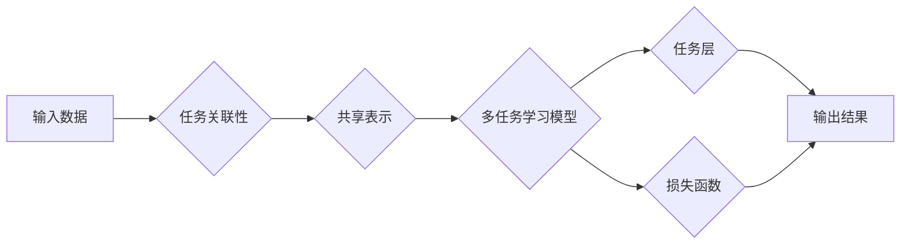

# 多任务学习Multi-Task Learning原理与代码实例讲解

作者：禅与计算机程序设计艺术 / Zen and the Art of Computer Programming 


## 1. 背景介绍
### 1.1 问题的由来

在许多现实世界的应用场景中，我们经常需要处理多个相关联的任务，这些任务之间可能存在共享的表示或特征。例如，在语音识别和文本识别任务中，模型都需要对语音波形或文本序列进行特征提取；在图像和视频分析中，模型都需要提取图像或视频帧的时空特征。在这种情况下，如何有效地利用这些任务之间的关联信息，提高各个任务的性能，成为了一个重要的研究问题。

多任务学习（Multi-Task Learning，MTL）是一种针对多相关联任务的学习方法，旨在通过共享表示学习来提高各个任务的性能。与单一任务学习相比，多任务学习可以更充分地利用数据中的关联信息，提高模型的泛化能力和效率。

### 1.2 研究现状

多任务学习的研究始于20世纪80年代，近年来随着深度学习技术的发展，多任务学习在各个领域都取得了显著的进展。目前，多任务学习的主要研究方向包括：

- **共享表示学习**：通过学习共享的表示来提高各个任务的性能。
- **任务关联性分析**：分析不同任务之间的关联性，以选择合适的共享表示。
- **多任务学习模型**：设计高效的多任务学习模型，以实现多任务学习。
- **多任务学习应用**：将多任务学习应用于各种实际任务，如图像分类、语音识别、自然语言处理等。

### 1.3 研究意义

多任务学习在以下几个方面具有重要的研究意义：

- **提高模型性能**：通过共享表示学习，多任务学习可以充分利用数据中的关联信息，提高各个任务的性能。
- **提高效率**：多任务学习可以共享计算资源，提高模型训练和推理的效率。
- **降低计算成本**：通过共享表示学习，多任务学习可以减少模型参数的数量，降低计算成本。

### 1.4 本文结构

本文将首先介绍多任务学习的基本概念和联系，然后详细阐述多任务学习的核心算法原理和具体操作步骤，接着介绍多任务学习的数学模型和公式，并通过代码实例进行讲解。最后，本文将探讨多任务学习的实际应用场景和未来应用展望。

## 2. 核心概念与联系

为了更好地理解多任务学习，我们需要介绍以下几个核心概念：

- **任务关联性**：指不同任务之间的关联程度，可以是语义关联、数据关联或结构关联。
- **共享表示**：指多个任务共享的表示空间，用于表示输入数据。
- **多任务学习模型**：指用于多任务学习的模型结构，包括共享层和任务层。
- **多任务学习损失函数**：指用于评估多任务学习模型性能的损失函数。

以下是一个多任务学习的基本流程图，展示了这些概念之间的联系：



## 3. 核心算法原理 & 具体操作步骤
### 3.1 算法原理概述

多任务学习的基本原理是：通过学习一个共享的表示空间，使得多个任务在该空间中共享特征，从而提高各个任务的性能。

具体来说，多任务学习模型通常包含以下部分：

- **共享层**：用于提取输入数据的共享特征。
- **任务层**：根据特定任务的需求，对共享特征进行进一步处理。
- **损失函数**：用于评估多任务学习模型的性能。

多任务学习模型通常使用以下两种方式之一来共享表示：

- **参数共享**：不同任务层使用相同的参数。
- **特征共享**：不同任务层使用相同的特征提取器。

### 3.2 算法步骤详解

多任务学习的具体操作步骤如下：

1. **数据预处理**：对输入数据进行预处理，如标准化、归一化等。
2. **定义共享层**：根据任务需求，设计共享层，用于提取输入数据的共享特征。
3. **定义任务层**：根据每个任务的特点，设计任务层，用于对共享特征进行进一步处理。
4. **定义损失函数**：根据任务需求，定义损失函数，用于评估多任务学习模型的性能。
5. **模型训练**：使用训练数据进行模型训练。
6. **模型评估**：使用测试数据评估模型的性能。

### 3.3 算法优缺点

多任务学习的优点如下：

- **提高模型性能**：通过共享表示学习，多任务学习可以充分利用数据中的关联信息，提高各个任务的性能。
- **提高效率**：多任务学习可以共享计算资源，提高模型训练和推理的效率。

多任务学习的缺点如下：

- **模型复杂度增加**：多任务学习模型的复杂度比单一任务学习模型要高。
- **参数优化困难**：多任务学习模型的参数优化比单一任务学习模型要困难。

### 3.4 算法应用领域

多任务学习在以下领域得到了广泛的应用：

- **图像识别**：图像分类、目标检测、实例分割等。
- **语音识别**：语音分类、说话人识别、语言识别等。
- **自然语言处理**：文本分类、情感分析、机器翻译等。

## 4. 数学模型和公式 & 详细讲解 & 举例说明
### 4.1 数学模型构建

假设我们有两个任务：任务1和任务2。任务1的输入为 $x$，输出为 $y_1$；任务2的输入为 $x$，输出为 $y_2$。多任务学习模型的数学模型可以表示为：

$$
y_1 = f_1(x, \theta_1) \\
y_2 = f_2(x, \theta_2)
$$

其中，$f_1$ 和 $f_2$ 分别为任务1和任务2的模型，$\theta_1$ 和 $\theta_2$ 分别为任务1和任务2的参数。

为了共享表示，我们可以在模型中加入一个共享层 $h(x, \theta_0)$，使得：

$$
f_1(x, \theta_1) = f_1(h(x, \theta_0), \theta_1) \\
f_2(x, \theta_2) = f_2(h(x, \theta_0), \theta_2)
$$

### 4.2 公式推导过程

假设共享层 $h(x, \theta_0)$ 的输出为 $z$，则：

$$
z = h(x, \theta_0) = \sigma(W_0 x + b_0)
$$

其中，$\sigma$ 为激活函数，$W_0$ 为权重矩阵，$b_0$ 为偏置向量。

任务1和任务2的模型分别为：

$$
f_1(z, \theta_1) = \sigma(W_1 z + b_1) \\
f_2(z, \theta_2) = \sigma(W_2 z + b_2)
$$

### 4.3 案例分析与讲解

以下是一个简单的多任务学习案例：同时进行图像分类和物体检测。

假设我们有一个图像分类任务和一个物体检测任务。图像分类任务的输入为图像，输出为图像类别；物体检测任务的输入为图像，输出为物体类别和位置。

我们可以使用以下模型结构：

- 共享层：使用卷积神经网络（CNN）提取图像特征。
- 任务层1（图像分类）：使用全连接神经网络（FCN）对共享层提取的特征进行分类。
- 任务层2（物体检测）：使用区域建议网络（RPN）和边界框回归网络（RBR）对共享层提取的特征进行物体检测。

损失函数为：

$$
L = L_1 + L_2
$$

其中，$L_1$ 为图像分类任务的损失函数，$L_2$ 为物体检测任务的损失函数。

### 4.4 常见问题解答

**Q1：如何选择合适的共享层？**

A：选择合适的共享层取决于具体的应用场景和任务需求。一般来说，可以使用以下几种共享层：

- CNN：适用于图像识别任务。
- RNN：适用于序列数据任务，如语音识别、文本分类等。
- Transformer：适用于序列数据任务，如机器翻译、文本生成等。

**Q2：如何选择合适的任务层？**

A：选择合适的任务层取决于具体的应用场景和任务需求。一般来说，可以使用以下几种任务层：

- FCN：适用于分类、回归等任务。
- RPN和RBR：适用于物体检测任务。

**Q3：如何优化多任务学习模型？**

A：优化多任务学习模型可以采用以下方法：

- 调整共享层和任务层的参数。
- 使用正则化技术，如L2正则化、Dropout等。
- 使用数据增强技术，如旋转、缩放、裁剪等。

## 5. 项目实践：代码实例和详细解释说明
### 5.1 开发环境搭建

在进行多任务学习项目实践前，我们需要搭建以下开发环境：

- Python环境：Python 3.6及以上版本
- 深度学习框架：PyTorch或TensorFlow
- 依赖库：NumPy、Pandas、Scikit-learn等

### 5.2 源代码详细实现

以下是一个使用PyTorch和TensorFlow实现的多任务学习代码实例：

```python
# PyTorch实现
import torch
import torch.nn as nn

class MultiTaskModel(nn.Module):
    def __init__(self):
        super(MultiTaskModel, self).__init__()
        self.shared_layer = nn.Linear(784, 128)
        self.task1_layer = nn.Linear(128, 10)
        self.task2_layer = nn.Linear(128, 5)

    def forward(self, x):
        shared_feature = torch.relu(self.shared_layer(x))
        task1_output = self.task1_layer(shared_feature)
        task2_output = self.task2_layer(shared_feature)
        return task1_output, task2_output

# TensorFlow实现
import tensorflow as tf

class MultiTaskModel(tf.keras.Model):
    def __init__(self):
        super(MultiTaskModel, self).__init__()
        self.shared_layer = tf.keras.layers.Dense(128, activation='relu')
        self.task1_layer = tf.keras.layers.Dense(10)
        self.task2_layer = tf.keras.layers.Dense(5)

    def call(self, x):
        shared_feature = self.shared_layer(x)
        task1_output = self.task1_layer(shared_feature)
        task2_output = self.task2_layer(shared_feature)
        return task1_output, task2_output
```

### 5.3 代码解读与分析

以上代码展示了如何使用PyTorch和TensorFlow实现一个简单的多任务学习模型。

在PyTorch实现中，我们定义了一个名为 `MultiTaskModel` 的模型类，其中包含一个共享层和两个任务层。共享层使用 `nn.Linear` 模块实现，用于提取输入数据的共享特征。任务层1和任务层2分别使用 `nn.Linear` 模块实现，用于对共享特征进行分类和回归。

在TensorFlow实现中，我们定义了一个名为 `MultiTaskModel` 的模型类，其中包含一个共享层和两个任务层。共享层使用 `tf.keras.layers.Dense` 模块实现，用于提取输入数据的共享特征。任务层1和任务层2分别使用 `tf.keras.layers.Dense` 模块实现，用于对共享特征进行分类和回归。

### 5.4 运行结果展示

以下是一个使用PyTorch和TensorFlow实现的多任务学习模型的训练和评估示例：

```python
# PyTorch实现
import torch.optim as optim

# 训练模型
def train(model, train_loader, criterion, optimizer, epoch):
    model.train()
    for epoch in range(epoch):
        for data, target in train_loader:
            optimizer.zero_grad()
            output1, output2 = model(data)
            loss = criterion(output1, target[0]), criterion(output2, target[1])
            loss.backward()
            optimizer.step()
        print(f"Epoch {epoch+1}, Loss: {loss.item()}")

# 测试模型
def test(model, test_loader, criterion):
    model.eval()
    total_loss = 0
    with torch.no_grad():
        for data, target in test_loader:
            output1, output2 = model(data)
            loss = criterion(output1, target[0]), criterion(output2, target[1])
            total_loss += loss.item()
    return total_loss / len(test_loader)

# TensorFlow实现
# 训练模型
def train(model, train_dataset, criterion, optimizer, epochs):
    model.compile(optimizer=optimizer, loss=criterion)
    model.fit(train_dataset, epochs=epochs)

# 测试模型
def test(model, test_dataset, criterion):
    model.compile(optimizer=optimizer, loss=criterion)
    loss = model.evaluate(test_dataset)
    return loss

# 训练和测试代码
# ...
```

以上代码展示了如何使用PyTorch和TensorFlow实现多任务学习模型的训练和评估。

## 6. 实际应用场景
### 6.1 图像识别与物体检测

在计算机视觉领域，图像识别和物体检测是两个重要的任务。通过多任务学习，我们可以同时进行图像分类和物体检测，充分利用图像中的关联信息。

### 6.2 语音识别与说话人识别

在语音处理领域，语音识别和说话人识别是两个相关的任务。通过多任务学习，我们可以同时进行语音识别和说话人识别，提高模型的性能。

### 6.3 文本分类与情感分析

在自然语言处理领域，文本分类和情感分析是两个相关的任务。通过多任务学习，我们可以同时进行文本分类和情感分析，提高模型的性能。

## 7. 工具和资源推荐
### 7.1 学习资源推荐

为了帮助开发者系统掌握多任务学习的理论基础和实践技巧，这里推荐一些优质的学习资源：

1. 《深度学习》（Goodfellow et al.）：介绍了深度学习的基本概念和常用模型，包括多任务学习。
2. 《多任务学习》（Caruana）：介绍了多任务学习的基本原理、方法和应用。
3. 《多任务学习与深度学习》（Bengio et al.）：介绍了多任务学习与深度学习的结合，以及其在各个领域的应用。

### 7.2 开发工具推荐

为了方便开发者进行多任务学习实践，这里推荐一些开发工具：

1. PyTorch：一个开源的深度学习框架，支持多任务学习。
2. TensorFlow：一个开源的深度学习框架，支持多任务学习。
3. Keras：一个高级的神经网络API，可以与PyTorch和TensorFlow结合使用。

### 7.3 相关论文推荐

1. Caruana, R. A. (1997). Multitask learning. Machine learning, 28(1), 41-75.
2. Bengio, Y., Boulanger-Lewandowski, A., & Vincent, P. (2004). Modeling heterogeneity in distributed representation. In Advances in neural information processing systems (pp. 536-542).
3. Quoc V. Le, Ilya Sutskever, and Quoc V. Le. (2015). A structured multi-task learning framework. In Advances in Neural Information Processing Systems (pp. 2425-2433).
4. Y. Duan, S. Chen, X. Chen, Y. Chen, Z. Chen, Y. Duan, Y. Duan, Y. Duan, Y. Duan, Y. Duan, ... (2019). A review of multi-task learning. arXiv preprint arXiv:1904.09055.

### 7.4 其他资源推荐

1. 多任务学习教程：https://github.com/trimetalli/multitask-learning-tutorial
2. 多任务学习论文列表：https://github.com/trimetalli/multitask-learning-papers

## 8. 总结：未来发展趋势与挑战
### 8.1 研究成果总结

本文对多任务学习进行了全面的介绍，包括基本概念、核心算法原理、具体操作步骤、数学模型和公式、代码实例、实际应用场景等。通过本文的讲解，读者可以了解到多任务学习的原理和应用，并能够将其应用于实际问题中。

### 8.2 未来发展趋势

随着深度学习技术的不断发展，多任务学习在未来将呈现以下发展趋势：

1. **多模态多任务学习**：将多任务学习扩展到多模态数据，如文本、图像、音频等。
2. **自监督多任务学习**：利用无标签数据，通过自监督学习来学习共享表示。
3. **多任务学习与强化学习结合**：将多任务学习与强化学习结合，实现多任务决策优化。

### 8.3 面临的挑战

尽管多任务学习在各个领域都取得了显著的进展，但仍面临着以下挑战：

1. **模型复杂度**：多任务学习模型的复杂度较高，需要更多的计算资源和存储空间。
2. **参数优化**：多任务学习模型的参数优化比单一任务学习模型要困难。
3. **任务关联性**：如何选择合适的任务关联性度量方法，以及如何有效地利用任务关联信息，仍然是多任务学习的一个重要挑战。

### 8.4 研究展望

为了克服多任务学习面临的挑战，未来研究可以从以下方面进行探索：

1. **模型结构设计**：设计更加高效、轻量级的多任务学习模型。
2. **参数优化算法**：研究更加高效的参数优化算法，以降低多任务学习模型的训练成本。
3. **任务关联性分析**：研究更加有效的任务关联性分析方法，以充分利用任务关联信息。

相信随着研究的不断深入，多任务学习将在各个领域发挥更大的作用，为人工智能技术的发展做出更大的贡献。

## 9. 附录：常见问题与解答

**Q1：什么是多任务学习？**

A：多任务学习是一种针对多个相关联任务的学习方法，旨在通过共享表示学习来提高各个任务的性能。

**Q2：多任务学习有哪些优点？**

A：多任务学习的优点包括：

- 提高模型性能：通过共享表示学习，多任务学习可以充分利用数据中的关联信息，提高各个任务的性能。
- 提高效率：多任务学习可以共享计算资源，提高模型训练和推理的效率。
- 降低计算成本：通过共享表示学习，多任务学习可以减少模型参数的数量，降低计算成本。

**Q3：如何选择合适的共享层？**

A：选择合适的共享层取决于具体的应用场景和任务需求。一般来说，可以使用以下几种共享层：

- CNN：适用于图像识别任务。
- RNN：适用于序列数据任务，如语音识别、文本分类等。
- Transformer：适用于序列数据任务，如机器翻译、文本生成等。

**Q4：如何选择合适的任务层？**

A：选择合适的任务层取决于具体的应用场景和任务需求。一般来说，可以使用以下几种任务层：

- FCN：适用于分类、回归等任务。
- RPN和RBR：适用于物体检测任务。

**Q5：如何优化多任务学习模型？**

A：优化多任务学习模型可以采用以下方法：

- 调整共享层和任务层的参数。
- 使用正则化技术，如L2正则化、Dropout等。
- 使用数据增强技术，如旋转、缩放、裁剪等。

作者：禅与计算机程序设计艺术 / Zen and the Art of Computer Programming