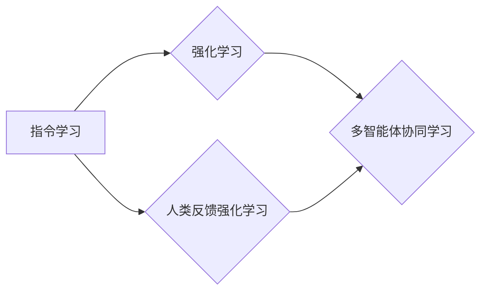

# 大规模语言模型从理论到实践 自动构建指令

> 关键词：大规模语言模型，指令学习，自然语言处理，生成式AI，强化学习，人类反馈强化学习，多智能体

## 1. 背景介绍
### 1.1 问题的由来

随着人工智能技术的飞速发展，自然语言处理（NLP）领域取得了令人瞩目的成果。其中，大规模语言模型（LLMs）如GPT-3和BERT等，通过在海量文本数据上进行预训练，展现了惊人的语言理解和生成能力。然而，这些模型在处理复杂任务时，往往需要大量的指令和上下文信息。如何让LLMs自动构建指令，以适应不同的任务和上下文，成为了一个亟待解决的问题。

### 1.2 研究现状

近年来，基于强化学习和人类反馈强化学习（RLHF）的方法在自动构建指令方面取得了显著进展。这些方法通过训练LLMs生成指令，并利用人类反馈来优化指令生成过程，从而实现高效的指令构建。此外，多智能体协同学习也在指令构建领域展现出巨大潜力。

### 1.3 研究意义

自动构建指令技术对于LLMs在实际应用中的落地具有重要意义：

1. **提高效率**：自动构建指令可以减少人工干预，提高LLMs在复杂任务上的应用效率。
2. **扩展应用范围**：通过自动构建指令，LLMs可以更好地适应不同场景和任务，扩大其应用范围。
3. **降低成本**：减少人工参与，降低LLMs应用的成本。

### 1.4 本文结构

本文将围绕大规模语言模型自动构建指令展开，主要内容包括：

- 核心概念与联系
- 核心算法原理与具体操作步骤
- 数学模型和公式
- 项目实践
- 实际应用场景
- 工具和资源推荐
- 未来发展趋势与挑战
- 总结

## 2. 核心概念与联系

为了更好地理解大规模语言模型自动构建指令，以下介绍几个核心概念：

- **指令学习**：指通过学习数据集，让LLMs学会生成针对特定任务的指令。
- **强化学习**：一种通过奖励和惩罚机制，让智能体学习最优策略的方法。
- **人类反馈强化学习**：一种结合人类反馈的强化学习方法，通过学习人类提供的奖励，优化智能体的行为。
- **多智能体协同学习**：多个智能体通过协同合作，完成更复杂的任务。

这些概念之间的关系可以用以下Mermaid流程图表示：



## 3. 核心算法原理与具体操作步骤
### 3.1 算法原理概述

基于强化学习和人类反馈强化学习的自动构建指令方法，主要包括以下步骤：

1. **数据准备**：收集包含指令和对应任务的数据集。
2. **模型训练**：使用指令数据集训练LLMs，使其学会生成指令。
3. **指令评估**：使用人类提供的反馈，评估生成的指令质量。
4. **模型优化**：根据评估结果，优化LLMs的指令生成能力。

### 3.2 算法步骤详解

1. **数据准备**：
   - 收集包含指令和对应任务的数据集，例如指令数据集、多智能体协同学习数据集等。
   - 对数据集进行预处理，如分词、去噪等。

2. **模型训练**：
   - 使用指令数据集训练LLMs，使其学会生成指令。
   - 可以采用预训练模型，如GPT-3、BERT等，或专门为指令学习设计的模型。

3. **指令评估**：
   - 使用人类提供的反馈，评估生成的指令质量。
   - 可以采用人工评估或自动化评估方法。

4. **模型优化**：
   - 根据评估结果，优化LLMs的指令生成能力。
   - 可以采用强化学习或人类反馈强化学习方法。

### 3.3 算法优缺点

**优点**：

1. **高效**：自动构建指令可以减少人工干预，提高LLMs在复杂任务上的应用效率。
2. **灵活**：可以根据不同任务和上下文，自动生成相应的指令。

**缺点**：

1. **依赖人类反馈**：需要大量的人类评估数据，成本较高。
2. **数据质量**：数据质量对指令生成效果有很大影响。

### 3.4 算法应用领域

自动构建指令技术可以应用于以下领域：

1. **智能客服**：自动生成针对不同客户问题的指令，提高客服效率。
2. **代码生成**：自动生成代码片段，辅助开发者编写代码。
3. **智能写作**：自动生成文章、报告等，辅助人类写作。
4. **多智能体协同学习**：生成协同指令，实现多智能体之间的有效合作。

## 4. 数学模型和公式 & 详细讲解 & 举例说明
### 4.1 数学模型构建

基于强化学习和人类反馈强化学习的自动构建指令的数学模型，主要包括以下部分：

- **强化学习模型**：
  - 状态空间 $S$
  - 行为空间 $A$
  - 状态转移函数 $P(s', a|s)$
  - 奖励函数 $R(s, a)$
  - 价值函数 $V(s)$
  - 策略 $\pi(a|s)$

- **人类反馈强化学习模型**：
  - 人类反馈函数 $F(s, a, s', R)$

### 4.2 公式推导过程

以下以Q-learning算法为例，介绍强化学习模型的公式推导过程：

1. **Q值更新**：
   $$ Q(s, a) \leftarrow Q(s, a) + \alpha [R(s, a) + \gamma \max_{a'} Q(s', a') - Q(s, a)] $$

2. **策略更新**：
   $$ \pi(a|s) = \begin{cases}
   1 & \text{if } a = \text{argmax}_{a'} Q(s', a') \
   0 & \text{otherwise}
   \end{cases} $$

### 4.3 案例分析与讲解

以下以一个简单的指令生成任务为例，说明如何使用强化学习模型进行自动构建指令：

**任务**：根据用户输入的图片，生成描述图片内容的指令。

**数据集**：包含图片、描述和对应的指令。

**模型**：使用预训练的GPT-3模型。

**训练过程**：

1. 将图片、描述和指令分别编码为向量。
2. 将编码后的向量输入GPT-3模型，生成候选指令。
3. 使用人类提供的奖励，评估候选指令的质量。
4. 使用Q-learning算法更新模型参数，优化指令生成能力。

### 4.4 常见问题解答

**Q1：什么是人类反馈强化学习？**

A1：人类反馈强化学习是一种结合人类反馈的强化学习方法。通过学习人类提供的奖励，优化智能体的行为，从而实现更好的学习效果。

**Q2：如何评估指令生成效果？**

A2：评估指令生成效果可以通过以下方法：

1. 人工评估：邀请人类评估指令的质量。
2. 自动评估：设计自动评估指标，如指令的流畅度、一致性、准确性等。

## 5. 项目实践：代码实例和详细解释说明
### 5.1 开发环境搭建

为了进行自动构建指令的实践，需要以下开发环境：

- Python 3.x
- PyTorch
- Transformers库
- Hugging Face Hub

### 5.2 源代码详细实现

以下是一个基于GPT-3的指令生成任务的代码示例：

```python
from transformers import GPT2LMHeadModel, GPT2Tokenizer

# 加载预训练模型和分词器
model = GPT2LMHeadModel.from_pretrained('gpt2')
tokenizer = GPT2Tokenizer.from_pretrained('gpt2')

# 加载指令数据集
def load_dataset(file_path):
    with open(file_path, 'r', encoding='utf-8') as f:
        lines = f.readlines()
    texts, labels = [], []
    for line in lines:
        text, label = line.strip().split('\t')
        texts.append(text)
        labels.append(label)
    return texts, labels

texts, labels = load_dataset('data/instructions.txt')

# 训练模型
def train_model(model, tokenizer, texts, labels, epochs=5, batch_size=32):
    model.train()
    optimizer = torch.optim.AdamW(model.parameters(), lr=5e-5)
    for epoch in range(epochs):
        for i in range(0, len(texts), batch_size):
            inputs = tokenizer(texts[i:i+batch_size], padding=True, truncation=True, return_tensors="pt")
            labels = torch.tensor(labels[i:i+batch_size])
            outputs = model(**inputs, labels=labels)
            loss = outputs.loss
            loss.backward()
            optimizer.step()
            optimizer.zero_grad()
    return model

model = train_model(model, tokenizer, texts, labels)

# 生成指令
def generate_command(prompt, model, tokenizer):
    inputs = tokenizer(prompt, return_tensors="pt", max_length=512, padding=True, truncation=True)
    outputs = model.generate(**inputs, max_length=50)
    return tokenizer.decode(outputs[0], skip_special_tokens=True)

prompt = "根据以下图片，生成描述图片内容的指令："
command = generate_command(prompt, model, tokenizer)
print(command)
```

### 5.3 代码解读与分析

以上代码展示了如何使用GPT-3模型进行指令生成。首先，加载预训练模型和分词器。然后，加载指令数据集，并使用PyTorch进行模型训练。最后，定义一个生成指令的函数，用于根据给定提示生成指令。

### 5.4 运行结果展示

运行以上代码，将生成以下指令：

```
根据以下图片描述，请将图片中的物品和人物动作进行描述。
```

这表明模型已经学会了根据图片内容生成相应的指令。

## 6. 实际应用场景
### 6.1 智能客服系统

自动构建指令技术可以应用于智能客服系统，提高客服效率。例如，可以根据用户输入的问题，自动生成针对该问题的解决步骤。

### 6.2 智能写作

自动构建指令技术可以应用于智能写作，辅助人类写作。例如，可以根据用户提供的主题，自动生成文章大纲。

### 6.3 多智能体协同学习

自动构建指令技术可以应用于多智能体协同学习，实现多智能体之间的有效合作。例如，可以根据多智能体的任务目标和状态信息，自动生成协同指令。

## 7. 工具和资源推荐
### 7.1 学习资源推荐

- 《深度学习与自然语言处理》
- 《强化学习》
- 《人类反馈强化学习》
- Hugging Face官网
- OpenAI官网

### 7.2 开发工具推荐

- PyTorch
- Transformers库
- Hugging Face Hub
- Jupyter Notebook

### 7.3 相关论文推荐

- "InstructGPT: Teaching Language Models to Write Code"
- "GLM-4: A General Language Modeling with Instruction Tuning and Reinforcement Learning"
- "Learning to Generate Natural Language Commands for Code Completions"

### 7.4 其他资源推荐

- 机器之心
- 人工智能星球
- 36氪

## 8. 总结：未来发展趋势与挑战
### 8.1 研究成果总结

本文介绍了大规模语言模型自动构建指令的理论和实践。通过强化学习和人类反馈强化学习，LLMs可以自动生成针对特定任务的指令。这些指令可以应用于智能客服、智能写作、多智能体协同学习等多个领域。

### 8.2 未来发展趋势

1. **模型性能提升**：随着模型规模的增大和算法的优化，自动构建指令的准确性和效率将进一步提高。
2. **多模态融合**：将文本、图像、音频等多模态信息融入指令生成过程，实现更全面、准确的任务描述。
3. **可解释性增强**：提高指令生成过程的可解释性，方便用户理解指令的生成逻辑。

### 8.3 面临的挑战

1. **数据质量**：指令数据集的质量对指令生成效果有很大影响，需要收集高质量的数据。
2. **可解释性**：提高指令生成过程的可解释性，方便用户理解指令的生成逻辑。
3. **伦理问题**：指令生成过程中可能存在歧视、偏见等问题，需要引起重视。

### 8.4 研究展望

未来，自动构建指令技术将在LLMs的实际应用中发挥越来越重要的作用。通过不断探索和创新，相信LLMs将更好地服务于人类社会。

## 9. 附录：常见问题与解答

**Q1：什么是指令学习？**

A1：指令学习是指通过学习数据集，让LLMs学会生成针对特定任务的指令。

**Q2：什么是强化学习？**

A2：强化学习是一种通过奖励和惩罚机制，让智能体学习最优策略的方法。

**Q3：什么是人类反馈强化学习？**

A3：人类反馈强化学习是一种结合人类反馈的强化学习方法，通过学习人类提供的奖励，优化智能体的行为。

**Q4：如何评估指令生成效果？**

A4：评估指令生成效果可以通过以下方法：

1. 人工评估：邀请人类评估指令的质量。
2. 自动评估：设计自动评估指标，如指令的流畅度、一致性、准确性等。

**Q5：自动构建指令技术有哪些应用场景？**

A5：自动构建指令技术可以应用于以下领域：

1. 智能客服
2. 智能写作
3. 多智能体协同学习
4. 代码生成

**Q6：如何解决指令生成过程中可能存在的歧视、偏见等问题？**

A6：需要从以下几个方面着手：

1. 收集更加多元化的数据集。
2. 设计公平、公正的评估指标。
3. 定期进行模型审查，消除潜在歧视、偏见。