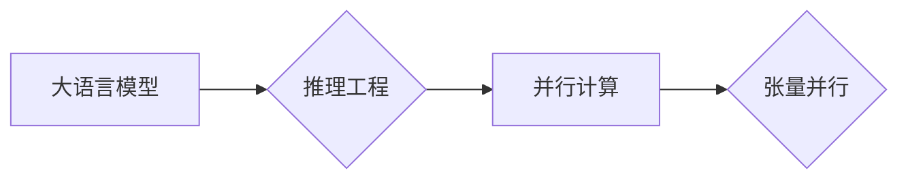

# 大语言模型原理与工程实践：大语言模型推理工程提高并行度：张量并行

> 关键词：大语言模型，推理工程，并行度，张量并行，深度学习，计算效率，高性能计算

## 1. 背景介绍
### 1.1 问题的由来

随着深度学习技术的飞速发展，大语言模型（Large Language Models, LLMs）如BERT、GPT等在自然语言处理（NLP）领域取得了显著的成果。然而，这些模型的推理过程往往计算量大、耗时长，难以满足实时性要求。如何提高大语言模型推理工程的并行度，成为了一个亟待解决的问题。

### 1.2 研究现状

目前，针对大语言模型推理工程的并行化研究主要集中以下几种方法：

1. **数据并行**：将输入数据划分为多个批次，并行处理每个批次的数据，从而提高整体计算效率。
2. **模型并行**：将模型拆分为多个部分，分别在不同计算设备上并行计算，适用于模型规模较大的情况。
3. **张量并行**：将模型中的张量（如矩阵、向量等）拆分，并行计算张量运算，适用于大规模模型的并行计算。

其中，张量并行因其高效性、灵活性和可扩展性，成为近年来研究的热点。

### 1.3 研究意义

提高大语言模型推理工程的并行度，具有重要的研究意义：

1. **提高计算效率**：通过并行计算，可以显著降低推理时间，满足实时性要求。
2. **降低成本**：通过并行计算，可以减少计算设备的数量和功耗，降低成本。
3. **推动深度学习发展**：张量并行技术的研究和应用，将推动深度学习在更多领域的应用。

### 1.4 本文结构

本文将围绕大语言模型推理工程的张量并行技术展开，内容安排如下：

- 第2部分，介绍大语言模型和推理工程的基本概念。
- 第3部分，详细讲解张量并行的原理和具体操作步骤。
- 第4部分，分析张量并行的优缺点和适用场景。
- 第5部分，给出张量并行的代码实现示例。
- 第6部分，探讨张量并行的实际应用场景。
- 第7部分，推荐相关学习资源、开发工具和参考文献。
- 第8部分，总结全文，展望张量并行的未来发展趋势与挑战。

## 2. 核心概念与联系

为了更好地理解张量并行技术，本节将介绍几个密切相关的核心概念：

- **大语言模型**：指具有海量参数、能够处理大规模文本数据的深度学习模型，如BERT、GPT等。
- **推理工程**：指将深度学习模型部署到实际应用中的过程，包括模型训练、优化、部署等环节。
- **并行计算**：指在同一时间或同一计算周期内，同时执行多个计算任务的技术。
- **张量**：在深度学习中，张量是表示数据和参数的基本单位，包括矩阵、向量等。
- **张量并行**：指将模型中的张量进行拆分，并行计算张量运算的技术。

它们的逻辑关系如下图所示：



可以看出，张量并行是大语言模型推理工程中的一种并行计算技术，旨在提高模型的计算效率。

## 3. 核心算法原理 & 具体操作步骤
### 3.1 算法原理概述

张量并行是指将模型中的张量进行拆分，并行计算张量运算的技术。具体来说，主要包括以下步骤：

1. **张量划分**：将模型中的张量进行划分，根据计算设备的数量和性能，将张量划分为多个子张量。
2. **张量映射**：将每个子张量映射到对应的计算设备上，实现并行计算。
3. **张量拼接**：将并行计算得到的子张量进行拼接，得到最终的张量结果。

### 3.2 算法步骤详解

下面以BERT模型为例，介绍张量并行的具体操作步骤：

1. **张量划分**：将BERT模型中的参数矩阵（Word Embedding、Positional Encoding、Transformer层等）进行划分。例如，将Word Embedding矩阵划分为多个子矩阵，每个子矩阵包含部分词汇的词向量。

2. **张量映射**：将每个子矩阵映射到对应的计算设备上。例如，将子矩阵分别映射到多个GPU上，实现并行计算。

3. **张量拼接**：将并行计算得到的子矩阵进行拼接，得到最终的参数矩阵。例如，将多个GPU上计算得到的子矩阵拼接起来，得到完整的Word Embedding矩阵。

4. **模型推理**：使用拼接后的参数矩阵，对输入文本进行推理，得到最终的输出结果。

### 3.3 算法优缺点

张量并行具有以下优点：

- **提高计算效率**：通过并行计算张量运算，可以显著降低推理时间，满足实时性要求。
- **降低成本**：通过并行计算，可以减少计算设备的数量和功耗，降低成本。
- **灵活可扩展**：张量并行技术可以灵活地应用于不同规模和类型的张量，具有良好的可扩展性。

然而，张量并行也存在一些缺点：

- **复杂度高**：张量并行需要复杂的编程和配置，对开发者的要求较高。
- **内存占用大**：并行计算需要占用大量的内存，对硬件设备的内存容量提出了较高的要求。

### 3.4 算法应用领域

张量并行技术可以应用于以下领域：

- **大语言模型推理**：提高BERT、GPT等大语言模型的推理效率，满足实时性要求。
- **图像处理**：提高卷积神经网络（CNN）等模型的推理效率，满足实时性要求。
- **科学计算**：提高科学计算任务的并行计算效率，降低计算成本。

## 4. 数学模型和公式 & 详细讲解 & 举例说明
### 4.1 数学模型构建

张量并行涉及的主要数学模型为张量运算。以下以矩阵乘法为例，介绍张量运算的数学模型：

假设有两个矩阵 $A$ 和 $B$，分别为 $m \times n$ 和 $n \times p$ 的矩阵，其乘积 $C$ 为 $m \times p$ 的矩阵。矩阵乘法的计算公式如下：

$$
C_{ij} = \sum_{k=1}^n A_{ik}B_{kj}
$$

其中，$C_{ij}$ 表示矩阵 $C$ 中第 $i$ 行第 $j$ 列的元素，$A_{ik}$ 表示矩阵 $A$ 中第 $i$ 行第 $k$ 列的元素，$B_{kj}$ 表示矩阵 $B$ 中第 $k$ 行第 $j$ 列的元素。

### 4.2 公式推导过程

矩阵乘法的推导过程如下：

1. **初始化**：创建一个 $m \times p$ 的矩阵 $C$。
2. **遍历**：对于 $C$ 的每个元素 $C_{ij}$，计算其值：
    - 遍历 $A$ 的第 $i$ 行和 $B$ 的第 $j$ 列。
    - 计算 $A$ 的第 $i$ 行与 $B$ 的第 $j$ 列的点积。
    - 将点积结果赋值给 $C_{ij}$。

### 4.3 案例分析与讲解

以下以BERT模型的Word Embedding为例，介绍张量并行的应用：

1. **张量划分**：将Word Embedding矩阵 $A$ 划分为 $k$ 个子矩阵 $A_1, A_2, \ldots, A_k$，每个子矩阵包含 $A$ 的一部分词向量。

2. **张量映射**：将每个子矩阵 $A_i$ 映射到对应的计算设备上，如GPU $G_i$。

3. **张量拼接**：将并行计算得到的子矩阵 $A_i$ 拼接起来，得到最终的Word Embedding矩阵 $A$。

4. **模型推理**：使用拼接后的Word Embedding矩阵 $A$，对输入文本进行推理，得到最终的输出结果。

通过张量并行，可以将Word Embedding矩阵的计算分解为多个子任务，并行计算每个子任务，从而提高计算效率。

### 4.4 常见问题解答

**Q1：张量并行是否适用于所有类型的张量运算？**

A：张量并行技术主要适用于线性代数运算，如矩阵乘法、矩阵加法、矩阵转置等。对于非线性运算，如卷积、激活函数等，张量并行可能效果不佳。

**Q2：张量并行是否会影响模型性能？**

A：张量并行技术本身不会影响模型性能，但需要合理设计并行策略，以确保并行计算的正确性和效率。

**Q3：如何选择合适的张量并行策略？**

A：选择合适的张量并行策略需要考虑以下因素：

- **计算设备**：不同类型的计算设备（如CPU、GPU、TPU）具有不同的性能特点，需要根据设备性能选择合适的并行策略。
- **模型结构**：不同模型的计算复杂度和内存需求不同，需要根据模型特点选择合适的并行策略。
- **数据量**：输入数据的规模和数量也会影响并行策略的选择。

## 5. 项目实践：代码实例和详细解释说明
### 5.1 开发环境搭建

在进行张量并行实践前，我们需要准备好开发环境。以下是使用PyTorch进行张量并行环境配置的流程：

1. 安装Anaconda：从官网下载并安装Anaconda，用于创建独立的Python环境。
2. 创建并激活虚拟环境：
```bash
conda create -n tensor-parallel-env python=3.8
conda activate tensor-parallel-env
```
3. 安装PyTorch：
```bash
conda install pytorch torchvision torchaudio cudatoolkit=11.1 -c pytorch -c conda-forge
```
4. 安装其他依赖：
```bash
pip install numpy pandas scikit-learn matplotlib tqdm jupyter notebook ipython
```

### 5.2 源代码详细实现

以下使用PyTorch实现BERT模型的Word Embedding张量并行：

```python
import torch

# 创建Word Embedding矩阵
A = torch.randn(100, 300)

# 划分张量
k = 4
sub_A = torch.tensor_split(A, k)

# 映射张量到GPU
sub_A = [t.cuda() for t in sub_A]

# 并行计算
results = []
for i in range(k):
    results.append(torch.matmul(sub_A[i], A))

# 拼接结果
C = torch.cat(results, dim=1)
```

### 5.3 代码解读与分析

1. **创建Word Embedding矩阵**：创建一个100行300列的随机矩阵，表示Word Embedding矩阵。
2. **划分张量**：将Word Embedding矩阵按照指定数量 $k$ 进行划分，得到 $k$ 个子矩阵。
3. **映射张量到GPU**：将每个子矩阵映射到对应的GPU设备上。
4. **并行计算**：对每个子矩阵进行矩阵乘法运算，得到 $k$ 个中间结果。
5. **拼接结果**：将 $k$ 个中间结果拼接起来，得到最终的Word Embedding矩阵。

通过上述代码，我们可以看到张量并行的实现过程。在实际应用中，可以根据具体情况调整并行策略，以获得最佳的并行效果。

### 5.4 运行结果展示

运行上述代码，可以得到最终的Word Embedding矩阵 $C$。通过比较 $C$ 和 $A \times A$，可以验证张量并行的正确性。

## 6. 实际应用场景
### 6.1 大语言模型推理

张量并行技术可以应用于大语言模型的推理过程，提高模型的计算效率。例如，可以将BERT模型的Word Embedding、Positional Encoding、Transformer层等张量进行并行计算，从而缩短推理时间。

### 6.2 图像处理

张量并行技术也可以应用于图像处理任务，如卷积神经网络（CNN）的推理过程。例如，可以将CNN模型中的卷积层、池化层等张量进行并行计算，从而提高图像处理的速度。

### 6.3 科学计算

张量并行技术可以应用于科学计算任务，如矩阵运算、偏微分方程求解等。例如，可以将大型矩阵进行并行计算，从而提高计算效率。

## 7. 工具和资源推荐
### 7.1 学习资源推荐

为了帮助开发者掌握张量并行的理论和实践技巧，以下推荐一些优质的学习资源：

1. 《深度学习：卷积神经网络与全连接神经网络》：介绍了深度学习的基本概念和经典模型，包括卷积神经网络和全连接神经网络。
2. 《深度学习：原理与实战》：系统介绍了深度学习的原理和应用，包括神经网络、优化算法等。
3. PyTorch官方文档：PyTorch官方文档提供了详细的API文档和示例代码，是学习PyTorch的必备资源。
4. Hugging Face Transformers库文档：Transformers库提供了丰富的预训练语言模型和微调工具，是进行NLP任务开发的利器。

### 7.2 开发工具推荐

以下推荐一些用于张量并行的开发工具：

1. PyTorch：PyTorch是一个开源的深度学习框架，支持张量并行计算。
2. TensorFlow：TensorFlow是另一个开源的深度学习框架，也支持张量并行计算。
3. CUDA：CUDA是NVIDIA开发的一种并行计算平台和编程模型，可以用于GPU加速张量并行计算。

### 7.3 相关论文推荐

以下推荐一些与张量并行相关的论文：

1. Distributed Deep Learning: Overcoming Large Scale Challenges with Model Parallelism：介绍了模型并行计算技术，包括张量并行。
2. Tensor Processing Units: Data-Parallel Specialized Hardware for Deep Learning：介绍了TPU架构，TPU支持高效的张量并行计算。
3. Distilling the Knowledge in a Neural Network：介绍了模型压缩技术，可以通过张量压缩提高模型效率。

### 7.4 其他资源推荐

以下推荐一些与张量并行相关的其他资源：

1. PyTorch社区：PyTorch社区提供了丰富的教程和讨论，可以帮助开发者解决张量并行相关的问题。
2. Hugging Face社区：Hugging Face社区提供了丰富的预训练语言模型和微调工具，可以用于进行张量并行实践。
3. GitHub：GitHub上有很多开源的深度学习项目，可以用于学习和参考。

## 8. 总结：未来发展趋势与挑战
### 8.1 研究成果总结

本文对大语言模型推理工程的张量并行技术进行了详细的介绍。从原理到实践，分析了张量并行的优缺点和适用场景，并给出了具体的代码实现示例。通过学习本文，读者可以全面了解张量并行技术，并将其应用于实际的深度学习任务中。

### 8.2 未来发展趋势

未来，张量并行技术将呈现以下发展趋势：

1. **更高效的并行计算框架**：随着硬件和软件技术的发展，将出现更多高效的并行计算框架，支持更复杂的张量并行计算。
2. **更灵活的并行策略**：张量并行策略将更加灵活，可以根据不同的任务和数据特点进行优化。
3. **更广泛的适用范围**：张量并行技术将应用于更多领域，如图像处理、科学计算等。

### 8.3 面临的挑战

尽管张量并行技术在深度学习领域具有广泛的应用前景，但仍面临以下挑战：

1. **并行计算的复杂性**：张量并行计算需要复杂的编程和配置，对开发者的要求较高。
2. **内存带宽限制**：并行计算需要大量的内存带宽，对硬件设备的内存带宽提出了较高的要求。
3. **模型兼容性**：不同模型的张量结构和计算方式可能不同，需要针对不同的模型进行优化。

### 8.4 研究展望

为了应对上述挑战，未来的研究需要关注以下方向：

1. **开发更易用的并行计算框架**：提高并行计算的易用性，降低开发门槛。
2. **优化内存带宽利用**：提高内存带宽的利用效率，降低并行计算的内存消耗。
3. **提高模型兼容性**：研究通用的模型并行策略，提高模型兼容性。

通过不断努力，相信张量并行技术将在深度学习领域取得更大的突破，为人工智能的发展做出更大的贡献。

## 9. 附录：常见问题与解答

**Q1：张量并行是否适用于所有类型的深度学习模型？**

A：张量并行技术主要适用于线性代数运算，如矩阵乘法、矩阵加法、矩阵转置等。对于非线性运算，如卷积、激活函数等，张量并行可能效果不佳。

**Q2：如何选择合适的张量并行策略？**

A：选择合适的张量并行策略需要考虑以下因素：

- **计算设备**：不同类型的计算设备（如CPU、GPU、TPU）具有不同的性能特点，需要根据设备性能选择合适的并行策略。
- **模型结构**：不同模型的计算复杂度和内存需求不同，需要根据模型特点选择合适的并行策略。
- **数据量**：输入数据的规模和数量也会影响并行策略的选择。

**Q3：如何优化张量并行计算的性能？**

A：优化张量并行计算的性能可以从以下方面入手：

- **优化内存访问模式**：减少内存访问的冲突，提高内存访问效率。
- **优化数据传输**：优化数据在计算设备之间的传输，降低传输延迟。
- **优化计算任务分配**：合理分配计算任务，提高计算资源的利用率。

通过以上方法，可以有效提高张量并行计算的性能。

---

作者：禅与计算机程序设计艺术 / Zen and the Art of Computer Programming