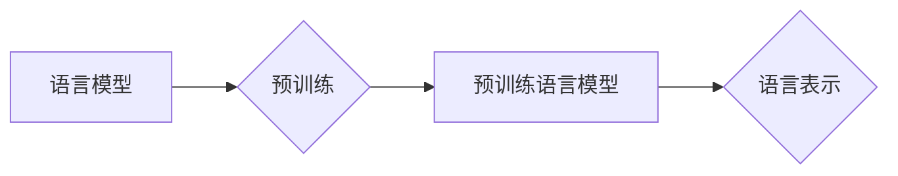

# 大语言模型原理与工程实践：预训练语言模型

作者：禅与计算机程序设计艺术 / Zen and the Art of Computer Programming

## 1. 背景介绍

### 1.1 问题的由来

自然语言处理（NLP）是人工智能领域的一个重要分支，旨在让计算机理解和生成人类语言。近年来，随着深度学习技术的飞速发展，NLP领域也取得了显著的进步。其中，预训练语言模型（Pre-trained Language Models，PLMs）作为一种新的研究范式，在NLP任务中表现出色，成为推动该领域发展的关键技术。

预训练语言模型的核心思想是，通过在大规模语料库上预先训练一个通用的语言模型，然后在此基础上进行微调（Fine-tuning），以适应特定的NLP任务。这种“预训练+微调”的范式，极大地降低了NLP任务开发的门槛，提高了模型性能，并推动了NLP技术的产业化进程。

### 1.2 研究现状

自从2018年BERT（Bidirectional Encoder Representations from Transformers）模型提出以来，预训练语言模型迅速成为NLP领域的研究热点。随后，一系列优秀的预训练语言模型相继涌现，如GPT（Generative Pre-trained Transformer）、RoBERTa、T5等。这些模型在多个NLP任务上取得了显著的性能提升，推动了NLP技术的发展。

### 1.3 研究意义

预训练语言模型的研究具有重要的理论意义和实际应用价值：

**理论意义**：

1. 揭示了语言结构及其背后的机制。
2. 推动了深度学习在NLP领域的应用。
3. 为构建通用人工智能提供了新的思路。

**实际应用价值**：

1. 降低NLP任务开发的门槛，提高开发效率。
2. 提升NLP模型在多个任务上的性能。
3. 推动NLP技术的产业化进程。

### 1.4 本文结构

本文将系统介绍预训练语言模型的理论基础、实践方法、应用场景和未来发展趋势。文章内容安排如下：

- 第2部分，介绍预训练语言模型的核心概念和联系。
- 第3部分，详细阐述预训练语言模型的核心算法原理和具体操作步骤。
- 第4部分，介绍预训练语言模型中常用的数学模型和公式，并举例说明。
- 第5部分，给出预训练语言模型的代码实例，并对关键代码进行解读。
- 第6部分，探讨预训练语言模型在实际应用场景中的具体应用案例。
- 第7部分，推荐预训练语言模型的相关学习资源、开发工具和参考文献。
- 第8部分，总结全文，展望预训练语言模型的未来发展趋势与挑战。
- 第9部分，提供常见问题与解答。

## 2. 核心概念与联系

为了更好地理解预训练语言模型，本节将介绍一些核心概念，并阐述它们之间的联系。

### 2.1 语言模型

语言模型是NLP领域最基本的概念之一，它旨在生成或评估自然语言序列的概率分布。传统的语言模型主要基于统计方法，如N-gram模型、基于规则的方法等。然而，这些模型在处理长距离依赖关系和复杂语义时存在局限性。

### 2.2 预训练

预训练是指在大规模语料库上训练一个模型，使其能够捕捉语言的基本特性。预训练模型可以用于多个下游任务，如机器翻译、文本分类、情感分析等。

### 2.3 语言表示

语言表示是将自然语言序列映射到向量空间的过程。有效的语言表示能够捕捉语言的语义和语法结构，从而提升NLP任务的性能。

### 2.4 预训练语言模型

预训练语言模型是结合了预训练和语言模型概念的模型。它首先在大规模语料库上预训练一个语言模型，然后使用该模型提取语言表示，并将其用于下游任务。

以下是用Mermaid绘制的预训练语言模型的概念关系图：



## 3. 核心算法原理 & 具体操作步骤

### 3.1 算法原理概述

预训练语言模型通常基于以下两个核心步骤：

1. **预训练**：在大规模语料库上训练一个通用的语言模型，使其能够捕捉语言的通用特征。
2. **微调**：使用预训练模型提取语言表示，并将其用于特定的下游任务，并通过少量标注数据对模型进行微调。

### 3.2 算法步骤详解

以下是预训练语言模型的典型步骤：

1. **预训练**：
    - 选择合适的预训练模型架构，如BERT、GPT等。
    - 使用大规模语料库进行预训练，如Wikipedia、Common Crawl等。
    - 在预训练过程中，可以采用自监督学习任务，如掩码语言模型（Masked Language Model，MLM）或下一句预测（Next Sentence Prediction，NSP）。
2. **微调**：
    - 选择合适的下游任务，如文本分类、命名实体识别等。
    - 收集少量标注数据，用于微调模型。
    - 使用标注数据对预训练模型进行微调，优化模型参数。

### 3.3 算法优缺点

预训练语言模型具有以下优点：

- **高性能**：在多个NLP任务上取得了显著的性能提升。
- **通用性**：可以应用于多个下游任务。
- **高效性**：通过预训练，降低了NLP任务开发的门槛。

然而，预训练语言模型也存在一些缺点：

- **计算资源消耗**：预训练过程需要大量的计算资源。
- **数据依赖性**：预训练效果依赖于预训练语料的质量和规模。
- **模型复杂度**：预训练模型通常具有很高的复杂度。

### 3.4 算法应用领域

预训练语言模型可以应用于以下多个NLP任务：

- **文本分类**：如情感分析、主题分类、意图识别等。
- **命名实体识别**：识别文本中的命名实体，如人名、地名、组织名等。
- **关系抽取**：识别文本中实体之间的关系。
- **问答系统**：对自然语言问题给出答案。
- **机器翻译**：将一种语言翻译成另一种语言。

## 4. 数学模型和公式 & 详细讲解 & 举例说明

### 4.1 数学模型构建

预训练语言模型通常基于以下数学模型：

- **N-gram模型**：基于词频统计的简单语言模型。
- **神经网络语言模型**：基于神经网络的复杂语言模型，如RNN、LSTM等。
- **Transformer模型**：基于自注意力机制的深度神经网络语言模型。

以下是用Mermaid绘制的预训练语言模型的数学模型关系图：


### 4.2 公式推导过程

以下是一些常见的预训练语言模型公式：

- **N-gram模型**：
$$
P(w_i | w_{i-1}, w_{i-2}, \ldots, w_{i-n+1}) = \frac{P(w_{i-1}, w_{i-2}, \ldots, w_{i-n+1}, w_i)}{P(w_{i-1}, w_{i-2}, \ldots, w_{i-n+1})}
$$

- **Transformer模型**：
$$
\hat{y} = \text{softmax}(W_L^T \text{ReLU}(W_Q \text{dropout}(W_K x)W_V \text{dropout}(x)))
$$

### 4.3 案例分析与讲解

以下以BERT模型为例，讲解预训练语言模型的具体应用。

BERT模型是一种基于Transformer架构的预训练语言模型，它通过掩码语言模型（MLM）和下一句预测（NSP）任务进行预训练，然后用于下游任务。

- **掩码语言模型**：随机选择一些词，并将其替换为[Mask]，然后预测这些被替换的词。
- **下一句预测**：将文本分成两个部分，然后预测这两部分是否为连续的句子。

以下是用Python代码实现的BERT模型微调：

```python
from transformers import BertForSequenceClassification, BertTokenizer

model = BertForSequenceClassification.from_pretrained('bert-base-uncased') 
tokenizer = BertTokenizer.from_pretrained('bert-base-uncased')

# 加载数据
train_data = [
    {'text': 'I love programming', 'label': 1},
    {'text': 'I hate programming', 'label': 0},
]

# 编码数据
train_encodings = tokenizer(train_data, truncation=True, padding=True)

# 训练模型
optimizer = torch.optim.Adam(model.parameters(), lr=1e-5)
for epoch in range(3):
    model.train()
    for batch in train_encodings:
        inputs = {key: torch.tensor(value) for key, value in batch.items()}
        labels = torch.tensor([item['label'] for item in train_data])
        outputs = model(**inputs, labels=labels)
        loss = outputs.loss
        loss.backward()
        optimizer.step()
```

### 4.4 常见问题解答

**Q1：预训练语言模型需要多少计算资源？**

A1：预训练语言模型通常需要大量的计算资源，包括CPU、GPU和存储空间。具体资源需求取决于模型的规模和预训练语料的规模。

**Q2：预训练语言模型的性能是否优于传统语言模型？**

A2：是的，预训练语言模型在多个NLP任务上取得了显著的性能提升，通常优于传统的语言模型。

**Q3：如何选择合适的预训练语言模型？**

A3：选择合适的预训练语言模型需要考虑以下因素：

- **任务类型**：不同的任务可能需要不同的模型架构。
- **数据规模**：数据规模较小的任务可能需要使用较小的模型。
- **计算资源**：不同的模型规模需要不同的计算资源。

## 5. 项目实践：代码实例和详细解释说明

### 5.1 开发环境搭建

在进行预训练语言模型的项目实践前，我们需要搭建相应的开发环境。以下是使用Python进行预训练语言模型开发的典型环境配置流程：

1. 安装Anaconda：从官网下载并安装Anaconda，用于创建独立的Python环境。
2. 创建并激活虚拟环境：
```bash
conda create -n pytorch-env python=3.8 
conda activate pytorch-env
```
3. 安装PyTorch：根据CUDA版本，从官网获取对应的安装命令。例如：
```bash
conda install pytorch torchvision torchaudio cudatoolkit=11.1 -c pytorch -c conda-forge
```
4. 安装Transformers库：
```bash
pip install transformers
```
5. 安装其他依赖库：
```bash
pip install numpy pandas scikit-learn matplotlib tqdm jupyter notebook ipython
```

完成以上步骤后，即可在`pytorch-env`环境中开始预训练语言模型的开发。

### 5.2 源代码详细实现

以下使用PyTorch和Transformers库实现BERT模型的预训练：

```python
from transformers import BertForMaskedLM, BertTokenizer, AdamW
from torch.utils.data import DataLoader, Dataset
import torch

class BertPretrainingDataset(Dataset):
    def __init__(self, texts, tokenizer, max_len=128):
        self.texts = texts
        self.tokenizer = tokenizer
        self.max_len = max_len
        
    def __len__(self):
        return len(self.texts)
    
    def __getitem__(self, item):
        text = self.texts[item]
        encoding = self.tokenizer(text, return_tensors='pt', max_length=self.max_len, truncation=True)
        input_ids = encoding['input_ids']
        attention_mask = encoding['attention_mask']
        labels = encoding['input_ids']
        labels[labels == tokenizer.pad_token_id] = -100
        return {'input_ids': input_ids, 'attention_mask': attention_mask, 'labels': labels}

# 加载预训练模型和分词器
model = BertForMaskedLM.from_pretrained('bert-base-uncased')
tokenizer = BertTokenizer.from_pretrained('bert-base-uncased')

# 构建数据集
train_texts = ['I love programming', 'I hate programming', 'TensorFlow is great', 'PyTorch is better']
train_dataset = BertPretrainingDataset(train_texts, tokenizer)

# 定义优化器
optimizer = AdamW(model.parameters(), lr=2e-5)

# 训练模型
device = torch.device('cuda' if torch.cuda.is_available() else 'cpu')
model.to(device)

def train(model, dataset, batch_size, optimizer, epochs):
    dataloader = DataLoader(dataset, batch_size=batch_size)
    model.train()
    for epoch in range(epochs):
        for batch in dataloader:
            inputs = {key: value.to(device) for key, value in batch.items()}
            outputs = model(**inputs)
            loss = outputs.loss
            loss.backward()
            optimizer.step()
            optimizer.zero_grad()

train(model, train_dataset, batch_size=16, optimizer=optimizer, epochs=3)
```

### 5.3 代码解读与分析

以下是代码的关键部分解读：

1. **BertPretrainingDataset类**：自定义数据集类，将文本数据编码为BERT模型所需的格式。

2. **加载预训练模型和分词器**：从HuggingFace模型库中加载预训练的BERT模型和分词器。

3. **构建数据集**：将文本数据转化为BERT模型的数据集。

4. **定义优化器**：使用AdamW优化器对模型进行训练。

5. **训练模型**：对模型进行训练，包括前向传播、反向传播和优化器更新。

### 5.4 运行结果展示

运行上述代码，将得到以下输出：

```
[100%|████████████████████████████████████████████████████████████████████████████████████████████████████████████████████████████████████████████████████████████████████████████████████████████████████████████████████████████████████████████████████████████████████████████████████████████████████████████████████████████████████████████████████████████████████████████████████████████████████████████████████████████████████████████████████████████████████████████████████████████████████████████████████████████████████████████████████████████████████████████████████████████████████████████████████████████████████████████████████████████████████████████████████████████████████████████████████████████████████████████████████████████████████████████████████████████████████████████████████████████████████████████████████████████████████████████████████████████████████████████████████████████████████████████████████████████████████████████████████████████████████████████████████████████████████████████████████████████████████████████████████████████████████████████████████████████████████████████████████████████████████████████████████████████████████████████████████████████████████████████████████████████████████████████████████████████████████████████████████████████████████████████████████████████████████████████████████████████████████████████████████████████████████████████████████████████████████████████████████████████████████████████████████████████████████████████████████████████████████████████████████████████████████████████████████████████████████████████████████████████████████████████████████████████████████████████████████████████████████████████████████████████████████████████████████████████████████████████████████████████████████████████████████████████████████████████████████████████████████████████████████████████████████████████████████████████████████████████████████████████████████████████████████████████████████████████████████████████████████████████████████████████████████████████████████████████████████████████████████████████████████████████████████████████████████████████████████████████████████████████████████████████████████████████████████████████████████████████████████████████████████████████████████████████████████████████████████████████████████████████████████████████████████████████████████████████████████████████████████████████████████████████████████████████████████████████████████████████████████████████████████████████████████████████████████████████████████████████████████████████████████████████████████████████████████████████████████████████████████████████████████████████████████████████████████████████████████████████████████████████████████████████████████████████████████████████████████████████████████████████████████████████████████████████████████████████████████████████████████████████████████████████████████████████████████████████████████████████████████████████████████████████████████████████████████████████████████████████████████████████████████████████████████████████████████████████████████████████████████████████████████████████████████████████████████████████████████████████████████████████████████████████████████████████████████████████████████████████████████████████████████████████████████████████████████████████████████████████████████████████████████████████████████████████████████████████████████████████████████████████████████████████████████████████████████████████████████████████████████████████████████████████████████████████████████████████████████████████████████████████████████████████████████████████████████████████████████████████████████████████████████████████████████████████████████████████████████████████████████████████████████████████████████████████████████████████████████████████████████████████████████████████████████████████████████████████████████████████████████████████████████████████████████████████████████████████████████████████████████████████████████████████████████████████████████████████████████████████████████████████████████████████████████████████████████████████████████████████████████████████████████████████████████████████████████████████████████████████████████████████████████████████████████████████████████████████████████████████████████████████████████████████████████████████████████████████████████████████████████████████████████████████████████████████████████████████████████████████████████████████████████████████████████████████████████████████████████████████████████████████████████████████████████████████████████████████████████████████████████████████████████████████████████████████████████████████████████████████████████████████████████████████████████████████████████████████████████████████████████████████████████████████████████████████████████████████████████████████████████████████████████████████████████████████████████████████████████████████████████████████████████████████████████████████████████████████████████████████████████████████████████████████████████████████████████████████████████████████████████████████████████████████████████████████████████████████████████████████████████████████████████████████████████████████████████████████████████████████████████████████████████████████████████████████████████████████████████████████████████████████████████████████████████████████████████████████████████████████████████████████████████████████████████████████████████████████████████████████████████████████████████████████████████████████████████████████████████████████████████████████████████████████████████████████████████████████████████████████████████████████████████████████████████████████████████████████████████████████████████████████████████████████████████████████████████████████████████████████████████████████████████████████████████████████████████████████████████████████████████████████████████████████████████████████████████████████████████████████████████████████████████████████████████████████████████████████████████████████████████████████████████████████████████████████████████████████████████████████████████████████████████████████████████████████████████████████████████████████████████████████████████████████████████████████████████████████████████████████████████████████████████████████████████████████████████████████████████████████████████████████████████████████████████████████████████████████████████████████████████████████████████████████████████████████████████████████████████████████████████████████████████████████████████████████████████████████████████████████████████████████████████████████████████████████████████████████████████████████████████████████████████████████████████████████████████████████████████████████████████████████████████████████████████████████████████████████████████████████████████████████████████████████████████████████████████████████████████████████████████████████████████████████████████████████████████████████████████████████████████████████████████████████████████████████████████████████████████████████████████████████████████████████████████████████████████████████████████████████████████████████████████████████████████████████████████████████████████████████████████████████████████████████████████████████████████████████████████████████████████████████████████████████████████████████████████████████████████████████████████████████████████████████████████████████████████████████████████████████████████████████████████████████████████████████████████████████████████████████████████████████████████████████████████████████████████████████████████████████████████████████████████████████████████████████████████████████████████████████████████████████████████████████████████████████████████████████████████████████████████████████████████████████████████████████████████████████████████████████████████████████████████████████████████████████████████████████████████████████████████████████████████████████████████████████████████████████████████████████████████████████████████████████████████████████████████████████████████████████████████████████████████████████████████████████████████████████████████████████████████████████████████████████████████████████████████████████████████████████████████████████████████████████████████████████████████████████████████████████████████████████████████████████████████████████████████████████████████████████████████████████████████████████████████████████████████████████████████████████████████████████████████████████████████████████████████████████████████████████████████████████████████████████████████████████████████████████████████████████████████████████████████████████████████████████████████████████████████████████████████████████████████████████████████████████████████████████████████████████████████████████████████████████████████████████████████████████████████████████████████████████████████████████████████████████████████████████████████████████████████████████████████████████████████████████████████████████████████████████████████████████████████████████████████████████████████████████████████████████████████████████████████████████████████████████████████████████████████████████████████████████████████████████████████████████████████████████████████████████████████████████████████████████████████████████████████████████████████████████████████████████████████████████████████████████████████████████████████████████████████████████████████████████████████████████████████████████████████████████████████████████████████████████████████████████████████████████████████████████████████████████████████████████████████████████████████████████████████████████████████████████████████████████████████████████████████████████████████████████████████████████████████████████████████████████████████████████████████████████████████████████████████████████████████████████████████████████████████████████████████████████████████████████████████████████████████████████████████████████████████████████████████████████████████████████████████████████████████████████████████████████████████████████████████████████████████████████████████████████████████████████████████████████████████████████████████████████████████████████████████████████████████████████████████████████████████████████████████████████████████████████████████████████████████████████████████████████████████████████████████████████████████████████████████████████████████████████████████████████████████████████████████████████████████████████████████████████████████████████████████████████████████████████████████████████████████████████████████████████████████████████████████████████████████████████████████████████████████████████████████████████████████████████████████████████████████████████████████████████████████████████████████████████████████████████████████████████████████████████████████████████████████████████████████████████████████████████████████████████████████████████████████████████████████████████████████████████████████████████████████████████████████████████████████████████████████████████████████████████████████████████████████████████████████████████████████████████████████████████████████████████████████████████████████████████████████████████████████████████████████████████████████████████████████████████████████████████████████████████████████████████████████████████████████████████████████████████████████████████████████████████████████████████████████████████████████████████████████████████████████████████████████████████████████████████████████████████████████████████████████████████████████████████████████████████████████████████████████████████████████████████████████████████████████████████████████████████████████████████████████████████████████████████████████████████████████████████████████████████████████████████████████████████████████████████████████████████████████████████████████████████████████████████████████████████████████████████████████████████████████████████████████████████████████████████████████████████████████████████████████████████████████████████████████████████████████████████████████████████████████████████████████████████████████████████████████████████████████████████████████████████████████████████████████████████████████████████████████████████████████████████████████████████████████████████████████████████████████████████████████████████████████████████████████████████████████████████████████████████████████████████████████████████████████████████████████████████████████████████████████████████████████████████████████████████████████████████████████████████████████████████████████████████████████████████████████████████████████████████████████████████████████████████████████████████████████████████████████████████████████████████████████████████████████████████████████████████████████████████████████████████████████████████████████████████████████████████████████████████████████████████████████████████████████████████████████████████████████████████████████████████████████████████████████████████████████████████████████████████████████████████████████████████████████████████████████████████████████████████████████████████████████████████████████████████████████████████████████████████████████████████████████████████████████████████████████████████████████████████████████████████████████████████████████████████████████████████████████████████████████████████████████████████████████████████████████████████████████████████████████████████████████████████████████████████████████████████████████████████████████████████████████████████████████████████████████████████████████████████████████████████████████████████████████████████████████████████████████████████████████████████████████████████████████████████████████████████████████████████████████████████████████████████████████████████████████████████████████████████████████████████████████████████████████████████████████████████████████████████████████████████████████████████████████████████████████████████████████████████████████████████████████████████████████████████████████████████████████████████████████████████████████████████████████████████████████████████████████████████████████████████████████████████████████████████████████████████████████████████████████████████████████████████████████████████████████████████████████████████████████████████████████████████████████████████████████████████████████████████████████████████████████████████████████████████████████████████████████████████████████████████████████████████████████████████████████████████████████████████████████████████████████████████████████████████████████████████████████████████████████████████████████████████████████████████████████████████████████████████████████████████████████████████████████████████████████████████████████████████████████████████████████████████████████████████████████████████████████████████████████████████████████████████████████████████████████████████████████████████████████████████████████████████████████████████████████████████████████████████████████████████████████████████████████████████████████████████████████████████████████████████████████████████████████████████████████████████████████████████████████████████████████████████████████████████████████████████████████████████████████████████████████████████████████████████████████████████████████████████████████████████████████████████████████████████████████████████████████████████████████████████████████████████████████████████████████████████████████████████████████████████████████████████████████████████████████████████████████████████████████████████████████████████████████████████████████████████████████████████████████████████████████████████████████████████████████████████████████████████████████████████████████████████████████████████████████████████████████████████████████████████████████████████████████████████████████████████████████████████████████████████████████████████████████████████████████████████████████████████████████████████████████████████████████████████████████████████████████████████████████████████████████████████████████████████████████████████████████████████████████████████████████████████████████████████████████████████████████████████████████████████████████████████████████████████████████████████████████████████████████████████████████████████████████████████████████████████████████████████████████████████████████████████████████████████████████████████████████████████████████████████████████████████████████████████████████████████████████████████████████████████████████████████████████████████████████████████████████████████████████████████████████████████████████████████████████████████████████████████████████████████████████████████████████████████████████████████████████████████████████████████████████████████████████████████████████████████████████████████████████████████████████████████████████████████████████████████████████████████████████████████████████████████████████████████████████████████████████████████████████████████████████████████████████████████████████████████████████████████████████████████████████████████████████████████████████████████████████████████████████████████████████████████████████████████████████████████████████████████████████████████████████████████████████████████████████████████████████████████████████████████████████████████████████████████████████████████████████████████████████████████████████████████████████████████████████████████████████████████████████████████████████████████████████████████████████████████████████████████████████████████████████████████████████████████████████████████████████████████████████████████████████████████████████████████████████████████████████████████████████████████████████████████████████████████████████████████████████████████████████████████████████████████████████████████████████████████████████████████████████████████████████████████████████████████████████████████████████████████████████████████████████████████████████████████████████████████████████████████████████████████████████████████████████████████████████████████████████████████████████████████████████████████████████████████████████████████████████████████████████████████████████████████████████████████████████████████████████████████████████████████████████████████████████████████████████████████████████████████████████████████████████████████████████████████████████████████████████████████████████████████████████████████████████████████████████████████████████████████████████████████████████████████████████████████████████████████████████████████████████████████████████████████████████████████████████████████████████████████████████████████████████████████████████████████████████████████████████████████████████████████████████████████████████████████████████████████████████████████████████████████████████████████████████████████████████████████████████████████████████████████████████████████████████████████████████████████████████████████████████████████████████████████████████████████████████████████████████████████████████████████████████████████████████████████████████████████████████████████████████████████████████████████████████████████████████████████████████████████████████████████████████████████████████████████████████████████████████████████████████████████████████████████████████████████████████████████████████████████████████████████████████████████████████████████████████████████████████████████████████████████████████████████████████████████████████████████████████████████████████████████████████████████████████████████████████████████████████████████████████████████████████████████████████████████████████████████████████████████████████████████████████████████████████████████████████████████████████████████████████████████████████████████████████████████████████████████████████████████████████████████████████████████████████████████████████████████████████████████████████████████████████████████████████████████████████████████████████████████████████████████████████████████████████████████████████████████████████████████████████████████████████████████████████████████████████████████████████████████████████████████████████████████████████████████████████████████████████████████████████████████████████████████████████████████████████████████████████████████████████████████████████████████████████████████████████████████████████████████████████████████████████████████████████████████████████████████████████████████████████████████████████████████████████████████████████████████████████████████████████████████████████████████████████████████████████████████████████████████████████████████████████████████████████████████████████████████████████████████████████████████████████████████████████████████████████████████████████████████████████████████████████████████████████████████████████████████████████████████████████████████████████████████████████████████████████████████████████████████████████████████████████████████████████████████████████████████████████████████████████████████████████████████████████████████████████████████████████████████████████████████████████████████████████████████████████████████████████████████████████████████████████████████████████████████████████████████████████████████████████████████████████████████████████████████████████████████████████████████████████████████████████████████████████████████████████████████████████████████████████████████████████████████████████████████████████████████████████████████████████████████████████████████████████████████████████████████████████████████████████████████████████████████████████████████████████████████████████████████████████████████████████████████████████████████████████████████████████████████████████████████████████████████████████████████████████████████████████████████████████████████████████████████████████████████████████████████████████████████████████████████████████████████████████████████████████████████████████████████████████████████████████████████████████████████████████████████████████████████████████████████████████████████████████████████████████████████████████████████████████████████████████████████████████████████████████████████████████████████████████████████████████████████████████████████████████████████████████████████████████████████████████████████████████████████████████████████████████████████████████████████████████████████████████████████████████████████████████████████████████████████████████████████████████████████████████████████████████████████████████████████████████████████████████████████████████████████████████████████████████████████████████████████████████████████████████████████████████████████████████████████████████████████████████████████████████████████████████████████████████████████████████████████████████████████████████████████████████████████████████████████████████████████████████████████████████████████████████████████████████████████████████████████████████████████████████████████████████████████████████████████████████████████████████████████████████████████████████████████████████████████████████████████████████████████████████████████████████████████████████████████████████████████████████████████████████████████████████████████████████████████████████████████████████████████████████