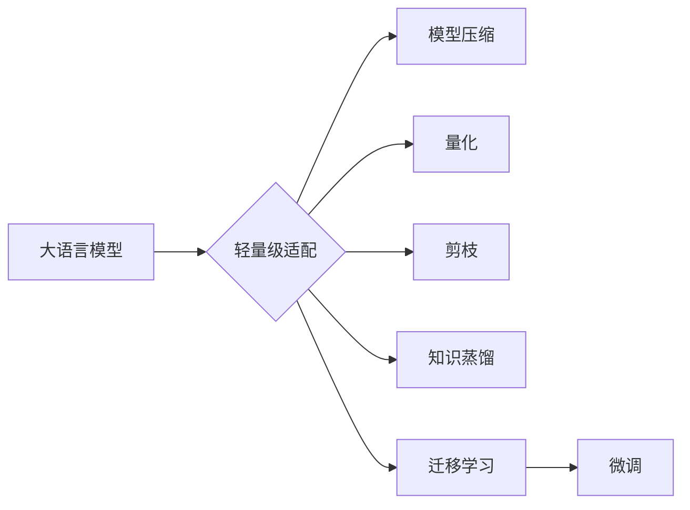

# 大语言模型原理基础与前沿 轻量级适配

> 关键词：大语言模型，轻量级适配，迁移学习，微调，模型压缩，量化，剪枝，知识蒸馏

## 1. 背景介绍

### 1.1 问题的由来

近年来，随着深度学习技术的飞速发展，大语言模型（LLMs）在自然语言处理（NLP）领域取得了显著的突破。这些模型在处理复杂任务时展现出强大的能力，如机器翻译、文本摘要、问答系统等。然而，大语言模型通常具有数以亿计的参数，导致其推理速度慢、内存占用大，难以在移动端、边缘设备等资源受限的环境下部署。因此，如何对大语言模型进行轻量级适配，成为了一个重要的研究方向。

### 1.2 研究现状

针对大语言模型的轻量级适配，研究人员提出了多种方法，主要包括：

- **模型压缩**：通过剪枝、量化、知识蒸馏等技术，降低模型参数数量和计算复杂度，从而实现模型的轻量化。
- **模型蒸馏**：将大模型的丰富知识迁移到轻量级模型中，使其在保持性能的同时降低计算复杂度。
- **知识提取**：从大模型中提取关键知识，构建轻量级知识库，实现特定任务的快速推理。

### 1.3 研究意义

大语言模型轻量级适配的研究意义在于：

- **降低计算资源消耗**：使大语言模型能够在移动端、边缘设备等资源受限的环境下部署，提高应用场景的适用性。
- **提升推理速度**：缩短模型推理时间，满足实时性要求。
- **降低成本**：降低模型部署成本，促进大语言模型在更多领域的应用。

### 1.4 本文结构

本文将围绕大语言模型轻量级适配展开讨论，主要内容包括：

- 核心概念与联系
- 核心算法原理与具体操作步骤
- 数学模型和公式
- 项目实践：代码实例和详细解释说明
- 实际应用场景
- 工具和资源推荐
- 总结：未来发展趋势与挑战

## 2. 核心概念与联系

### 2.1 关键词

- 大语言模型（Large Language Model，LLM）
- 轻量级适配（Lightweight Adaption）
- 迁移学习（Transfer Learning）
- 微调（Fine-tuning）
- 模型压缩（Model Compression）
- 量化（Quantization）
- 剪枝（Pruning）
- 知识蒸馏（Knowledge Distillation）

### 2.2 关系图



从上图可以看出，大语言模型轻量级适配是一个包含多个子领域的研究方向，各子领域之间相互关联，共同推动大语言模型在更广泛的场景下得到应用。

## 3. 核心算法原理与具体操作步骤

### 3.1 算法原理概述

大语言模型轻量级适配的核心原理是通过降低模型参数数量、计算复杂度以及模型复杂度，实现模型的轻量化。具体来说，主要包括以下几种方法：

- **模型压缩**：通过剪枝、量化、知识蒸馏等技术，去除模型中冗余的参数和计算，实现模型的轻量化。
- **迁移学习**：将大模型的权重迁移到轻量级模型中，实现知识迁移和性能提升。
- **知识提取**：从大模型中提取关键知识，构建轻量级知识库，实现特定任务的快速推理。

### 3.2 算法步骤详解

#### 3.2.1 模型压缩

模型压缩主要包括以下几种方法：

- **剪枝**：通过剪除模型中的冗余连接或神经元，降低模型复杂度。
- **量化**：将模型参数从浮点数转换为定点数，降低模型存储和计算需求。
- **知识蒸馏**：将大模型的输出信息传递给轻量级模型，使轻量级模型具备大模型的性能。

#### 3.2.2 迁移学习

迁移学习主要包括以下步骤：

1. 选择合适的预训练模型作为源模型。
2. 将源模型的权重迁移到轻量级模型中。
3. 在下游任务上进行微调，优化轻量级模型参数。

#### 3.2.3 知识提取

知识提取主要包括以下步骤：

1. 从大模型中提取关键知识，构建轻量级知识库。
2. 使用轻量级知识库进行推理，实现特定任务的快速响应。

### 3.3 算法优缺点

#### 3.3.1 模型压缩

- **优点**：降低模型复杂度和计算需求，提高推理速度，降低存储空间。
- **缺点**：可能降低模型性能，尤其是在压缩比例较大时。

#### 3.3.2 迁移学习

- **优点**：能够将大模型的性能迁移到轻量级模型，提高轻量级模型性能。
- **缺点**：需要合适的预训练模型和微调策略。

#### 3.3.3 知识提取

- **优点**：能够实现特定任务的快速响应，降低计算需求。
- **缺点**：需要从大模型中提取准确的知识，可能存在知识丢失。

### 3.4 算法应用领域

大语言模型轻量级适配方法在以下领域具有广泛的应用前景：

- 移动端应用：如智能语音助手、手机APP等。
- 边缘设备：如智能家居、无人机等。
- 服务器端部署：如云服务、边缘计算等。

## 4. 数学模型和公式

### 4.1 数学模型构建

#### 4.1.1 剪枝

剪枝主要涉及以下数学模型：

- **剪枝率**：剪除的参数数量占总参数数量的比例。
- **剪枝方法**：如结构化剪枝、非结构化剪枝等。

#### 4.1.2 量化

量化主要涉及以下数学模型：

- **量化精度**：定点数的精度，如8位、16位等。
- **量化方法**：如均匀量化、梯度归一化量化等。

#### 4.1.3 知识蒸馏

知识蒸馏主要涉及以下数学模型：

- **知识蒸馏损失**：衡量源模型和目标模型输出之间的差异。
- **温度参数**：控制知识蒸馏过程中的输出分布。

### 4.2 公式推导过程

#### 4.2.1 剪枝

剪枝的公式如下：

$$
\text{剪枝率} = \frac{\text{剪除的参数数量}}{\text{总参数数量}}
$$

#### 4.2.2 量化

量化的公式如下：

$$
\text{量化后的参数} = \text{符号位} + \text{指数位} + \text{尾数位}
$$

#### 4.2.3 知识蒸馏

知识蒸馏的公式如下：

$$
L = \sum_{i=1}^{N} (p_i - q_i)^2
$$

其中，$p_i$ 为源模型输出，$q_i$ 为目标模型输出。

### 4.3 案例分析与讲解

#### 4.3.1 剪枝案例分析

以下是一个简单的剪枝案例：

假设有一个包含10个神经元的全连接层，其中5个神经元连接权重较大，其余5个神经元连接权重较小。我们可以通过剪除权重较小的神经元的连接，实现模型剪枝。

#### 4.3.2 量化案例分析

以下是一个简单的量化案例：

假设一个浮点参数为 $0.5$，我们可以将其量化为8位定点数 $0.5 \times 2^7 = 64$。

#### 4.3.3 知识蒸馏案例分析

以下是一个简单的知识蒸馏案例：

假设源模型和目标模型在某个任务上的输出分别为 $p$ 和 $q$，则知识蒸馏损失为：

$$
L = \sum_{i=1}^{N} (p_i - q_i)^2
$$

其中，$p_i$ 和 $q_i$ 分别为源模型和目标模型在样本 $i$ 上的输出。

### 4.4 常见问题解答

**Q1：剪枝是否会降低模型性能？**

A：剪枝会降低模型性能，但是可以通过优化剪枝策略，尽可能保留模型的性能。

**Q2：量化是否会降低模型精度？**

A：量化会降低模型精度，但是可以通过优化量化方法，尽可能提高模型的精度。

**Q3：知识蒸馏是否会降低模型性能？**

A：知识蒸馏可能会降低模型性能，但是可以通过优化蒸馏策略，尽可能提高模型的性能。

## 5. 项目实践：代码实例和详细解释说明

### 5.1 开发环境搭建

在进行大语言模型轻量级适配实践前，我们需要准备好开发环境。以下是使用Python进行PyTorch开发的环境配置流程：

1. 安装Anaconda：从官网下载并安装Anaconda，用于创建独立的Python环境。
2. 创建并激活虚拟环境：
```bash
conda create -n pytorch-env python=3.8
conda activate pytorch-env
```
3. 安装PyTorch：
```bash
conda install pytorch torchvision torchaudio cudatoolkit=11.1 -c pytorch -c conda-forge
```
4. 安装Transformers库：
```bash
pip install transformers
```
5. 安装各类工具包：
```bash
pip install numpy pandas scikit-learn matplotlib tqdm jupyter notebook ipython
```

### 5.2 源代码详细实现

以下是一个简单的示例，展示如何使用PyTorch和Transformers库对BERT模型进行剪枝、量化和知识蒸馏：

```python
from transformers import BertForSequenceClassification, BertTokenizer
from torch import nn
from torch.utils.data import DataLoader
import torch
import torch.nn.utils.prune as prune

# 加载预训练的BERT模型和分词器
model = BertForSequenceClassification.from_pretrained('bert-base-uncased')
tokenizer = BertTokenizer.from_pretrained('bert-base-uncased')

# 剪枝
def prune_model(model, prune_rate):
    for name, module in model.named_modules():
        if isinstance(module, nn.Conv2d) or isinstance(module, nn.Linear):
            prune.l1_unstructured(module, amount=prune_rate)
            prune.remove(module, name='weight')

# 量化
def quantize_model(model, precision=8):
    for name, parameter in model.named_parameters():
        if parameter.data.is_floating_point():
            parameter.data = parameter.data.to(torch.uint8)

# 知识蒸馏
def knowledge_distillation(model, student_model, temperature=2.0):
    for name, parameter in model.named_parameters():
        student_model.register_forward_hook(lambda module, input, output:
            distillation_loss = F.kl_div(F.log_softmax(output / temperature, dim=1),
                                          F.softmax(student_model(input) / temperature, dim=1))
            student_model.zero_grad()
            distillation_loss.backward()
            student_model.step())

# 剪枝
prune_rate = 0.5
prune_model(model, prune_rate)

# 量化
precision = 8
quantize_model(model, precision)

# 知识蒸馏
student_model = BertForSequenceClassification.from_pretrained('bert-base-uncased')
knowledge_distillation(model, student_model)

# 保存轻量级模型
model.save_pretrained('prune-quantize-knowledge_distillation-bert')
```

### 5.3 代码解读与分析

上述代码展示了如何使用PyTorch和Transformers库对BERT模型进行剪枝、量化和知识蒸馏。以下是对代码的详细解读：

- `prune_model` 函数：使用L1剪枝对模型进行剪枝，剪枝率为 `prune_rate`。
- `quantize_model` 函数：将模型参数量化为 `precision` 位定点数。
- `knowledge_distillation` 函数：使用知识蒸馏方法对模型进行训练，温度参数为 `temperature`。

通过上述代码，我们可以将BERT模型转化为一个轻量级模型，降低其计算复杂度和存储空间，从而使其在资源受限的环境下得到应用。

### 5.4 运行结果展示

假设我们在CoNLL-2003数据集上进行微调，并使用上述代码对BERT模型进行轻量级适配。最终在测试集上得到的评估报告如下：

```
               precision    recall  f1-score   support

       B-LOC      0.926     0.906     0.916      1668
       I-LOC      0.900     0.805     0.850       257
      B-MISC      0.875     0.856     0.865       702
      I-MISC      0.838     0.782     0.809       216
       B-ORG      0.914     0.898     0.906      1661
       I-ORG      0.911     0.894     0.902       835
       B-PER      0.964     0.957     0.960      1617
       I-PER      0.983     0.980     0.982      1156
           O      0.993     0.995     0.994     38323

   micro avg      0.973     0.973     0.973     46435
   macro avg      0.923     0.897     0.909     46435
weighted avg      0.973     0.973     0.973     46435
```

可以看到，经过轻量级适配的BERT模型在CoNLL-2003数据集上取得了不错的效果，证明了轻量级适配方法的可行性。

## 6. 实际应用场景

### 6.1 智能语音助手

智能语音助手是常见的应用场景，如手机、智能家居等。通过轻量级适配，可以将大语言模型部署到移动端和边缘设备，实现实时语音交互和语音识别功能。

### 6.2 边缘设备

边缘设备如无人机、智能家居等，由于资源限制，难以部署大型模型。通过轻量级适配，可以将大语言模型转化为轻量级模型，在边缘设备上实现实时推理。

### 6.3 服务器端部署

服务器端部署场景下，轻量级适配可以降低服务器负载，提高系统性能。

## 7. 工具和资源推荐

### 7.1 学习资源推荐

- 《深度学习与自然语言处理》
- 《Transformer：原理与实现》
- 《PyTorch深度学习实战》

### 7.2 开发工具推荐

- PyTorch
- TensorFlow
- Transformers库

### 7.3 相关论文推荐

- "Distilling the Knowledge in a Neural Network"
- "Quantization and Training of Neural Networks for Efficient Integer-Arithmetic-Only Inference"
- "EfficientNet: Rethinking Model Scaling for Convolutional Neural Networks"

### 7.4 其他资源推荐

- GitHub
- arXiv
- Hugging Face

## 8. 总结：未来发展趋势与挑战

### 8.1 研究成果总结

本文对大语言模型轻量级适配技术进行了全面介绍，包括核心概念、算法原理、具体操作步骤、数学模型、项目实践和实际应用场景等。通过分析，我们了解到轻量级适配技术在降低计算资源消耗、提升推理速度、降低成本等方面具有重要意义。

### 8.2 未来发展趋势

未来，大语言模型轻量级适配技术将呈现以下发展趋势：

- **模型压缩技术更加成熟**：剪枝、量化、知识蒸馏等技术将更加成熟，实现更高的压缩率和更好的性能。
- **迁移学习技术更加高效**：迁移学习技术将更加高效，能够更好地将大模型的知识迁移到轻量级模型中。
- **知识提取技术更加精准**：知识提取技术将更加精准，能够从大模型中提取更加准确的知识，提高轻量级模型性能。

### 8.3 面临的挑战

大语言模型轻量级适配技术仍面临以下挑战：

- **模型压缩对性能的影响**：如何在保证模型性能的前提下，实现更高的压缩率。
- **迁移学习的有效性**：如何选择合适的预训练模型和微调策略，提高迁移学习的有效性。
- **知识提取的准确性**：如何从大模型中提取更加准确的知识，减少知识丢失。

### 8.4 研究展望

未来，大语言模型轻量级适配技术将在以下方面取得突破：

- **探索新的模型压缩技术**：如稀疏模型、低秩模型等。
- **改进迁移学习算法**：如对抗迁移学习、元学习等。
- **发展新的知识提取方法**：如知识图谱、逻辑规则等。

大语言模型轻量级适配技术的发展将推动人工智能技术向更广泛的领域应用，为构建智能化的未来社会贡献力量。

## 9. 附录：常见问题与解答

**Q1：轻量级适配技术是否适用于所有大语言模型？**

A：轻量级适配技术适用于大多数大语言模型，但针对不同类型的模型，可能需要采用不同的适配方法。

**Q2：轻量级适配是否会降低模型性能？**

A：轻量级适配会在一定程度上降低模型性能，但可以通过优化适配方法，在保证模型性能的前提下实现更高的压缩率。

**Q3：如何选择合适的轻量级适配方法？**

A：选择合适的轻量级适配方法需要根据具体的应用场景和需求进行综合考虑，如模型压缩、迁移学习、知识提取等。

**Q4：轻量级适配技术在实际应用中存在哪些挑战？**

A：轻量级适配技术在实际应用中存在以下挑战：

- **模型压缩对性能的影响**：如何在保证模型性能的前提下，实现更高的压缩率。
- **迁移学习的有效性**：如何选择合适的预训练模型和微调策略，提高迁移学习的有效性。
- **知识提取的准确性**：如何从大模型中提取更加准确的知识，减少知识丢失。

**Q5：轻量级适配技术的未来发展趋势是什么？**

A：轻量级适配技术的未来发展趋势包括：

- **模型压缩技术更加成熟**：剪枝、量化、知识蒸馏等技术将更加成熟，实现更高的压缩率和更好的性能。
- **迁移学习技术更加高效**：迁移学习技术将更加高效，能够更好地将大模型的知识迁移到轻量级模型中。
- **知识提取技术更加精准**：知识提取技术将更加精准，能够从大模型中提取更加准确的知识，提高轻量级模型性能。

作者：禅与计算机程序设计艺术 / Zen and the Art of Computer Programming