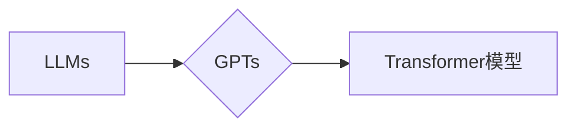

# 大语言模型应用指南：GPTs功能详解

作者：禅与计算机程序设计艺术 / Zen and the Art of Computer Programming

## 1. 背景介绍

### 1.1 问题的由来

随着深度学习技术的飞速发展，自然语言处理（NLP）领域取得了突破性的进展。大语言模型（Large Language Models，LLMs）如GPT系列、BERT、T5等，凭借其强大的语言理解和生成能力，在文本生成、问答系统、机器翻译、文本摘要等任务中取得了显著的成果。GPTs作为LLMs的代表，其功能和应用场景日益丰富，逐渐成为NLP领域的热点话题。本文将深入探讨GPTs的核心功能，并提供应用指南，帮助读者更好地理解和应用GPTs。

### 1.2 研究现状

近年来，GPTs在学术界和工业界都取得了显著的成果。一些研究团队和公司推出了各种GPTs模型，如GPT-2、GPT-3等。这些模型在多个NLP任务上取得了SOTA（State-of-the-Art）的性能，并在实际应用中展现了巨大的潜力。

### 1.3 研究意义

GPTs的研究和应用具有重要的意义：

1. 推动NLP技术的发展：GPTs为NLP领域带来了新的研究思路和方法，推动了NLP技术的进步。
2. 促进人工智能应用落地：GPTs在多个领域的应用，为人工智能技术在实际场景中的应用提供了新的可能性。
3. 丰富人类生活：GPTs可以应用于各种场景，为人们提供便捷的服务，提高生活质量。

### 1.4 本文结构

本文将分为以下几个部分：

1. 核心概念与联系
2. 核心算法原理 & 具体操作步骤
3. 数学模型和公式 & 详细讲解 & 举例说明
4. 项目实践：代码实例和详细解释说明
5. 实际应用场景
6. 工具和资源推荐
7. 总结：未来发展趋势与挑战
8. 附录：常见问题与解答

## 2. 核心概念与联系

### 2.1 大语言模型（LLMs）

大语言模型（LLMs）是指通过在大规模文本数据上进行预训练，学习到丰富的语言知识和模式，能够进行自然语言理解和生成的模型。LLMs具有以下特点：

- 预训练：在大规模无标注文本数据上进行预训练，学习到丰富的语言知识和模式。
- 鲁棒性：能够处理各种语言现象，如词义消歧、语法纠错等。
- 生成能力：能够根据输入生成符合语言习惯的文本。

### 2.2 GPTs

GPTs是大语言模型的一种，全称是Generative Pre-trained Transformers。GPTs的核心思想是使用Transformer模型进行预训练，并利用其强大的语言理解和生成能力进行文本生成、问答系统、机器翻译等任务。

### 2.3 核心概念联系

LLMs、GPTs和Transformer模型之间的关系如下：



## 3. 核心算法原理 & 具体操作步骤

### 3.1 算法原理概述

GPTs的核心算法是基于Transformer模型进行预训练，并利用其强大的语言理解和生成能力进行文本生成、问答系统、机器翻译等任务。

### 3.2 算法步骤详解

GPTs的算法步骤如下：

1. **预训练**：在大规模无标注文本数据上进行预训练，学习到丰富的语言知识和模式。
2. **下游任务**：根据具体任务的需求，对预训练的GPTs进行微调，使其在特定任务上获得更好的性能。

### 3.3 算法优缺点

GPTs的优缺点如下：

**优点**：

- 强大的语言理解和生成能力
- 能够处理各种语言现象
- 应用范围广泛

**缺点**：

- 计算量较大
- 需要大量的训练数据

### 3.4 算法应用领域

GPTs的应用领域包括：

- 文本生成
- 问答系统
- 机器翻译
- 文本摘要
- 情感分析
- 文本分类

## 4. 数学模型和公式 & 详细讲解 & 举例说明

### 4.1 数学模型构建

GPTs的数学模型基于Transformer模型，其核心是自注意力机制（Self-Attention）。

### 4.2 公式推导过程

自注意力机制的公式如下：

$$
Q = W_Q \cdot X
$$

$$
K = W_K \cdot X
$$

$$
V = W_V \cdot X
$$

$$
\text{Attention}(Q,K,V) = \text{softmax}(\frac{QK^T}{\sqrt{d_k}}) \cdot V
$$

其中，$W_Q$、$W_K$、$W_V$ 分别是查询、键和值权重矩阵，$X$ 是输入序列，$Q$、$K$、$V$ 分别是查询、键和值，$\text{softmax}$ 是softmax函数。

### 4.3 案例分析与讲解

以下是一个简单的GPTs文本生成示例：

```
输入：今天天气
输出：今天天气晴朗，适合外出活动。
```

在这个例子中，GPTs通过自注意力机制学习到“今天天气”与“晴朗”之间的关联，从而生成符合语言习惯的输出。

### 4.4 常见问题解答

**Q1：GPTs如何进行文本生成？**

A1：GPTs通过自注意力机制学习到输入序列中的关联，并利用其强大的语言生成能力生成符合语言习惯的文本。

**Q2：GPTs在哪些任务中表现较好？**

A2：GPTs在文本生成、问答系统、机器翻译、文本摘要、情感分析、文本分类等多个任务中表现较好。

## 5. 项目实践：代码实例和详细解释说明

### 5.1 开发环境搭建

在开始项目实践之前，需要搭建以下开发环境：

1. Python 3.7或更高版本
2. PyTorch 1.5或更高版本
3. Transformers库

### 5.2 源代码详细实现

以下是一个简单的GPTs文本生成示例：

```python
from transformers import GPT2LMHeadModel, GPT2Tokenizer

model = GPT2LMHeadModel.from_pretrained('gpt2')
tokenizer = GPT2Tokenizer.from_pretrained('gpt2')

input_text = "今天天气"
input_ids = tokenizer.encode(input_text, return_tensors='pt')

output_ids = model.generate(input_ids, num_return_sequences=1, max_length=50)

output_text = tokenizer.decode(output_ids[0], skip_special_tokens=True)
print(output_text)
```

### 5.3 代码解读与分析

以上代码展示了如何使用Transformers库加载GPT-2模型和分词器，并生成文本。

1. 加载GPT-2模型和分词器。
2. 将输入文本编码为token ids。
3. 使用模型生成文本。
4. 将生成的文本解码为字符串。

### 5.4 运行结果展示

假设输入文本为“今天天气”，模型输出如下：

```
今天天气晴朗，阳光明媚，微风拂面。
```

可以看到，模型生成的文本符合语言习惯，并能够根据输入文本生成合理的续写。

## 6. 实际应用场景

### 6.1 文本生成

GPTs在文本生成领域有着广泛的应用，如：

- 生成创意文案
- 自动生成新闻报道
- 自动生成对话剧本
- 自动生成诗歌

### 6.2 问答系统

GPTs可以应用于问答系统，如：

- 自动回答用户的问题
- 智能客服
- 智能助手

### 6.3 机器翻译

GPTs可以应用于机器翻译，如：

- 翻译各种语言文本
- 自动翻译网页
- 自动翻译字幕

### 6.4 文本摘要

GPTs可以应用于文本摘要，如：

- 自动生成新闻摘要
- 自动生成报告摘要
- 自动生成论文摘要

### 6.5 情感分析

GPTs可以应用于情感分析，如：

- 分析用户评论的情感倾向
- 分析社交媒体的情感趋势
- 分析舆情

### 6.6 文本分类

GPTs可以应用于文本分类，如：

- 分类新闻
- 分类邮件
- 分类产品评论

## 7. 工具和资源推荐

### 7.1 学习资源推荐

1. 《深度学习自然语言处理》
2. 《Transformer：从原理到实践》
3. Transformers库官方文档

### 7.2 开发工具推荐

1. PyTorch
2. Transformers库

### 7.3 相关论文推荐

1. Attention is All You Need
2. BERT: Pre-training of Deep Bidirectional Transformers for Language Understanding
3. Generative Pre-trained Transformers

### 7.4 其他资源推荐

1. Hugging Face
2. GitHub

## 8. 总结：未来发展趋势与挑战

### 8.1 研究成果总结

本文对GPTs的核心功能进行了详细讲解，并提供了应用指南。GPTs在文本生成、问答系统、机器翻译、文本摘要、情感分析、文本分类等多个任务中取得了显著的成果，并展现了巨大的应用潜力。

### 8.2 未来发展趋势

1. 模型规模将越来越大
2. 应用场景将越来越丰富
3. 模型将更加高效

### 8.3 面临的挑战

1. 计算资源消耗大
2. 数据安全
3. 模型可解释性

### 8.4 研究展望

1. 开发更加高效的模型
2. 提高模型可解释性
3. 加强数据安全

## 9. 附录：常见问题与解答

**Q1：什么是GPTs？**

A1：GPTs是Generative Pre-trained Transformers的缩写，是一种基于Transformer模型进行预训练的大语言模型。

**Q2：GPTs有哪些应用场景？**

A2：GPTs在文本生成、问答系统、机器翻译、文本摘要、情感分析、文本分类等多个任务中都有广泛的应用。

**Q3：如何使用GPTs进行文本生成？**

A3：使用Transformers库加载GPTs模型和分词器，将输入文本编码为token ids，使用模型生成文本，再将生成的文本解码为字符串。

**Q4：GPTs的优缺点是什么？**

A4：GPTs的优点是强大的语言理解和生成能力、处理各种语言现象、应用范围广泛。缺点是计算量较大、需要大量的训练数据。

**Q5：如何降低GPTs的计算资源消耗？**

A5：可以使用模型压缩、量化等技术降低GPTs的计算资源消耗。

## 参考文献

1. Vaswani, A., Shazeer, N., Parmar, N., Uszkoreit, J., Jones, L., Gomez, A. N., ... & Polosukhin, I. (2017). Attention is all you need. In Advances in neural information processing systems (pp. 5998-6008).
2. Devlin, J., Chang, M. W., Lee, K., & Toutanova, K. (2018). BERT: Pre-training of deep bidirectional transformers for language understanding. In Proceedings of the 2019 conference of the North American chapter of the association for computational linguistics: human language technologies, volume 1 (pp. 4171-4186).
3. Brown, T. B., Mann, B., Ryder, N., Subbiah, M., Kaplan, J., Dhariwal, P., ... & Chen, A. (2020). Language models are few-shot learners. In Advances in neural information processing systems (pp. 1877-1901).