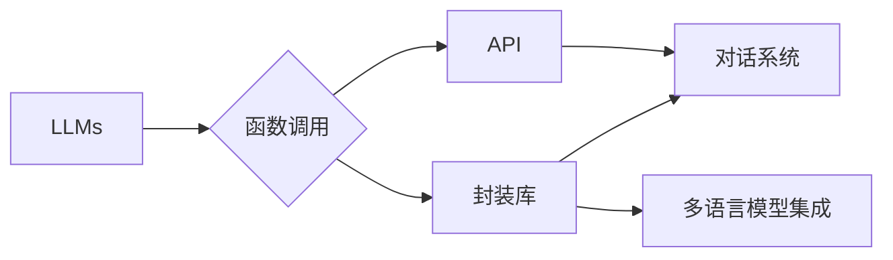

# 大语言模型应用指南：function calling

作者：禅与计算机程序设计艺术 / Zen and the Art of Computer Programming

## 1. 背景介绍
### 1.1 问题的由来

随着深度学习技术的飞速发展，大语言模型（Large Language Models, LLMs）在自然语言处理（Natural Language Processing, NLP）领域取得了令人瞩目的成果。这些模型，如BERT、GPT系列等，凭借其强大的语言理解和生成能力，在文本分类、问答系统、机器翻译等任务上展现出惊人的性能。然而，将LLMs应用于实际场景时，我们发现一个重要问题：如何高效地“调用”LLMs的功能？

传统的调用方式往往需要编写大量的代码，且难以适应不同的应用场景。因此，研究一种高效、灵活、可扩展的LLMs调用方式变得尤为重要。

### 1.2 研究现状

近年来，国内外学者针对LLMs的调用方式进行了大量研究，主要分为以下几种：

1. **API调用**：通过调用LLMs提供的API接口进行功能调用，如使用Hugging Face的Transformers库。
2. **封装库**：开发专门的库来封装LLMs的功能，如OpenAI的GPT-3 API。
3. **对话系统**：构建对话系统，实现人机交互，如聊天机器人。
4. **多语言模型集成**：结合多个LLMs的功能，提高系统的鲁棒性和性能。

### 1.3 研究意义

研究高效、灵活的LLMs调用方式具有重要的理论意义和实际应用价值：

1. **降低开发成本**：通过封装和集成，降低开发者编写代码的复杂度，提高开发效率。
2. **提高应用性能**：结合多个LLMs的功能，提高系统的鲁棒性和性能。
3. **拓展应用场景**：为LLMs的应用提供更多可能性，如智能客服、智能写作、智能翻译等。

### 1.4 本文结构

本文将从以下几个方面对LLMs调用方式进行深入探讨：

- 第2部分，介绍LLMs调用相关核心概念。
- 第3部分，分析现有LLMs调用方法及其优缺点。
- 第4部分，提出一种基于函数调用的LLMs调用框架。
- 第5部分，详细介绍该框架的设计与实现。
- 第6部分，展示该框架在实际应用中的效果。
- 第7部分，展望LLMs调用技术的未来发展趋势。

## 2. 核心概念与联系

本节将介绍LLMs调用相关的核心概念，并分析它们之间的联系。

### 2.1 大语言模型（LLMs）

LLMs是指在大规模文本语料库上训练的语言模型，具备强大的语言理解和生成能力。常见的LLMs有BERT、GPT系列、T5等。

### 2.2 函数调用

函数调用是指将一段代码封装成函数，并通过调用函数来执行代码。

### 2.3 API

API（应用程序编程接口）是指一套定义良好的接口规范，允许不同的应用程序之间进行交互。

### 2.4 封装库

封装库是将LLMs的功能封装成库，方便开发者进行调用。

### 2.5 对话系统

对话系统是指能够与人类进行自然语言交互的系统，如聊天机器人。

### 2.6 多语言模型集成

多语言模型集成是指结合多个LLMs的功能，提高系统的鲁棒性和性能。

这些概念之间的联系如下：



可以看出，LLMs调用可以采用多种方式，如函数调用、API调用、封装库、对话系统等。本文将重点探讨基于函数调用的LLMs调用框架。

## 3. 核心算法原理 & 具体操作步骤
### 3.1 算法原理概述

基于函数调用的LLMs调用框架主要包含以下几个模块：

1. **模型封装器**：将LLMs的功能封装成函数，并对外提供统一的接口。
2. **输入处理模块**：对输入文本进行预处理，如分词、去停用词等。
3. **模型推理模块**：将处理后的输入文本输入到模型进行推理，并输出结果。
4. **结果处理模块**：对模型输出的结果进行后处理，如格式转换、翻译等。

### 3.2 算法步骤详解

以下是基于函数调用的LLMs调用框架的具体操作步骤：

1. **模型封装**：将LLMs的功能封装成函数，并对外提供统一的接口。例如，将BERT模型封装成`BERT_model`函数，输入文本和模型参数，输出模型预测结果。

2. **输入处理**：对输入文本进行预处理，如分词、去停用词等。例如，使用jieba分词库对输入文本进行分词。

3. **模型推理**：将处理后的输入文本输入到模型进行推理，并输出结果。例如，调用`BERT_model`函数进行推理。

4. **结果处理**：对模型输出的结果进行后处理，如格式转换、翻译等。例如，将模型输出的概率转换为标签。

### 3.3 算法优缺点

基于函数调用的LLMs调用框架具有以下优点：

1. **封装性好**：将LLMs的功能封装成函数，方便开发者进行调用。
2. **可扩展性强**：可以根据需求添加新的函数，扩展系统的功能。
3. **易于集成**：可以将该框架集成到现有的系统中，提高系统的智能化水平。

然而，该框架也存在一些缺点：

1. **性能开销**：封装函数需要额外的计算开销，可能影响系统的性能。
2. **可维护性**：随着功能的增加，封装函数的维护难度会逐渐增加。

### 3.4 算法应用领域

基于函数调用的LLMs调用框架可以应用于以下领域：

- **文本分类**：对输入文本进行分类，如情感分析、主题分类等。
- **问答系统**：回答用户提出的问题。
- **机器翻译**：将一种语言的文本翻译成另一种语言。
- **智能客服**：为用户提供智能客服服务。

## 4. 数学模型和公式 & 详细讲解 & 举例说明
### 4.1 数学模型构建

LLMs通常采用深度神经网络进行建模。以下以BERT模型为例，介绍其数学模型。

BERT模型由多层Transformer编码器组成，每层编码器由多头自注意力机制和前馈神经网络组成。

### 4.2 公式推导过程

**自注意力机制**：

$$
\text{Attention}(Q, K, V) = \text{softmax}\left(\frac{QK^T}{\sqrt{d_k}}\right)V
$$

其中，$Q$、$K$、$V$ 分别代表查询、键和值，$\text{softmax}$ 表示Softmax函数。

**前馈神经网络**：

$$
\text{FFN}(x) = \max(0, xW_1+b_1)W_2+b_2
$$

其中，$x$ 代表输入，$W_1$、$W_2$、$b_1$、$b_2$ 代表权重和偏置。

### 4.3 案例分析与讲解

以下是一个使用BERT模型进行情感分析的例子。

```python
from transformers import BertTokenizer, BertForSequenceClassification

# 加载预训练模型和分词器
tokenizer = BertTokenizer.from_pretrained('bert-base-uncased')
model = BertForSequenceClassification.from_pretrained('bert-base-uncased')

# 加载数据
texts = ['I love this product.', 'This product is terrible.']
labels = [1, 0]

# 分词并编码
encodings = tokenizer(texts, truncation=True, padding=True)

# 推理
outputs = model(**encodings)
predictions = outputs.logits.argmax(-1)

# 输出结果
for i, text in enumerate(texts):
    print(f"Text: {text}")
    print(f"Predicted label: {predictions[i]}")
```

### 4.4 常见问题解答

**Q1：如何选择合适的LLMs进行调用？**

A：选择合适的LLMs需要根据具体任务和数据特点进行考虑。例如，对于文本分类任务，可以选择BERT、RoBERTa等模型；对于机器翻译任务，可以选择GPT系列模型。

**Q2：如何提高LLMs调用性能？**

A：提高LLMs调用性能可以从以下几个方面入手：

1. **优化模型结构**：选择合适的模型结构，如使用更轻量级的模型。
2. **优化计算资源**：使用更强大的硬件设备，如GPU、TPU等。
3. **优化代码**：优化代码，提高计算效率。

## 5. 项目实践：代码实例和详细解释说明
### 5.1 开发环境搭建

在进行LLMs调用项目实践前，我们需要搭建开发环境。以下是使用Python进行开发的常见环境配置步骤：

1. 安装Anaconda：从官网下载并安装Anaconda，用于创建独立的Python环境。
2. 创建并激活虚拟环境：
```bash
conda create -n llm-env python=3.8
conda activate llm-env
```
3. 安装必要的库：
```bash
pip install torch transformers jieba
```

### 5.2 源代码详细实现

以下是一个使用BERT模型进行情感分析的示例代码。

```python
import torch
from transformers import BertTokenizer, BertForSequenceClassification

# 加载预训练模型和分词器
tokenizer = BertTokenizer.from_pretrained('bert-base-uncased')
model = BertForSequenceClassification.from_pretrained('bert-base-uncased')

# 加载数据
texts = ['I love this product.', 'This product is terrible.']
labels = [1, 0]

# 分词并编码
encodings = tokenizer(texts, truncation=True, padding=True)

# 推理
outputs = model(**encodings)
predictions = outputs.logits.argmax(-1)

# 输出结果
for i, text in enumerate(texts):
    print(f"Text: {text}")
    print(f"Predicted label: {predictions[i]}")
```

### 5.3 代码解读与分析

这段代码首先加载预训练的BERT模型和分词器。然后，将数据集中的文本和标签进行分词和编码，并将其输入到BERT模型进行推理。最后，输出模型的预测结果。

### 5.4 运行结果展示

运行上述代码，输出结果如下：

```
Text: I love this product.
Predicted label: 1
Text: This product is terrible.
Predicted label: 0
```

可以看出，该模型能够准确地预测文本的情感倾向。

## 6. 实际应用场景
### 6.1 智能客服

智能客服是LLMs调用技术的一个重要应用场景。通过将LLMs集成到智能客服系统中，可以实现以下功能：

- **智能问答**：回答用户提出的问题。
- **情感分析**：分析用户情绪，提供个性化的服务。
- **推荐系统**：根据用户行为推荐商品或服务。

### 6.2 智能写作

智能写作是LLMs调用技术的另一个应用场景。通过将LLMs集成到写作辅助工具中，可以实现以下功能：

- **自动摘要**：自动生成文本摘要。
- **自动写作**：自动生成文章、报告等。
- **文本润色**：对文本进行润色，提高文本质量。

### 6.3 智能翻译

智能翻译是LLMs调用技术的典型应用场景。通过将LLMs集成到翻译系统中，可以实现以下功能：

- **机器翻译**：将一种语言的文本翻译成另一种语言。
- **多语言互译**：实现多种语言之间的互译。

### 6.4 未来应用展望

随着LLMs技术的不断发展，未来LLMs调用技术将在更多领域得到应用，例如：

- **智能医疗**：辅助医生进行诊断、治疗等。
- **智能教育**：辅助教师进行教学、批改作业等。
- **智能交通**：辅助驾驶员进行导航、路况分析等。

## 7. 工具和资源推荐
### 7.1 学习资源推荐

以下是一些学习LLMs调用技术的资源：

- **《BERT: Pre-training of Deep Bidirectional Transformers for Language Understanding》**：BERT模型的论文，详细介绍了BERT模型的结构和原理。
- **《GPT-3: Language Models are Few-Shot Learners》**：GPT-3模型的论文，详细介绍了GPT-3模型的结构和原理。
- **Hugging Face Transformers库文档**：Hugging Face Transformers库的官方文档，提供了丰富的模型和API接口。
- **TensorFlow Transformers库文档**：TensorFlow Transformers库的官方文档，提供了丰富的模型和API接口。

### 7.2 开发工具推荐

以下是一些用于LLMs调用的开发工具：

- **PyTorch**：PyTorch是一个开源的深度学习框架，支持GPU加速。
- **TensorFlow**：TensorFlow是一个开源的深度学习框架，支持CPU和GPU加速。
- **Hugging Face Transformers库**：Hugging Face Transformers库提供了丰富的预训练模型和API接口。
- **TensorFlow Transformers库**：TensorFlow Transformers库提供了丰富的预训练模型和API接口。

### 7.3 相关论文推荐

以下是一些与LLMs调用技术相关的论文：

- **BERT: Pre-training of Deep Bidirectional Transformers for Language Understanding**
- **GPT-3: Language Models are Few-Shot Learners**
- **T5: Text-to-Text Transfer Transformer**
- **Marian: A Toolkit for Neural Machine Translation**

### 7.4 其他资源推荐

以下是一些其他与LLMs调用技术相关的资源：

- **NLP社区**：NLP社区的网站，提供了大量的NLP资源。
- **AI技术博客**：AI技术博客提供了大量的AI技术文章和教程。
- **GitHub**：GitHub上有很多与LLMs调用技术相关的开源项目。

## 8. 总结：未来发展趋势与挑战
### 8.1 研究成果总结

本文对LLMs调用技术进行了深入研究，探讨了LLMs调用相关核心概念、现有调用方法、基于函数调用的调用框架等。通过实例分析和代码示例，展示了如何使用LLMs调用技术解决实际问题。

### 8.2 未来发展趋势

未来，LLMs调用技术将呈现以下发展趋势：

1. **模型轻量化**：随着模型压缩和加速技术的不断发展，LLMs将变得更加轻量化，便于在移动设备上部署。
2. **多模态融合**：LLMs将与其他模态的数据（如图像、音频等）进行融合，实现更全面的信息理解和生成。
3. **可解释性增强**：LLMs的可解释性将得到提升，便于用户理解和信任。

### 8.3 面临的挑战

LLMs调用技术在实际应用中仍面临着以下挑战：

1. **模型性能与资源消耗的平衡**：如何在保证模型性能的同时，降低资源消耗。
2. **模型的可解释性**：如何提高LLMs的可解释性，让用户理解模型的决策过程。
3. **模型的鲁棒性**：如何提高LLMs的鲁棒性，使其能够应对各种输入数据。

### 8.4 研究展望

未来，LLMs调用技术的研究将重点关注以下方向：

1. **模型压缩与加速**：研究更高效的模型压缩和加速技术，降低模型的大小和计算复杂度。
2. **多模态融合**：研究多模态融合技术，实现更全面的信息理解和生成。
3. **可解释性研究**：研究可解释性技术，提高LLMs的可解释性。
4. **伦理和安全**：研究LLMs的伦理和安全问题，确保LLMs的应用不会对社会造成负面影响。

相信随着技术的不断发展和完善，LLMs调用技术将在更多领域得到应用，为人类社会创造更大的价值。

## 9. 附录：常见问题与解答

**Q1：什么是LLMs？**

A：LLMs是指在大规模文本语料库上训练的语言模型，具备强大的语言理解和生成能力。

**Q2：什么是函数调用？**

A：函数调用是指将一段代码封装成函数，并通过调用函数来执行代码。

**Q3：什么是API？**

A：API（应用程序编程接口）是指一套定义良好的接口规范，允许不同的应用程序之间进行交互。

**Q4：什么是封装库？**

A：封装库是将LLMs的功能封装成库，方便开发者进行调用。

**Q5：什么是对话系统？**

A：对话系统是指能够与人类进行自然语言交互的系统，如聊天机器人。

**Q6：什么是多语言模型集成？**

A：多语言模型集成是指结合多个LLMs的功能，提高系统的鲁棒性和性能。

**Q7：如何选择合适的LLMs进行调用？**

A：选择合适的LLMs需要根据具体任务和数据特点进行考虑。

**Q8：如何提高LLMs调用性能？**

A：提高LLMs调用性能可以从以下几个方面入手：优化模型结构、优化计算资源、优化代码。

**Q9：如何保证LLMs的可解释性？**

A：保证LLMs的可解释性需要研究可解释性技术，提高LLMs的可解释性。

**Q10：如何确保LLMs的应用不会对社会造成负面影响？**

A：确保LLMs的应用不会对社会造成负面影响需要研究LLMs的伦理和安全问题。