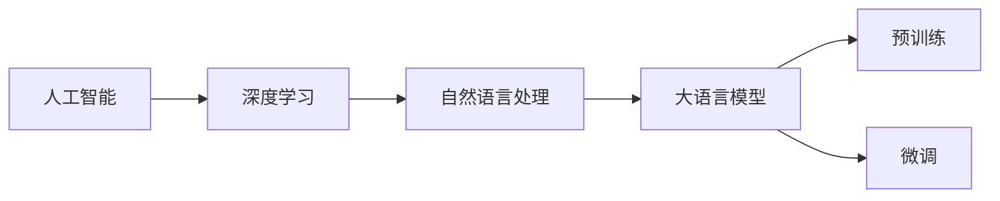

# 大语言模型应用指南：从人工智能的起源到大语言模型

作者：禅与计算机程序设计艺术 / Zen and the Art of Computer Programming 


## 1. 背景介绍
### 1.1 问题的由来

人工智能（AI）作为计算机科学的一个分支，从诞生之初就承载着人类对智能的无限憧憬。从早期的图灵测试、专家系统，到如今的深度学习、大语言模型，AI历经了数十年的发展。近年来，随着计算能力的提升、大数据的积累和算法的突破，大语言模型（Large Language Model，LLM）应运而生，为AI领域带来了前所未有的变革。

大语言模型在自然语言处理（NLP）、问答系统、对话系统、机器翻译、文本生成等领域取得了显著的成果，正逐步走进我们的生活。然而，如何理解和应用大语言模型，使其更好地服务于人类，仍是一个值得深入探讨的课题。

### 1.2 研究现状

目前，大语言模型的研究主要集中于以下几个方面：

- 预训练模型：通过在大规模无标签语料上预训练，学习到丰富的语言知识和表征。
- 微调技术：利用少量标注数据，对预训练模型进行微调，使其适应特定任务。
- 参数高效微调：在不增加参数量的情况下，提高微调效率。
- 对抗训练：增强模型鲁棒性，提高模型在对抗样本上的表现。
- 提示学习：通过设计合理的提示，引导模型进行特定任务。
- 知识增强：将外部知识库、规则库等专家知识引入模型，提升模型的理解能力。

### 1.3 研究意义

大语言模型的研究和应用具有重要的理论意义和实际价值：

- 推动AI技术的发展：大语言模型是AI领域的重要里程碑，推动着算法、计算、数据等方面的进步。
- 丰富人类生活：大语言模型在NLP、问答、对话、翻译等领域展现出巨大的潜力，为人类生活带来便利。
- 促进产业升级：大语言模型可以应用于各个行业，推动产业智能化升级。

### 1.4 本文结构

本文将从人工智能的起源讲起，逐步深入到大语言模型的应用，主要包括以下内容：

- 回顾人工智能的发展历程，介绍大语言模型的兴起背景。
- 深入解析大语言模型的原理和架构。
- 探讨大语言模型在实际应用场景中的应用。
- 展望大语言模型的未来发展趋势和挑战。
- 总结全文，展望人工智能的未来。

## 2. 核心概念与联系

为更好地理解大语言模型，本节将介绍几个核心概念：

- 人工智能（AI）：模拟、延伸和扩展人的智能的理论、方法、技术及应用。
- 深度学习（Deep Learning）：一种基于人工神经网络的深度学习模型，可以自动从数据中学习特征和模式。
- 自然语言处理（NLP）：研究如何让计算机理解、解释和生成人类语言的技术。
- 大语言模型（LLM）：通过在大规模语料上预训练，学习到丰富的语言知识和表征，具备强大的语言理解、生成和推理能力。
- 预训练：在大规模无标签语料上训练模型，学习到通用语言知识。
- 微调：利用少量标注数据，对预训练模型进行微调，使其适应特定任务。

这些概念之间的逻辑关系如图所示：



可以看出，大语言模型是自然语言处理领域的一个重要分支，其核心思想是通过预训练和微调，使模型具备强大的语言理解、生成和推理能力。

## 3. 核心算法原理 & 具体操作步骤
### 3.1 算法原理概述

大语言模型的算法原理主要基于深度学习技术，其核心思想是模仿人脑神经网络的结构和功能，通过大量的数据学习和提取特征，从而实现智能。

大语言模型通常采用以下步骤进行：

1. 数据采集：收集大规模无标签语料，为预训练提供数据基础。
2. 预训练：在大规模无标签语料上训练模型，学习到丰富的语言知识和表征。
3. 微调：利用少量标注数据，对预训练模型进行微调，使其适应特定任务。
4. 应用：将微调后的模型应用于实际场景，如问答、对话、翻译等。

### 3.2 算法步骤详解

**数据采集**：

1. 收集大量无标签文本数据，如新闻、小说、网页等。
2. 对数据进行清洗、预处理，如分词、去噪等。

**预训练**：

1. 选择合适的预训练模型，如BERT、GPT等。
2. 利用预训练模型在大规模无标签语料上进行训练，学习到丰富的语言知识和表征。
3. 优化预训练模型的参数，提高模型的性能。

**微调**：

1. 收集少量标注数据，如问答数据、对话数据等。
2. 在标注数据上对预训练模型进行微调，使其适应特定任务。
3. 优化微调模型的参数，提高模型在特定任务上的性能。

**应用**：

1. 将微调后的模型应用于实际场景，如问答、对话、翻译等。
2. 根据实际需求，对模型进行调整和优化。

### 3.3 算法优缺点

**优点**：

- 强大的语言理解、生成和推理能力。
- 适应性强，可以应用于各种NLP任务。
- 可以处理长文本，理解上下文信息。

**缺点**：

- 训练数据量巨大，计算资源消耗大。
- 模型参数量巨大，难以部署。
- 对标注数据的依赖性强。

### 3.4 算法应用领域

大语言模型在以下领域取得了显著的成果：

- NLP：文本分类、命名实体识别、情感分析、机器翻译、文本摘要等。
- 问答系统：自动问答、对话系统等。
- 对话系统：聊天机器人、客服机器人等。
- 翻译：机器翻译、机器同传等。
- 文本生成：文本摘要、故事生成、诗歌创作等。

## 4. 数学模型和公式 & 详细讲解 & 举例说明
### 4.1 数学模型构建

大语言模型通常采用深度神经网络作为数学模型，其核心思想是将输入数据通过多层非线性变换，最终得到输出结果。

以BERT模型为例，其数学模型可以表示为：

$$
\hat{y} = f(W^{[L]} f(W^{[L-1]} \cdots f(W^{[1]} f(W^{[0]} x) \cdots f(W^{[0]} x)) \cdots f(W^{[1]} x)
$$

其中，$W^{[l]}$ 表示第 $l$ 层的权重矩阵，$f$ 表示非线性激活函数，$x$ 表示输入数据，$\hat{y}$ 表示输出结果。

### 4.2 公式推导过程

以BERT模型为例，其数学模型的具体推导过程如下：

1. 将输入文本进行分词、编码，得到token ids。
2. 将token ids映射到对应的词嵌入向量。
3. 将词嵌入向量输入到第一个Transformer层，得到新的表示。
4. 重复上述步骤，经过多个Transformer层，得到最终的表示。
5. 将最终的表示输入到输出层，得到分类结果或序列预测。

### 4.3 案例分析与讲解

以下以BERT模型在情感分析任务中的应用为例，讲解其具体实现过程。

1. 准备数据集：收集标注的情感数据，如电影评论、产品评论等。
2. 数据预处理：将文本进行分词、编码，得到token ids。
3. 模型构建：加载预训练的BERT模型，并添加输出层。
4. 模型训练：在标注数据上对模型进行训练，优化模型参数。
5. 模型评估：在测试集上评估模型性能，如准确率、召回率等。

### 4.4 常见问题解答

**Q1：如何选择合适的预训练模型？**

A：选择预训练模型时，需要考虑以下因素：

- 任务类型：不同的任务需要不同的模型结构。
- 数据规模：大规模数据需要使用大规模预训练模型。
- 计算资源：预训练模型需要大量计算资源。

**Q2：微调过程中如何避免过拟合？**

A：为了避免过拟合，可以采取以下措施：

- 使用正则化技术，如L2正则化、Dropout等。
- 使用早停法（Early Stopping）。
- 使用数据增强技术，如随机删除、随机替换等。

**Q3：如何提高模型的推理速度？**

A：为了提高模型的推理速度，可以采取以下措施：

- 模型压缩，如剪枝、量化等。
- 模型并行，如TensorCore、TPU等。

## 5. 项目实践：代码实例和详细解释说明
### 5.1 开发环境搭建

在进行大语言模型应用实践之前，我们需要搭建合适的开发环境。以下是使用Python和TensorFlow搭建开发环境的步骤：

1. 安装Anaconda：从官网下载并安装Anaconda，用于创建独立的Python环境。
2. 创建并激活虚拟环境：
```bash
conda create -n tf-env python=3.8
conda activate tf-env
```
3. 安装TensorFlow：
```bash
pip install tensorflow-gpu==2.3.0
```
4. 安装其他依赖库：
```bash
pip install transformers pandas numpy scikit-learn matplotlib seaborn
```

### 5.2 源代码详细实现

以下是一个使用TensorFlow和Transformers库对BERT模型进行情感分析任务的代码实例：

```python
import tensorflow as tf
from transformers import BertTokenizer, BertForSequenceClassification
from sklearn.model_selection import train_test_split
from sklearn.metrics import accuracy_score

# 加载预训练的BERT模型和分词器
tokenizer = BertTokenizer.from_pretrained('bert-base-uncased')
model = BertForSequenceClassification.from_pretrained('bert-base-uncased')

# 准备数据集
data = pd.read_csv('data.csv')
texts = data['text']
labels = data['label']

# 数据预处理
encoded_data = tokenizer(texts.tolist(), padding=True, truncation=True, return_tensors='tf')
train_data, test_data = train_test_split(encoded_data, test_size=0.2)

# 定义训练函数
def train_step(model, optimizer, features, labels, learning_rate):
    with tf.GradientTape() as tape:
        logits = model(features['input_ids'], attention_mask=features['attention_mask'])
        loss = tf.nn.sparse_softmax_cross_entropy_with_logits(logits=logits, labels=labels)
    gradients = tape.gradient(loss, model.trainable_variables)
    optimizer.apply_gradients(zip(gradients, model.trainable_variables))
    return loss

# 定义评估函数
def evaluate(model, features, labels):
    logits = model(features['input_ids'], attention_mask=features['attention_mask'])
    predictions = tf.argmax(logits, axis=1)
    return accuracy_score(labels.numpy(), predictions.numpy())

# 训练模型
optimizer = tf.keras.optimizers.Adam(learning_rate=2e-5)
for epoch in range(3):
    train_loss = 0
    for features, labels in train_data:
        loss = train_step(model, optimizer, features, labels, 2e-5)
        train_loss += loss.numpy()
    print(f"Epoch {epoch+1}, train loss: {train_loss/len(train_data)}")

# 评估模型
print(f"Test accuracy: {evaluate(model, test_data, test_data['label'])}")
```

### 5.3 代码解读与分析

1. 加载预训练的BERT模型和分词器。
2. 读取数据集，并进行数据预处理，包括分词、编码、padding等。
3. 定义训练函数和评估函数。
4. 使用Adam优化器进行模型训练，并在每个epoch结束后输出训练损失。
5. 在测试集上评估模型性能，输出测试准确率。

### 5.4 运行结果展示

运行上述代码，将在控制台输出每个epoch的训练损失，并在最后输出测试集的准确率。假设测试集准确率为85%，则表明模型在情感分析任务上取得了较好的效果。

## 6. 实际应用场景
### 6.1 问答系统

问答系统是一种常见的AI应用，其核心目标是回答用户提出的问题。大语言模型可以应用于问答系统，实现以下功能：

- 理解用户提问：使用自然语言处理技术，将用户提问转换为模型可理解的输入。
- 知识检索：从知识库中检索与用户提问相关的答案。
- 生成答案：使用大语言模型生成针对用户提问的答案。

### 6.2 对话系统

对话系统是一种与人类进行自然对话的AI系统，其核心目标是实现人机交互。大语言模型可以应用于对话系统，实现以下功能：

- 理解用户意图：使用自然语言处理技术，从用户输入中提取意图和语义。
- 生成回复：使用大语言模型生成针对用户意图的回复。
- 跟踪对话状态：使用对话管理器跟踪对话历史，实现连贯的对话体验。

### 6.3 机器翻译

机器翻译是将一种语言文本翻译成另一种语言文本的过程。大语言模型可以应用于机器翻译，实现以下功能：

- 词义消歧：在翻译过程中，对词语进行语义理解，避免歧义。
- 语法分析：对句子进行语法分析，保证翻译结果的正确性。
- 翻译风格保持：在翻译过程中，保持原文的文体和风格。

### 6.4 未来应用展望

大语言模型在各个领域的应用前景广阔，以下是一些未来可能的应用场景：

- 自动创作：使用大语言模型自动创作诗歌、小说、剧本等文学作品。
- 智能助手：使用大语言模型构建智能助手，为用户提供个性化服务。
- 智能客服：使用大语言模型构建智能客服，提高客服效率和质量。
- 智能翻译：使用大语言模型构建智能翻译系统，实现实时翻译和机器同传。
- 智能问答：使用大语言模型构建智能问答系统，为用户提供专业、准确的答案。

## 7. 工具和资源推荐
### 7.1 学习资源推荐

为帮助开发者更好地学习大语言模型，以下推荐一些学习资源：

1. 《深度学习》系列图书：周志华教授著作，系统介绍了深度学习的基本原理和方法。
2. 《深度学习自然语言处理》课程：斯坦福大学开设的NLP课程，涵盖了NLP领域的经典模型和方法。
3. HuggingFace官网：提供了丰富的预训练模型和工具，方便开发者进行模型训练和推理。
4. TensorFlow和PyTorch官网：分别介绍了TensorFlow和PyTorch框架，提供了详细的API文档和示例代码。
5. 《Transformer》论文：介绍了Transformer模型，是深度学习NLP领域的奠基性工作。

### 7.2 开发工具推荐

以下是一些常用的开发工具：

1. TensorFlow：Google开源的深度学习框架，提供了丰富的API和预训练模型。
2. PyTorch：Facebook开源的深度学习框架，以易用性和灵活性著称。
3. HuggingFace Transformers：基于TensorFlow和PyTorch的NLP工具库，提供了丰富的预训练模型和工具。
4. Jupyter Notebook：Python的开源交互式计算环境，方便进行数据分析和可视化。
5. Colab：Google提供的免费云平台，提供了丰富的算力和工具，方便进行模型训练和推理。

### 7.3 相关论文推荐

以下是一些与大语言模型相关的经典论文：

1. 《Attention is All You Need》
2. 《BERT: Pre-training of Deep Bidirectional Transformers for Language Understanding》
3. 《Generative Pre-trained Transformers》
4. 《BERT for Sentence Pair Classification》
5. 《Transformers》

### 7.4 其他资源推荐

以下是一些其他有用的资源：

1. arXiv论文预印本：人工智能领域最新研究成果的发布平台。
2. 顶级AI会议：如NIPS、ICML、ACL、ICLR等。
3. 深度学习社区：如GitHub、知乎、CSDN等。
4. 人工智能公司：如Google AI、Facebook AI Research、OpenAI等。

## 8. 总结：未来发展趋势与挑战
### 8.1 研究成果总结

本文从人工智能的起源讲起，逐步深入到大语言模型的应用。通过对大语言模型的原理、算法、应用场景等方面的介绍，希望读者能够对大语言模型有一个全面的理解。

### 8.2 未来发展趋势

未来，大语言模型将在以下几个方面取得突破：

1. 模型规模将进一步扩大，参数量将不断增长。
2. 微调技术将更加高效，降低对标注数据的依赖。
3. 模型将更加鲁棒，能够抵抗对抗样本的攻击。
4. 模型将更加可解释，提高模型决策过程的透明度。
5. 模型将更加安全，防止模型被滥用。

### 8.3 面临的挑战

大语言模型在发展过程中，也面临着以下挑战：

1. 计算资源消耗巨大，难以部署到边缘设备。
2. 对标注数据的依赖性强，难以适应小样本场景。
3. 模型可解释性不足，难以理解模型的决策过程。
4. 模型存在偏见和歧视，需要加强伦理审查。

### 8.4 研究展望

未来，大语言模型的研究将重点关注以下方向：

1. 模型压缩和加速，降低模型计算复杂度。
2. 无监督和半监督微调技术，降低对标注数据的依赖。
3. 模型可解释性和安全性，提高模型的透明度和可信度。
4. 模型伦理审查，防止模型被滥用。

相信在众多科研工作者的共同努力下，大语言模型将不断突破自身局限，为人类社会带来更多福祉。

## 9. 附录：常见问题与解答

**Q1：什么是预训练？**

A：预训练是指在大规模无标签语料上训练模型，使其学习到丰富的语言知识和表征。预训练模型通常包含多个预训练任务，如语言建模、掩码语言模型等。

**Q2：什么是微调？**

A：微调是指利用少量标注数据，对预训练模型进行进一步训练，使其适应特定任务。微调过程主要针对预训练模型的输出层进行调整。

**Q3：如何选择合适的预训练模型？**

A：选择预训练模型时，需要考虑以下因素：

- 任务类型：不同的任务需要不同的模型结构。
- 数据规模：大规模数据需要使用大规模预训练模型。
- 计算资源：预训练模型需要大量计算资源。

**Q4：如何避免过拟合？**

A：为了避免过拟合，可以采取以下措施：

- 使用正则化技术，如L2正则化、Dropout等。
- 使用早停法（Early Stopping）。
- 使用数据增强技术，如随机删除、随机替换等。

**Q5：如何提高模型的推理速度？**

A：为了提高模型的推理速度，可以采取以下措施：

- 模型压缩，如剪枝、量化等。
- 模型并行，如TensorCore、TPU等。