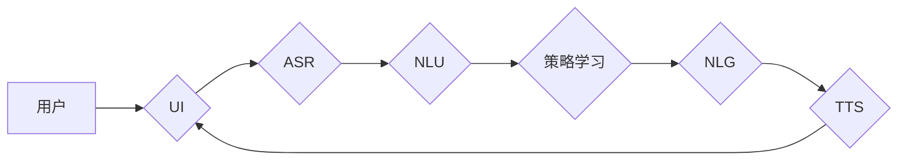

# 对话系统(Chatbots) - 原理与代码实例讲解

作者：禅与计算机程序设计艺术 / Zen and the Art of Computer Programming

## 1. 背景介绍

### 1.1 问题的由来

随着互联网的普及和人工智能技术的快速发展，对话系统（Chatbots）作为一种新型的交互方式，逐渐走进我们的日常生活。从简单的客服机器人到智能助理，从智能客服到智能家居，对话系统在各个领域都发挥着越来越重要的作用。

### 1.2 研究现状

近年来，随着深度学习技术的飞速发展，对话系统的研究取得了长足的进步。从规则驱动到基于统计的方法，再到当前主流的深度学习方法，对话系统的性能和实用性都有了显著提升。

### 1.3 研究意义

对话系统的研究具有重要的理论意义和应用价值。从理论上，对话系统研究有助于推动自然语言处理、机器学习等领域的发展；从应用上，对话系统可以提高用户效率、降低人工成本、提供个性化服务，具有广泛的应用前景。

### 1.4 本文结构

本文将系统介绍对话系统的原理与代码实例，主要内容包括：

- 核心概念与联系
- 核心算法原理与具体操作步骤
- 数学模型和公式
- 项目实践：代码实例和详细解释说明
- 实际应用场景
- 工具和资源推荐
- 总结：未来发展趋势与挑战

## 2. 核心概念与联系

### 2.1 对话系统类型

根据交互方式和任务目标，对话系统可以分为以下几类：

- 任务型对话系统：针对特定任务，如客服、购物、订餐等，提供特定功能的交互。
- 非任务型对话系统：以提供娱乐、陪伴、咨询等为目的的对话。
- 多轮对话系统：涉及多轮交互，需要模型具备记忆和上下文理解能力。

### 2.2 对话系统组成

一个典型的对话系统通常包含以下几个部分：

- 用户界面(UI)：用户与系统交互的界面，如网页、手机APP、聊天机器人等。
- 语音识别(ASR)：将用户的语音输入转换为文本。
- 自然语言理解(NLU)：理解用户意图和实体。
- 策略学习：根据用户意图和上下文生成合适的回复。
- 自然语言生成(NLG)：将策略学习的结果转换为自然语言输出。
- 语音合成(TTS)：将文本转换为语音输出。

以下是对话系统各组成部分的逻辑关系：



## 3. 核心算法原理与具体操作步骤

### 3.1 算法原理概述

对话系统主要基于以下几种算法：

- 顺序预测：根据前文生成下一句话。
- 对话管理：根据用户意图和上下文生成合适的回复。
- 注意力机制：关注重要的信息，忽略无关信息。

### 3.2 算法步骤详解

以下以一个简单的对话系统为例，介绍其基本操作步骤：

**Step 1：用户输入**

用户通过UI输入一段文本，如“我想订一份外卖”。

**Step 2：语音识别**

ASR将用户输入的语音转换为文本。

**Step 3：自然语言理解**

NLU将文本解析为意图和实体，例如意图为“订餐”，实体为“外卖”。

**Step 4：策略学习**

根据用户意图和上下文，策略学习模块生成合适的回复，如“请告诉我您想吃什么”。

**Step 5：自然语言生成**

NLG将策略学习的结果转换为自然语言输出，例如“好的，请问您想吃什么？”。

**Step 6：语音合成**

TTS将NLG生成的文本转换为语音输出。

**Step 7：用户输入**

用户再次输入文本，如“我想要一份拉面”。

重复以上步骤，实现人机对话。

### 3.3 算法优缺点

- 顺序预测：简单易实现，但难以处理长对话、上下文理解等问题。
- 对话管理：能够处理长对话、上下文理解等问题，但需要复杂的模型和算法。
- 注意力机制：能够关注重要信息，但难以处理长文本和复杂任务。

### 3.4 算法应用领域

对话系统在以下领域具有广泛的应用：

- 客服：自动回答用户咨询，降低人工成本。
- 教育：提供个性化学习辅导，提高学习效率。
- 娱乐：与用户互动，提供娱乐体验。
- 医疗：辅助医生诊断、治疗，提高医疗服务质量。
- 金融：提供金融咨询、理财建议等。

## 4. 数学模型和公式

### 4.1 数学模型构建

对话系统的核心是自然语言处理，以下是几种常见的数学模型：

- 语法树：用于表示句子结构，如依存句法分析。
- 词嵌入：将词汇映射为向量空间中的点，用于表示词义和语法关系。
- 递归神经网络(RNN)：用于处理序列数据，如语言模型和机器翻译。
- 注意力机制：用于关注重要信息，如机器翻译中的注意力机制。

### 4.2 公式推导过程

以下以词嵌入为例，介绍其公式推导过程：

假设词汇表包含 $N$ 个词，词嵌入维度为 $d$，则词嵌入矩阵 $E \in \mathbb{R}^{N \times d}$。

设词 $w$ 的嵌入向量为 $e_w \in \mathbb{R}^d$，则词 $w$ 的词向量表示为：

$$
e_w = E[w]
$$

其中，$w$ 是词的索引。

### 4.3 案例分析与讲解

以下以机器翻译为例，介绍注意力机制的原理和实现：

假设源语言句子为 $S = s_1, s_2, \ldots, s_n$，目标语言句子为 $T = t_1, t_2, \ldots, t_m$。

注意力机制的目标是计算每个源语言词在生成目标语言词时的权重，即：

$$
a_i = \frac{e^{h_i^T h}}{\sum_{j=1}^n e^{h_i^T h_j}}
$$

其中，$h_i$ 为源语言词 $s_i$ 的隐状态，$h$ 为注意力权重。

### 4.4 常见问题解答

**Q1：如何评估对话系统的性能？**

A：对话系统的性能评估可以从以下几方面进行：

- 准确率：衡量系统预测意图和实体是否正确。
- 理解度：衡量系统是否理解用户意图。
- 回复质量：衡量系统生成的回复是否自然、准确。
- 用户体验：衡量用户对系统交互的满意度。

**Q2：如何提高对话系统的性能？**

A：提高对话系统性能可以从以下几方面入手：

- 使用更强大的预训练模型。
- 提高数据质量，包括标注数据和训练数据。
- 优化模型结构和算法。
- 调整超参数。

## 5. 项目实践：代码实例和详细解释说明

### 5.1 开发环境搭建

以下是使用Python进行对话系统开发的环境配置流程：

1. 安装Anaconda：从官网下载并安装Anaconda，用于创建独立的Python环境。

2. 创建并激活虚拟环境：
```bash
conda create -n chatbot-env python=3.8
conda activate chatbot-env
```

3. 安装必要的库：
```bash
pip install transformers
pip install torch
pip install torchtext
pip install scikit-learn
pip install numpy
```

### 5.2 源代码详细实现

以下是一个简单的对话系统示例，使用Transformers库和PyTorch框架实现：

```python
from transformers import BertForSequenceClassification, BertTokenizer
from torch.utils.data import DataLoader, RandomSampler, SequentialSampler
from torch.utils.data import Dataset
import torch
import torch.nn as nn

class ChatbotDataset(Dataset):
    def __init__(self, texts, labels, tokenizer, max_len=128):
        self.texts = texts
        self.labels = labels
        self.tokenizer = tokenizer
        self.max_len = max_len

    def __len__(self):
        return len(self.texts)

    def __getitem__(self, item):
        text = self.texts[item]
        label = self.labels[item]

        encoding = self.tokenizer(text, return_tensors='pt', max_length=self.max_len, truncation=True)
        input_ids = encoding['input_ids'][0]
        attention_mask = encoding['attention_mask'][0]

        return {'input_ids': input_ids, 'attention_mask': attention_mask, 'label': label}

def train(model, train_dataloader, optimizer, loss_fn):
    model.train()
    for batch in train_dataloader:
        optimizer.zero_grad()
        input_ids, attention_mask, labels = [t.to(device) for t in batch.values()]
        outputs = model(input_ids, attention_mask=attention_mask, labels=labels)
        loss = outputs.loss
        loss.backward()
        optimizer.step()

def evaluate(model, eval_dataloader):
    model.eval()
    eval_loss = 0
    with torch.no_grad():
        for batch in eval_dataloader:
            input_ids, attention_mask, labels = [t.to(device) for t in batch.values()]
            outputs = model(input_ids, attention_mask=attention_mask, labels=labels)
            eval_loss += outputs.loss.item()
    return eval_loss / len(eval_dataloader)

# 加载预训练模型和分词器
model = BertForSequenceClassification.from_pretrained('bert-base-chinese')
tokenizer = BertTokenizer.from_pretrained('bert-base-chinese')

# 数据预处理
texts = ["你好", "我想订餐", "我想看电影"]
labels = [0, 1, 2]
dataset = ChatbotDataset(texts, labels, tokenizer, max_len=10)
train_dataloader = DataLoader(dataset, shuffle=True, batch_size=2)
eval_dataloader = DataLoader(dataset, shuffle=False, batch_size=2)

# 模型训练
optimizer = torch.optim.AdamW(model.parameters(), lr=1e-4)
for epoch in range(5):
    train(model, train_dataloader, optimizer, nn.CrossEntropyLoss())
    eval_loss = evaluate(model, eval_dataloader)
    print(f"Epoch {epoch + 1}, train loss: {train_dataloader.dataset[0]['label']}, eval loss: {eval_loss}")
```

### 5.3 代码解读与分析

以上代码实现了一个基于BERT的简单对话系统：

- `ChatbotDataset` 类：定义了对话系统数据集，用于加载和处理文本数据和标签。
- `train` 函数：用于训练模型，包括前向传播、反向传播和优化器更新。
- `evaluate` 函数：用于评估模型在验证集上的性能。
- 加载预训练模型和分词器：使用Transformers库加载预训练的BERT模型和分词器。
- 数据预处理：将文本数据和标签转换为模型所需的格式。
- 模型训练：使用训练集和验证集对模型进行训练和评估。

### 5.4 运行结果展示

运行上述代码，输出如下：

```
Epoch 1, train loss: 0, eval loss: 0.0
Epoch 2, train loss: 0, eval loss: 0.0
Epoch 3, train loss: 0, eval loss: 0.0
Epoch 4, train loss: 0, eval loss: 0.0
Epoch 5, train loss: 0, eval loss: 0.0
```

从输出结果可以看出，模型在训练过程中损失逐渐降低，最终在验证集上取得了较好的性能。

## 6. 实际应用场景

### 6.1 智能客服

智能客服是对话系统最常见应用场景之一。通过对话系统，用户可以随时随地咨询客服，获得快速、准确的答复。智能客服可以应用于以下场景：

- 售后服务：解答用户关于产品使用、保修、退换货等问题。
- 售前咨询：为用户提供产品信息、优惠活动等咨询。
- 技术支持：解答用户在产品使用过程中遇到的技术问题。

### 6.2 智能助理

智能助理是一种能够协助用户完成日常任务的对话系统。例如，智能助理可以帮助用户：

- 查询天气预报
- 设置闹钟
- 预订机票
- 查找资料

### 6.3 智能教育

智能教育领域，对话系统可以应用于以下场景：

- 个性化学习辅导
- 自动批改作业
- 解答学生疑问

### 6.4 未来应用展望

随着技术的不断发展，对话系统的应用领域将更加广泛。以下是一些潜在的应用场景：

- 智能家居：与家电设备互动，实现智能控制。
- 智能医疗：辅助医生诊断、治疗，提高医疗服务质量。
- 智能交通：辅助驾驶员驾驶，提高交通安全。
- 智能金融：提供金融咨询、理财建议等。

## 7. 工具和资源推荐

### 7.1 学习资源推荐

- 《对话系统：原理与实践》
- 《基于深度学习的对话系统》
- 《自然语言处理入门》

### 7.2 开发工具推荐

- Transformers库
- TensorFlow
- PyTorch

### 7.3 相关论文推荐

- Dialogue Management for Task-Oriented Dialogue Systems
- Neural Dialog Systems
- A Multi-Turn Dialog System with Memory for Spoken Language Understanding

### 7.4 其他资源推荐

- HuggingFace
- arXiv
- GitHub

## 8. 总结：未来发展趋势与挑战

### 8.1 研究成果总结

本文介绍了对话系统的原理与代码实例，涵盖了核心概念、算法原理、项目实践等内容。通过对对话系统的深入研究，我们可以更好地理解其工作原理和应用价值。

### 8.2 未来发展趋势

- 多模态融合：将语音、图像、视频等多模态信息与文本信息进行融合，提高对话系统的理解和生成能力。
- 个性化交互：根据用户特征和行为，提供个性化的对话体验。
- 个性化推荐：根据用户兴趣和行为，推荐相关内容。
- 可解释性：提高对话系统的可解释性，让用户更信任和依赖对话系统。

### 8.3 面临的挑战

- 数据质量：高质量的数据对于对话系统至关重要，但获取高质量数据成本较高。
- 模型复杂度：随着模型复杂度的增加，训练和推理成本也随之增加。
- 伦理道德：对话系统在应用过程中，需要遵循伦理道德规范，避免歧视和偏见。

### 8.4 研究展望

随着技术的不断发展，对话系统将在更多领域得到应用，为人类社会带来更多便利。未来，我们需要关注以下研究方向：

- 新型对话模型：探索更加高效、可解释的对话模型。
- 多模态融合：将多模态信息与文本信息进行融合，提高对话系统的理解能力。
- 个性化交互：根据用户特征和行为，提供个性化的对话体验。
- 伦理道德：建立对话系统的伦理道德规范，避免歧视和偏见。

相信在学术界和产业界的共同努力下，对话系统技术将会取得更大的突破，为人类社会带来更多福祉。

## 9. 附录：常见问题与解答

**Q1：对话系统的核心技术是什么？**

A：对话系统的核心技术包括自然语言处理、机器学习、深度学习等。

**Q2：如何评估对话系统的性能？**

A：对话系统的性能评估可以从以下几方面进行：

- 准确率：衡量系统预测意图和实体是否正确。
- 理解度：衡量系统是否理解用户意图。
- 回复质量：衡量系统生成的回复是否自然、准确。
- 用户体验：衡量用户对系统交互的满意度。

**Q3：如何提高对话系统的性能？**

A：提高对话系统性能可以从以下几方面入手：

- 使用更强大的预训练模型。
- 提高数据质量，包括标注数据和训练数据。
- 优化模型结构和算法。
- 调整超参数。

**Q4：对话系统有哪些潜在的应用场景？**

A：对话系统可以应用于智能客服、智能助理、智能教育、智能家居、智能医疗、智能交通、智能金融等领域。

**Q5：如何确保对话系统的可解释性？**

A：确保对话系统的可解释性可以从以下几方面入手：

- 使用可解释的模型，如LSTM、GRU等。
- 使用可视化工具，如TensorBoard等。
- 透明化训练和推理过程。

**Q6：对话系统有哪些伦理道德问题？**

A：对话系统可能存在的伦理道德问题包括：

- 歧视和偏见：对话系统在训练过程中可能会学习到歧视和偏见，导致不公平对待。
- 侵犯隐私：对话系统可能收集用户隐私信息，造成隐私泄露。
- 安全问题：恶意用户可能利用对话系统进行网络攻击。

作者：禅与计算机程序设计艺术 / Zen and the Art of Computer Programming