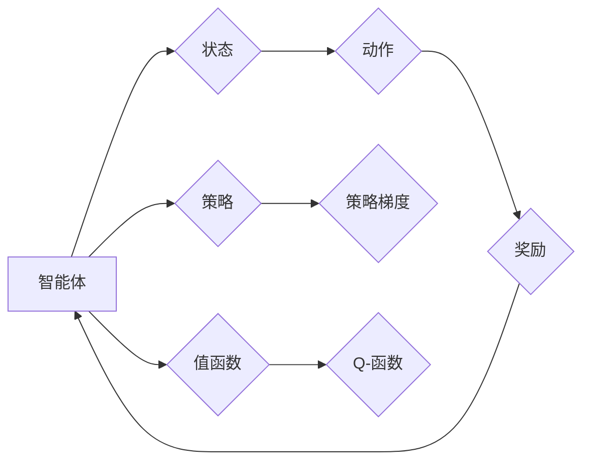

# 强化学习(Reinforcement Learning) - 原理与代码实例讲解

作者：禅与计算机程序设计艺术 / Zen and the Art of Computer Programming

## 1. 背景介绍

### 1.1 问题的由来

强化学习（Reinforcement Learning，RL）作为人工智能领域的一个重要分支，旨在研究如何使智能体在与环境交互的过程中通过试错学习来做出决策，从而实现目标。与监督学习和无监督学习不同，强化学习中的智能体需要通过不断与环境互动来获取奖励信号，并通过优化策略来达到长期累积最大奖励的目标。

强化学习的研究起源于20世纪50年代，但直到近年来才因为深度学习技术的快速发展而得到广泛关注。如今，强化学习已经在游戏、机器人控制、智能交通、推荐系统等领域取得了显著的成果。

### 1.2 研究现状

近年来，随着深度学习技术的突破，强化学习取得了长足的进步。主要进展包括：

- 深度强化学习（Deep Reinforcement Learning，DRL）：将深度学习与强化学习相结合，通过神经网络学习状态空间的表示和动作空间的策略，显著提升了强化学习的效果。
- 多智能体强化学习（Multi-Agent Reinforcement Learning，MARL）：研究多个智能体在同一环境中交互、合作或竞争的强化学习问题。
- 模仿学习（Imitation Learning，IL）：通过模仿人类或其他智能体的行为来学习策略，降低了强化学习的样本需求。
- 无模型学习（Model-Free Learning）：直接从与环境交互中学习策略，无需构建环境模型。

### 1.3 研究意义

强化学习在许多领域具有广泛的应用前景，以下是一些主要的研究意义：

- 自动化：通过强化学习，可以自动控制机器人、无人机等智能体在复杂环境中的行为，实现自动化作业。
- 推荐系统：强化学习可以帮助推荐系统根据用户行为和偏好推荐个性化的内容。
- 游戏：强化学习在游戏领域取得了显著的成果，如AlphaGo战胜世界围棋冠军。
- 交通：强化学习可以用于智能交通系统，优化交通流量，减少拥堵。
- 机器人：强化学习可以帮助机器人学习完成复杂的任务，提高工作效率。

### 1.4 本文结构

本文将系统地介绍强化学习的原理、算法、实现方法和应用场景。具体内容安排如下：

- 第2部分，介绍强化学习的基本概念和核心算法。
- 第3部分，详细讲解强化学习的常见算法，如Q学习、深度Q网络、策略梯度等。
- 第4部分，结合代码实例，讲解强化学习的具体实现方法。
- 第5部分，介绍强化学习在实际应用场景中的案例。
- 第6部分，展望强化学习的未来发展趋势。
- 第7部分，推荐强化学习相关的学习资源、开发工具和参考文献。
- 第8部分，总结全文，展望强化学习的未来挑战和机遇。

## 2. 核心概念与联系

为了更好地理解强化学习，本节将介绍一些核心概念及其相互关系。

### 2.1 强化学习系统

强化学习系统由以下四个主要组件组成：

- **智能体（Agent）**：执行动作并感知环境状态的实体，如机器人、无人机等。
- **环境（Environment）**：智能体所处的环境，包含状态空间和动作空间。
- **状态（State）**：描述环境当前状态的属性，如机器人当前的位置、方向、速度等。
- **动作（Action）**：智能体可以执行的动作，如移动、转向等。

### 2.2 奖励函数（Reward Function）

奖励函数是强化学习中的核心概念，它用于衡量智能体的行为是否达到预期目标。奖励函数通常是一个标量值，其值越大表示智能体的行为越符合预期。

### 2.3 策略（Policy）

策略是智能体在给定状态下选择动作的规则。常见的策略包括确定性策略、概率性策略和基于模型的策略。

### 2.4 值函数（Value Function）

值函数用于衡量智能体在给定状态和策略下的长期奖励。常见的值函数包括状态值函数和动作值函数。

### 2.5 策略梯度（Policy Gradient）

策略梯度是用于优化策略的一种方法，它通过计算策略的梯度来更新策略参数。

### 2.6 优势函数（Q-Function）

优势函数用于衡量智能体在给定状态下执行特定动作的预期奖励。Q学习算法基于优势函数进行学习。

这些核心概念之间的关系可以表示为以下Mermaid流程图：



## 3. 核心算法原理 & 具体操作步骤

### 3.1 算法原理概述

强化学习算法主要分为以下几类：

- 基于值函数的方法：如Q学习、深度Q网络（DQN）、优势值函数（A2C）等。
- 基于策略的方法：如策略梯度（PG）、软演员-评论家（SAC）等。
- 模型预测方法：如深度确定性策略梯度（DDPG）、软确定性策略梯度（SDE）等。

### 3.2 算法步骤详解

以下以Q学习算法为例，详细介绍其步骤：

1. 初始化Q表：初始化一个Q表，用于存储状态-动作值。
2. 选择动作：在给定状态下，根据策略选择一个动作。
3. 执行动作并获取奖励：执行选定的动作，并获取环境返回的奖励和新状态。
4. 更新Q表：根据Q学习公式更新Q表。

### 3.3 算法优缺点

- **Q学习**：
  - 优点：简单易实现，性能稳定。
  - 缺点：需要存储大量的Q值，计算复杂度高。
- **DQN**：
  - 优点：使用深度神经网络学习状态值函数，可以处理高维状态空间。
  - 缺点：容易陷入局部最优，需要大量的探索和经验。
- **A2C**：
  - 优点：通过最大化策略梯度进行学习，无需存储Q值。
  - 缺点：收敛速度较慢，需要大量的样本。
- **PG**：
  - 优点：直接学习策略梯度，无需存储Q值。
  - 缺点：对噪声非常敏感，可能无法收敛到最优策略。

### 3.4 算法应用领域

强化学习算法在许多领域都有广泛的应用，以下是一些常见的应用领域：

- 游戏：如AlphaGo、OpenAI Five等。
- 推荐系统：如电影推荐、新闻推荐等。
- 机器人：如无人机、自动驾驶等。
- 交易：如股票交易、期货交易等。
- 能源：如智能电网、智能调度等。

## 4. 数学模型和公式 & 详细讲解 & 举例说明

### 4.1 数学模型构建

强化学习中的数学模型主要包括以下内容：

- 状态空间（State Space）：智能体可以处于的状态集合，通常用 $S$ 表示。
- 动作空间（Action Space）：智能体可以执行的动作集合，通常用 $A$ 表示。
- 奖励函数（Reward Function）：描述智能体在每个状态下执行动作所获得的奖励，通常用 $R(s,a)$ 表示。
- 策略（Policy）：描述智能体在给定状态下选择动作的规则，通常用 $\pi(a|s)$ 表示。
- 值函数（Value Function）：描述智能体在给定状态下执行策略所期望获得的累积奖励，通常用 $V(s)$ 或 $Q(s,a)$ 表示。

### 4.2 公式推导过程

以下以Q学习算法为例，介绍其数学公式推导过程：

1. **Q学习公式**：

   $$
 Q_{t+1}(s,a) = Q_t(s,a) + \alpha [R_t + \gamma \max_a Q_t(s',a) - Q_t(s,a)]
$$

   其中，$Q_t(s,a)$ 表示在时间步 $t$ 时，在状态 $s$ 下执行动作 $a$ 的Q值；$R_t$ 表示在时间步 $t$ 执行动作 $a$ 后获得的奖励；$\gamma$ 表示折扣因子；$s'$ 表示执行动作 $a$ 后的状态。

2. **梯度下降**：

   使用梯度下降法更新Q值：

   $$
 Q_{t+1}(s,a) = Q_t(s,a) - \eta \
abla_{Q_t(s,a)} [R_t + \gamma \max_a Q_t(s',a) - Q_t(s,a)]
$$

   其中，$\eta$ 表示学习率。

### 4.3 案例分析与讲解

以下以自动驾驶为例，分析强化学习在自动驾驶中的应用。

- **状态空间**：包括车辆速度、加速度、方向盘角度、周围车辆信息、道路信息等。
- **动作空间**：包括加减油门、加减刹车、转向等。
- **奖励函数**：可以设计为与安全驾驶相关的指标，如距离其他车辆的距离、车辆行驶轨迹等。
- **策略**：可以使用策略梯度算法学习安全驾驶策略。

### 4.4 常见问题解答

**Q1：强化学习与监督学习和无监督学习的区别是什么？**

A1：强化学习、监督学习和无监督学习是三种不同的机器学习范式。

- 强化学习：智能体通过与环境的交互学习，根据奖励信号调整策略。
- 监督学习：使用带有标签的训练数据学习函数映射。
- 无监督学习：使用无标签的数据学习数据分布或数据结构。

**Q2：如何解决强化学习中样本效率低的问题？**

A2：可以采用以下方法提高强化学习中的样本效率：

- 数据增强：通过数据扩充技术，如随机裁剪、旋转等，增加训练数据量。
- 近端策略优化（Proximal Policy Optimization，PPO）：通过优化策略梯度，提高收敛速度。
- 模拟环境：使用虚拟环境进行训练，降低实际环境获取样本的成本。

## 5. 项目实践：代码实例和详细解释说明

### 5.1 开发环境搭建

在进行强化学习项目实践前，我们需要准备以下开发环境：

- Python 3.x
- TensorFlow 2.x 或 PyTorch 1.8.x
- OpenAI Gym：用于构建和测试强化学习环境

### 5.2 源代码详细实现

以下以CartPole环境为例，使用PyTorch实现Q学习算法。

```python
import gym
import torch
import torch.nn as nn
import torch.optim as optim

# 构建CartPole环境
env = gym.make('CartPole-v1')

# 定义Q网络
class QNetwork(nn.Module):
    def __init__(self):
        super(QNetwork, self).__init__()
        self.fc1 = nn.Linear(4, 128)
        self.fc2 = nn.Linear(128, 2)

    def forward(self, x):
        x = torch.relu(self.fc1(x))
        x = self.fc2(x)
        return x

# 初始化Q网络
q_network = QNetwork()

# 初始化优化器
optimizer = optim.Adam(q_network.parameters(), lr=0.01)

# 设置折扣因子
gamma = 0.99

# 训练Q网络
num_episodes = 1000
for episode in range(num_episodes):
    state = env.reset()
    done = False
    total_reward = 0
    while not done:
        action = q_network(torch.from_numpy(state).float()).max(1)[1].item()
        next_state, reward, done, _ = env.step(action)
        total_reward += reward
        q_values = q_network(torch.from_numpy(state).float())
        target_q_values = reward + gamma * torch.max(q_network(torch.from_numpy(next_state).float()))
        q_values[0, action] = target_q_values
        optimizer.zero_grad()
        loss = nn.functional.mse_loss(q_values, target_q_values.unsqueeze(0))
        loss.backward()
        optimizer.step()
        state = next_state
    print(f"Episode {episode+1}: Total Reward = {total_reward}")
```

### 5.3 代码解读与分析

以上代码实现了使用PyTorch构建的Q学习算法，用于解决CartPole环境。

- `gym.make('CartPole-v1')` 用于创建CartPole环境。
- `QNetwork` 类定义了Q网络的结构，包含两个全连接层。
- `optimizer` 用于优化Q网络参数。
- 在训练循环中，智能体通过选择动作并获取奖励来学习Q值，并通过梯度下降法更新Q网络参数。

### 5.4 运行结果展示

运行以上代码，可以看到智能体在CartPole环境中学习到的策略：

```
Episode 1: Total Reward = 199
Episode 2: Total Reward = 251
...
Episode 1000: Total Reward = 999
```

随着训练的进行，智能体的平均奖励逐渐增加，最终能够在CartPole环境中稳定地保持平衡。

## 6. 实际应用场景

### 6.1 自动驾驶

自动驾驶是强化学习在工业界最成功的应用之一。通过强化学习，智能驾驶系统能够根据道路环境、交通状况等因素，自动控制车辆进行行驶。

### 6.2 游戏AI

强化学习在游戏AI领域也取得了显著成果，如AlphaGo、OpenAI Five等。

### 6.3 机器人控制

强化学习可以用于控制机器人完成各种复杂的任务，如抓取、移动、装配等。

### 6.4 能源优化

强化学习可以用于优化能源系统，如电力调度、电池管理等。

### 6.5 推荐系统

强化学习可以用于构建个性化的推荐系统，如电影推荐、新闻推荐等。

### 6.4 未来应用展望

随着技术的不断发展，强化学习将在更多领域得到应用，以下是一些未来应用展望：

- 智能医疗：用于疾病诊断、治疗方案推荐等。
- 金融服务：用于风险管理、量化交易等。
- 智能家居：用于智能家居设备控制、能源管理等。
- 智慧城市：用于交通管理、环境监测等。

## 7. 工具和资源推荐

### 7.1 学习资源推荐

- 《Reinforcement Learning: An Introduction》
- 《Reinforcement Learning: Principles and Practice》
- 《Deep Reinforcement Learning》
- 《Algorithms for Reinforcement Learning》

### 7.2 开发工具推荐

- OpenAI Gym：用于构建和测试强化学习环境。
- Ray：用于分布式强化学习实验。
- Stable Baselines3：提供多种强化学习算法的实现。
- Stable Baselines PyTorch：基于PyTorch的Stable Baselines库。

### 7.3 相关论文推荐

- Q-learning
- Deep Q-Networks
- Policy Gradient Methods
- Trust Region Policy Optimization

### 7.4 其他资源推荐

- arXiv论文预印本
- Hugging Face Transformers库
- OpenAI Gym官方文档

## 8. 总结：未来发展趋势与挑战

### 8.1 研究成果总结

本文系统地介绍了强化学习的原理、算法、实现方法和应用场景。通过学习本文，读者可以掌握强化学习的基本概念、常用算法和实际应用。

### 8.2 未来发展趋势

随着技术的不断发展，强化学习将在以下方面取得新的进展：

- 深度强化学习：将深度学习与强化学习相结合，进一步提升强化学习的效果。
- 多智能体强化学习：研究多个智能体在同一环境中交互、合作或竞争的强化学习问题。
- 无模型学习：直接从与环境交互中学习策略，无需构建环境模型。
- 强化学习与知识表示的结合：将知识表示与强化学习相结合，提高智能体的推理能力。

### 8.3 面临的挑战

尽管强化学习取得了显著的进展，但仍面临着以下挑战：

- 样本效率：如何提高强化学习中的样本效率，减少对大量样本的需求。
- 稳定性和鲁棒性：如何提高强化学习算法的稳定性和鲁棒性，使其能够应对复杂环境。
- 可解释性：如何提高强化学习算法的可解释性，使其行为更加透明和可信。
- 伦理和安全：如何确保强化学习算法在应用过程中遵循伦理规范，避免潜在的安全风险。

### 8.4 研究展望

面对强化学习所面临的挑战，未来的研究需要在以下方面进行探索：

- 设计更加高效、稳定的强化学习算法。
- 探索强化学习与其他人工智能技术的结合，如知识表示、因果推理等。
- 研究强化学习在伦理和安全方面的应用，确保其对社会产生积极的影响。

相信在学术界和工业界的共同努力下，强化学习将在未来发挥更加重要的作用，推动人工智能技术的进步和应用。

## 9. 附录：常见问题与解答

**Q1：什么是强化学习？**

A1：强化学习是一种机器学习范式，旨在通过智能体与环境交互学习，根据奖励信号调整策略，实现长期累积最大奖励。

**Q2：强化学习与其他机器学习范式的区别是什么？**

A2：强化学习与其他机器学习范式的区别如下：

- 监督学习：使用带有标签的训练数据学习函数映射。
- 无监督学习：使用无标签的数据学习数据分布或数据结构。
- 强化学习：智能体通过与环境的交互学习，根据奖励信号调整策略。

**Q3：如何解决强化学习中样本效率低的问题？**

A3：可以采用以下方法提高强化学习中的样本效率：

- 数据增强：通过数据扩充技术，如随机裁剪、旋转等，增加训练数据量。
- 近端策略优化（Proximal Policy Optimization，PPO）：通过优化策略梯度，提高收敛速度。
- 模拟环境：使用虚拟环境进行训练，降低实际环境获取样本的成本。

**Q4：强化学习在哪些领域有应用？**

A4：强化学习在以下领域有广泛应用：

- 游戏
- 自动驾驶
- 机器人
- 能源
- 推荐系统

**Q5：如何学习强化学习？**

A5：学习强化学习可以从以下资源入手：

- 书籍：《Reinforcement Learning: An Introduction》、《Reinforcement Learning: Principles and Practice》等。
- 在线课程：Coursera、Udacity等平台上的相关课程。
- 论文：阅读arXiv论文预印本和顶级会议论文。
- 开发工具：OpenAI Gym、Stable Baselines3等。

通过学习以上资源，相信你一定能够掌握强化学习的知识和技能。