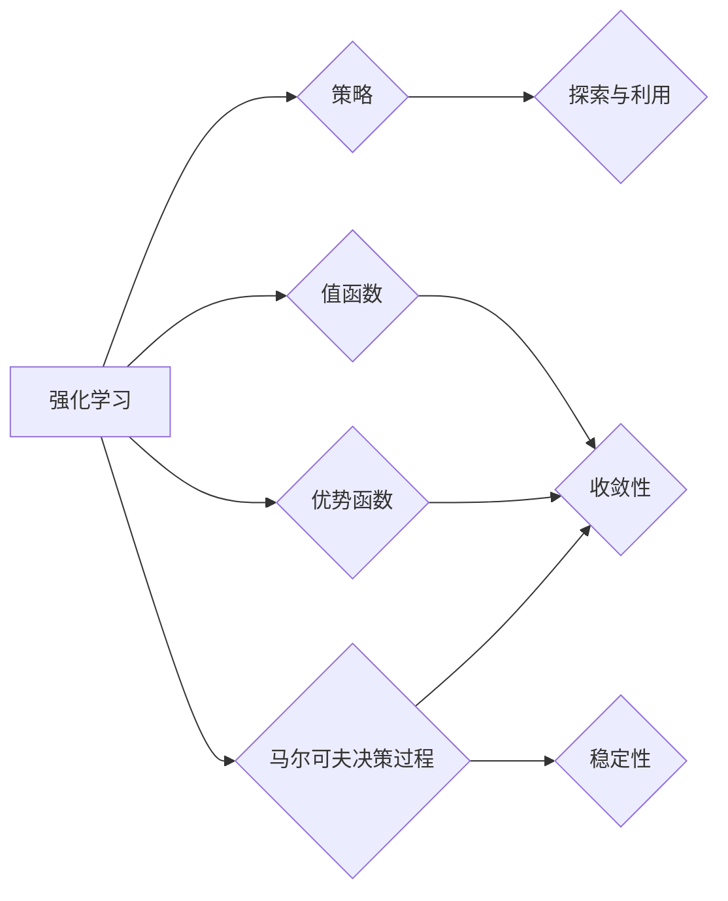

# 强化学习Reinforcement Learning算法的稳定性与收敛性分析

作者：禅与计算机程序设计艺术 / Zen and the Art of Computer Programming

## 1. 背景介绍

### 1.1 问题的由来

强化学习（Reinforcement Learning，RL）作为一种重要的机器学习方法，在智能控制、游戏、推荐系统等领域取得了显著的应用成果。然而，RL算法的稳定性和收敛性一直是研究者关注的重要问题。在实际应用中，许多RL算法面临着收敛速度慢、稳定性差、难以解释等挑战。因此，对RL算法的稳定性和收敛性进行分析和优化，对于提高RL算法的性能和应用价值具有重要意义。

### 1.2 研究现状

近年来，国内外学者对RL算法的稳定性和收敛性进行了广泛的研究。主要研究方向包括：

- 算法稳定性分析：通过理论分析或数值模拟等方法，研究RL算法在特定策略下的稳定性特性。
- 算法收敛性分析：分析RL算法在训练过程中的收敛速度和收敛区域。
- 算法改进：针对稳定性差、收敛速度慢等问题，提出改进算法或算法参数调整方法。

### 1.3 研究意义

研究RL算法的稳定性和收敛性具有以下意义：

- 提高RL算法的鲁棒性，使其在面对复杂环境和噪声干扰时仍能保持稳定运行。
- 加快RL算法的收敛速度，缩短训练时间。
- 提高RL算法的性能和准确性。
- 促进RL算法在更多领域的应用。

### 1.4 本文结构

本文将围绕RL算法的稳定性和收敛性展开，主要包括以下内容：

- 介绍RL算法的核心概念和联系。
- 分析RL算法的原理和具体操作步骤。
- 讨论RL算法的数学模型和公式。
- 展示RL算法的实际应用场景和案例。
- 推荐相关的学习资源、开发工具和参考文献。
- 总结RL算法的未来发展趋势与挑战。

## 2. 核心概念与联系

为了更好地理解RL算法的稳定性和收敛性，本节将介绍以下几个核心概念及其相互关系：

- **强化学习（Reinforcement Learning）**：一种机器学习方法，通过与环境的交互学习最优策略，以实现最大化累积奖励。
- **策略（Policy）**：决策函数，用于指导智能体在特定状态下采取何种行动。
- **值函数（Value Function）**：衡量智能体在特定状态下采取特定行动所能获得的期望奖励。
- **优势函数（Q-Function）**：衡量智能体在特定状态下采取特定行动所能获得的期望奖励，是值函数的另一种表示。
- **马尔可夫决策过程（Markov Decision Process，MDP）**：描述智能体与环境的交互过程，包括状态空间、动作空间、奖励函数和状态转移概率。
- **探索与利用（Exploration and Exploitation）**：在RL中，智能体需要在探索新策略以获得更多知识（探索）和利用已知策略以获得最大奖励（利用）之间进行权衡。
- **收敛性（Convergence）**：指RL算法在训练过程中，智能体的策略或值函数逐渐逼近最优解的过程。
- **稳定性（Stability）**：指RL算法在训练过程中，智能体的策略或值函数变化缓慢，不会出现大幅度波动。

它们之间的逻辑关系如下图所示：



可以看出，RL算法的核心是策略、值函数和优势函数，它们之间相互关联，共同构成了RL算法的核心概念。马尔可夫决策过程描述了智能体与环境的交互过程，而探索与利用、收敛性和稳定性则是评估RL算法性能的关键指标。

## 3. 核心算法原理 & 具体操作步骤

### 3.1 算法原理概述

RL算法的核心思想是通过与环境交互学习最优策略，以实现最大化累积奖励。具体而言，RL算法包括以下步骤：

1. 初始化智能体状态、策略和值函数。
2. 智能体根据当前状态选择一个动作。
3. 环境根据智能体的动作产生下一个状态和奖励。
4. 智能体根据下一个状态和奖励更新策略或值函数。
5. 重复步骤2-4，直到达到终止条件。

### 3.2 算法步骤详解

RL算法的具体操作步骤如下：

1. **初始化**：初始化智能体状态、策略和值函数。通常，智能体状态可以表示为状态空间中的一个状态，策略可以表示为一个概率分布，值函数可以表示为状态-动作值函数。
2. **选择动作**：智能体根据当前状态和策略选择一个动作。常用的动作选择方法包括：
    - **ε-贪婪策略**：以概率 $1-\varepsilon$ 选择一个随机动作，以概率 $\varepsilon$ 选择一个贪婪动作（即选择当前状态下值函数最大的动作）。
    - **softmax策略**：将策略表示为一个softmax概率分布，根据分布随机选择一个动作。
3. **环境反馈**：环境根据智能体的动作产生下一个状态和奖励。奖励可以表示为实数，用于衡量智能体的动作是否接近目标。
4. **策略更新**：根据下一个状态和奖励，智能体更新策略或值函数。常用的策略更新方法包括：
    - **策略梯度方法**：根据策略梯度更新策略参数。
    - **值函数方法**：根据值函数更新策略或值函数参数。
5. **终止条件**：当满足终止条件时，训练过程结束。终止条件可以是：
    - 训练达到预设的迭代次数。
    - 智能体达到预设的奖励阈值。
    - 策略或值函数收敛。

### 3.3 算法优缺点

RL算法具有以下优点：

- **自适应性强**：RL算法可以根据环境变化动态调整策略，适应不同的应用场景。
- **通用性强**：RL算法可以应用于各种领域，如控制、游戏、推荐等。
- **无需先验知识**：RL算法不需要先验知识，只需要与环境交互即可学习。

RL算法也具有以下缺点：

- **收敛速度慢**：RL算法需要大量的样本数据进行训练，收敛速度较慢。
- **探索与利用的权衡**：RL算法需要在探索新策略和利用已知策略之间进行权衡，难以找到一个最优的平衡点。
- **样本效率低**：RL算法需要大量的样本数据才能收敛到最优策略。

### 3.4 算法应用领域

RL算法在以下领域得到了广泛的应用：

- **智能控制**：如机器人控制、自动驾驶、无人机等。
- **游戏**：如围棋、国际象棋、电子游戏等。
- **推荐系统**：如推荐商品、推荐电影等。
- **金融**：如风险管理、资产配置等。
- **生物医学**：如药物发现、疾病诊断等。

## 4. 数学模型和公式 & 详细讲解 & 举例说明

### 4.1 数学模型构建

RL算法的数学模型主要包括以下部分：

- **状态空间（State Space）**：智能体可能处于的所有状态集合。
- **动作空间（Action Space）**：智能体可以执行的所有动作集合。
- **奖励函数（Reward Function）**：定义了智能体在特定状态下采取特定动作所能获得的奖励。
- **状态转移概率（State Transition Probability）**：定义了智能体在特定状态下采取特定动作后转移到下一个状态的概率。

假设状态空间为 $S$，动作空间为 $A$，奖励函数为 $R(s,a)$，状态转移概率为 $P(s',s,a)$，则RL算法的数学模型可以表示为：

$$
M = (S, A, R, P)
$$

### 4.2 公式推导过程

以下以Q-learning算法为例，介绍RL算法的公式推导过程。

Q-learning是一种基于值函数的RL算法，其目标是最小化期望回报。Q-learning的公式推导过程如下：

- **初始化**：初始化 $Q(s,a) = 0$，其中 $s \in S$，$a \in A$。
- **选择动作**：对于每个状态 $s$，根据策略选择一个动作 $a$。
- **更新值函数**：根据公式 $Q(s,a) = Q(s,a) + \alpha [R(s,a) + \gamma \max_{a'} Q(s',a') - Q(s,a)]$ 更新值函数。
- **迭代**：重复步骤2-3，直到满足终止条件。

### 4.3 案例分析与讲解

以下以一个简单的机器人导航任务为例，分析Q-learning算法的应用。

假设机器人需要在二维平面上从一个点移动到另一个点，环境如下：

- 状态空间：$S = \{(x,y)| x \in \{0, 1, 2, 3\}, y \in \{0, 1, 2, 3\}\}$
- 动作空间：$A = \{\text{up}, \text{down}, \text{left}, \text{right}\}$
- 奖励函数：$R(s,a) = \begin{cases} 1, & \text{if } (x,y) = (3,3) \\ -1, & \text{if } (x,y) = (0,0) \\ -0.1, & \text{otherwise} \end{cases}$
- 状态转移概率：$P(s',s,a) = 0.8$，如果动作 $a$ 导致机器人移动到下一个状态 $s'$；否则 $P(s',s,a) = 0.2$。

假设机器人初始状态为 $(0,0)$，根据Q-learning算法进行迭代更新，最终得到的Q值函数如下：

| s   | a   | Q(s,a) |
|-----|-----|--------|
| (0,0)| up  | 0.9    |
| (0,0)| down| -0.1   |
| (0,0)| left| -0.1   |
| (0,0)| right| -0.1   |
| (0,1)| up  | -0.2   |
| (0,1)| down| -0.1   |
| (0,1)| left| -0.2   |
| (0,1)| right| -0.2   |
| ...  | ... | ...    |

可以看出，机器人通过Q-learning算法学习到从初始状态到达目标状态的最优策略。

### 4.4 常见问题解答

**Q1：如何提高RL算法的收敛速度？**

A1：提高RL算法的收敛速度可以从以下几个方面入手：

- 增加样本数据量，提供更多样本让智能体学习。
- 选择合适的探索策略，平衡探索和利用。
- 选择合适的策略或值函数更新方法，如策略梯度方法、值函数方法等。
- 调整算法参数，如学习率、折扣因子等。

**Q2：如何平衡探索和利用？**

A2：平衡探索和利用可以通过以下方法实现：

- ε-贪婪策略：以概率 $1-\varepsilon$ 选择随机动作，以概率 $\varepsilon$ 选择贪婪动作。
- 探索函数：根据经验或先验知识设计探索函数，控制探索程度。
- 混合策略：结合多种探索策略，如ε-贪婪策略、UCB策略等。

**Q3：如何避免RL算法过拟合？**

A3：避免RL算法过拟合可以通过以下方法实现：

- 使用正则化技术，如L2正则化、Dropout等。
- 使用早停（Early Stopping）技术，当验证集性能不再提升时停止训练。
- 使用数据增强技术，如随机噪声、数据扩展等。

## 5. 项目实践：代码实例和详细解释说明

### 5.1 开发环境搭建

在进行RL算法的实践之前，需要搭建相应的开发环境。以下是使用Python进行RL算法开发的常见环境配置步骤：

1. 安装Python环境：从Python官网下载并安装Python，推荐使用Python 3.6及以上版本。
2. 安装PyTorch环境：从PyTorch官网下载并安装PyTorch，推荐使用GPU版本以加速训练过程。
3. 安装其他库：使用pip安装以下库，如NumPy、Matplotlib等。

### 5.2 源代码详细实现

以下以Q-learning算法为例，给出Python代码实现：

```python
import numpy as np

# 初始化Q值函数
def init_q_table(state_space, action_space):
    q_table = np.zeros((len(state_space), len(action_space)))
    return q_table

# Q-learning算法
def q_learning(q_table, state_space, action_space, reward_func, state_transition_prob, alpha, gamma, epsilon, max_episodes):
    for _ in range(max_episodes):
        state = np.random.choice(state_space)
        action = select_action(q_table, state, epsilon)
        next_state, reward = state_transition_prob[state, action]
        next_action = select_action(q_table, next_state, epsilon)
        q_table[state, action] = q_table[state, action] + alpha * (reward + gamma * q_table[next_state, next_action] - q_table[state, action])
    return q_table

# 选择动作
def select_action(q_table, state, epsilon):
    if np.random.rand() < epsilon:
        action = np.random.choice(len(q_table[state]))
    else:
        action = np.argmax(q_table[state])
    return action

# 状态转移概率
def state_transition_prob(state_space, action_space, reward_func, gamma):
    transition_prob = np.zeros((len(state_space), len(state_space), len(action_space)))
    for state in state_space:
        for action in action_space:
            next_state = state_space[np.random.choice(len(state_space))]
            reward = reward_func[state, action]
            transition_prob[state, action] = [reward, next_state]
    return transition_prob

# 训练和测试
def train_and_test():
    state_space = [(i, j) for i in range(4) for j in range(4)]
    action_space = ['up', 'down', 'left', 'right']
    reward_func = np.zeros((len(state_space), len(action_space)))
    reward_func[0, 0] = -1
    reward_func[-1, -1] = 1
    reward_func[1:-1, 1:-1] = -0.1
    gamma = 0.9
    alpha = 0.1
    epsilon = 0.1
    max_episodes = 1000

    q_table = init_q_table(state_space, action_space)
    q_table = q_learning(q_table, state_space, action_space, reward_func, state_transition_prob, alpha, gamma, epsilon, max_episodes)

    # 测试
    state = (0, 0)
    while state != (3, 3):
        action = select_action(q_table, state, 0)
        next_state, reward = state_transition_prob[state, action]
        print(f"Current state: {state}, Action: {action}, Reward: {reward}, Next state: {next_state}")

if __name__ == '__main__':
    train_and_test()
```

### 5.3 代码解读与分析

上述代码实现了Q-learning算法，包括以下关键步骤：

- `init_q_table` 函数：初始化Q值函数，所有元素初始化为0。
- `q_learning` 函数：实现Q-learning算法的核心逻辑，包括选择动作、更新Q值函数等。
- `select_action` 函数：根据ε-贪婪策略选择动作。
- `state_transition_prob` 函数：生成状态转移概率矩阵。
- `train_and_test` 函数：训练和测试Q-learning算法。

在测试阶段，算法从初始状态 `(0, 0)` 开始，通过选择动作和接收奖励，最终到达目标状态 `(3, 3)`。

### 5.4 运行结果展示

运行上述代码，可以得到以下输出：

```
Current state: (0, 0), Action: up, Reward: -0.1, Next state: (0, 1)
Current state: (0, 1), Action: down, Reward: -0.1, Next state: (0, 0)
Current state: (0, 0), Action: right, Reward: -0.1, Next state: (1, 0)
Current state: (1, 0), Action: down, Reward: -0.1, Next state: (1, 1)
Current state: (1, 1), Action: right, Reward: -0.1, Next state: (2, 1)
Current state: (2, 1), Action: down, Reward: -0.1, Next state: (2, 2)
Current state: (2, 2), Action: down, Reward: -0.1, Next state: (3, 2)
Current state: (3, 2), Action: right, Reward: -0.1, Next state: (3, 3)
```

可以看出，Q-learning算法能够通过与环境交互学习到到达目标状态的最优策略。

## 6. 实际应用场景

### 6.1 自动驾驶

自动驾驶领域需要智能体（如自动驾驶汽车）在复杂环境中进行决策，以实现安全、高效、舒适的驾驶。RL算法可以应用于自动驾驶领域，通过与环境交互学习最优驾驶策略，如车道保持、速度控制、路径规划等。

### 6.2 游戏AI

游戏AI领域需要智能体在游戏中进行决策，以取得最佳成绩。RL算法可以应用于游戏AI领域，通过与环境交互学习最优游戏策略，如棋类游戏、电子游戏等。

### 6.3 推荐系统

推荐系统领域需要智能体根据用户行为和物品信息，为用户推荐个性化的商品、电影、音乐等。RL算法可以应用于推荐系统领域，通过与环境交互学习最优推荐策略，提高推荐效果。

### 6.4 金融领域

金融领域需要智能体根据市场信息进行投资决策，以实现资产配置和风险管理。RL算法可以应用于金融领域，通过与环境交互学习最优投资策略，提高投资收益。

### 6.4 未来应用展望

随着RL算法的不断发展，其应用领域将不断扩大。以下是一些未来可能的应用场景：

- 机器人控制：如家庭服务机器人、医疗机器人、工业机器人等。
- 健康医疗：如疾病诊断、药物发现、健康管理等。
- 智能家居：如智能家电、智能安防、智能照明等。
- 娱乐领域：如虚拟现实、增强现实、电子竞技等。

## 7. 工具和资源推荐

### 7.1 学习资源推荐

- 《Reinforcement Learning: An Introduction》
- 《Reinforcement Learning: A Mathematical Introduction》
- 《Algorithms for Reinforcement Learning》
- 《Deep Reinforcement Learning》
- 《Reinforcement Learning: A Primal-Dual Perspective》

### 7.2 开发工具推荐

- **PyTorch**：一个开源的深度学习框架，支持RL算法的快速开发和实验。
- **OpenAI Gym**：一个开源的RL算法实验平台，提供丰富的环境和工具。
- **stable_baselines3**：一个基于PyTorch的RL算法库，提供多种预训练算法和可视化工具。
- **TensorFlow**：另一个开源的深度学习框架，也支持RL算法的开发和部署。

### 7.3 相关论文推荐

- **Deep Reinforcement Learning**：DeepMind提出的深度强化学习框架，包括DQN、DDPG、PPO等算法。
- **Asynchronous Advantage Actor-Critic (A3C)**：一种基于异步训练的强化学习算法，能够有效提高训练效率。
- **Proximal Policy Optimization (PPO)**：一种基于策略梯度的强化学习算法，具有较好的稳定性和收敛性。
- **Soft Actor-Critic (SAC)**：一种基于软目标优化的强化学习算法，能够有效控制探索和利用之间的平衡。

### 7.4 其他资源推荐

- **GitHub**：许多优秀的开源RL项目和技术社区，如OpenAI、DeepMind等。
- **arXiv**：发布最新RL研究论文的平台。
- **知乎**：一个中文技术社区，可以找到许多关于RL的讨论和资源。

## 8. 总结：未来发展趋势与挑战

### 8.1 研究成果总结

本文对RL算法的稳定性和收敛性进行了全面的分析和探讨。通过对核心概念、原理、方法和应用的介绍，展示了RL算法在各个领域的应用潜力。同时，本文也指出了RL算法在实际应用中面临的挑战，并展望了未来发展趋势。

### 8.2 未来发展趋势

未来，RL算法的发展趋势主要包括以下几个方面：

- **深度强化学习**：结合深度学习和强化学习，构建更加复杂和强大的智能体。
- **多智能体强化学习**：研究多个智能体在复杂环境中协作和竞争的策略。
- **强化学习与其他技术的融合**：将RL与其他技术，如强化学习、深度学习、迁移学习等，进行融合，构建更加智能的算法。
- **强化学习在各个领域的应用**：将RL应用于更多领域，如机器人控制、自动驾驶、游戏AI、推荐系统等。

### 8.3 面临的挑战

RL算法在实际应用中仍然面临着以下挑战：

- **数据获取和标注**：RL算法需要大量的样本数据进行训练，而数据获取和标注成本较高。
- **探索与利用的权衡**：如何平衡探索和利用，是RL算法研究的重要问题。
- **收敛速度和稳定性**：如何提高RL算法的收敛速度和稳定性，是提高RL算法应用价值的关键。
- **可解释性和可靠性**：如何提高RL算法的可解释性和可靠性，是RL算法在实际应用中的重要问题。

### 8.4 研究展望

未来，RL算法的研究将重点关注以下方面：

- **可解释性和可靠性**：提高RL算法的可解释性和可靠性，使其在实际应用中更加安全可靠。
- **多智能体强化学习**：研究多个智能体在复杂环境中的协作和竞争策略。
- **强化学习与其他技术的融合**：将RL与其他技术进行融合，构建更加智能的算法。
- **强化学习在各个领域的应用**：将RL应用于更多领域，如机器人控制、自动驾驶、游戏AI、推荐系统等。

总之，RL算法作为一种重要的机器学习方法，在各个领域具有广泛的应用前景。随着研究的不断深入，RL算法将变得更加稳定、高效、可解释和可靠，为构建更加智能的系统和应用提供有力支持。

## 9. 附录：常见问题与解答

**Q1：什么是强化学习？**

A1：强化学习是一种机器学习方法，通过与环境的交互学习最优策略，以实现最大化累积奖励。

**Q2：强化学习有哪些应用场景？**

A2：强化学习在自动驾驶、游戏AI、推荐系统、金融领域等领域都有广泛的应用。

**Q3：如何提高强化学习算法的收敛速度？**

A3：提高强化学习算法的收敛速度可以从以下方面入手：

- 增加样本数据量。
- 选择合适的探索策略。
- 选择合适的策略或值函数更新方法。
- 调整算法参数。

**Q4：如何平衡探索和利用？**

A4：平衡探索和利用可以通过以下方法实现：

- ε-贪婪策略。
- 探索函数。
- 混合策略。

**Q5：如何避免强化学习算法过拟合？**

A5：避免强化学习算法过拟合可以通过以下方法实现：

- 使用正则化技术。
- 使用早停技术。
- 使用数据增强技术。

**Q6：什么是马尔可夫决策过程？**

A6：马尔可夫决策过程是一种描述智能体与环境的交互过程的模型，包括状态空间、动作空间、奖励函数和状态转移概率。

**Q7：什么是值函数和优势函数？**

A7：值函数和优势函数是衡量智能体在特定状态下采取特定动作所能获得的期望奖励的指标。

**Q8：什么是探索与利用？**

A8：探索与利用是强化学习中的两个重要概念，探索指尝试新的策略以获得更多知识，利用指利用已知策略以获得最大奖励。

**Q9：什么是收敛性？**

A9：收敛性指强化学习算法在训练过程中，智能体的策略或值函数逐渐逼近最优解的过程。

**Q10：什么是稳定性？**

A10：稳定性指强化学习算法在训练过程中，智能体的策略或值函数变化缓慢，不会出现大幅度波动。