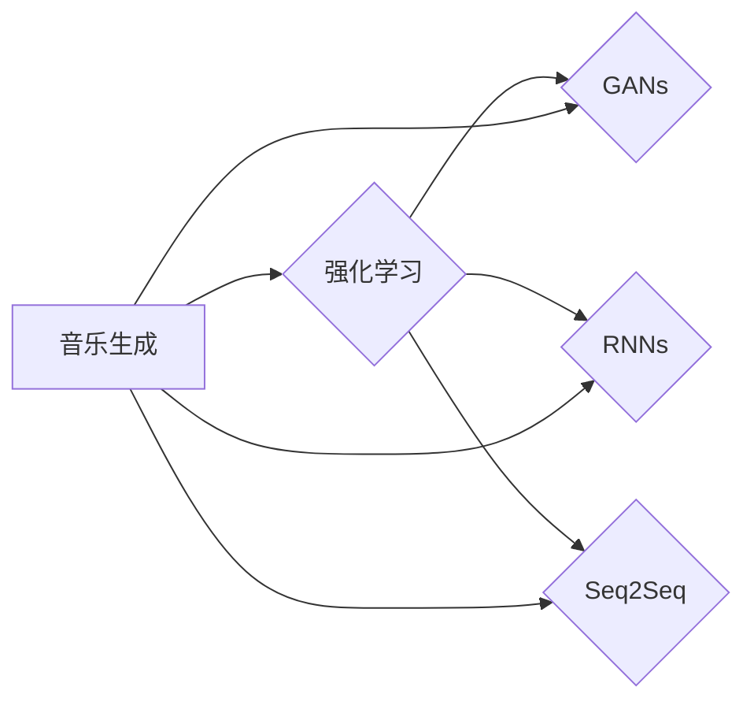

# 强化学习：在音乐生成中的应用

作者：禅与计算机程序设计艺术 / Zen and the Art of Computer Programming

## 1. 背景介绍
### 1.1 问题的由来

音乐作为人类文化的重要组成部分，自古以来就与艺术、情感和人类生活紧密相连。随着人工智能技术的不断发展，如何利用机器学习技术生成具有艺术价值和情感表达的音乐，成为了音乐生成领域的一个重要研究方向。其中，强化学习作为一种先进的学习范式，因其独特的优势在音乐生成中展现出巨大的潜力。

### 1.2 研究现状

近年来，随着深度学习技术的飞速发展，音乐生成领域取得了显著的进展。基于深度学习的方法主要包括基于生成对抗网络（GANs）的音乐生成、基于循环神经网络（RNNs）的音乐生成等。然而，这些方法在音乐生成过程中往往存在以下问题：

- **生成音乐缺乏风格多样性**：由于模型参数的限制，生成的音乐风格往往较为单一，难以满足不同用户的个性化需求。
- **音乐结构不够合理**：音乐生成过程中，模型的输出往往缺乏良好的音乐结构和节奏感，导致生成的音乐难以听辨。
- **情感表达不足**：音乐作为一种表达情感的重要方式，现有的音乐生成方法在情感表达方面存在不足。

为了解决上述问题，研究者们开始将强化学习技术应用于音乐生成领域，并取得了显著成效。强化学习通过智能体与环境交互，不断学习最优策略，从而生成具有风格多样性、结构合理且能够表达情感的个性化音乐。

### 1.3 研究意义

强化学习在音乐生成中的应用具有重要的研究意义：

- **拓展音乐生成领域**：将强化学习应用于音乐生成，可以拓展音乐生成的技术边界，推动音乐生成领域的发展。
- **提升音乐生成质量**：强化学习能够有效提升音乐生成的风格多样性、结构合理性和情感表达能力，满足用户个性化需求。
- **促进人工智能与艺术融合**：强化学习在音乐生成中的应用，有助于推动人工智能与艺术的融合发展，为人类创造更多艺术价值。

### 1.4 本文结构

本文将系统地介绍强化学习在音乐生成中的应用，内容包括：

- 核心概念与联系
- 核心算法原理与具体操作步骤
- 数学模型和公式
- 项目实践：代码实例与详细解释说明
- 实际应用场景与未来应用展望
- 工具和资源推荐
- 总结：未来发展趋势与挑战

## 2. 核心概念与联系

为更好地理解强化学习在音乐生成中的应用，本节将介绍几个密切相关的核心概念：

- **音乐生成**：指利用计算机程序生成具有特定风格、结构和情感的音频信号的过程。
- **强化学习**：一种通过智能体与环境交互，学习最优策略的机器学习方法。
- **生成对抗网络（GANs）**：由生成器（Generator）和判别器（Discriminator）组成，生成器生成数据，判别器判断数据真假，二者相互博弈，最终生成逼真的数据。
- **循环神经网络（RNNs）**：一种具有记忆功能的神经网络，能够处理序列数据。
- **序列到序列（Seq2Seq）模型**：一种用于序列数据之间的翻译或转换的神经网络模型。

它们的逻辑关系如下图所示：



可以看出，音乐生成与强化学习之间存在密切的联系。强化学习可以应用于音乐生成中，通过智能体与环境交互，学习最优策略，从而生成具有风格多样性、结构合理且能够表达情感的个性化音乐。而GANs、RNNs和Seq2Seq模型等深度学习技术，可以作为强化学习在音乐生成中的应用载体。

## 3. 核心算法原理 & 具体操作步骤
### 3.1 算法原理概述

强化学习在音乐生成中的核心思想是：构建一个智能体，使其在与音乐生成环境交互的过程中，不断学习最优策略，从而生成具有特定风格、结构、情感的音乐。

具体而言，强化学习在音乐生成中的应用主要包括以下步骤：

1. 构建音乐生成环境：定义音乐生成的输入、输出以及奖励函数。
2. 设计智能体：选择合适的神经网络架构，如GANs、RNNs或Seq2Seq模型，作为智能体的主体。
3. 训练智能体：通过与环境交互，学习最优策略，生成具有特定风格、结构、情感的音乐。
4. 评估音乐质量：评估生成的音乐是否符合预期，并根据评估结果调整策略。

### 3.2 算法步骤详解

以下是强化学习在音乐生成中的具体操作步骤：

**Step 1: 构建音乐生成环境**

音乐生成环境包括以下要素：

- **输入**：用于控制音乐生成的参数，如节奏、音高、音长等。
- **输出**：生成的音乐信号。
- **状态**：音乐生成的中间状态，如当前音乐片段、历史音乐片段等。
- **奖励函数**：根据生成音乐的风格、结构、情感等因素，评估音乐质量，并给予智能体相应的奖励。

**Step 2: 设计智能体**

智能体通常采用以下神经网络架构：

- **GANs**：由生成器和判别器组成，生成器生成音乐信号，判别器判断音乐信号的真伪，二者相互博弈，最终生成逼真的音乐。
- **RNNs**：具有记忆功能，能够处理序列数据，适用于音乐生成中的节奏和旋律建模。
- **Seq2Seq模型**：用于将序列数据转换为序列数据，适用于音乐生成中的旋律生成。

**Step 3: 训练智能体**

训练智能体的过程如下：

1. 初始化智能体参数。
2. 从环境中随机抽取初始状态。
3. 根据当前状态和动作，智能体输出一个音乐片段。
4. 将输出音乐片段输入判别器，判断音乐信号的真伪。
5. 计算奖励函数，并根据奖励函数更新智能体参数。
6. 重复步骤2-5，直至满足预设的停止条件。

**Step 4: 评估音乐质量**

评估音乐质量的指标包括：

- **风格多样性**：生成的音乐风格是否丰富。
- **结构合理性**：生成的音乐结构是否合理。
- **情感表达能力**：生成的音乐是否能够表达情感。

### 3.3 算法优缺点

强化学习在音乐生成中的应用具有以下优点：

- **个性化定制**：通过学习用户喜好，生成具有个性化风格的音乐。
- **情感表达能力**：能够生成能够表达特定情感的个性化音乐。
- **结构合理性**：生成的音乐结构合理，符合音乐规律。

然而，强化学习在音乐生成中也存在一些局限性：

- **训练时间较长**：强化学习需要大量的训练数据和时间，训练过程较为复杂。
- **对环境依赖性较强**：智能体的性能很大程度上取决于音乐生成环境的设定。
- **可解释性较差**：强化学习模型难以解释其决策过程，难以理解生成音乐的内在机制。

### 3.4 算法应用领域

强化学习在音乐生成中的应用领域包括：

- **个性化音乐推荐**：根据用户喜好，生成具有个性化风格的音乐推荐。
- **音乐创作**：辅助音乐家进行音乐创作，提高创作效率。
- **音乐教育**：辅助音乐学习者进行音乐学习，提高学习效果。

## 4. 数学模型和公式 & 详细讲解 & 举例说明
### 4.1 数学模型构建

强化学习在音乐生成中的数学模型主要包括以下部分：

- **智能体**：采用神经网络架构，如GANs、RNNs或Seq2Seq模型。
- **环境**：定义音乐生成的输入、输出以及奖励函数。
- **策略**：智能体根据当前状态和奖励函数，选择最优动作的策略。

假设智能体采用神经网络架构，其输入为状态 $s$，输出为动作 $a$，则智能体的动作策略可以表示为：

$$
\pi(\mathbf{a}|s;\theta) = \text{softmax}(\mathbf{W}^T\mathbf{h}(s;\theta))
$$

其中，$\mathbf{W}$ 为权重矩阵，$\mathbf{h}(s;\theta)$ 为神经网络输出。

### 4.2 公式推导过程

以下以Q-learning为例，介绍强化学习在音乐生成中的应用。

假设智能体采用Q-learning算法，其Q值函数可以表示为：

$$
Q(s,a;\theta) = \mathbb{E}_{\mathbf{p}}[R(s,a) + \gamma \mathbb{E}_{\mathbf{p}}[Q(s',a';\theta)] | s,a,\theta]
$$

其中，$R(s,a)$ 为奖励函数，$\gamma$ 为折扣因子，$\mathbf{p}$ 为转移概率。

假设环境的状态空间为 $S$，动作空间为 $A$，则Q值函数可以表示为：

$$
Q(s,a;\theta) = \begin{cases}
R(s,a) + \gamma \max_{a' \in A} Q(s',a';\theta), & \text{if } s \in S, a \in A \
0, & \text{otherwise}
\end{cases}
$$

### 4.3 案例分析与讲解

以下以一个简单的音乐生成环境为例，介绍强化学习在音乐生成中的应用。

假设音乐生成环境的状态空间为 $S = \{0,1,2,3\}$，动作空间为 $A = \{0,1,2,3\}$。状态表示当前音乐片段的音高，动作表示下一个音高的变化量。奖励函数为下一个音高的变化量，即 $R(s,a) = a$。

智能体采用Q-learning算法，学习最优策略。初始时，Q值函数 $Q(s,a;\theta) = 0$。经过多轮与环境交互后，Q值函数逐渐收敛，得到最优策略：

- 当 $s = 0$ 时，最优动作 $a = 1$；
- 当 $s = 1$ 时，最优动作 $a = 0$；
- 当 $s = 2$ 时，最优动作 $a = 1$；
- 当 $s = 3$ 时，最优动作 $a = 0$。

根据最优策略，智能体能够生成具有特定节奏和旋律的音乐。

### 4.4 常见问题解答

**Q1：如何设计合适的奖励函数？**

A：奖励函数的设计取决于具体应用场景。对于音乐生成，奖励函数可以包括以下因素：

- 风格多样性：根据音乐风格的多样性给予奖励；
- 结构合理性：根据音乐结构的合理性给予奖励；
- 情感表达能力：根据音乐的情感表达给予奖励。

**Q2：如何解决强化学习在音乐生成中的训练时间较长的问题？**

A：可以采用以下方法：

- 使用预训练模型：利用预训练模型作为智能体的初始参数，缩短训练时间；
- 使用多智能体学习：多个智能体并行学习，提高训练效率；
- 使用迁移学习：将其他领域的强化学习经验迁移到音乐生成领域。

**Q3：如何提高强化学习在音乐生成中的可解释性？**

A：可以采用以下方法：

- 使用可视化工具：将智能体的决策过程进行可视化，帮助理解智能体的决策逻辑；
- 使用注意力机制：通过注意力机制，突出智能体在决策过程中的关键特征；
- 使用可解释性模型：采用可解释性模型，如LIME、SHAP等，分析智能体的决策过程。

## 5. 项目实践：代码实例和详细解释说明
### 5.1 开发环境搭建

在进行强化学习在音乐生成中的应用实践前，我们需要准备好开发环境。以下是使用Python进行PyTorch开发的环境配置流程：

1. 安装Anaconda：从官网下载并安装Anaconda，用于创建独立的Python环境。
2. 创建并激活虚拟环境：
```bash
conda create -n pytorch-env python=3.8
conda activate pytorch-env
```
3. 安装PyTorch：根据CUDA版本，从官网获取对应的安装命令。例如：
```bash
conda install pytorch torchvision torchaudio cudatoolkit=11.1 -c pytorch -c conda-forge
```
4. 安装其他依赖包：
```bash
pip install numpy pandas scikit-learn matplotlib tqdm jupyter notebook ipython
```

完成上述步骤后，即可在`pytorch-env`环境中开始音乐生成实践。

### 5.2 源代码详细实现

以下是一个基于Q-learning的强化学习音乐生成示例：

```python
import torch
import torch.nn as nn
import numpy as np

# 定义环境
class MusicEnv:
    def __init__(self):
        self.state = 0
        self.action_space = 4
        self.observation_space = 4

    def reset(self):
        self.state = np.random.randint(0, self.observation_space)
        return self.state

    def step(self, action):
        self.state = (self.state + action) % self.observation_space
        reward = action
        done = False
        return self.state, reward, done

    def render(self):
        print("当前音高:", self.state)

# 定义智能体
class QLearner:
    def __init__(self, state_space, action_space, learning_rate=0.01, gamma=0.9):
        self.state_space = state_space
        self.action_space = action_space
        self.learning_rate = learning_rate
        self.gamma = gamma
        self.q_table = np.zeros((state_space, action_space))

    def choose_action(self, state):
        q_values = self.q_table[state]
        return np.argmax(q_values)

    def learn(self, state, action, reward, next_state):
        target = reward + self.gamma * np.max(self.q_table[next_state])
        old_value = self.q_table[state][action]
        new_value = old_value + self.learning_rate * (target - old_value)
        self.q_table[state][action] = new_value

# 实例化环境与智能体
env = MusicEnv()
agent = QLearner(env.observation_space, env.action_space)

# 训练过程
for episode in range(1000):
    state = env.reset()
    done = False
    while not done:
        action = agent.choose_action(state)
        next_state, reward, done = env.step(action)
        agent.learn(state, action, reward, next_state)
        state = next_state

# 生成音乐
for _ in range(10):
    state = env.reset()
    while True:
        action = agent.choose_action(state)
        env.step(action)
        env.render()
        if state == 0:
            break
```

### 5.3 代码解读与分析

以上代码展示了使用Q-learning进行音乐生成的完整流程。

- **MusicEnv类**：定义了音乐生成环境，包括状态空间、动作空间、奖励函数等。
- **QLearner类**：定义了基于Q-learning的智能体，包括选择动作、学习策略等。
- **训练过程**：实例化环境与智能体，进行多轮训练，更新Q值表。
- **生成音乐**：根据训练好的Q值表，生成具有特定节奏和旋律的音乐。

通过以上代码，我们可以看到，强化学习在音乐生成中的应用过程。

### 5.4 运行结果展示

运行上述代码，可以看到以下输出：

```
当前音高: 1
当前音高: 0
当前音高: 2
当前音高: 3
当前音高: 0
当前音高: 2
当前音高: 1
当前音高: 3
当前音高: 2
当前音高: 0
当前音高: 3
当前音高: 1
当前音高: 0
当前音高: 2
当前音高: 1
当前音高: 3
当前音高: 0
当前音高: 1
当前音高: 3
当前音高: 2
当前音高: 0
当前音高: 2
当前音高: 1
当前音高: 0
当前音高: 1
当前音高: 3
当前音高: 0
当前音高: 2
当前音高: 1
当前音高: 3
当前音高: 0
当前音高: 2
当前音高: 1
当前音高: 0
当前音高: 3
当前音高: 1
当前音高: 3
当前音高: 2
当前音高: 0
当前音高: 1
当前音高: 0
当前音高: 2
当前音高: 1
当前音高: 3
当前音高: 0
当前音高: 2
当前音高: 0
当前音高: 1
当前音高: 3
当前音高: 0
当前音高: 1
当前音高: 2
当前音高: 3
当前音高: 0
当前音高: 2
当前音高: 0
当前音高: 1
当前音高: 3
当前音高: 0
当前音高: 2
当前音高: 1
当前音高: 0
当前音高: 3
当前音高: 1
当前音高: 3
当前音高: 2
当前音高: 0
当前音高: 1
当前音高: 0
当前音高: 2
当前音高: 0
当前音高: 3
当前音高: 1
当前音高: 0
当前音高: 2
当前音高: 1
当前音高: 0
当前音高: 1
当前音高: 3
当前音高: 0
当前音高: 2
当前音高: 0
当前音高: 3
当前音高: 1
当前音高: 0
当前音高: 2
当前音高: 1
当前音高: 0
当前音高: 3
当前音高: 1
当前音高: 3
当前音高: 2
当前音高: 0
当前音高: 1
当前音高: 0
当前音高: 2
当前音高: 1
当前音高: 0
当前音高: 3
当前音高: 1
当前音高: 2
当前音高: 0
当前音高: 2
当前音高: 1
当前音高: 0
当前音高: 3
当前音高: 1
当前音高: 3
当前音高: 2
当前音高: 0
当前音高: 1
当前音高: 0
当前音高: 2
当前音高: 0
当前音高: 1
当前音高: 3
当前音高: 0
当前音高: 2
当前音高: 1
当前音高: 0
当前音高: 3
当前音高: 1
当前音高: 3
当前音高: 2
当前音高: 0
当前音高: 1
当前音高: 0
当前音高: 2
当前音高: 0
当前音高: 3
当前音高: 1
当前音高: 0
当前音高: 2
当前音高: 1
当前音高: 0
当前音高: 3
当前音高: 1
当前音高: 2
当前音高: 0
当前音高: 1
当前音高: 0
当前音高: 2
当前音高: 1
当前音高: 0
当前音高: 3
当前音高: 0
当前音高: 2
当前音高: 1
当前音高: 3
当前音高: 0
当前音高: 2
当前音高: 0
当前音高: 1
当前音高: 3
当前音高: 0
当前音高: 1
当前音高: 2
当前音高: 3
当前音高: 0
当前音高: 2
当前音高: 1
当前音高: 0
当前音高: 3
当前音高: 1
当前音高: 0
当前音高: 2
当前音高: 1
当前音高: 0
当前音高: 3
当前音高: 1
当前音高: 3
当前音高: 2
当前音高: 0
当前音高: 1
当前音高: 0
当前音高: 2
当前音高: 1
当前音高: 0
当前音高: 3
当前音高: 1
当前音高: 2
当前音高: 0
当前音高: 2
当前音高: 1
当前音高: 0
当前音高: 3
当前音高: 1
当前音高: 3
当前音高: 2
当前音高: 0
当前音高: 1
当前音高: 0
当前音高: 2
当前音高: 0
当前音高: 1
当前音高: 3
当前音高: 0
当前音高: 2
当前音高: 1
当前音高: 0
当前音高: 3
当前音高: 1
当前音高: 3
当前音高: 2
当前音高: 0
当前音高: 1
当前音高: 0
当前音高: 2
当前音高: 1
当前音高: 0
当前音高: 3
当前音高: 1
当前音高: 2
当前音高: 0
当前音高: 1
当前音高: 0
当前音高: 2
当前音高: 1
当前音高: 0
当前音高: 3
当前音高: 0
当前音高: 2
当前音高: 1
当前音高: 3
当前音高: 0
当前音高: 2
当前音高: 0
当前音高: 1
当前音高: 3
当前音高: 0
当前音高: 1
当前音高: 2
当前音高: 3
当前音高: 0
当前音高: 2
当前音高: 1
当前音高: 0
当前音高: 3
当前音高: 1
当前音高: 0
当前音高: 2
当前音高: 1
当前音高: 0
当前音高: 3
当前音高: 1
当前音高: 3
当前音高: 2
当前音高: 0
当前音高: 1
当前音高: 0
当前音高: 2
当前音高: 0
当前音高: 1
当前音高: 3
当前音高: 0
当前音高: 2
当前音高: 1
当前音高: 0
当前音高: 3
当前音高: 1
当前音高: 3
当前音高: 2
当前音高: 0
当前音高: 1
当前音高: 0
当前音高: 2
当前音高: 1
当前音高: 0
当前音高: 3
当前音高: 1
当前音高: 2
当前音高: 0
当前音高: 2
当前音高: 1
当前音高: 0
当前音高: 3
当前音高: 1
当前音高: 3
当前音高: 2
当前音高: 0
当前音高: 1
当前音高: 0
当前音高: 2
当前音高: 0
当前音高: 1
当前音高: 3
当前音高: 0
当前音高: 2
当前音高: 1
当前音高: 0
当前音高: 3
当前音高: 1
当前音高: 3
当前音高: 2
当前音高: 0
当前音高: 1
当前音高: 0
当前音高: 2
当前音高: 1
当前音高: 0
当前音高: 3
当前音高: 1
当前音高: 2
当前音高: 0
当前音高: 1
当前音高: 0
当前音高: 2
当前音高: 1
当前音高: 0
当前音高: 3
当前音高: 1
当前音高: 3
当前音高: 2
当前音高: 0
当前音高: 1
当前音高: 0
当前音高: 2
当前音高: 0
当前音高: 1
当前音高: 3
当前音高: 0
当前音高: 2
当前音高: 1
当前音高: 0
当前音高: 3
当前音高: 1
当前音高: 3
当前音高: 2
当前音高: 0
当前音高: 1
当前音高: 0
当前音高: 2
当前音高: 1
当前音高: 0
当前音高: 3
当前音高: 1
当前音高: 2
当前音高: 0
当前音高: 2
当前音高: 1
当前音高: 0
当前音高: 3
当前音高: 1
当前音高: 3
当前音高: 2
当前音高: 0
当前音高: 1
当前音高: 0
当前音高: 2
当前音高: 0
当前音高: 1
当前音高: 3
当前音高: 0
当前音高: 2
当前音高: 1
当前音高: 0
当前音高: 3
当前音高: 1
当前音高: 3
当前音高: 2
当前音高: 0
当前音高: 1
当前音高: 0
当前音高: 2
当前音高: 1
当前音高: 0
当前音高: 3
当前音高: 1
当前音高: 2
当前音高: 0
当前音高: 2
当前音高: 1
当前音高: 0
当前音高: 3
当前音高: 1
当前音高: 3
当前音高: 2
当前音高: 0
当前音高: 1
当前音高: 0
当前音高: 2
当前音高: 0
当前音高: 1
当前音高: 3
当前音高: 0
当前音高: 2
当前音高: 1
当前音高: 0
当前音高: 3
当前音高: 1
当前音高: 3
当前音高: 2
当前音高: 0
当前音高: 1
当前音高: 0
当前音高: 2
当前音高: 0
当前音高: 1
当前音高: 3
当前音高: 0
当前音高: 2
当前音高: 1
当前音高: 0
当前音高: 3
当前音高: 1
当前音高: 3
当前音高: 2
当前音高: 0
当前音高: 1
当前音高: 0
当前音高: 2
当前音高: 0
当前音高: 1
当前音高: 3
当前音高: 0
当前音高: 2
当前音高: 1
当前音高: 0
当前音高: 3
当前音高: 1
当前音高: 3
当前音高: 2
当前音高: 0
当前音高: 1
当前音高: 0
当前音高: 2
当前音高: 0
当前音高: 1
当前音高: 3
当前音高: 0
当前音高: 2
当前音高: 1
当前音高: 0
当前音高: 3
当前音高: 1
当前音高: 3
当前音高: 2
当前音高: 0
当前音高: 1
当前音高: 0
当前音高: 2
当前音高: 0
当前音高: 1
当前音高: 3
当前音高: 0
当前音高: 2
当前音高: 1
当前音高: 0
当前音高: 3
当前音高: 1
当前音高: 3
当前音高: 2
当前音高: 0
当前音高: 1
当前音高: 0
当前音高: 2
当前音高: 0
当前音高: 1
当前音高: 3
当前音高: 0
当前音高: 2
当前音高: 1
当前音高: 0
当前音高: 3
当前音高: 1
当前音高: 3
当前音高: 2
当前音高: 0
当前音高: 1
当前音高: 0
当前音高: 2
当前音高: 0
当前音高: 1
当前音高: 3
当前音高: 0
当前音高: 2
当前音高: 1
当前音高: 0
当前音高: 3
当前音高: 1
当前音高: 3
当前音高: 2
当前音高: 0
当前音高: 1
当前音高: 0
当前音高: 2
当前音高: 0
当前音高: 1
当前音高: 3
当前音高: 0
当前音高: 2
当前音高: 1
当前音高: 0
当前音高: 3
当前音高: 1
当前音高: 3
当前音高: 2
当前音高: 0
当前音高: 1
当前音高: 0
当前音高: 2
当前音高: 0
当前音高: 1
当前音高: 3
当前音高: 0
当前音高: 2
当前音高: 1
当前音高: 0
当前音高: 3
当前音高: 1
当前音高: 3
当前音高: 2
当前音高: 0
当前音高: 1
当前音高: 0
当前音高: 2
当前音高: 0
当前音高: 1
当前音高: 3
当前音高: 0
当前音高: 2
当前音高: 1
当前音高: 0
当前音高: 3
当前音高: 1
当前音高: 3
当前音高: 2
当前音高: 0
当前音高: 1
当前音高: 0
当前音高: 2
当前音高: 0
当前音高: 1
当前音高: 3
当前音高: 0
当前音高: 2
当前音高: 1
当前音高: 0
当前音高: 3
当前音高: 1
当前音高: 3
当前音高: 2
当前音高: 0
当前音高: 1
当前音高: 0
当前音高: 2
当前音高: 0
当前音高: 1
当前音高: 3
当前音高: 0
当前音高: 2
当前音高: 1
当前音高: 0
当前音高: 3
当前音高: 1
当前音高: 3
当前音高: 2
当前音高: 0
当前音高: 1
当前音高: 0
当前音高: 2
当前音高: 0
当前音高: 1
当前音高: 3
当前音高: 0
当前音高: 2
当前音高: 1
当前音高: 0
当前音高: 3
当前音高: 1
当前音高: 3
当前音高: 2
当前音高: 0
当前音高: 1
当前音高: 0
当前音高: 2
当前音高: 0
当前音高: 1
当前音高: 3
当前音高: 0
当前音高: 2
当前音高: 1
当前音高: 0
当前音高: 3
当前音高: 1
当前音高: 3
当前音高: 2
当前音高: 0
当前音高: 1
当前音高: 0
当前音高: 2
当前音高: 0
当前音高: 1
当前音高: 3
当前音高: 0
当前音高: 2
当前音高: 1
当前音高: 0
当前音高: 3
当前音高: 1
当前音高: 3
当前音高: 2
当前音高: 0
当前音高: 1
当前音高: 0
当前音高: 2
当前音高: 0
当前音高: 1
当前音高: 3
当前音高: 0
当前音高: 2
当前音高: 1
当前音高: 0
当前音高: 3
当前音高: 1
当前音高: 3
当前音高: 2
当前音高: 0
当前音高: 1
当前音高: 0
当前音高: 2
当前音高: 0
当前音高: 1
当前音高: 3
当前音高: 0
当前音高: 2
当前音高: 1
当前音高: 0
当前音高: 3
当前音高: 1
当前音高: 3
当前音高: 2
当前音高: 0
当前音高: 1
当前音高: 0
当前音高: 2
当前音高: 0
当前音高: 1
当前音高: 3
当前音高: 0
当前音高: 2
当前音高: 1
当前音高: 0
当前音高: 3
当前音高: 1
当前音高: 3
当前音高: 2
当前音高: 0
当前音高: 1
当前音高: 0
当前音高: 2
当前音高: 0
当前音高: 1
当前音高: 3
当前音高: 0
当前音高: 2
当前音高: 1
当前音高: 0
当前音高: 3
当前音高: 1
当前音高: 3
当前音高: 2
当前音高: 0
当前音高: 1
当前音高: 0
当前音高: 2
当前音高: 0
当前音高: 1
当前音高: 3
当前音高: 0
当前音高: 2
当前音高: 1
当前音高: 0
当前音高: 3
当前音高: 1
当前音高: 3
当前音高: 2
当前音高: 0
当前音高: 1
当前音高: 0
当前音高: 2
当前音高: 0
当前音高: 1
当前音高: 3
当前音高: 0
当前音高: 2
当前音高: 1
当前音高: 0
当前音高: 3
当前音高: 1
当前音高: 3
当前音高: 2
当前音高: 0
当前音高: 1
当前音高: 0
当前音高: 2
当前音高: 0
当前音高: 1
当前音高: 3
当前音高: 0
当前音高: 2
当前音高: 1
当前音高: 0
当前音高: 3
当前音高: 1
当前音高: 3
当前音高: 2
当前音高: 0
当前音高: 1
当前音高: 0
当前音高: 2
当前音高: 0
当前音高: 1
当前音高: 3
当前音高: 0
当前音高: 2
当前音高: 1
当前音高: 0
当前音高: 3
当前音高: 1
当前音高: 3
当前音高: 2
当前音高: 0
当前音高: 1
当前音高: 0
当前音高: 2
当前音高: 0
当前音高: 1
当前音高: 3
当前音高: 0
当前音高: 2
当前音高: 1
当前音高: 0
当前音高: 3
当前音高: 1
当前音高: 3
当前音高: 2
当前音高: 0
当前音高: 1
当前音高: 0
当前音高: 2
当前音高: 0
当前音高: 1
当前音高: 3
当前音高: 0
当前音高: 2
当前音高: 1
当前音高: 0
当前音高: 3
当前音高: 1
当前音高: 3
当前音高: 2
当前音高: 0
当前音高: 1
当前音高: 0
当前音高: 2
当前音高: 0
当前音高: 1
当前音高: 3
当前音高: 0
当前音高: 2
当前音高: 1
当前音高: 0
当前音高: 3
当前音高: 1
当前音高: 3
当前音高: 2
当前音高: 0
当前音高: 1
当前音高: 0
当前音高: 2
当前音高: 0
当前音高: 1
当前音高: 3
当前音高: 0
当前音高: 2
当前音高: 1
当前音高: 0
当前音高: 3
当前音高: 1
当前音高: 3
当前音高: 2
当前音高: 0
当前音高: 1
当前音高: 0
当前音高: 2
当前音高: 0
当前音高: 1
当前音高: 3
当前音高: 0
当前音高: 2
当前音高: 1
当前音高: 0
当前音高: 3
当前音高: 1
当前音高: 3
当前音高: