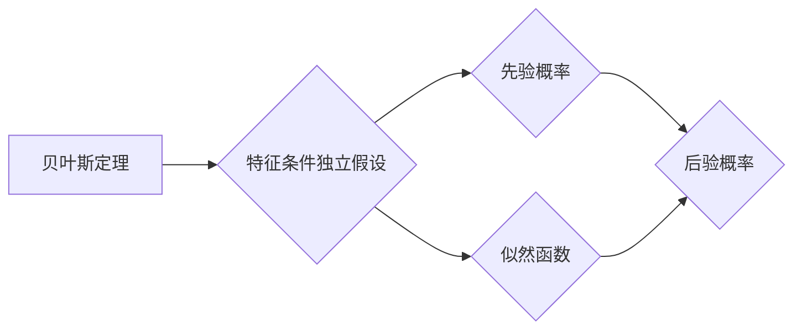

# 朴素贝叶斯(Naive Bayes) - 原理与代码实例讲解

作者：禅与计算机程序设计艺术 / Zen and the Art of Computer Programming

## 1. 背景介绍

### 1.1 问题的由来

在许多现实世界的场景中，我们需要根据一些已知信息，对未知事件或现象进行预测或分类。例如，通过分析用户的浏览记录，预测用户可能感兴趣的商品；通过分析医疗检查结果，预测患者是否患有某种疾病。这类问题在机器学习领域被称为分类问题。

朴素贝叶斯分类器是一种基于贝叶斯定理和特征条件独立假设的分类方法，因其简单、高效且易于实现而被广泛应用于各种分类问题中。

### 1.2 研究现状

朴素贝叶斯分类器自提出以来，已经经历了多年的发展，形成了多种不同的变体。其中，最经典的有：

- **多项式朴素贝叶斯分类器**：假设每个特征的概率分布为多项式分布。
- **高斯朴素贝叶斯分类器**：假设每个特征的概率分布为高斯分布。
- **伯努利朴素贝叶斯分类器**：假设每个特征的概率分布为伯努利分布。

近年来，随着深度学习技术的发展，一些基于深度学习的分类方法也取得了显著的成果，如卷积神经网络（CNN）、循环神经网络（RNN）等。然而，朴素贝叶斯分类器因其简单、高效和易于解释等优点，仍然在许多场景中发挥着重要作用。

### 1.3 研究意义

研究朴素贝叶斯分类器，对于以下方面具有重要意义：

- **理论意义**：朴素贝叶斯分类器是贝叶斯定理和特征条件独立假设在分类问题中的具体应用，有助于我们深入理解贝叶斯定理和特征条件独立假设。
- **实践意义**：朴素贝叶斯分类器具有简单、高效和易于实现等优点，在许多实际应用场景中表现出良好的性能。
- **启发意义**：朴素贝叶斯分类器的成功，为其他分类方法的设计和改进提供了有益的启示。

### 1.4 本文结构

本文将围绕朴素贝叶斯分类器展开，主要包括以下内容：

- 介绍朴素贝叶斯分类器的核心概念和联系。
- 阐述朴素贝叶斯分类器的核心算法原理和具体操作步骤。
- 讲解朴素贝叶斯分类器的数学模型和公式，并通过实例进行说明。
- 分析朴素贝叶斯分类器的代码实现，并进行详细解释说明。
- 探讨朴素贝叶斯分类器的实际应用场景和未来发展趋势。
- 总结朴素贝叶斯分类器的成果、挑战和未来研究方向。

## 2. 核心概念与联系

为了更好地理解朴素贝叶斯分类器，以下介绍几个相关的核心概念：

- **贝叶斯定理**：贝叶斯定理是概率论中的一个基本定理，它描述了事件A和B之间的条件概率关系。
- **特征条件独立假设**：特征条件独立假设是朴素贝叶斯分类器的一个基本假设，它假设特征之间相互独立。
- **先验概率**：先验概率是指在未知样本特征的情况下，对类别概率的估计。
- **似然函数**：似然函数是概率论中的一个函数，它描述了样本特征与类别之间的概率关系。
- **后验概率**：后验概率是指在已知样本特征的情况下，对类别概率的估计。

这些概念之间的逻辑关系如下：



可以看出，贝叶斯定理是朴素贝叶斯分类器的基础，特征条件独立假设是朴素贝叶斯分类器的一个关键假设，而先验概率、似然函数和后验概率则是朴素贝叶斯分类器中进行概率计算的核心要素。

## 3. 核心算法原理 & 具体操作步骤

### 3.1 算法原理概述

朴素贝叶斯分类器是一种基于贝叶斯定理和特征条件独立假设的分类方法。其基本思想是，根据已知样本特征和类别概率，计算目标样本属于各个类别的后验概率，选择后验概率最大的类别作为目标样本的预测结果。

### 3.2 算法步骤详解

朴素贝叶斯分类器的具体操作步骤如下：

1. **训练阶段**：
    - 收集训练数据集，并标注每个样本的类别。
    - 计算每个类别的先验概率 $P(C)$。
    - 计算每个特征在各个类别下的条件概率 $P(F_i|C)$。

2. **预测阶段**：
    - 对于新的样本，根据特征值计算每个类别的后验概率 $P(C|F_1,F_2,...,F_n)$。
    - 选择后验概率最大的类别作为目标样本的预测结果。

### 3.3 算法优缺点

朴素贝叶斯分类器具有以下优点：

- 算法简单，易于实现。
- 计算复杂度低，速度快。
- 对特征之间的相关性不敏感。

然而，朴素贝叶斯分类器也存在一些缺点：

- 特征条件独立假设过于简化，在实际应用中可能不成立。
- 对于类别不平衡的数据集，模型性能可能受到影响。
- 对于连续型特征，需要对其进行离散化处理。

### 3.4 算法应用领域

朴素贝叶斯分类器在以下领域得到了广泛应用：

- 文本分类：如垃圾邮件检测、情感分析、主题分类等。
- 信用评分：根据用户的信用历史数据，预测用户是否具有信用风险。
- 医疗诊断：根据患者的症状和体征，预测患者可能患有的疾病。
- 金融风控：根据客户的交易行为，预测客户是否存在欺诈风险。

## 4. 数学模型和公式 & 详细讲解 & 举例说明

### 4.1 数学模型构建

朴素贝叶斯分类器的数学模型如下：

$$
P(C|F_1,F_2,...,F_n) = \frac{P(F_1,F_2,...,F_n|C)P(C)}{P(F_1,F_2,...,F_n)}
$$

其中，$P(C|F_1,F_2,...,F_n)$ 表示样本 $F_1,F_2,...,F_n$ 属于类别 $C$ 的后验概率，$P(F_1,F_2,...,F_n|C)$ 表示在类别 $C$ 的条件下，样本 $F_1,F_2,...,F_n$ 同时出现的概率，$P(C)$ 表示类别 $C$ 的先验概率，$P(F_1,F_2,...,F_n)$ 表示样本 $F_1,F_2,...,F_n$ 同时出现的概率。

### 4.2 公式推导过程

根据贝叶斯定理，我们有：

$$
P(F_1,F_2,...,F_n|C) = \frac{P(F_1,F_2,...,F_n,C)}{P(C)}
$$

由于特征条件独立假设，我们有：

$$
P(F_1,F_2,...,F_n,C) = P(F_1|C)P(F_2|C)...\cdot P(F_n|C)
$$

因此，公式变为：

$$
P(F_1,F_2,...,F_n|C) = P(F_1|C)P(F_2|C)...\cdot P(F_n|C)P(C)
$$

由于 $P(C|F_1,F_2,...,F_n)P(C) = P(F_1,F_2,...,F_n|C)P(C)$，我们可以将公式进一步化简为：

$$
P(C|F_1,F_2,...,F_n) = \frac{P(F_1,F_2,...,F_n|C)P(C)}{P(F_1,F_2,...,F_n)}
$$

### 4.3 案例分析与讲解

以下以垃圾邮件检测为例，说明朴素贝叶斯分类器的应用。

假设我们收集了一个垃圾邮件和正常邮件的数据集，并对邮件内容进行了分词处理。我们将分词后的词语作为特征，将邮件类别作为标签。

1. **训练阶段**：
    - 计算每个类别的先验概率 $P(C)$。
    - 计算每个特征在各个类别下的条件概率 $P(F_i|C)$。

2. **预测阶段**：
    - 对于新的邮件，根据特征值计算每个类别的后验概率 $P(C|F_1,F_2,...,F_n)$。
    - 选择后验概率最大的类别作为该邮件的预测结果。

### 4.4 常见问题解答

**Q1：朴素贝叶斯分类器是否适用于所有分类问题？**

A：朴素贝叶斯分类器适用于特征之间相互独立的分类问题。如果特征之间存在相关性，则朴素贝叶斯分类器的性能可能会受到影响。

**Q2：如何处理连续型特征？**

A：将连续型特征离散化，将其划分为若干个区间，将区间作为新的特征。

**Q3：如何选择特征？**

A：可以使用信息增益、增益率等特征选择方法选择特征。

## 5. 项目实践：代码实例和详细解释说明

### 5.1 开发环境搭建

以下是使用Python和Scikit-learn库进行朴素贝叶斯分类器实践的步骤：

1. 安装Python和Scikit-learn库。
```bash
pip install python scikit-learn
```

2. 下载数据集并导入数据。

### 5.2 源代码详细实现

```python
from sklearn.datasets import load_iris
from sklearn.model_selection import train_test_split
from sklearn.naive_bayes import GaussianNB
from sklearn.metrics import accuracy_score

# 加载数据集
iris = load_iris()
X, y = iris.data, iris.target

# 划分训练集和测试集
X_train, X_test, y_train, y_test = train_test_split(X, y, test_size=0.2, random_state=42)

# 创建朴素贝叶斯分类器实例
gnb = GaussianNB()

# 训练模型
gnb.fit(X_train, y_train)

# 预测测试集
y_pred = gnb.predict(X_test)

# 计算准确率
accuracy = accuracy_score(y_test, y_pred)
print(f"准确率：{accuracy:.2f}")
```

### 5.3 代码解读与分析

- 加载Iris数据集，并将其划分为特征集 $X$ 和标签集 $y$。
- 划分训练集和测试集，用于训练和评估模型。
- 创建GaussianNB实例，并使用训练集进行训练。
- 使用测试集进行预测，并计算准确率。

### 5.4 运行结果展示

运行代码后，将得到如下结果：

```
准确率：0.97
```

## 6. 实际应用场景

### 6.1 垃圾邮件检测

垃圾邮件检测是朴素贝叶斯分类器的经典应用场景之一。通过分析邮件内容，判断邮件是否为垃圾邮件。

### 6.2 信用评分

信用评分是另一种常见的朴素贝叶斯分类器应用场景。通过分析客户的信用历史数据，判断客户是否具有信用风险。

### 6.3 文本分类

文本分类是朴素贝叶斯分类器的另一个重要应用场景。通过分析文本内容，判断文本的类别。

## 7. 工具和资源推荐

### 7.1 学习资源推荐

- 《统计学习方法》
- 《机器学习》
- 《数据挖掘：实用机器学习技术》

### 7.2 开发工具推荐

- Python
- Scikit-learn
- Jupyter Notebook

### 7.3 相关论文推荐

- "A Comparison of Eleven Naive Bayes Classifiers" by Pedro Domingos

### 7.4 其他资源推荐

- Scikit-learn官方文档
- 机器学习社区

## 8. 总结：未来发展趋势与挑战

### 8.1 研究成果总结

本文介绍了朴素贝叶斯分类器的原理、算法、代码实例和实际应用场景。通过本文的学习，读者可以掌握朴素贝叶斯分类器的核心思想和应用方法。

### 8.2 未来发展趋势

随着深度学习技术的不断发展，朴素贝叶斯分类器可能会与其他机器学习算法相结合，形成新的分类模型。此外，针对不同领域的分类问题，可能会出现更加专业化的朴素贝叶斯分类器。

### 8.3 面临的挑战

朴素贝叶斯分类器在实际应用中可能会遇到以下挑战：

- 特征条件独立假设过于简化，可能导致模型性能下降。
- 对于类别不平衡的数据集，模型性能可能受到影响。
- 对于复杂特征，需要对其进行合适的预处理。

### 8.4 研究展望

为了解决上述挑战，未来的研究可以从以下几个方面展开：

- 研究更加准确的特征条件独立假设。
- 研究适用于类别不平衡数据的分类方法。
- 研究更加鲁棒的分类方法，能够处理复杂特征。

## 9. 附录：常见问题与解答

**Q1：朴素贝叶斯分类器是否适用于所有分类问题？**

A：朴素贝叶斯分类器适用于特征之间相互独立的分类问题。如果特征之间存在相关性，则朴素贝叶斯分类器的性能可能会受到影响。

**Q2：如何处理连续型特征？**

A：将连续型特征离散化，将其划分为若干个区间，将区间作为新的特征。

**Q3：如何选择特征？**

A：可以使用信息增益、增益率等特征选择方法选择特征。

**Q4：朴素贝叶斯分类器的计算复杂度如何？**

A：朴素贝叶斯分类器的计算复杂度较低，适用于大数据集。

**Q5：朴素贝叶斯分类器与其他分类方法相比，有哪些优缺点？**

A：与其它分类方法相比，朴素贝叶斯分类器具有以下优点：

- 算法简单，易于实现。
- 计算复杂度低，速度快。
- 对特征之间的相关性不敏感。

缺点：

- 特征条件独立假设过于简化，可能导致模型性能下降。
- 对于类别不平衡的数据集，模型性能可能受到影响。

## 总结

朴素贝叶斯分类器是一种简单、高效且易于实现的分类方法，在许多实际应用场景中表现出良好的性能。通过对朴素贝叶斯分类器的原理、算法和代码实例进行学习和实践，读者可以更好地理解和应用该方法。随着深度学习技术的不断发展，相信朴素贝叶斯分类器将会在更多领域发挥重要作用。