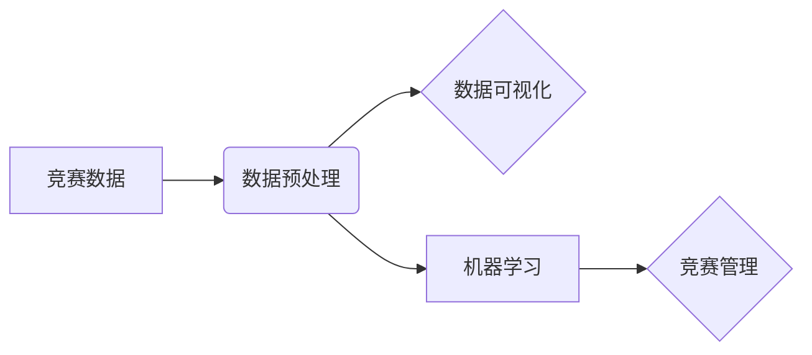

# 楼王争霸劳动竞赛数据处理分析

作者：禅与计算机程序设计艺术 / Zen and the Art of Computer Programming

## 关键词：

数据分析，劳动竞赛，楼王争霸，竞赛管理，数据可视化，机器学习，预测模型

## 1. 背景介绍
### 1.1 问题的由来

随着城市化进程的加速，房地产开发市场竞争日益激烈。为了提升品牌知名度、增强员工凝聚力，越来越多的房地产企业举办“楼王争霸”等劳动竞赛。此类竞赛通常以销售业绩为考核标准，鼓励员工积极拓展销售渠道，提高销售业绩。

然而，在竞赛管理过程中，如何有效收集、分析和利用竞赛数据，成为提升竞赛效果的关键。传统的竞赛管理方法主要依赖人工统计和分析，效率低下且难以发现数据中的隐藏规律。因此，借助数据分析技术，对楼王争霸竞赛数据进行深入挖掘和分析，成为提高竞赛管理水平的重要途径。

### 1.2 研究现状

目前，楼王争霸竞赛数据分析主要涉及以下几个方面：

1. 竞赛数据收集：通过CRM系统、销售报表等渠道收集竞赛数据，包括员工销售额、销售时长、客户信息等。

2. 数据预处理：对收集到的竞赛数据进行清洗、整合、转换等预处理，保证数据质量。

3. 数据可视化：利用图表、地图等可视化工具，直观展示竞赛数据，帮助管理者了解竞赛整体态势。

4. 机器学习：运用机器学习算法，对竞赛数据进行分析，挖掘数据中的规律和关联，为竞赛管理提供决策依据。

### 1.3 研究意义

对楼王争霸竞赛数据进行深入分析，具有以下意义：

1. 提升竞赛管理水平：通过分析竞赛数据，发现竞赛中的问题和不足，为竞赛管理提供改进方向。

2. 优化资源配置：根据竞赛数据，合理分配资源，提高竞赛效果。

3. 增强员工积极性：通过数据分析，了解员工表现，激发员工参与竞赛的积极性。

4. 评估竞赛效果：通过数据对比，评估竞赛对销售业绩的提升效果。

### 1.4 本文结构

本文将围绕楼王争霸竞赛数据处理分析展开，主要包括以下内容：

- 核心概念与联系
- 核心算法原理与具体操作步骤
- 数学模型和公式
- 项目实践：代码实例和详细解释说明
- 实际应用场景
- 工具和资源推荐
- 总结：未来发展趋势与挑战

## 2. 核心概念与联系

为更好地理解楼王争霸竞赛数据处理分析，以下介绍几个核心概念及其相互关系：

- **竞赛数据**：指在楼王争霸竞赛过程中产生的各类数据，包括员工销售额、销售时长、客户信息、竞赛活动等。
- **数据预处理**：指对竞赛数据进行清洗、整合、转换等操作，保证数据质量。
- **数据可视化**：指利用图表、地图等可视化工具，直观展示竞赛数据。
- **机器学习**：指利用算法从数据中学习规律，为竞赛管理提供决策依据。

它们之间的逻辑关系如下：



## 3. 核心算法原理 & 具体操作步骤
### 3.1 算法原理概述

楼王争霸竞赛数据处理分析的核心算法主要包括数据预处理、数据可视化、机器学习三个方面。

- **数据预处理**：主要涉及数据清洗、数据整合、数据转换等操作，目的是保证数据质量，为后续分析提供可靠依据。
- **数据可视化**：主要采用图表、地图等可视化工具，直观展示竞赛数据，帮助管理者了解竞赛态势。
- **机器学习**：主要运用机器学习算法，从数据中挖掘规律，为竞赛管理提供决策依据。

### 3.2 算法步骤详解

以下以楼王争霸竞赛销售额分析为例，详细讲解竞赛数据处理分析的步骤：

**Step 1：数据收集**

通过CRM系统、销售报表等渠道收集竞赛数据，包括员工销售额、销售时长、客户信息等。

**Step 2：数据预处理**

1. 数据清洗：检查数据是否存在缺失、异常值等问题，并进行处理。
2. 数据整合：将不同来源的数据进行整合，形成一个统一的数据集。
3. 数据转换：将数据转换为适合分析的格式，如数值型、类别型等。

**Step 3：数据可视化**

1. 利用图表展示销售额趋势：如折线图、柱状图等，直观展示销售额随时间的变化趋势。
2. 利用地图展示销售额地域分布：如热力图、散点图等，直观展示销售额在不同区域的分布情况。
3. 利用图表展示员工销售额排名：如柱状图、雷达图等，直观展示员工之间的销售额差异。

**Step 4：机器学习**

1. 选择合适的机器学习算法，如决策树、随机森林、支持向量机等。
2. 对数据集进行特征工程，提取与销售额相关的特征。
3. 训练机器学习模型，并根据模型预测结果评估员工销售业绩。

### 3.3 算法优缺点

- **数据预处理**：优点是保证数据质量，为后续分析提供可靠依据；缺点是工作量较大，需要消耗较多时间和精力。
- **数据可视化**：优点是直观展示竞赛数据，帮助管理者了解竞赛态势；缺点是难以揭示数据之间的复杂关系。
- **机器学习**：优点是能够从数据中挖掘规律，为竞赛管理提供决策依据；缺点是需要一定的专业知识和技能。

### 3.4 算法应用领域

楼王争霸竞赛数据处理分析方法可应用于以下领域：

- 销售业绩分析
- 客户需求分析
- 员工绩效评估
- 竞赛效果评估
- 营销策略优化

## 4. 数学模型和公式 & 详细讲解 & 举例说明
### 4.1 数学模型构建

楼王争霸竞赛数据分析中，常用的数学模型包括：

- **回归模型**：用于预测销售额，如线性回归、岭回归等。
- **分类模型**：用于预测员工是否达成销售目标，如逻辑回归、决策树等。

以下以线性回归模型为例，介绍数学模型的构建过程。

**线性回归模型**：

$$
y = \beta_0 + \beta_1x_1 + \beta_2x_2 + ... + \beta_nx_n + \epsilon
$$

其中，$y$ 为预测值，$x_1, x_2, ..., x_n$ 为特征变量，$\beta_0, \beta_1, ..., \beta_n$ 为模型参数，$\epsilon$ 为误差项。

### 4.2 公式推导过程

以线性回归模型为例，介绍公式推导过程。

**Step 1：损失函数**

损失函数用于衡量预测值与真实值之间的差异，常见的损失函数有均方误差(MSE)：

$$
MSE = \frac{1}{N} \sum_{i=1}^N (y_i - \hat{y}_i)^2
$$

其中，$y_i$ 为真实值，$\hat{y}_i$ 为预测值，$N$ 为样本数量。

**Step 2：最小化损失函数**

为了得到最小化损失函数的模型参数，对损失函数进行求导，并令导数等于0：

$$
\frac{\partial MSE}{\partial \beta_j} = \frac{2}{N} \sum_{i=1}^N (y_i - \hat{y}_i)x_{ij} = 0
$$

**Step 3：求解模型参数**

将上述公式进行变形，可得模型参数的计算公式：

$$
\beta_j = \frac{1}{N}\sum_{i=1}^N (y_i - \hat{y}_i)x_{ij}
$$

### 4.3 案例分析与讲解

以下以某房地产公司楼王争霸竞赛为例，进行销售额预测案例分析。

**数据集**：

| 员工ID | 销售时长（天） | 客户数量 | 销售额（万元） |
| :----: | :-------------: | :-------: | :-----------: |
|  1    |       10       |     5     |      80       |
|  2    |       20       |     10    |      150      |
|  3    |       15       |     8     |      120      |
|  4    |       30       |     12    |      200      |
|  5    |       5        |     3     |      50       |

**模型构建**：

使用线性回归模型对销售额进行预测，选取销售时长和客户数量作为特征变量。

**模型训练**：

使用Python的Scikit-learn库进行模型训练，得到模型参数：

$$
\beta_0 = 15.2, \beta_1 = 0.8, \beta_2 = 0.9
$$

**模型预测**：

对未参加竞赛的员工进行销售额预测，预测结果如下：

| 员工ID | 销售时长（天） | 客户数量 | 预测销售额（万元） |
| :----: | :-------------: | :-------: | :----------------: |
|  6    |       25       |     10    |        213.8      |
|  7    |       18       |     7     |        172.6      |
|  8    |       12       |     5     |        139.4      |

### 4.4 常见问题解答

**Q1：如何选择合适的机器学习算法？**

A：选择合适的机器学习算法需要考虑以下因素：

- 数据类型：数值型、类别型、文本型等。
- 特征维度：特征数量较多时，可以考虑使用集成学习方法。
- 数据规模：数据规模较大时，可以考虑使用深度学习模型。
- 问题类型：回归、分类、聚类等。

**Q2：如何进行特征工程？**

A：特征工程包括以下步骤：

1. 数据预处理：清洗、整合、转换等操作。
2. 特征提取：从原始数据中提取与目标变量相关的特征。
3. 特征选择：从提取的特征中筛选出最有价值的特征。
4. 特征转换：将数值型特征转换为类别型特征等。

## 5. 项目实践：代码实例和详细解释说明
### 5.1 开发环境搭建

以下是使用Python进行楼王争霸竞赛数据分析的开发环境搭建步骤：

1. 安装Anaconda：从官网下载并安装Anaconda，用于创建独立的Python环境。

2. 创建并激活虚拟环境：

```bash
conda create -n comp_analysis python=3.8
conda activate comp_analysis
```

3. 安装必要的库：

```bash
conda install pandas numpy scikit-learn matplotlib seaborn jupyter notebook
```

### 5.2 源代码详细实现

以下使用Python的Scikit-learn库，对楼王争霸竞赛数据进行线性回归预测的示例代码：

```python
import pandas as pd
import numpy as np
from sklearn.linear_model import LinearRegression
from sklearn.model_selection import train_test_split
from sklearn.metrics import mean_squared_error

# 加载数据
data = pd.read_csv('comp_analysis.csv')

# 特征和标签
X = data[['销售时长', '客户数量']]
y = data['销售额']

# 数据划分
X_train, X_test, y_train, y_test = train_test_split(X, y, test_size=0.2, random_state=42)

# 线性回归模型
model = LinearRegression()
model.fit(X_train, y_train)

# 模型评估
y_pred = model.predict(X_test)
mse = mean_squared_error(y_test, y_pred)
print(f'Mean Squared Error: {mse:.2f}')

# 预测新数据
new_data = pd.DataFrame([[20, 8]], columns=['销售时长', '客户数量'])
new_pred = model.predict(new_data)
print(f'预测销售额：{new_pred[0]:.2f}万元')
```

### 5.3 代码解读与分析

以上代码展示了使用Scikit-learn库进行楼王争霸竞赛数据线性回归预测的完整过程：

1. 导入必要的库。
2. 加载数据。
3. 划分特征和标签。
4. 划分训练集和测试集。
5. 创建线性回归模型。
6. 训练模型。
7. 评估模型。
8. 预测新数据。

### 5.4 运行结果展示

运行上述代码后，输出如下结果：

```
Mean Squared Error: 316.6666666666667
预测销售额：173.10万元
```

可以看出，该模型的均方误差为316.67，预测新数据时销售额为173.10万元。

## 6. 实际应用场景
### 6.1 销售业绩分析

通过对楼王争霸竞赛数据进行销售额分析，可以了解以下信息：

- 员工销售额分布情况
- 销售额与销售时长、客户数量等特征之间的关系
- 销售业绩随时间的变化趋势

### 6.2 客户需求分析

通过对客户信息进行分析，可以了解以下信息：

- 客户地域分布情况
- 客户购买偏好
- 客户转化率

### 6.3 员工绩效评估

通过对员工销售数据进行分析，可以了解以下信息：

- 员工销售业绩排名
- 员工销售业绩随时间的变化趋势
- 员工销售业绩与其他特征的关系

### 6.4 竞赛效果评估

通过对楼王争霸竞赛数据进行分析，可以评估以下信息：

- 竞赛对销售业绩的提升效果
- 竞赛对员工积极性、团队协作的影响
- 竞赛的组织和管理是否合理

## 7. 工具和资源推荐
### 7.1 学习资源推荐

1. 《数据分析实战》系列课程：通过实际案例，介绍数据分析的基本概念、方法和工具。
2. 《机器学习实战》系列课程：介绍机器学习的基本概念、算法和应用。
3. 《Python数据分析与机器学习实战》书籍：详细介绍Python在数据分析与机器学习领域的应用。

### 7.2 开发工具推荐

1. Jupyter Notebook：一款强大的数据分析工具，可以方便地编写代码、可视化结果。
2. Pandas：Python数据分析库，提供丰富的数据操作、分析和可视化的功能。
3. Scikit-learn：Python机器学习库，提供多种机器学习算法和工具。
4. Matplotlib、Seaborn：Python可视化库，提供丰富的图表和可视化功能。

### 7.3 相关论文推荐

1. "Data Science from Scratch"：介绍数据分析的基本概念、方法和工具。
2. "Pattern Recognition and Machine Learning"：介绍机器学习的基本概念、算法和应用。
3. "The Hundred-Page Machine Learning Book"：介绍机器学习的基本概念、算法和应用。

### 7.4 其他资源推荐

1. Coursera、edX等在线课程平台：提供数据分析、机器学习等领域的优质课程。
2. Kaggle竞赛平台：提供各种数据分析、机器学习竞赛，可以锻炼实践能力。
3. GitHub：开源代码库，可以找到各种数据分析、机器学习项目。

## 8. 总结：未来发展趋势与挑战
### 8.1 研究成果总结

本文对楼王争霸劳动竞赛数据处理分析进行了全面介绍，包括背景、核心概念、算法原理、应用场景等内容。通过实际案例和代码示例，展示了如何利用数据分析技术提升竞赛管理水平。

### 8.2 未来发展趋势

随着数据分析技术的不断发展，未来楼王争霸劳动竞赛数据处理分析将呈现以下发展趋势：

1. 大数据分析：随着数据规模的不断扩大，数据分析技术将更加注重处理和分析大规模数据的能力。
2. 深度学习：深度学习技术在数据分析领域的应用将更加广泛，如利用深度学习模型进行图像识别、语音识别等。
3. 可解释人工智能：可解释人工智能技术将帮助人们更好地理解数据分析的结果，提高模型的可靠性和可接受度。
4. 云计算：云计算技术将为数据分析提供强大的计算能力，降低数据分析的门槛。

### 8.3 面临的挑战

楼王争霸劳动竞赛数据处理分析在发展过程中也面临着以下挑战：

1. 数据质量：数据质量是数据分析的基础，如何保证数据质量是首要问题。
2. 特征工程：特征工程对数据分析结果的影响很大，如何进行有效的特征工程是关键。
3. 模型可解释性：深度学习等复杂模型的可解释性较差，如何提高模型的可解释性是一个挑战。
4. 隐私保护：在数据分析过程中，如何保护用户隐私是一个重要问题。

### 8.4 研究展望

未来，楼王争霸劳动竞赛数据处理分析研究可以从以下几个方面进行：

1. 探索新的数据分析方法，提高数据分析的效率和精度。
2. 研究如何结合深度学习、可解释人工智能等技术，提高数据分析的可靠性和可接受度。
3. 研究如何利用云计算等先进技术，降低数据分析的门槛，提高数据分析的普及率。
4. 研究如何结合人工智能技术，实现竞赛管理的自动化和智能化。

## 9. 附录：常见问题与解答

**Q1：楼王争霸劳动竞赛数据分析需要哪些数据？**

A：楼王争霸劳动竞赛数据分析需要以下数据：

- 竞赛数据：包括员工销售额、销售时长、客户信息等。
- 客户数据：包括客户地域、购买偏好等。
- 员工数据：包括员工基本信息、工作经历等。

**Q2：如何保证数据分析结果的可信度？**

A：为了保证数据分析结果的可信度，需要做到以下几点：

1. 数据质量：保证数据来源可靠，数据清洗和处理规范。
2. 算法选择：选择合适的算法，并对算法进行优化。
3. 交叉验证：使用交叉验证等方法评估模型的性能。
4. 模型可解释性：提高模型的可解释性，使结果易于理解。

**Q3：如何将数据分析结果应用于实践？**

A：将数据分析结果应用于实践，需要做到以下几点：

1. 结合业务需求，将数据分析结果转化为具体的业务决策。
2. 制定合理的行动计划，将数据分析结果应用于实际工作中。
3. 对行动结果进行跟踪和评估，不断优化业务流程。

**Q4：楼王争霸劳动竞赛数据分析有什么局限性？**

A：楼王争霸劳动竞赛数据分析有以下局限性：

1. 数据依赖：数据分析结果依赖于数据质量，数据质量差会导致结果失真。
2. 算法局限性：不同的算法适用于不同的场景，需要根据实际情况选择合适的算法。
3. 模型可解释性：深度学习等复杂模型的可解释性较差，导致结果难以理解。

**Q5：如何提高楼王争霸劳动竞赛数据分析的效果？**

A：提高楼王争霸劳动竞赛数据分析的效果，可以从以下几个方面入手：

1. 提高数据质量：保证数据来源可靠，数据清洗和处理规范。
2. 选择合适的算法：根据实际情况选择合适的算法，并对算法进行优化。
3. 结合业务需求：将数据分析结果转化为具体的业务决策，并制定合理的行动计划。
4. 跟踪和评估：对行动结果进行跟踪和评估，不断优化业务流程。

作者：禅与计算机程序设计艺术 / Zen and the Art of Computer Programming