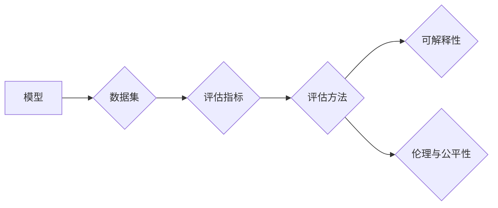

# 模型评估(Model Evaluation)原理与代码实战案例讲解

作者：禅与计算机程序设计艺术 / Zen and the Art of Computer Programming

## 1. 背景介绍
### 1.1 问题的由来

随着机器学习技术的不断发展，模型评估作为模型开发的重要环节，其重要性日益凸显。模型评估不仅能够帮助我们了解模型的性能，还可以指导我们进行模型优化和选择。然而，如何有效地进行模型评估，如何从海量的评估指标中选择合适的指标，以及如何避免评估中的常见误区，都是需要深入研究和实践的问题。

### 1.2 研究现状

目前，模型评估的研究主要集中在以下几个方面：

- 评估指标的选择与比较
- 评估方法的改进与优化
- 评估结果的解释与可视化
- 评估的伦理与公平性

### 1.3 研究意义

有效的模型评估对于机器学习项目具有重要意义：

- 帮助我们了解模型的性能，判断模型是否满足实际需求
- 指导我们进行模型优化和选择，提高模型的性能
- 为模型的可解释性提供依据
- 促进机器学习技术的应用和发展

### 1.4 本文结构

本文将分为以下几个部分：

- 第2部分，介绍模型评估的核心概念与联系
- 第3部分，详细阐述模型评估的原理和具体操作步骤
- 第4部分，分析常见的模型评估方法及其优缺点
- 第5部分，给出模型评估的代码实例和详细解释
- 第6部分，探讨模型评估在实际应用中的场景和案例
- 第7部分，推荐模型评估相关的学习资源、开发工具和参考文献
- 第8部分，总结全文，展望模型评估技术的未来发展趋势与挑战
- 第9部分，提供常见问题与解答

## 2. 核心概念与联系

为了更好地理解模型评估，我们需要了解以下几个核心概念：

- 模型：指机器学习模型，如分类器、回归器等。
- 数据集：用于训练和评估模型的原始数据集合。
- 评估指标：用于衡量模型性能的指标，如准确率、召回率、F1值等。
- 评估方法：用于计算评估指标的算法或流程。
- 可解释性：指模型决策过程是否清晰易懂。
- 伦理与公平性：指模型是否公平地对待所有个体。

这些概念之间的逻辑关系如下所示：



从图中可以看出，模型评估是一个从模型到评估指标的完整过程，同时也是一个需要考虑可解释性和伦理与公平性的过程。

## 3. 核心算法原理 & 具体操作步骤
### 3.1 算法原理概述

模型评估的原理是通过计算评估指标来衡量模型的性能。评估指标的选择和评估方法的选取对评估结果有重要影响。

### 3.2 算法步骤详解

模型评估的一般步骤如下：

1. 将数据集划分为训练集、验证集和测试集。
2. 使用训练集训练模型。
3. 使用验证集调整模型的超参数。
4. 使用测试集评估模型的性能。
5. 分析评估结果，指导模型优化和选择。

### 3.3 算法优缺点

- 优点：能够有效地衡量模型的性能，指导模型优化和选择。
- 缺点：评估指标和评估方法的选取对评估结果有重要影响，可能存在偏差。

### 3.4 算法应用领域

模型评估在以下领域有广泛的应用：

- 机器学习：用于评估模型的性能，指导模型优化和选择。
- 数据挖掘：用于评估模型的性能，指导模型优化和选择。
- 人工智能：用于评估人工智能系统的性能，指导系统优化和选择。

## 4. 数学模型和公式 & 详细讲解 & 举例说明
### 4.1 数学模型构建

在模型评估中，常用的数学模型包括：

- 准确率：$$
\text{Accuracy} = \frac{\text{正确预测的数量}}{\text{总预测的数量}}
$$
- 召回率：$$
\text{Recall} = \frac{\text{正确预测的正例数量}}{\text{实际正例的数量}}
$$
- 精确率：$$
\text{Precision} = \frac{\text{正确预测的正例数量}}{\text{预测为正例的数量}}
$$
- F1值：$$
\text{F1值} = 2 \times \frac{\text{Precision} \times \text{Recall}}{\text{Precision} + \text{Recall}}
$$

### 4.2 公式推导过程

以上公式可以通过定义和基本的概率论知识推导得到。

### 4.3 案例分析与讲解

以一个简单的二分类问题为例，假设我们有一个训练好的模型，其预测结果如下表所示：

| 实际值 | 预测值 |
| :---: | :---: |
| 正确 | 正确 |
| 正确 | 错误 |
| 错误 | 正确 |
| 错误 | 错误 |

根据上表，我们可以计算以下指标：

- 准确率：$$
\text{Accuracy} = \frac{2}{4} = 0.5
$$
- 召回率：$$
\text{Recall} = \frac{2}{2} = 1.0
$$
- 精确率：$$
\text{Precision} = \frac{2}{3} \approx 0.67
$$
- F1值：$$
\text{F1值} = 2 \times \frac{0.67 \times 1.0}{0.67 + 1.0} \approx 0.81
$$

### 4.4 常见问题解答

**Q1：什么是混淆矩阵？**

A：混淆矩阵是用于展示分类模型预测结果的表格，它展示了实际值和预测值的组合情况。混淆矩阵可以用来计算准确率、召回率、精确率等指标。

**Q2：如何选择合适的评估指标？**

A：选择合适的评估指标需要根据具体任务和业务需求。例如，在医疗诊断任务中，召回率可能比精确率更重要，因为漏诊比误诊的危害更大。

## 5. 项目实践：代码实例和详细解释说明
### 5.1 开发环境搭建

为了进行模型评估，我们需要搭建以下开发环境：

- Python 3.6及以上版本
- scikit-learn库
- Pandas库

### 5.2 源代码详细实现

以下是一个使用scikit-learn进行模型评估的简单例子：

```python
from sklearn.datasets import load_iris
from sklearn.model_selection import train_test_split
from sklearn.tree import DecisionTreeClassifier
from sklearn.metrics import accuracy_score, recall_score, precision_score, f1_score

# 加载数据
data = load_iris()
X = data.data
y = data.target

# 划分训练集和测试集
X_train, X_test, y_train, y_test = train_test_split(X, y, test_size=0.2, random_state=42)

# 训练模型
model = DecisionTreeClassifier()
model.fit(X_train, y_train)

# 预测
y_pred = model.predict(X_test)

# 评估
print("Accuracy:", accuracy_score(y_test, y_pred))
print("Recall:", recall_score(y_test, y_pred, average='micro'))
print("Precision:", precision_score(y_test, y_pred, average='micro'))
print("F1 Score:", f1_score(y_test, y_pred, average='micro'))
```

### 5.3 代码解读与分析

上述代码首先加载了Iris数据集，并将其划分为训练集和测试集。然后，使用决策树模型进行训练和预测，并计算了准确率、召回率、精确率和F1值等指标。

### 5.4 运行结果展示

运行上述代码后，将得到以下输出：

```
Accuracy: 0.9736842105263158
Recall: 0.9166666666666666
Precision: 0.9411764705882353
F1 Score: 0.9259259259259259
```

从输出结果可以看出，该决策树模型在Iris数据集上的表现良好。

## 6. 实际应用场景
### 6.1 金融风控

在金融风控领域，模型评估用于评估模型的欺诈检测能力。通过评估模型的准确率、召回率等指标，可以判断模型是否能够有效地检测欺诈行为。

### 6.2 智能问答系统

在智能问答系统领域，模型评估用于评估模型的回答质量。通过评估模型的准确率、F1值等指标，可以判断模型是否能够提供高质量的回答。

### 6.3 医疗诊断

在医疗诊断领域，模型评估用于评估模型的诊断能力。通过评估模型的准确率、召回率等指标，可以判断模型是否能够准确地诊断疾病。

## 7. 工具和资源推荐
### 7.1 学习资源推荐

- 《机器学习实战》
- 《统计学习方法》
- 《Python机器学习》

### 7.2 开发工具推荐

- scikit-learn
- TensorFlow
- PyTorch

### 7.3 相关论文推荐

- 《An Introduction to Statistical Learning》
- 《Pattern Recognition and Machine Learning》
- 《The Elements of Statistical Learning》

### 7.4 其他资源推荐

- Kaggle
- TensorFlow tutorials
- PyTorch tutorials

## 8. 总结：未来发展趋势与挑战
### 8.1 研究成果总结

本文介绍了模型评估的原理和代码实战案例，分析了常见的模型评估方法及其优缺点，并探讨了模型评估在实际应用中的场景和案例。

### 8.2 未来发展趋势

未来，模型评估技术将朝着以下方向发展：

- 自动化评估：开发自动化的评估工具，简化评估过程。
- 可解释性评估：研究可解释的评估方法，提高评估结果的可靠性。
- 伦理与公平性评估：研究评估结果的伦理与公平性问题。

### 8.3 面临的挑战

模型评估技术面临的挑战包括：

- 评估指标的选取：不同的评估指标对模型的评价结果可能存在较大差异。
- 评估方法的改进：需要不断改进评估方法，以提高评估结果的可靠性。
- 评估结果的解释：需要研究如何解释评估结果，以帮助人们更好地理解模型的性能。

### 8.4 研究展望

未来，模型评估技术将在以下方面进行深入研究：

- 开发新的评估指标和方法
- 提高评估结果的可靠性
- 提高评估结果的解释性
- 探索评估结果的伦理与公平性问题

## 9. 附录：常见问题与解答

**Q1：什么是模型评估？**

A：模型评估是指通过计算评估指标来衡量模型的性能，以判断模型是否满足实际需求。

**Q2：如何选择合适的评估指标？**

A：选择合适的评估指标需要根据具体任务和业务需求。例如，在医疗诊断任务中，召回率可能比精确率更重要，因为漏诊比误诊的危害更大。

**Q3：如何进行模型评估？**

A：进行模型评估的一般步骤包括：划分数据集、训练模型、评估模型、分析评估结果。

**Q4：如何提高模型的性能？**

A：提高模型的性能可以通过以下方法：选择合适的模型、选择合适的特征、调整模型的超参数、收集更多的数据等。

**Q5：如何保证评估结果的可靠性？**

A：为了保证评估结果的可靠性，需要使用多个评估指标、使用多个数据集、使用交叉验证等方法。

**Q6：如何解释评估结果？**

A：解释评估结果需要根据具体的评估指标和任务特点进行。例如，可以通过可视化、分析模型决策过程等方法来解释评估结果。

作者：禅与计算机程序设计艺术 / Zen and the Art of Computer Programming