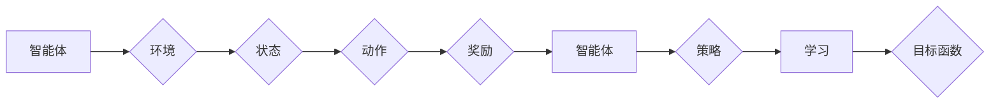

# 深度强化学习 (Deep Reinforcement Learning) 原理与代码实例讲解

作者：禅与计算机程序设计艺术 / Zen and the Art of Computer Programming

## 1. 背景介绍

### 1.1 问题的由来

强化学习（Reinforcement Learning，RL）是机器学习领域的一个重要分支，旨在使智能体在环境中通过学习获得最优行为策略。自20世纪50年代由Richard Bellman提出以来，强化学习在游戏、机器人、推荐系统等领域取得了显著的进展。然而，随着深度学习技术的兴起，深度强化学习（Deep Reinforcement Learning，DRL）应运而生，它将深度学习与强化学习相结合，为解决复杂决策问题提供了新的思路。

### 1.2 研究现状

近年来，DRL取得了令人瞩目的成果，尤其是在棋类游戏、自动驾驶、机器人控制、自然语言处理等领域。然而，DRL仍然面临着一些挑战，如样本效率低、难以解释性、长期依赖学习等。本文将深入探讨DRL的原理、算法、应用场景，并结合代码实例进行讲解，帮助读者全面了解DRL技术。

### 1.3 研究意义

DRL在解决复杂决策问题方面具有广泛的应用前景，如：

1. 自动驾驶：DRL可以帮助自动驾驶汽车学习在不同交通环境下的最优驾驶策略，提高行驶安全性。
2. 机器人控制：DRL可以帮助机器人学习完成复杂任务，如抓取、搬运、焊接等。
3. 游戏智能：DRL可以用于开发高水平的游戏AI，如AlphaGo、AlphaZero等。
4. 推荐系统：DRL可以帮助推荐系统更好地理解用户行为，提高推荐质量。

### 1.4 本文结构

本文将从以下方面对DRL进行讲解：

- 核心概念与联系
- 核心算法原理与具体操作步骤
- 数学模型和公式
- 代码实例与详细解释说明
- 实际应用场景
- 工具和资源推荐
- 总结：未来发展趋势与挑战
- 附录：常见问题与解答

## 2. 核心概念与联系

为了更好地理解DRL，本节将介绍几个核心概念及其相互关系：

- 智能体（Agent）：执行动作并获取环境反馈的实体，如机器人、游戏AI等。
- 环境（Environment）：智能体进行决策和学习的环境，如棋盘、游戏界面等。
- 状态（State）：描述环境当前状态的向量，如棋盘上的棋子分布、游戏中的玩家信息等。
- 动作（Action）：智能体可执行的动作集合，如走棋、移动机器人手臂等。
- 奖励（Reward）：环境对智能体动作的反馈，用于指导智能体的学习过程。
- 策略（Policy）：智能体根据当前状态选择动作的规则，如Q学习中的Q函数、深度Q网络（DQN）中的确定性策略等。
- 目标函数：衡量智能体学习成果的函数，如最大化累积奖励。

它们之间的逻辑关系如下：



## 3. 核心算法原理 & 具体操作步骤

### 3.1 算法原理概述

DRL的核心思想是通过与环境交互，学习一个策略，使智能体能够最大化累积奖励。DRL算法主要包括以下几种：

- Q学习（Q-Learning）：基于值函数的方法，通过学习Q函数（状态-动作值函数）来指导智能体的决策。
- 策略梯度（Policy Gradient）：直接学习策略参数，通过优化策略来最大化累积奖励。
- 深度Q网络（DQN）：结合深度学习技术，使用神经网络来近似Q函数，提高Q学习的样本效率。
- 深度确定性策略梯度（DDPG）：结合深度学习和策略梯度方法，适用于连续动作空间。
- A3C（Asynchronous Advantage Actor-Critic）：通过多智能体并行训练，提高训练效率。
- 集成策略（A2C）：将多个智能体训练成一个整体，提高策略的鲁棒性和探索能力。

### 3.2 算法步骤详解

以下以DQN为例，介绍DRL算法的具体步骤：

1. 初始化智能体、环境、Q网络和目标网络。
2. 选择初始状态s0，将Q网络和目标网络的参数同步。
3. 使用Q网络选择动作a，将动作a作用于环境，获取新状态s'和奖励r。
4. 将(s', r, a, s)存储到经验池中。
5. 从经验池中随机抽取一批经验，计算Q值。
6. 使用目标网络计算目标Q值。
7. 使用Adam优化器更新Q网络参数。
8. 持续重复步骤2-7，直至达到训练时间或满足终止条件。

### 3.3 算法优缺点

DRL算法具有以下优点：

- 能够处理复杂的决策问题，如连续动作空间、高维状态空间等。
- 能够通过学习获得最优或近似最优策略。
- 可以应用于各种领域，如游戏、机器人、推荐系统等。

DRL算法也具有以下缺点：

- 样本效率低，需要大量数据进行训练。
- 模型难以解释，难以理解智能体的决策过程。
- 长期依赖学习困难，难以学习到长期奖励。

### 3.4 算法应用领域

DRL算法在以下领域具有广泛的应用：

- 游戏AI：如AlphaGo、AlphaZero等。
- 自动驾驶：如自动驾驶汽车的控制策略。
- 机器人控制：如机器人抓取、搬运、焊接等。
- 自然语言处理：如对话系统、机器翻译等。
- 推荐系统：如个性化推荐、广告投放等。

## 4. 数学模型和公式 & 详细讲解 & 举例说明

### 4.1 数学模型构建

DRL的数学模型主要包括以下几部分：

- 状态空间S：描述环境状态的集合。
- 动作空间A：描述智能体可执行动作的集合。
- 策略π：智能体根据当前状态选择动作的规则，π: S → A。
- 奖励函数R：环境对智能体动作的反馈，R: S × A → R。
- 状态转移概率P：从当前状态s转移到下一个状态s'的概率，P: S × A × S' → R。
- 目标函数：衡量智能体学习成果的函数，如最大化累积奖励。

### 4.2 公式推导过程

以下以Q学习为例，介绍DRL算法的数学推导过程：

定义Q(s, a)为状态s下执行动作a的期望回报：

$$
Q(s, a) = \mathbb{E}_{s' \sim P}(R(s, a) + \gamma \max_{a'} Q(s', a'))
$$

其中，$\gamma$为折扣因子，$\mathbb{E}$表示期望。

目标是最小化Q函数的均方误差：

$$
\min_{\theta} \mathbb{E}_{s \sim P, a \sim \pi}[(Q(s, a) - Q^*(s, a))^2]
$$

其中，$Q^*(s, a)$为最优Q函数。

### 4.3 案例分析与讲解

以下以无人驾驶为例，介绍DRL在实际应用中的案例分析：

**场景**：自动驾驶汽车在道路上行驶，需要根据当前道路情况选择合适的行驶速度和转向角度。

**状态**：汽车的位置、速度、加速度、周围车辆信息等。

**动作**：加速、减速、转向等。

**奖励函数**：根据行驶距离、行驶时间、安全距离等因素计算奖励。

**目标**：使汽车在保证安全的前提下，以最快的速度到达目的地。

在DRL框架下，我们可以使用DQN算法对自动驾驶汽车进行训练。首先，收集大量自动驾驶数据，包括状态、动作、奖励等信息，作为经验池。然后，使用DQN算法从经验池中学习最优策略，使汽车能够在道路上安全行驶。

### 4.4 常见问题解答

**Q1：DRL算法是否需要大量数据进行训练？**

A：DRL算法确实需要大量数据进行训练，特别是对于样本效率较低的算法，如Q学习。随着数据规模的扩大，DRL算法的性能会得到显著提升。

**Q2：如何解决DRL算法的样本效率问题？**

A：解决DRL算法的样本效率问题可以从以下几个方面入手：

1. 使用经验回放：将经历过的经验存储在经验池中，随机地从经验池中抽取经验进行训练，提高样本利用率。
2. 使用优先级采样：根据经验的重要性对经验进行排序，优先训练重要的经验。
3. 使用多智能体并行训练：使用多个智能体并行训练，提高训练效率。
4. 使用神经网络近似策略：使用神经网络近似策略，减少策略参数的数量，降低样本效率。

**Q3：DRL算法是否具有可解释性？**

A：DRL算法通常缺乏可解释性，难以理解智能体的决策过程。为了提高可解释性，可以从以下几个方面入手：

1. 使用可视化技术：将智能体的决策过程可视化，帮助理解决策过程。
2. 使用解释性模型：如LIME、SHAP等，将DRL模型解释为传统的决策树、规则等模型。
3. 分析策略参数：分析策略参数的分布和作用，理解策略的决策逻辑。

## 5. 项目实践：代码实例和详细解释说明

### 5.1 开发环境搭建

在进行DRL项目实践之前，我们需要搭建相应的开发环境。以下是使用Python和PyTorch进行DRL开发的环境配置流程：

1. 安装Anaconda：从官网下载并安装Anaconda，用于创建独立的Python环境。

2. 创建并激活虚拟环境：

```bash
conda create -n drl-env python=3.8
conda activate drl-env
```

3. 安装PyTorch和相关的依赖包：

```bash
conda install pytorch torchvision torchaudio cudatoolkit=11.1 -c pytorch -c conda-forge
pip install gym stable-baselines3
```

完成上述步骤后，即可在`drl-env`环境中开始DRL项目实践。

### 5.2 源代码详细实现

以下是一个使用PyTorch和Stable Baselines3库实现DQN算法的无人驾驶案例：

```python
import gym
from stable_baselines3 import DQN
import numpy as np

# 创建环境
env = gym.make("CartPole-v1")

# 定义DQN模型
model = DQN("MlpPolicy", env, verbose=1)

# 训练模型
model.learn(total_timesteps=10000)

# 评估模型
obs = env.reset()
for _ in range(100):
    action, _states = model.predict(obs)
    obs, rewards, dones, info = env.step(action)
    env.render()
    if dones:
        obs = env.reset()
```

### 5.3 代码解读与分析

以上代码演示了使用Stable Baselines3库实现DQN算法的无人驾驶案例。

- 首先，导入必要的库，包括gym库用于创建环境、stable_baselines3库用于定义和训练DQN模型。

- 创建一个CartPole-v1环境，这是一个经典的无人驾驶环境，智能体需要控制一个杆子保持平衡。

- 定义一个DQN模型，其中MlpPolicy表示使用多层感知器网络作为策略网络。

- 使用`learn`函数训练模型，其中`total_timesteps`表示总训练步数。

- 使用`predict`函数预测动作，并将动作应用于环境。

- 使用`env.render`显示环境画面，并使用`env.reset`重置环境。

### 5.4 运行结果展示

运行上述代码，可以看到无人驾驶智能体在CartPole-v1环境中学习到控制杆子保持平衡的策略，并能够稳定地完成100次以上回合。

## 6. 实际应用场景

### 6.1 自动驾驶

自动驾驶是DRL应用最典型的场景之一。通过DRL算法，自动驾驶汽车可以在复杂的道路环境中自主规划路径、控制车速、避让行人等。

### 6.2 机器人控制

DRL算法可以用于控制机器人完成各种任务，如抓取、搬运、焊接等。通过学习环境中的物理规律，机器人可以更好地适应不同的工作环境。

### 6.3 游戏AI

DRL算法可以用于开发高水平的游戏AI，如AlphaGo、AlphaZero等。这些AI能够在棋类游戏等领域战胜人类顶尖选手。

### 6.4 自然语言处理

DRL算法可以用于自然语言处理领域，如对话系统、机器翻译等。通过学习语言规律，智能系统可以更好地与人类进行交互。

### 6.5 推荐系统

DRL算法可以用于推荐系统领域，如个性化推荐、广告投放等。通过学习用户行为，推荐系统可以更好地满足用户的个性化需求。

## 7. 工具和资源推荐

### 7.1 学习资源推荐

以下是一些学习DRL的优质资源：

1. 《Reinforcement Learning: An Introduction》书籍：全面介绍了强化学习的理论基础和实践应用。
2. 《Deep Reinforcement Learning Hands-On》书籍：结合Python代码实例，深入浅出地讲解了DRL技术。
3. Stable Baselines3库：一个开源的DRL库，提供了多种DRL算法的实现。
4. gym库：一个开源的强化学习环境库，包含了丰富的强化学习环境。
5. OpenAI Gym：一个开源的强化学习平台，提供了各种强化学习环境和工具。

### 7.2 开发工具推荐

以下是一些DRL开发工具：

1. PyTorch：一个开源的深度学习框架，适合进行DRL研究。
2. TensorFlow：一个开源的深度学习框架，提供了丰富的DRL算法实现。
3. Stable Baselines3库：一个开源的DRL库，提供了多种DRL算法的实现。
4. gym库：一个开源的强化学习环境库，包含了丰富的强化学习环境。
5. OpenAI Gym：一个开源的强化学习平台，提供了各种强化学习环境和工具。

### 7.3 相关论文推荐

以下是一些DRL领域的经典论文：

1. "Deep Q-Networks"（DQN）
2. "Asynchronous Methods for Deep Reinforcement Learning"
3. "Deep Deterministic Policy Gradient"
4. "Proximal Policy Optimization"
5. "Reinforcement Learning: A Survey"

### 7.4 其他资源推荐

以下是一些其他DRL资源：

1. arXiv论文预印本：一个开源的论文预印本平台，包含了大量的DRL论文。
2. arXiv.org：一个开源的论文数据库，包含了大量的DRL论文。
3. GitHub：一个代码托管平台，包含了大量的DRL开源项目和工具。

## 8. 总结：未来发展趋势与挑战

### 8.1 研究成果总结

本文对深度强化学习（DRL）的原理、算法、应用场景进行了全面系统的介绍。DRL技术通过将深度学习与强化学习相结合，为解决复杂决策问题提供了新的思路。DRL在自动驾驶、机器人控制、游戏AI、自然语言处理等领域取得了显著的进展。

### 8.2 未来发展趋势

未来，DRL技术将呈现以下发展趋势：

1. 深度学习与强化学习的进一步融合，开发更加高效的DRL算法。
2. DRL与其他人工智能技术的结合，如知识表示、因果推理等。
3. DRL在更多领域的应用，如医疗、金融、教育等。
4. DRL的伦理和安全性问题将得到更多关注。

### 8.3 面临的挑战

DRL技术仍然面临着以下挑战：

1. 样本效率低，需要大量数据进行训练。
2. 模型难以解释，难以理解智能体的决策过程。
3. 长期依赖学习困难，难以学习到长期奖励。
4. 伦理和安全性问题。

### 8.4 研究展望

为了克服DRL技术面临的挑战，未来的研究可以从以下几个方面展开：

1. 提高样本效率，如使用经验回放、优先级采样等方法。
2. 提高模型可解释性，如使用可视化技术、解释性模型等。
3. 提高长期依赖学习能力，如使用注意力机制、记忆网络等。
4. 关注DRL的伦理和安全性问题，确保DRL技术的可持续发展。

相信随着DRL技术的不断发展，它将为人类创造更加美好的未来。

## 9. 附录：常见问题与解答

**Q1：DRL算法是否需要大量数据进行训练？**

A：DRL算法确实需要大量数据进行训练，特别是对于样本效率较低的算法，如Q学习。随着数据规模的扩大，DRL算法的性能会得到显著提升。

**Q2：如何解决DRL算法的样本效率问题？**

A：解决DRL算法的样本效率问题可以从以下几个方面入手：

1. 使用经验回放：将经历过的经验存储在经验池中，随机地从经验池中抽取经验进行训练，提高样本利用率。
2. 使用优先级采样：根据经验的重要性对经验进行排序，优先训练重要的经验。
3. 使用多智能体并行训练：使用多个智能体并行训练，提高训练效率。
4. 使用神经网络近似策略：使用神经网络近似策略，减少策略参数的数量，降低样本效率。

**Q3：DRL算法是否具有可解释性？**

A：DRL算法通常缺乏可解释性，难以理解智能体的决策过程。为了提高可解释性，可以从以下几个方面入手：

1. 使用可视化技术：将智能体的决策过程可视化，帮助理解决策过程。
2. 使用解释性模型：如LIME、SHAP等，将DRL模型解释为传统的决策树、规则等模型。
3. 分析策略参数：分析策略参数的分布和作用，理解策略的决策逻辑。

**Q4：DRL算法是否可以应用于非决策问题？**

A：DRL算法主要针对决策问题，如游戏、机器人控制等。对于一些非决策问题，如聚类、分类等，可能需要使用其他机器学习方法，如聚类算法、支持向量机等。

**Q5：DRL算法是否可以应用于实际应用场景？**

A：DRL算法在许多实际应用场景中取得了显著的成果，如自动驾驶、机器人控制、游戏AI等。随着DRL技术的不断发展，它将在更多领域得到应用。