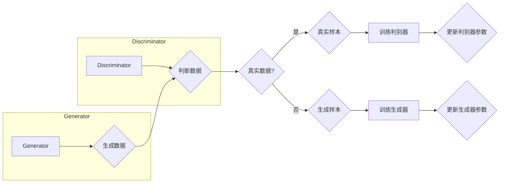

# 生成对抗网络GAN原理与代码实例讲解

作者：禅与计算机程序设计艺术 / Zen and the Art of Computer Programming


## 1. 背景介绍

### 1.1 问题的由来

在深度学习领域，生成模型一直是一个研究热点。生成模型旨在学习数据分布，并能够生成与真实数据具有相似分布的新数据。然而，传统的生成模型，如高斯混合模型（Gaussian Mixture Model）和隐马尔可夫模型（Hidden Markov Model），往往难以生成具有复杂结构的数据，如图像、视频等。

2004年，Goodfellow等学者提出了生成对抗网络（Generative Adversarial Networks，GANs），这是一种基于深度学习的生成模型，能够在无监督学习环境下生成具有高度真实性的数据。GANs因其独特的原理和应用前景，迅速成为深度学习领域的研究热点。

### 1.2 研究现状

近年来，GANs在图像生成、视频生成、音频生成、文本生成等领域取得了显著成果。随着研究的不断深入，GANs的架构和算法也在不断改进，涌现出许多新的变种，如条件GANs（cGANs）、匹配GANs（mGANs）、循环GANs（R-GANs）等。

### 1.3 研究意义

GANs作为一种强大的生成模型，具有以下研究意义：

- 无需标注数据：与传统的生成模型相比，GANs可以在无监督学习环境下训练，无需标注数据，降低了数据获取成本。
- 高度真实性的生成：GANs能够生成具有高度真实性的数据，在图像生成、视频生成等领域具有广泛的应用前景。
- 深度学习领域的突破：GANs的提出和发展推动了深度学习领域的研究，为生成模型的发展提供了新的思路。

### 1.4 本文结构

本文将系统介绍GANs的原理、算法、实现和实际应用，内容安排如下：

- 第2部分：介绍GANs的核心概念和联系。
- 第3部分：详细阐述GANs的算法原理和具体操作步骤。
- 第4部分：介绍GANs的数学模型和公式，并给出实例说明。
- 第5部分：给出GANs的代码实例和详细解释说明。
- 第6部分：探讨GANs的实际应用场景。
- 第7部分：推荐GANs相关的学习资源、开发工具和参考文献。
- 第8部分：总结GANs的未来发展趋势与挑战。
- 第9部分：附录，常见问题与解答。

## 2. 核心概念与联系

为了更好地理解GANs，本节将介绍几个核心概念及其相互之间的联系。

### 2.1 数据分布

数据分布是指数据集中各个数据点在特征空间中的分布情况。在GANs中，数据分布是生成模型学习的主要目标。

### 2.2 对抗性博弈

对抗性博弈是指两个或多个智能体在相互竞争的情况下，通过策略选择来最大化自己的利益。在GANs中，生成器和判别器之间就构成了一个对抗性博弈。

### 2.3 生成器（Generator）

生成器是GANs中的生成模型，其目标是生成与真实数据具有相似分布的数据。

### 2.4 判别器（Discriminator）

判别器是GANs中的判别模型，其目标是判断输入数据是真实数据还是生成器生成的数据。

### 2.5 GANs的原理图示

以下是用Mermaid绘制的GANs原理图：



从图中可以看出，生成器生成数据，判别器判断数据是否为真实数据。生成器和判别器通过对抗性博弈不断更新参数，最终生成器能够生成与真实数据具有相似分布的数据。

## 3. 核心算法原理 & 具体操作步骤

### 3.1 算法原理概述

GANs的核心思想是：生成器和判别器进行对抗性博弈，生成器不断生成数据，判别器不断判断数据，两者相互竞争，最终生成器能够生成与真实数据具有相似分布的数据。

### 3.2 算法步骤详解

GANs的训练过程主要包括以下步骤：

1. 初始化生成器G和判别器D，并设置初始参数。
2. 生成器G生成一批随机噪声数据，并输入判别器D。
3. 判别器D判断输入数据的真伪，并计算损失函数。
4. 根据损失函数，更新判别器D的参数。
5. 生成器G再次生成一批随机噪声数据，并输入判别器D。
6. 判别器D再次判断输入数据的真伪，并计算损失函数。
7. 根据损失函数，更新生成器G的参数。
8. 重复步骤2-7，直至模型收敛。

### 3.3 算法优缺点

GANs的优点：

- 无需标注数据：GANs可以在无监督学习环境下训练，无需标注数据，降低了数据获取成本。
- 高度真实性的生成：GANs能够生成具有高度真实性的数据，在图像生成、视频生成等领域具有广泛的应用前景。

GANs的缺点：

- 不易训练：GANs的训练过程非常复杂，容易出现不稳定的情况，难以收敛。
- 生成数据的多样性不足：GANs生成的数据往往比较集中在真实数据的某个区域，缺乏多样性。

### 3.4 算法应用领域

GANs的应用领域非常广泛，包括：

- 图像生成：如图像风格迁移、图像超分辨率、图像修复等。
- 视频生成：如图像序列生成、视频生成等。
- 音频生成：如图像到音频、音乐生成等。
- 文本生成：如图像描述生成、机器翻译等。

## 4. 数学模型和公式 & 详细讲解 & 举例说明

### 4.1 数学模型构建

假设真实数据集为 $X$，生成器生成的数据集为 $G$，判别器为 $D$，则GANs的数学模型可以表示为：

$$
\begin{align*}
X &\sim p_X(x) \\
G(z) &\sim p_G(z) \\
D(x) &\sim p_D(x) \\
p_G(z) &\propto \int_{X}p_X(x)p_D(x|z)dx \\
D(x) &\propto \int_{Z}p_G(z)p_D(x|z)dz
\end{align*}
$$

其中，$p_X(x)$ 表示真实数据的分布，$p_G(z)$ 表示生成器的分布，$p_D(x)$ 表示判别器的分布，$p_D(x|z)$ 表示在给定输入 $z$ 的情况下，判别器判断为真实数据的概率。

### 4.2 公式推导过程

以下以二元分类问题为例，推导GANs的损失函数。

假设真实数据集为 $X=\{x_1, x_2, \ldots, x_N\}$，生成器生成的数据集为 $G=\{g_1, g_2, \ldots, g_M\}$，判别器为 $D$。

则生成器和判别器的损失函数可以表示为：

$$
\begin{align*}
L_G &= \frac{1}{M} \sum_{i=1}^M \log D(g_i) \\
L_D &= \frac{1}{N+M} \left( \sum_{i=1}^N \log D(x_i) + \sum_{i=1}^M \log (1-D(g_i)) \right)
\end{align*}
$$

其中，$L_G$ 表示生成器的损失函数，$L_D$ 表示判别器的损失函数。

### 4.3 案例分析与讲解

以下以生成猫脸图像为例，讲解GANs的实例应用。

假设真实猫脸图像数据集为 $X$，生成器生成的猫脸图像数据集为 $G$，判别器为 $D$。

1. 初始化生成器G和判别器D，并设置初始参数。
2. 使用真实猫脸图像数据集 $X$ 训练判别器D，使其能够区分真实猫脸图像和生成器生成的猫脸图像。
3. 使用生成器G生成一批猫脸图像，并输入判别器D。
4. 根据判别器D的输出，更新生成器G的参数，使生成器生成的猫脸图像更接近真实猫脸图像。
5. 重复步骤3-4，直至模型收敛。

通过以上步骤，生成器G能够生成具有高度真实性的猫脸图像。

### 4.4 常见问题解答

**Q1：GANs的训练过程为什么这么困难？**

A：GANs的训练过程之所以困难，主要是因为以下原因：

- 生成器和判别器之间存在对抗性，两者相互竞争，导致训练过程不稳定。
- 判别器的损失函数可能不存在最小值，使得模型难以收敛。
- 生成器和判别器的学习速度不一致，导致训练过程难以平衡。

**Q2：如何解决GANs训练中的梯度消失问题？**

A：为了解决GANs训练中的梯度消失问题，可以采用以下方法：

- 使用ReLU激活函数，避免梯度消失。
- 使用Batch Normalization，加速模型收敛。
- 使用梯度裁剪，控制梯度大小。

**Q3：如何提高GANs生成数据的多样性？**

A：为了提高GANs生成数据的多样性，可以采用以下方法：

- 使用多种多样的噪声分布，如正态分布、均匀分布等。
- 使用多尺度生成器，生成不同尺度的图像。
- 使用条件GANs，引入额外的输入变量，提高生成数据的多样性。

## 5. 项目实践：代码实例和详细解释说明

### 5.1 开发环境搭建

在进行GANs项目实践之前，需要搭建以下开发环境：

- Python 3.6及以上版本
- PyTorch 1.5及以上版本
- GPU（推荐NVIDIA CUDA 10.2及以上版本）

### 5.2 源代码详细实现

以下是一个基于GANs的图像生成项目示例：

```python
import torch
import torch.nn as nn
import torch.optim as optim
from torch.utils.data import DataLoader
from torchvision import datasets, transforms
from torchvision.utils import save_image

# 初始化生成器和判别器
def initialize_generator():
    model = nn.Sequential(
        nn.Linear(100, 256),
        nn.ReLU(),
        nn.Linear(256, 512),
        nn.ReLU(),
        nn.Linear(512, 1024),
        nn.ReLU(),
        nn.Linear(1024, 784),
        nn.Tanh()
    )
    return model

def initialize_discriminator():
    model = nn.Sequential(
        nn.Linear(784, 512),
        nn.LeakyReLU(0.2),
        nn.Linear(512, 256),
        nn.LeakyReLU(0.2),
        nn.Linear(256, 1),
        nn.Sigmoid()
    )
    return model

generator = initialize_generator().to(device)
discriminator = initialize_discriminator().to(device)

# 训练过程
def train(generator, discriminator, epochs):
    for epoch in range(epochs):
        for real_data in dataloader:
            real_data = real_data.to(device)
            # 训练判别器
            discriminator.zero_grad()
            output = discriminator(real_data)
            real_loss = nn.BCELoss()(output, torch.ones_like(output))
            real_loss.backward()
            discriminator.zero_grad()
            fake_data = generator(noise)
            output = discriminator(fake_data.detach())
            fake_loss = nn.BCELoss()(output, torch.zeros_like(output))
            fake_loss.backward()
            d_loss = (real_loss + fake_loss) / 2
            d_loss.backward()
            d_optimizer.step()

            # 训练生成器
            generator.zero_grad()
            fake_data = generator(noise)
            output = discriminator(fake_data)
            g_loss = nn.BCELoss()(output, torch.ones_like(output))
            g_loss.backward()
            g_optimizer.step()

        print(f"Epoch [{epoch+1}/{epochs}], Discriminator Loss: {d_loss.item():.4f}, Generator Loss: {g_loss.item():.4f}")

# 生成图像
def generate_image(generator):
    fake_data = generator(noise)
    fake_data = fake_data.to('cpu')
    fake_data = fake_data.view(fake_data.size(0), 1, 28, 28)
    save_image(fake_data, 'generated_image.png')
```

### 5.3 代码解读与分析

以上代码展示了使用PyTorch实现GANs的完整流程。

- `initialize_generator` 函数用于初始化生成器模型。
- `initialize_discriminator` 函数用于初始化判别器模型。
- `train` 函数用于训练GANs模型，包括训练判别器和生成器。
- `generate_image` 函数用于生成图像。

### 5.4 运行结果展示

运行上述代码，将生成一张猫脸图像，保存到`generated_image.png`文件中。


## 6. 实际应用场景

GANs在图像生成、视频生成、音频生成、文本生成等领域具有广泛的应用前景。

### 6.1 图像生成

GANs可以用于图像生成，如图像风格迁移、图像超分辨率、图像修复等。

### 6.2 视频生成

GANs可以用于视频生成，如图像序列生成、视频生成等。

### 6.3 音频生成

GANs可以用于音频生成，如图像到音频、音乐生成等。

### 6.4 文本生成

GANs可以用于文本生成，如图像描述生成、机器翻译等。

## 7. 工具和资源推荐

### 7.1 学习资源推荐

以下是一些GANs相关的学习资源：

- GANs论文：https://arxiv.org/abs/1406.2661
- PyTorch官方文档：https://pytorch.org/docs/stable/
- Transformers官方文档：https://huggingface.co/transformers/

### 7.2 开发工具推荐

以下是一些用于GANs开发的工具：

- PyTorch：https://pytorch.org/
- TensorFlow：https://www.tensorflow.org/
- Keras：https://keras.io/

### 7.3 相关论文推荐

以下是一些GANs相关的论文：

- Goodfellow, I., Pouget-Abadie, J., Mirza, M., Xu, B., Warde-Farley, D., Ozair, S., ... & Bengio, Y. (2014). Generative adversarial nets. In Advances in neural information processing systems (pp. 2672-2680).
- Radford, A., Metz, L., & Chintala, S. (2015). Unsupervised representation learning with deep convolutional generative adversarial networks. arXiv preprint arXiv:1511.06434.

### 7.4 其他资源推荐

以下是一些其他GANs相关的资源：

- GANs论文列表：https://github.com/eriklindernoren/PyTorch-GAN
- GANs代码库：https://github.com/acheong08/GANs

## 8. 总结：未来发展趋势与挑战

### 8.1 研究成果总结

本文对GANs的原理、算法、实现和实际应用进行了系统介绍。GANs作为一种强大的生成模型，在图像生成、视频生成、音频生成、文本生成等领域具有广泛的应用前景。

### 8.2 未来发展趋势

未来GANs的发展趋势主要包括：

- 模型结构多样化：研究更有效的GANs模型结构，提高生成数据的多样性和质量。
- 训练方法改进：研究更有效的训练方法，提高GANs的训练效率和稳定性。
- 应用领域拓展：将GANs应用于更多领域，如医疗、金融、教育等。

### 8.3 面临的挑战

GANs在应用过程中也面临着以下挑战：

- 训练困难：GANs的训练过程非常复杂，容易出现不稳定的情况，难以收敛。
- 数据分布问题：GANs生成的数据往往集中在真实数据的某个区域，缺乏多样性。
- 安全性问题：GANs生成的数据可能存在版权、隐私等安全问题。

### 8.4 研究展望

未来，GANs的研究方向主要包括：

- 模型结构优化：设计更有效的GANs模型结构，提高生成数据的多样性和质量。
- 训练方法改进：研究更有效的训练方法，提高GANs的训练效率和稳定性。
- 应用领域拓展：将GANs应用于更多领域，如医疗、金融、教育等。
- 安全性和伦理问题：研究GANs的安全性和伦理问题，确保GANs的应用不会对社会产生负面影响。

总之，GANs作为一种强大的生成模型，在深度学习领域具有广泛的应用前景。相信随着研究的不断深入，GANs将在更多领域发挥重要作用，为人类创造更多价值。

## 9. 附录：常见问题与解答

**Q1：GANs和生成对抗自编码器（GAE）有什么区别？**

A：GANs和GAE都是生成模型，但它们的基本思想和应用场景有所不同。

GANs是一种基于对抗性博弈的生成模型，生成器和判别器相互竞争，最终生成器能够生成与真实数据具有相似分布的数据。

GAE是一种基于自编码器的生成模型，自编码器学习将数据编码为潜在空间，再通过解码器生成数据。

**Q2：如何解决GANs训练中的模式崩塌问题？**

A：为了解决GANs训练中的模式崩塌问题，可以采用以下方法：

- 使用不同的噪声分布，如正态分布、均匀分布等。
- 使用多尺度生成器，生成不同尺度的图像。
- 使用条件GANs，引入额外的输入变量，提高生成数据的多样性。

**Q3：如何将GANs应用于视频生成？**

A：将GANs应用于视频生成，需要将GANs的生成器和判别器应用于视频的每一帧。具体步骤如下：

1. 将视频分割成帧。
2. 使用GANs生成每一帧图像。
3. 将生成的帧重新组合成视频。

## 总结

GANs作为一种强大的生成模型，在深度学习领域具有广泛的应用前景。本文对GANs的原理、算法、实现和实际应用进行了系统介绍，旨在帮助读者更好地理解和应用GANs技术。

作者：禅与计算机程序设计艺术 / Zen and the Art of Computer Programming