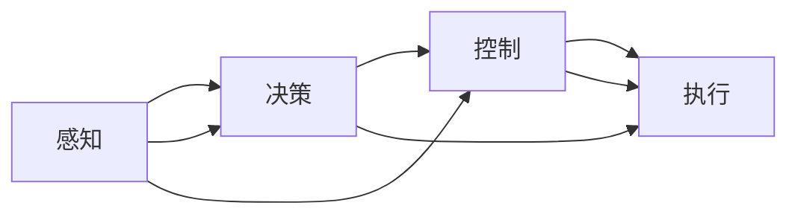

# 自动驾驶(Autonomous Driving)原理与代码实战案例讲解

作者：禅与计算机程序设计艺术 / Zen and the Art of Computer Programming

## 1. 背景介绍
### 1.1 问题的由来

自动驾驶技术作为人工智能领域的璀璨明珠，近年来受到了广泛关注。随着全球汽车产业的转型升级和智能化进程的加速，自动驾驶技术逐渐从实验室走向市场，成为未来交通出行的重要方向。然而，自动驾驶技术的实现并非一蹴而就，它需要融合感知、决策、控制等多方面的技术，并对算法、硬件、数据等多方面进行深入研究和开发。

### 1.2 研究现状

自动驾驶技术的研究始于上世纪60年代，经历了模拟、基于规则、基于模型、基于数据四个阶段。目前，自动驾驶技术正处于数据驱动阶段，以深度学习为代表的人工智能技术在自动驾驶领域取得了显著成果。根据SAE国际组织对自动驾驶的分级，当前自动驾驶技术主要集中于L2和L3级别，即辅助驾驶和部分自动驾驶阶段。

### 1.3 研究意义

自动驾驶技术的研发具有以下重要意义：

1. **提高交通安全**：通过减少人为错误，降低交通事故发生率，保障出行安全。
2. **提升交通效率**：优化道路资源利用，缓解交通拥堵，提高交通效率。
3. **降低运输成本**：降低人力成本，提高运输效率，降低运输成本。
4. **推动产业升级**：带动相关产业发展，如车联网、车路协同、智慧交通等。

### 1.4 本文结构

本文将详细介绍自动驾驶技术的原理，并通过代码实战案例展示自动驾驶系统的开发过程。文章结构如下：

- 第2部分：介绍自动驾驶技术的核心概念和联系。
- 第3部分：阐述自动驾驶技术的核心算法原理和具体操作步骤。
- 第4部分：讲解自动驾驶系统中常用的数学模型和公式，并结合实例进行说明。
- 第5部分：给出自动驾驶系统的代码实例，并进行详细解读。
- 第6部分：探讨自动驾驶技术的实际应用场景和未来发展趋势。
- 第7部分：推荐自动驾驶技术相关的学习资源、开发工具和参考文献。
- 第8部分：总结全文，展望自动驾驶技术的未来发展趋势与挑战。
- 第9部分：附录，提供常见问题与解答。

## 2. 核心概念与联系

为了更好地理解自动驾驶技术，本节将介绍几个核心概念及其相互联系。

### 2.1 自动驾驶系统架构

自动驾驶系统通常包含感知、决策、控制和执行四个核心模块，它们之间的关系如下：



- **感知**：通过传感器获取周围环境信息，如激光雷达、摄像头、毫米波雷达等，为决策模块提供输入。
- **决策**：根据感知信息，结合先验知识和任务目标，进行路径规划和行为决策。
- **控制**：根据决策结果，控制车辆执行相应的操作，如转向、加速、制动等。
- **执行**：通过执行模块控制车辆执行决策结果，实现自动驾驶。

### 2.2 自动驾驶任务

自动驾驶任务可以根据不同的任务目标和场景进行分类，常见的自动驾驶任务包括：

- **感知**：环境感知、障碍物检测、目标跟踪等。
- **决策**：路径规划、轨迹规划、行为决策等。
- **控制**：转向控制、制动控制、加速控制等。
- **执行**：车辆控制、环境感知、路径规划等。

### 2.3 自动驾驶技术体系

自动驾驶技术体系包含多个技术分支，包括：

- **感知技术**：激光雷达、摄像头、毫米波雷达、超声波雷达等。
- **决策规划技术**：路径规划、轨迹规划、行为决策等。
- **控制技术**：车辆控制、环境感知、路径规划等。
- **数据处理技术**：数据采集、数据标注、数据清洗、数据增强等。
- **人工智能技术**：深度学习、强化学习、规划算法等。

## 3. 核心算法原理 & 具体操作步骤
### 3.1 算法原理概述

自动驾驶技术的核心算法主要涉及感知、决策和控制三个方面。

### 3.2 算法步骤详解

#### 3.2.1 感知

感知模块负责获取周围环境信息，主要包括以下步骤：

1. **数据采集**：通过激光雷达、摄像头、毫米波雷达等传感器采集环境信息。
2. **数据预处理**：对采集到的数据进行滤波、去噪、去雨雾等预处理操作。
3. **特征提取**：从预处理后的数据中提取关键特征，如车道线、障碍物、交通标志等。
4. **目标检测和识别**：利用深度学习算法，如Faster R-CNN、SSD等，对提取的特征进行目标检测和识别。

#### 3.2.2 决策

决策模块根据感知模块提供的信息，结合先验知识和任务目标，进行路径规划和行为决策。主要步骤如下：

1. **场景理解**：根据感知信息和先验知识，对当前场景进行理解，包括交通规则、交通状况等。
2. **路径规划**：根据场景理解和任务目标，规划车辆行驶路径。
3. **轨迹规划**：根据路径规划结果，生成车辆的行驶轨迹。
4. **行为决策**：根据轨迹规划结果和场景信息，决定车辆的行为，如加速、减速、转向等。

#### 3.2.3 控制

控制模块根据决策模块提供的行为决策，控制车辆执行相应的操作。主要步骤如下：

1. **车辆控制**：根据行为决策，控制车辆的转向、制动和加速等动作。
2. **环境感知**：实时获取周围环境信息，更新感知模块数据。
3. **反馈控制**：根据环境感知和车辆状态信息，对车辆进行反馈控制，确保车辆按照预定轨迹行驶。

### 3.3 算法优缺点

自动驾驶算法的优缺点如下：

#### 3.3.1 感知算法

- **优点**：激光雷达感知能力强，对复杂天气和光照条件下的适应性较好。
- **缺点**：成本较高，数据处理复杂，对环境依赖性较强。

#### 3.3.2 决策算法

- **优点**：深度学习算法能够有效处理复杂场景，决策能力较强。
- **缺点**：对数据依赖性较强，泛化能力有限。

#### 3.3.3 控制算法

- **优点**：控制算法成熟，控制精度高。
- **缺点**：对车辆动力学特性依赖性强，适应不同车型和路况的能力有限。

### 3.4 算法应用领域

自动驾驶算法广泛应用于以下领域：

- **自动驾驶汽车**：如特斯拉、蔚来、小鹏等品牌。
- **无人驾驶出租车**：如Uber ATG、Lyft等。
- **无人配送车**：如京东、美团等。
- **自动驾驶公交**：如百度Apollo公交、小马智行等。

## 4. 数学模型和公式 & 详细讲解 & 举例说明
### 4.1 数学模型构建

自动驾驶技术的数学模型主要包括以下几类：

#### 4.1.1 感知模块

- **激光雷达点云处理**：

  $$
  P = (x, y, z) = R \times (X, Y, Z) + T
  $$

  其中，$P$ 为点云坐标，$R$ 为旋转矩阵，$T$ 为平移矩阵，$X, Y, Z$ 为原始点云坐标。

- **深度估计**：

  $$
  d = \frac{f \cdot l}{u}
  $$

  其中，$d$ 为深度，$f$ 为相机焦距，$l$ 为实际距离，$u$ 为图像中点与相机中心的距离。

#### 4.1.2 决策模块

- **路径规划**：

  $$
  C = G + h(c) + \alpha(c)
  $$

  其中，$C$ 为成本函数，$G$ 为累积成本，$h$ 为启发式函数，$\alpha$ 为平滑系数。

- **轨迹规划**：

  $$
  x(t) = x_0 + v \cdot t \cdot \cos(\theta)
  $$

  $$
  y(t) = y_0 + v \cdot t \cdot \sin(\theta)
  $$

  其中，$x(t), y(t)$ 为轨迹坐标，$x_0, y_0$ 为起点坐标，$v$ 为速度，$\theta$ 为航向角。

#### 4.1.3 控制模块

- **PID控制**：

  $$
  u = K_p \cdot e + K_i \cdot \int e + K_d \cdot \frac{de}{dt}
  $$

  其中，$u$ 为控制量，$e$ 为误差，$K_p, K_i, K_d$ 为PID参数。

### 4.2 公式推导过程

以激光雷达点云处理为例，介绍公式推导过程。

假设激光雷达扫描到一个点云坐标 $P = (X, Y, Z)$，需要将其转换为相机坐标系下的坐标 $P' = (x', y', z')$。

首先，将点云坐标转换为世界坐标系：

$$
P_w = R_w \times P + T_w
$$

其中，$R_w$ 为世界坐标系旋转矩阵，$T_w$ 为世界坐标系平移矩阵。

然后，将世界坐标系坐标转换为相机坐标系：

$$
P' = R_w^T \times P_w - R_w^T \times T_w
$$

其中，$R_w^T$ 为世界坐标系旋转矩阵的转置。

### 4.3 案例分析与讲解

以下以自动驾驶中的路径规划为例，展示如何使用A*算法进行路径规划。

假设在二维平面上，存在一个起点 $O$ 和一个终点 $D$，需要在起点和终点之间找到一条最优路径。

1. **构建图**：将二维平面划分为网格，每个网格节点表示一个可能的位置，节点之间通过边连接。
2. **计算启发式函数**：计算每个节点到终点的距离，作为启发式函数 $h(n)$。
3. **选择起始节点**：选择起点 $O$ 作为起始节点。
4. **扩展节点**：按照启发式函数 $h(n)$ 的值，从起始节点 $O$ 开始扩展节点。
5. **更新父节点**：在扩展过程中，记录每个节点的父节点，以便后续回溯路径。
6. **判断终止条件**：当扩展到终点 $D$ 时，终止扩展过程。
7. **回溯路径**：从终点 $D$ 开始，根据父节点回溯路径，得到最优路径。

### 4.4 常见问题解答

**Q1：如何选择合适的感知算法？**

A：选择感知算法需要考虑以下因素：
- **成本**：激光雷达成本较高，摄像头成本较低，毫米波雷达介于两者之间。
- **适应性**：激光雷达对复杂天气和光照条件下的适应性较好，摄像头受光照和天气影响较大，毫米波雷达受雨雾影响较大。
- **数据处理**：激光雷达数据处理复杂，摄像头数据处理简单，毫米波雷达数据处理介于两者之间。

**Q2：如何选择合适的决策算法？**

A：选择决策算法需要考虑以下因素：
- **数据依赖性**：深度学习算法对数据依赖性较强，传统方法对数据依赖性较弱。
- **泛化能力**：深度学习算法泛化能力较强，传统方法泛化能力有限。
- **实时性**：传统方法计算速度较快，深度学习算法计算速度较慢。

**Q3：如何选择合适的控制算法？**

A：选择控制算法需要考虑以下因素：
- **控制精度**：PID控制精度较高，深度学习控制精度较低。
- **适应性**：PID控制适应性较强，深度学习控制适应性有限。
- **实时性**：PID控制实时性较高，深度学习控制实时性较低。

## 5. 项目实践：代码实例和详细解释说明
### 5.1 开发环境搭建

以下以使用Python和OpenCV进行图像处理为例，介绍自动驾驶项目的开发环境搭建过程。

1. 安装Python和pip：

   ```bash
   sudo apt-get install python3-pip python3-dev
   ```

2. 创建虚拟环境：

   ```bash
   python3 -m venv venv
   source venv/bin/activate
   ```

3. 安装OpenCV：

   ```bash
   pip install opencv-python
   ```

### 5.2 源代码详细实现

以下是一个简单的自动驾驶图像处理代码示例：

```python
import cv2
import numpy as np

def process_image(image):
    # 转换为灰度图
    gray = cv2.cvtColor(image, cv2.COLOR_BGR2GRAY)

    # 高斯模糊
    blurred = cv2.GaussianBlur(gray, (5, 5), 0)

    # Canny边缘检测
    edges = cv2.Canny(blurred, 50, 150)

    # 轮廓检测
    contours, _ = cv2.findContours(edges, cv2.RETR_EXTERNAL, cv2.CHAIN_APPROX_SIMPLE)

    # 选择合适的轮廓
    for contour in contours:
        perimeter = cv2.arcLength(contour, True)
        if perimeter > 200:
            cv2.drawContours(image, [contour], -1, (0, 255, 0), 2)

    return image

if __name__ == '__main__':
    image = cv2.imread('test.jpg')
    processed_image = process_image(image)
    cv2.imshow('Processed Image', processed_image)
    cv2.waitKey(0)
    cv2.destroyAllWindows()
```

### 5.3 代码解读与分析

1. **读取图像**：使用 `cv2.imread()` 函数读取图像文件。
2. **转换为灰度图**：使用 `cv2.cvtColor()` 函数将图像转换为灰度图。
3. **高斯模糊**：使用 `cv2.GaussianBlur()` 函数对图像进行高斯模糊处理，去除噪声。
4. **Canny边缘检测**：使用 `cv2.Canny()` 函数对图像进行Canny边缘检测。
5. **轮廓检测**：使用 `cv2.findContours()` 函数检测图像中的轮廓。
6. **选择合适的轮廓**：根据轮廓周长筛选合适的轮廓。
7. **绘制轮廓**：使用 `cv2.drawContours()` 函数绘制轮廓。
8. **显示图像**：使用 `cv2.imshow()` 函数显示图像。
9. **等待按键**：使用 `cv2.waitKey(0)` 函数等待按键输入。
10. **销毁所有窗口**：使用 `cv2.destroyAllWindows()` 函数销毁所有窗口。

### 5.4 运行结果展示

运行上述代码，将显示一个经过处理的图像，其中包含了被检测到的轮廓。

## 6. 实际应用场景
### 6.1 自动驾驶汽车

自动驾驶汽车是自动驾驶技术的典型应用场景，它将感知、决策和控制等技术融合在一起，实现汽车的自主驾驶。

### 6.2 无人驾驶出租车

无人驾驶出租车是自动驾驶技术的重要应用场景之一，它将自动驾驶技术与共享出行相结合，为用户提供便捷的出行服务。

### 6.3 无人配送车

无人配送车是自动驾驶技术在物流领域的应用，它能够实现货物的自主配送，提高物流效率。

### 6.4 自动驾驶公交

自动驾驶公交是自动驾驶技术在公共交通领域的应用，它能够提高公共交通的效率和安全性。

### 6.5 未来应用展望

随着自动驾驶技术的不断发展，未来将在更多领域得到应用，如：

- **自动驾驶卡车**：提高物流效率，降低运输成本。
- **自动驾驶船舶**：提高航运效率，降低能源消耗。
- **自动驾驶无人机**：实现无人机送货、巡检等功能。
- **自动驾驶火车**：提高火车运行效率，降低运营成本。

## 7. 工具和资源推荐
### 7.1 学习资源推荐

以下是一些学习自动驾驶技术的资源：

- **书籍**：
  - 《深度学习与自动驾驶》
  - 《自动驾驶原理与技术》
  - 《计算机视觉：算法与应用》
- **在线课程**：
  - Coursera上的《自动驾驶汽车》
  - Udacity的《自动驾驶工程师纳米学位》
  - 京东云的《自动驾驶技术》
- **开源项目**：
  - 百度Apollo
  - 美团无人车平台
  - 腾讯AI Lab的AutoX平台

### 7.2 开发工具推荐

以下是一些用于自动驾驶技术开发的工具：

- **编程语言**：Python、C++、Java
- **深度学习框架**：TensorFlow、PyTorch、Keras
- **计算机视觉库**：OpenCV、OpenPose、Dlib
- **自动驾驶仿真平台**：Carla、AirSim、SUMO

### 7.3 相关论文推荐

以下是一些自动驾驶技术领域的经典论文：

- **《A New Approach for Real-Time 3D Object Detection from Monocular Images**》
- **《3D Object Detection and Tracking from a Single Camera**》
- **《Detection and Tracking of Multiple Moving Objects Using Deep Learning**》
- **《Visual Odometry Based on Deep Learning**》
- **《Recurrent Neural Networks for Language Modeling**》

### 7.4 其他资源推荐

以下是一些其他资源：

- **技术社区**：知乎、CSDN、51CTO
- **技术博客**：极客公园、36氪、雷锋网
- **技术论坛**：中国人工智能学会论坛、机器之心论坛

## 8. 总结：未来发展趋势与挑战
### 8.1 研究成果总结

本文介绍了自动驾驶技术的原理、算法、应用场景以及未来发展趋势。通过分析自动驾驶技术的研究现状，我们可以看到，自动驾驶技术已经取得了显著的成果，并将在未来交通出行领域发挥重要作用。

### 8.2 未来发展趋势

自动驾驶技术未来将呈现以下发展趋势：

- **感知技术**：多传感器融合、高精度定位、高精度地图。
- **决策规划技术**：多智能体协同、交通流量预测、路径规划优化。
- **控制技术**：自动驾驶芯片、深度学习控制算法、自主泊车技术。
- **人工智能技术**：强化学习、多智能体协同、人机交互。

### 8.3 面临的挑战

自动驾驶技术面临的挑战主要包括：

- **数据获取**：海量标注数据获取成本高昂，数据标注质量难以保证。
- **算法精度**：算法在复杂场景下的精度和鲁棒性仍需提高。
- **安全性和可靠性**：确保自动驾驶系统的安全性和可靠性是至关重要的。
- **法律法规**：自动驾驶汽车的法律法规尚不完善，需要逐步建立和完善。

### 8.4 研究展望

自动驾驶技术的研究需要从以下几个方面进行突破：

- **数据获取**：探索新的数据获取方式，降低数据标注成本，提高数据质量。
- **算法研究**：研究更加鲁棒、高效的算法，提高算法精度和泛化能力。
- **安全性和可靠性**：提高自动驾驶系统的安全性和可靠性，确保系统在各种场景下都能稳定运行。
- **法律法规**：逐步建立和完善自动驾驶汽车的法律法规，推动自动驾驶汽车的商业化进程。

## 9. 附录：常见问题与解答

**Q1：自动驾驶技术是否能够完全取代人类驾驶员？**

A：目前，自动驾驶技术还处于发展阶段，还不能完全取代人类驾驶员。在未来，随着技术的不断进步，自动驾驶汽车有望逐步取代人类驾驶员，实现完全自动驾驶。

**Q2：自动驾驶技术有哪些应用场景？**

A：自动驾驶技术可以应用于自动驾驶汽车、无人驾驶出租车、无人配送车、自动驾驶公交、自动驾驶卡车、自动驾驶船舶、自动驾驶无人机、自动驾驶火车等多个领域。

**Q3：自动驾驶技术面临哪些挑战？**

A：自动驾驶技术面临的挑战主要包括数据获取、算法精度、安全性和可靠性、法律法规等。

**Q4：如何学习自动驾驶技术？**

A：学习自动驾驶技术可以从以下几个方面入手：
- 学习计算机视觉、机器学习、深度学习等相关基础知识。
- 学习自动驾驶技术相关的课程和书籍。
- 参与开源项目，实战锻炼编程能力。
- 关注自动驾驶技术领域的最新进展。

**Q5：自动驾驶技术是否会产生就业问题？**

A：自动驾驶技术的推广和应用可能会对部分驾驶员产生就业压力，但同时也将创造新的就业岗位，如自动驾驶系统测试员、自动驾驶系统维护员等。

**Q6：自动驾驶技术是否会带来安全问题？**

A：自动驾驶技术本身并不会带来安全问题，但需要在研发、测试和部署过程中严格把控，确保系统的安全性和可靠性。

**Q7：自动驾驶技术是否会侵犯个人隐私？**

A：自动驾驶技术在获取和处理数据时，需要尊重个人隐私，采取有效措施保护个人隐私不被泄露。

**Q8：自动驾驶技术是否会加剧交通拥堵？**

A：自动驾驶技术有望通过优化交通流、提高交通效率，缓解交通拥堵。

**Q9：自动驾驶技术是否会提高交通事故率？**

A：自动驾驶技术有望通过减少人为错误，降低交通事故率。

**Q10：自动驾驶技术是否会改变人类出行方式？**

A：自动驾驶技术将改变人类出行方式，提高出行效率，降低出行成本。