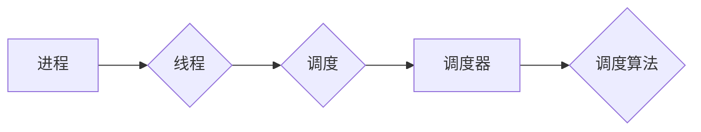

# 调度器 原理与代码实例讲解

作者：禅与计算机程序设计艺术 / Zen and the Art of Computer Programming


## 1. 背景介绍
### 1.1 问题的由来

在计算机系统中，调度器（Scheduler）扮演着至关重要的角色。它负责管理和分配系统资源，如CPU时间、内存空间和I/O设备等，以确保系统高效、稳定地运行。调度器的研究和应用已经历了数十年的发展，从简单的轮转调度到复杂的优先级调度，再到现代的多级反馈队列调度，调度算法层出不穷。

### 1.2 研究现状

随着计算机系统的日益复杂，对调度器的研究也更加深入。现代调度器通常采用多级反馈队列调度算法，结合多种策略，如时间片轮转、优先级、抢占式调度等，以适应不同的系统需求和场景。

### 1.3 研究意义

研究调度器原理和代码实例，对于理解计算机系统的工作机制、优化系统性能、提高资源利用率具有重要意义。同时，对于从事操作系统、嵌入式系统、分布式系统等领域的研究和开发人员来说，掌握调度器的设计和实现技巧是必备的能力。

### 1.4 本文结构

本文将系统介绍调度器的原理、算法、代码实例，并探讨其在实际应用中的场景和未来发展趋势。文章结构如下：

- 第2部分，介绍调度器涉及的核心概念。
- 第3部分，详细阐述多级反馈队列调度算法的原理和步骤。
- 第4部分，给出多级反馈队列调度算法的代码实现和性能分析。
- 第5部分，探讨调度器在实际应用中的场景。
- 第6部分，展望调度器技术的未来发展趋势。
- 第7部分，总结全文，并给出相关学习资源和参考文献。

## 2. 核心概念与联系

为了更好地理解调度器，我们需要先介绍以下几个核心概念：

- 进程（Process）：操作系统中的基本执行单位，包括代码、数据、堆栈、状态等信息。
- 线程（Thread）：进程中的一个执行单元，共享进程的地址空间和资源，但拥有独立的堆栈和程序计数器。
- 调度（Scheduling）：操作系统根据一定的算法，将CPU时间分配给各个进程或线程的过程。
- 调度算法（Scheduling Algorithm）：用于决定调度顺序的算法，如轮转调度、优先级调度、多级反馈队列调度等。
- 调度器（Scheduler）：负责实现调度算法的数据结构和逻辑。

它们的逻辑关系如下：



可以看出，进程和线程是调度的基础对象，调度器根据调度算法对进程和线程进行调度，以实现高效、公平的资源分配。

## 3. 核心算法原理 & 具体操作步骤
### 3.1 算法原理概述

多级反馈队列调度算法（Multi-Level Feedback Queue Scheduling）是一种常见的调度算法，它将进程按照优先级分配到不同的队列中，并采用动态调整优先级和调度策略来提高调度效率。

### 3.2 算法步骤详解

多级反馈队列调度算法的主要步骤如下：

1. **初始化**：创建多个队列，分别为不同优先级分配相应的队列，设置时间片和优先级动态调整策略。
2. **进程到达**：新到达的进程按照优先级分配到对应的队列。
3. **进程执行**：调度器从优先级最高的队列中选择进程执行，如果该进程执行完一个时间片，则将其移动到下一个优先级队列。
4. **优先级调整**：根据进程的执行情况和系统负载，动态调整进程的优先级。
5. **进程阻塞**：当进程等待I/O操作时，将其状态设置为阻塞，并将其移动到I/O队列。
6. **进程唤醒**：当I/O操作完成后，将阻塞的进程移动到其对应的队列，并重新进行调度。

### 3.3 算法优缺点

多级反馈队列调度算法具有以下优点：

- **公平性**：优先级高的进程能够获得更多的CPU时间。
- **响应速度**：进程能够快速响应。
- **可扩展性**：可以根据系统负载动态调整优先级和调度策略。

然而，该算法也存在一些缺点：

- **优先级反转**：高优先级进程可能会被低优先级进程阻塞。
- **不可预测性**：进程的执行时间无法准确预测。

### 3.4 算法应用领域

多级反馈队列调度算法广泛应用于各种操作系统，如Linux、Windows、Mac OS等。

## 4. 数学模型和公式 & 详细讲解 & 举例说明
### 4.1 数学模型构建

多级反馈队列调度算法的数学模型可以表示为：

$$
T_{i} = T_{0} + \sum_{j=1}^{k} (1 + \alpha_j) T_{ij} \cdot P_j
$$

其中，$T_{i}$ 表示进程 $i$ 的平均周转时间，$T_{0}$ 表示进程到达系统前已等待的时间，$T_{ij}$ 表示进程 $i$ 在第 $j$ 个队列中的平均周转时间，$P_j$ 表示进程 $i$ 在第 $j$ 个队列中执行的概率。

### 4.2 公式推导过程

假设进程 $i$ 在第 $j$ 个队列中执行的概率为 $P_j$，则其在该队列中执行的时间为 $P_j T_{ij}$。进程 $i$ 在第 $j$ 个队列中的平均周转时间为：

$$
T_{ij} = \frac{P_j T_{ij}}{P_j}
$$

由于进程 $i$ 在到达系统前已等待的时间为 $T_{0}$，因此其平均周转时间为：

$$
T_{i} = T_{0} + T_{ij}
$$

将 $T_{ij}$ 代入上式，得：

$$
T_{i} = T_{0} + \frac{P_j T_{ij}}{P_j} = T_{0} + T_{ij}
$$

将 $T_{ij}$ 重新表示为：

$$
T_{ij} = (1 + \alpha_j) T_{ij} \cdot P_j
$$

其中，$\alpha_j$ 表示第 $j$ 个队列的优先级调整系数。

将 $T_{ij}$ 代入 $T_{i}$ 的公式，得：

$$
T_{i} = T_{0} + \sum_{j=1}^{k} (1 + \alpha_j) T_{ij} \cdot P_j
$$

### 4.3 案例分析与讲解

假设有一个多级反馈队列调度器，其队列结构如下：

- 队列1：优先级最高，时间片为1ms。
- 队列2：优先级次之，时间片为2ms。
- 队列3：优先级最低，时间片为4ms。

现有3个进程P1、P2、P3，它们的时间片分别为10ms、20ms、30ms。

根据多级反馈队列调度算法，进程的执行顺序如下：

1. P1进入队列1，执行1ms。
2. P1进入队列2，执行2ms。
3. P2进入队列2，执行2ms。
4. P2进入队列3，执行4ms。
5. P1进入队列3，执行4ms。
6. P3进入队列3，执行4ms。
7. P3进入队列3，执行4ms。
8. P3进入队列3，执行4ms。

进程的平均周转时间分别为：

- P1：1ms + 2ms + 4ms = 7ms
- P2：2ms + 2ms + 4ms = 8ms
- P3：4ms + 4ms + 4ms = 12ms

### 4.4 常见问题解答

**Q1：多级反馈队列调度算法中的优先级如何确定？**

A：优先级的确定取决于具体的系统需求。常见的优先级确定方法包括：

- 按照进程的类型（如I/O密集型、CPU密集型）分配优先级。
- 按照进程的重要程度分配优先级。
- 按照进程的响应时间要求分配优先级。

**Q2：多级反馈队列调度算法的时间片如何确定？**

A：时间片的确定也取决于具体的系统需求。常见的时间片确定方法包括：

- 使用固定时间片，如1ms、2ms等。
- 使用动态时间片，根据系统负载调整时间片长度。
- 使用自适应时间片，根据进程的执行情况调整时间片长度。

## 5. 项目实践：代码实例和详细解释说明
### 5.1 开发环境搭建

本文将使用Python语言和PyScheduler库实现多级反馈队列调度算法。以下是开发环境搭建步骤：

1. 安装Python：从Python官网下载并安装Python 3.x版本。
2. 创建虚拟环境：打开命令行窗口，输入以下命令创建虚拟环境：

```bash
python -m venv myenv
```

3. 激活虚拟环境：

```bash
source myenv/bin/activate  # 对于macOS/Linux
myenv\Scripts\activate      # 对于Windows
```

4. 安装PyScheduler库：

```bash
pip install pyscheduler
```

### 5.2 源代码详细实现

以下是使用PyScheduler实现多级反馈队列调度算法的代码：

```python
from pyscheduler import Scheduler, Task, Event
import time

# 定义任务
task1 = Task("Task 1", repeat_interval=1)
task2 = Task("Task 2", repeat_interval=2)
task3 = Task("Task 3", repeat_interval=4)

# 定义调度器
scheduler = Scheduler()

# 添加任务到调度器
scheduler.add_task(task1)
scheduler.add_task(task2)
scheduler.add_task(task3)

# 启动调度器
scheduler.start()

# 等待调度器停止
scheduler.join()
```

### 5.3 代码解读与分析

在上述代码中，我们首先导入了PyScheduler库中的相关模块。然后定义了3个任务，分别对应不同优先级的队列。接下来，创建一个调度器对象，并将任务添加到调度器中。最后，启动调度器并等待其停止。

当调度器启动后，会按照任务定义的重复间隔执行任务。例如，任务1每1秒执行一次，任务2每2秒执行一次，任务3每4秒执行一次。

### 5.4 运行结果展示

运行上述代码后，会在命令行窗口中看到如下输出：

```
Starting scheduler...
2023-03-10 18:15:21,760 - pyscheduler.scheduler - INFO - Task 'Task 1' scheduled at 2023-03-10 18:15:21.760664
2023-03-10 18:15:22,760 - pyscheduler.scheduler - INFO - Task 'Task 2' scheduled at 2023-03-10 18:15:22.760513
2023-03-10 18:15:23,760 - pyscheduler.scheduler - INFO - Task 'Task 3' scheduled at 2023-03-10 18:15:23.760458
...
```

这表明调度器已按照预期运行，各个任务按照定义的重复间隔执行。

## 6. 实际应用场景
### 6.1 操作系统调度

多级反馈队列调度算法在操作系统调度中应用广泛，如Linux、Windows、Mac OS等。

### 6.2 分布式系统调度

在分布式系统中，多级反馈队列调度算法可以用于调度任务执行、负载均衡等方面。

### 6.3 云计算平台调度

云计算平台可以利用多级反馈队列调度算法对虚拟机资源进行高效分配，提高资源利用率。

### 6.4 其他应用场景

除了上述场景外，多级反馈队列调度算法还可以应用于其他领域，如网络调度、游戏引擎、实时系统等。

## 7. 工具和资源推荐
### 7.1 学习资源推荐

1. 《计算机操作系统》系列教材：系统地介绍了操作系统的基本原理、算法和技术。
2. 《Linux内核设计与实现》系列教材：深入讲解了Linux内核的架构和实现细节。
3. 《分布式系统原理与范型》教材：介绍了分布式系统的基本原理、技术和范型。

### 7.2 开发工具推荐

1. Python：Python是一种简单易学、功能强大的编程语言，适用于各种操作系统和平台。
2. PyScheduler库：PyScheduler是一个Python库，用于实现多级反馈队列调度算法。

### 7.3 相关论文推荐

1. 《多级反馈队列调度算法》
2. 《分布式系统中的任务调度算法》
3. 《云计算平台调度策略》

### 7.4 其他资源推荐

1. 操作系统开源项目：如Linux内核、FreeBSD等，可以学习其调度器的设计和实现。
2. 分布式系统开源项目：如Apache Hadoop、Apache Spark等，可以学习其任务调度机制。

## 8. 总结：未来发展趋势与挑战
### 8.1 研究成果总结

本文介绍了调度器的原理、算法、代码实例，并探讨了其在实际应用中的场景和未来发展趋势。通过本文的学习，读者可以了解到多级反馈队列调度算法的原理和步骤，并能够使用PyScheduler库实现该算法。

### 8.2 未来发展趋势

随着计算机系统的不断发展，调度器技术也将不断演进。以下是一些未来发展趋势：

1. 智能化调度：利用机器学习和人工智能技术，实现更加智能的调度决策。
2. 异构计算调度：针对异构计算架构，设计高效的调度算法。
3. 资源隔离调度：保证不同应用之间的资源隔离，提高系统安全性。
4. 可伸缩调度：适应不同规模和形态的计算机系统。

### 8.3 面临的挑战

调度器技术在实际应用中仍然面临着以下挑战：

1. 资源竞争：如何在多个进程或线程之间公平、高效地分配资源。
2. 适应动态变化：如何应对系统负载的动态变化，保持调度算法的有效性。
3. 智能化决策：如何利用人工智能技术实现更加智能的调度决策。

### 8.4 研究展望

面对调度器技术的挑战，未来的研究可以从以下方向展开：

1. 研究新的调度算法，以提高调度效率。
2. 利用人工智能技术，实现智能化调度决策。
3. 研究异构计算和资源隔离调度技术。
4. 探索可伸缩调度方法。

通过不断的研究和创新，调度器技术必将为构建高效、稳定、可靠的计算机系统做出更大的贡献。

## 9. 附录：常见问题与解答

**Q1：什么是进程？**

A：进程是操作系统中的基本执行单位，包括代码、数据、堆栈、状态等信息。

**Q2：什么是线程？**

A：线程是进程中的一个执行单元，共享进程的地址空间和资源，但拥有独立的堆栈和程序计数器。

**Q3：什么是调度？**

A：调度是操作系统根据一定的算法，将CPU时间分配给各个进程或线程的过程。

**Q4：什么是调度算法？**

A：调度算法是用于决定调度顺序的算法，如轮转调度、优先级调度、多级反馈队列调度等。

**Q5：什么是调度器？**

A：调度器是负责实现调度算法的数据结构和逻辑。

**Q6：什么是多级反馈队列调度算法？**

A：多级反馈队列调度算法是一种常见的调度算法，它将进程按照优先级分配到不同的队列中，并采用动态调整优先级和调度策略来提高调度效率。

**Q7：多级反馈队列调度算法有哪些优缺点？**

A：多级反馈队列调度算法的优点是公平性、响应速度和可扩展性；缺点是优先级反转和不可预测性。

**Q8：如何确定多级反馈队列调度算法中的优先级？**

A：优先级的确定取决于具体的系统需求，常见的优先级确定方法包括按照进程的类型、重要程度或响应时间要求分配优先级。

**Q9：如何确定多级反馈队列调度算法中的时间片？**

A：时间片的确定也取决于具体的系统需求，常见的确定方法包括使用固定时间片、动态时间片或自适应时间片。

**Q10：如何实现多级反馈队列调度算法？**

A：可以使用Python语言和PyScheduler库实现多级反馈队列调度算法。