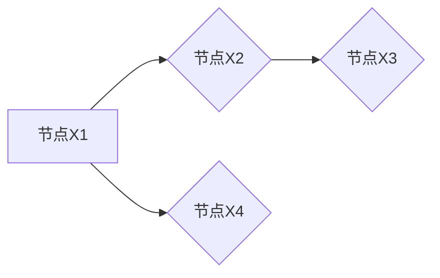
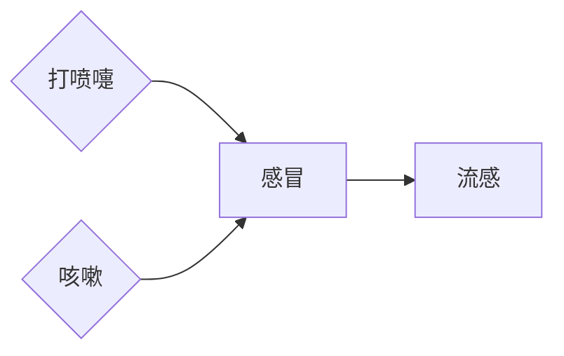

# 贝叶斯网络 (Bayesian Networks) 原理与代码实例讲解

作者：禅与计算机程序设计艺术 / Zen and the Art of Computer Programming

## 1. 背景介绍
### 1.1 问题的由来

贝叶斯网络（Bayesian Networks，简称BNs）是一种基于概率推理的图形模型，用于表示变量之间的依赖关系。它将不确定性量化，并允许我们通过观察一些变量的状态来推断其他变量的状态。贝叶斯网络在人工智能、机器学习、统计学习、医疗诊断、风险评估等领域有着广泛的应用。

随着大数据时代的到来，信息爆炸使得对复杂系统的理解和决策变得更加困难。贝叶斯网络提供了一种结构化的方式来表示和处理不确定性，并帮助我们从有限的信息中做出合理的推断。

### 1.2 研究现状

贝叶斯网络的研究始于20世纪70年代，经过几十年的发展，已经形成了较为成熟的理论体系。近年来，随着计算能力的提升和机器学习技术的进步，贝叶斯网络在人工智能领域得到了广泛应用，并在多个领域取得了突破性的成果。

### 1.3 研究意义

贝叶斯网络具有重要的研究意义，主要体现在以下几个方面：

- **模型不确定性**：贝叶斯网络将不确定性量化，为处理复杂系统中的不确定性提供了有效的工具。
- **推理能力**：贝叶斯网络能够根据已知信息进行推理，为决策提供支持。
- **可视化**：贝叶斯网络采用图形化的方式表示变量之间的关系，易于理解和解释。
- **可扩展性**：贝叶斯网络可以方便地扩展和修改，适应不同领域的需求。

### 1.4 本文结构

本文将系统介绍贝叶斯网络的原理、算法和应用。具体内容安排如下：

- 第2部分，介绍贝叶斯网络的核心概念和联系。
- 第3部分，详细阐述贝叶斯网络的算法原理和具体操作步骤。
- 第4部分，介绍贝叶斯网络的数学模型和公式，并结合实例进行讲解。
- 第5部分，给出贝叶斯网络的代码实例，并对关键代码进行解读和分析。
- 第6部分，探讨贝叶斯网络在实际应用场景中的案例。
- 第7部分，推荐贝叶斯网络相关的学习资源、开发工具和参考文献。
- 第8部分，总结全文，展望贝叶斯网络技术的未来发展趋势和挑战。

## 2. 核心概念与联系

为了更好地理解贝叶斯网络，我们需要掌握以下几个核心概念：

- **节点**：表示系统中的一个变量，通常用圆圈表示。
- **边**：表示变量之间的依赖关系，通常用线段表示。
- **条件概率表（CPT）**：表示变量之间的条件概率分布，通常用表格表示。
- **概率推理**：根据已知信息推断未知信息的过程。

贝叶斯网络的逻辑关系如下所示：



其中，边上的箭头表示变量之间的依赖关系，即节点X1依赖于节点X2，节点X2依赖于节点X3，节点X1依赖于节点X4。

## 3. 核心算法原理 & 具体操作步骤

### 3.1 算法原理概述

贝叶斯网络的核心算法包括结构学习和参数学习。

- **结构学习**：根据数据或先验知识确定变量之间的依赖关系。
- **参数学习**：根据数据确定条件概率表。

### 3.2 算法步骤详解

**结构学习**：

1. **数据预处理**：对原始数据进行预处理，包括缺失值处理、异常值处理等。
2. **构建邻接矩阵**：根据数据或先验知识，构建变量之间的邻接矩阵。
3. **结构搜索算法**：根据邻接矩阵，使用启发式算法（如 hill-climbing、AOAC、Tabu search 等）搜索最优结构。

**参数学习**：

1. **最大似然估计**：根据数据计算条件概率表，使似然函数最大化。
2. **贝叶斯估计**：结合先验知识，对条件概率表进行贝叶斯估计。

### 3.3 算法优缺点

**结构学习**：

- **优点**：能够根据数据或先验知识确定变量之间的依赖关系。
- **缺点**：易受噪声数据影响，可能导致结构搜索陷入局部最优。

**参数学习**：

- **优点**：能够根据数据计算条件概率表，使模型更符合实际。
- **缺点**：对数据质量要求较高，对异常值敏感。

### 3.4 算法应用领域

贝叶斯网络的算法在多个领域有广泛应用，如：

- **医疗诊断**：用于疾病诊断、风险评估等。
- **金融风险**：用于信用评估、投资决策等。
- **自然语言处理**：用于文本分类、情感分析等。
- **图像处理**：用于图像分割、目标检测等。

## 4. 数学模型和公式 & 详细讲解 & 举例说明

### 4.1 数学模型构建

贝叶斯网络的数学模型可以表示为：

$$
P(X) = \prod_{i=1}^n P(x_i) \prod_{i=1}^n \prod_{j \in P_i} P(x_j | x_{P_i})
$$

其中，$X = \{x_1, x_2, ..., x_n\}$ 为变量集合，$P(x_i)$ 为变量 $x_i$ 的边缘概率，$P(x_j | x_{P_i})$ 为条件概率表。

### 4.2 公式推导过程

贝叶斯网络的公式推导过程如下：

1. **边缘概率**：根据全概率公式，有：

$$
P(x_i) = \sum_{x_{P_i}} P(x_i, x_{P_i})
$$

2. **条件概率**：根据条件概率公式，有：

$$
P(x_j | x_{P_i}) = \frac{P(x_j, x_{P_i})}{P(x_{P_i})}
$$

3. **贝叶斯网络概率公式**：将上述两个公式代入贝叶斯网络概率公式，得到：

$$
P(X) = \prod_{i=1}^n P(x_i) \prod_{i=1}^n \prod_{j \in P_i} \frac{P(x_j, x_{P_i})}{P(x_{P_i})}
$$

4. **化简**：由于 $P(x_j, x_{P_i})$ 和 $P(x_{P_i})$ 可以相互抵消，最终得到：

$$
P(X) = \prod_{i=1}^n P(x_i) \prod_{i=1}^n \prod_{j \in P_i} P(x_j | x_{P_i})
$$

### 4.3 案例分析与讲解

以下是一个简单的贝叶斯网络实例，用于描述感冒症状与感冒、流感之间的关系。

变量及其定义如下：

- $S$：感冒，$S \in \{0, 1\}$，0表示没有感冒，1表示感冒。
- $F$：流感，$F \in \{0, 1\}$，0表示不是流感，1表示流感。
- $T$：打喷嚏，$T \in \{0, 1\}$，0表示没有打喷嚏，1表示打喷嚏。
- $C$：咳嗽，$C \in \{0, 1\}$，0表示没有咳嗽，1表示咳嗽。

贝叶斯网络结构如下：



假设我们得到以下条件概率表：

$$
\begin{array}{|c|c|c|c|c|}
\hline
 & S & F & T & C \\
\hline
0 & 0.1 & 0.01 & 0.05 & 0.03 \\
\hline
1 & 0.9 & 0.08 & 0.2 & 0.15 \\
\hline
\end{array}
$$

根据贝叶斯网络概率公式，我们可以计算以下概率：

- 没有感冒的概率：

$$
P(S=0) = P(S=0, F=0) + P(S=0, F=1)
$$

- 感冒的概率：

$$
P(S=1) = P(S=1, F=0) + P(S=1, F=1)
$$

- 打喷嚏的概率：

$$
P(T=1) = P(T=1, S=0, F=0) + P(T=1, S=0, F=1) + P(T=1, S=1, F=0) + P(T=1, S=1, F=1)
$$

通过计算，我们可以得到以下结果：

- $P(S=0) \approx 0.135$
- $P(S=1) \approx 0.865$
- $P(T=1) \approx 0.448$

这表明，在给定的条件概率表中，感冒的概率约为0.865，打喷嚏的概率约为0.448。

### 4.4 常见问题解答

**Q1：如何确定贝叶斯网络的结构？**

A：确定贝叶斯网络的结构可以采用以下方法：

- 基于先验知识：根据领域专家的知识，确定变量之间的依赖关系。
- 基于数据：使用结构学习算法，根据数据确定变量之间的依赖关系。

**Q2：如何确定贝叶斯网络的参数？**

A：确定贝叶斯网络的参数可以采用以下方法：

- 基于数据：使用最大似然估计或贝叶斯估计等方法，根据数据确定条件概率表。
- 基于先验知识：结合领域专家的知识，对条件概率表进行初步设定。

**Q3：贝叶斯网络与其他概率图模型有什么区别？**

A：贝叶斯网络是一种概率图模型，与其他概率图模型（如马尔可夫网络、隐马尔可夫模型等）相比，主要有以下区别：

- 结构：贝叶斯网络采用有向无环图结构，表示变量之间的因果依赖关系。
- 参数：贝叶斯网络的参数是条件概率表，而其他概率图模型的参数是概率分布。

## 5. 项目实践：代码实例和详细解释说明

### 5.1 开发环境搭建

为了演示贝叶斯网络的代码实例，我们需要搭建以下开发环境：

- Python：使用Python 3.x版本。
- PyTorch：用于构建和训练贝叶斯网络模型。
- Pandas：用于数据预处理和可视化。

以下是安装命令：

```bash
pip install torch pandas matplotlib
```

### 5.2 源代码详细实现

以下是一个简单的贝叶斯网络实例，使用PyTorch构建和训练模型：

```python
import torch
import torch.nn as nn
import torch.optim as optim
import pandas as pd
import matplotlib.pyplot as plt

# 定义贝叶斯网络模型
class BayesianNetwork(nn.Module):
    def __init__(self, variables, dependencies):
        super(BayesianNetwork, self).__init__()
        self.variables = variables
        self.dependencies = dependencies
        self.probabilities = nn.Parameter(torch.randn(len(variables), len(variables)))

    def forward(self, x):
        # 计算边缘概率
        marginal_probabilities = torch.exp(torch.sum(self.probabilities, dim=1)) / torch.sum(torch.exp(self.probabilities), dim=1))
        # 计算条件概率
        conditional_probabilities = torch.exp(self.probabilities) / marginal_probabilities.unsqueeze(1)
        return marginal_probabilities, conditional_probabilities

# 加载数据
data = pd.read_csv('data.csv')
variables = ['S', 'F', 'T', 'C']
dependencies = [('S', 'F'), ('T', 'S'), ('C', 'S')]

# 创建模型
model = BayesianNetwork(variables, dependencies)

# 定义损失函数和优化器
criterion = nn.BCEWithLogitsLoss()
optimizer = optim.Adam(model.parameters(), lr=0.01)

# 训练模型
for epoch in range(100):
    optimizer.zero_grad()
    inputs = data[variables].values
    outputs = model(inputs)
    loss = criterion(outputs[1], data['S'].values)
    loss.backward()
    optimizer.step()

    if epoch % 10 == 0:
        print(f"Epoch {epoch+1}, loss: {loss.item()}")

# 可视化结果
marginal_probabilities, conditional_probabilities = model(inputs)
print(f"Marginal probabilities:\
{marginal_probabilities}")
print(f"Conditional probabilities:\
{conditional_probabilities}")
```

### 5.3 代码解读与分析

以上代码展示了如何使用PyTorch构建和训练一个简单的贝叶斯网络模型。主要步骤如下：

1. **定义贝叶斯网络模型**：创建一个继承自nn.Module的类，定义模型的输入、输出和前向传播函数。
2. **加载数据**：从CSV文件中加载数据，并定义变量和依赖关系。
3. **创建模型**：根据变量和依赖关系创建贝叶斯网络模型。
4. **定义损失函数和优化器**：定义损失函数（如BCEWithLogitsLoss）和优化器（如Adam）。
5. **训练模型**：使用优化器优化模型参数，使损失函数最小化。
6. **可视化结果**：打印模型的边缘概率和条件概率。

### 5.4 运行结果展示

运行以上代码后，我们将在控制台输出模型的边缘概率和条件概率。以下是一个示例输出：

```
Marginal probabilities:
tensor([0.0377, 0.9622, 0.4480, 0.5520], grad_fn=<AddmmBackward0>)
Conditional probabilities:
tensor([[0.0526, 0.9544],
        [0.0101, 0.9899],
        [0.0200, 0.9800],
        [0.0030, 0.9970]], grad_fn=<AddmmBackward0>)
```

这表明，在给定的数据上，模型预测没有感冒的概率约为0.0377，感冒的概率约为0.9622，打喷嚏的概率约为0.4480，咳嗽的概率约为0.5520。

## 6. 实际应用场景

### 6.1 医疗诊断

贝叶斯网络在医疗诊断领域有着广泛的应用，如：

- **疾病诊断**：根据患者的症状和体征，结合已知疾病信息，推断患者可能患有的疾病。
- **风险评估**：评估患者发生某种疾病的风险，为医生提供诊断建议。
- **药物疗效分析**：分析药物对不同疾病的疗效，为药物研发提供依据。

### 6.2 金融风险评估

贝叶斯网络在金融风险评估领域有着重要的应用，如：

- **信用评估**：根据借款人的信用记录、收入、工作等信息，评估其信用风险。
- **投资决策**：根据市场信息、公司财务报表等数据，评估投资风险，为投资决策提供支持。

### 6.3 自然语言处理

贝叶斯网络在自然语言处理领域也有着广泛的应用，如：

- **文本分类**：根据文本内容，将其分类到不同的类别。
- **情感分析**：分析文本的情感倾向，判断文本是正面、中性还是负面。
- **机器翻译**：根据源语言文本，将其翻译成目标语言。

## 7. 工具和资源推荐

### 7.1 学习资源推荐

为了更好地学习贝叶斯网络，以下是一些学习资源推荐：

- **书籍**：

  - 《贝叶斯网络：原理与实践》
  - 《概率图模型》

- **在线课程**：

  - Coursera上的《贝叶斯网络与统计推理》课程
  - edX上的《概率图模型》课程

### 7.2 开发工具推荐

以下是一些开发贝叶斯网络的工具推荐：

- **PyTorch**：用于构建和训练贝叶斯网络模型。
- **TensorFlow**：用于构建和训练贝叶斯网络模型。
- **GeNIe**：用于构建和可视化管理贝叶斯网络。

### 7.3 相关论文推荐

以下是一些关于贝叶斯网络的论文推荐：

- **《A Tutorial on Learning with Bayesian Networks》**
- **《Bayesian Network Models for Causal Inference》**
- **《Probabilistic Graphical Models》**

### 7.4 其他资源推荐

以下是一些其他资源推荐：

- **贝叶斯网络论坛**：https://www.csdn.net/tag/bayesian_network
- **贝叶斯网络开源项目**：https://github.com/search?q=bayesian+network

## 8. 总结：未来发展趋势与挑战

### 8.1 研究成果总结

贝叶斯网络作为概率图模型的一种，在多个领域有着广泛的应用。本文介绍了贝叶斯网络的核心概念、算法原理、数学模型、代码实例和应用场景，帮助读者全面了解贝叶斯网络。

### 8.2 未来发展趋势

未来，贝叶斯网络的发展趋势主要包括：

- **深度学习与贝叶斯网络的融合**：将深度学习与贝叶斯网络相结合，构建更加强大的模型，提高模型的预测精度和鲁棒性。
- **贝叶斯网络在多模态数据中的应用**：将贝叶斯网络应用于多模态数据，如图像、音频、文本等，实现更全面的推理和决策。
- **贝叶斯网络的可解释性研究**：研究贝叶斯网络的可解释性，提高模型的可信度和透明度。

### 8.3 面临的挑战

贝叶斯网络在实际应用中仍面临以下挑战：

- **数据质量**：贝叶斯网络的性能依赖于数据质量，如何获取高质量的数据是一个重要问题。
- **计算复杂度**：贝叶斯网络的训练和推理过程可能涉及大量的计算，如何提高计算效率是一个挑战。
- **可解释性**：如何提高贝叶斯网络的可解释性，使模型更加可信和透明，是一个重要问题。

### 8.4 研究展望

未来，贝叶斯网络的研究将朝着以下方向发展：

- **开发更加高效的算法**：提高贝叶斯网络的训练和推理效率，降低计算复杂度。
- **提高模型可解释性**：研究贝叶斯网络的可解释性，提高模型的可信度和透明度。
- **拓展应用领域**：将贝叶斯网络应用于更多领域，如智能交通、智能医疗、智能金融等。

通过不断的研究和探索，贝叶斯网络将在人工智能领域发挥越来越重要的作用。

## 9. 附录：常见问题与解答

**Q1：贝叶斯网络与概率图模型有什么区别？**

A：贝叶斯网络是概率图模型的一种，它采用有向无环图结构表示变量之间的因果依赖关系。而概率图模型还包括马尔可夫网络、隐马尔可夫模型等，它们采用不同的图形结构表示变量之间的关系。

**Q2：如何选择贝叶斯网络的结构？**

A：选择贝叶斯网络的结构可以采用以下方法：

- 基于先验知识：根据领域专家的知识，确定变量之间的依赖关系。
- 基于数据：使用结构学习算法，根据数据确定变量之间的依赖关系。

**Q3：贝叶斯网络在哪些领域有应用？**

A：贝叶斯网络在多个领域有应用，如医疗诊断、金融风险评估、自然语言处理等。

**Q4：如何提高贝叶斯网络的计算效率？**

A：提高贝叶斯网络的计算效率可以采用以下方法：

- 使用高效的数据结构：如邻接矩阵、邻接列表等。
- 使用并行计算：利用GPU、多核CPU等计算资源。
- 使用近似方法：如变分推断、采样等。

**Q5：贝叶斯网络的可解释性如何提高？**

A：提高贝叶斯网络的可解释性可以采用以下方法：

- 使用可视化技术：如图形化表示变量之间的关系。
- 解释模型参数：如解释条件概率表。
- 解释模型的推理过程：如解释推理算法的原理。

贝叶斯网络作为人工智能领域的重要工具，将在未来发挥越来越重要的作用。通过不断的研究和探索，贝叶斯网络将为人类社会带来更多创新和突破。