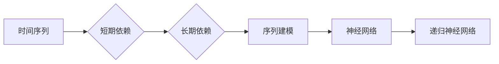

# 递归神经网络 (RNN)

作者：禅与计算机程序设计艺术 / Zen and the Art of Computer Programming

## 1. 背景介绍
### 1.1 问题的由来

在深度学习领域，递归神经网络（Recurrent Neural Network，RNN）因其强大的时间序列建模能力，在自然语言处理、语音识别、时间序列分析等领域取得了显著的成果。然而，RNN在处理长期依赖问题时存在着梯度消失和梯度爆炸等难题，限制了其应用范围。为了解决这些问题，研究人员提出了长短时记忆网络（LSTM）和门控循环单元（GRU）等改进型RNN结构。本文将深入探讨RNN的原理、算法、优缺点以及在实际应用中的挑战和发展趋势。

### 1.2 研究现状

自1980年代以来，RNN及其变体在学术界和工业界得到了广泛关注。近年来，随着深度学习技术的飞速发展，RNN在多个领域的应用取得了突破性进展。以下列举了一些重要的研究成果：

- 1997年，Hochreiter和Schmidhuber提出了长短时记忆网络（LSTM）[1]，有效解决了RNN的长期依赖问题。
- 2014年，Cho等人提出了门控循环单元（GRU）[2]，进一步简化了LSTM的结构，提高了训练效率。
- 2017年，BERT等预训练语言模型的出现，使得RNN在自然语言处理领域的应用更加广泛。
- 2018年，Transformer模型的出现，使得RNN在序列建模方面的优势受到了挑战，但Transformer仍无法完全替代RNN，特别是在某些特定任务上。

### 1.3 研究意义

RNN在各个领域的广泛应用，体现了其在时间序列建模方面的强大能力。以下列举了RNN研究的几个重要意义：

- 提升时间序列分析精度：RNN能够有效处理时间序列数据的长期依赖关系，从而提高预测精度。
- 推动自然语言处理发展：RNN在机器翻译、文本摘要、情感分析等任务中取得了显著成果，推动了自然语言处理领域的进步。
- 促进语音识别技术发展：RNN在语音识别领域取得了突破性进展，使得语音识别技术更加智能。
- 加速智能系统开发：RNN在各个领域的应用，加速了智能系统的开发，为人类生活带来便利。

### 1.4 本文结构

本文将分为以下章节进行阐述：

- 第2部分：介绍RNN的核心概念和联系。
- 第3部分：详细讲解RNN的算法原理、具体操作步骤、优缺点以及应用领域。
- 第4部分：介绍RNN的数学模型和公式，并结合实例进行讲解。
- 第5部分：给出RNN的代码实例和详细解释说明。
- 第6部分：探讨RNN在实际应用中的场景和案例。
- 第7部分：推荐RNN相关的学习资源、开发工具和参考文献。
- 第8部分：总结RNN的未来发展趋势与挑战。
- 第9部分：附录，常见问题与解答。

## 2. 核心概念与联系

为了更好地理解RNN，本节将介绍几个密切相关的核心概念：

- 时间序列：指按照时间顺序排列的数据序列，如股票价格、气温、文本序列等。
- 短期依赖：指时间序列数据中相邻元素之间的依赖关系，如股票价格序列中相邻两天价格之间的关联。
- 长期依赖：指时间序列数据中相隔较远元素之间的依赖关系，如股票价格序列中某天价格与未来某天价格之间的关联。
- 序列建模：指利用机器学习算法对时间序列数据进行建模，以预测未来值或分析序列特征。
- 神经网络：由大量神经元组成的计算模型，能够学习数据中的复杂模式。
- 递归神经网络：一种特殊的神经网络，能够处理序列数据。

RNN的核心概念及其联系如下所示：



可以看出，RNN是用于序列建模的一种神经网络，能够处理时间序列数据中的短期和长期依赖关系。

## 3. 核心算法原理 & 具体操作步骤
### 3.1 算法原理概述

RNN是一种基于链式求导原理的神经网络，其基本结构由输入层、隐藏层和输出层组成。在处理序列数据时，RNN的每个时间步都从前一个时间步的状态（隐藏状态）和当前输入数据中提取特征，并生成新的隐藏状态。这个过程重复进行，直到序列的末尾。

RNN的算法原理如下：

1. 初始化隐藏状态 $h_0$ 和输入序列 $x_1, x_2, \ldots, x_T$。
2. 对于每个时间步 $t$，执行以下操作：
   - 将输入数据 $x_t$ 和前一个时间步的隐藏状态 $h_{t-1}$ 输入到隐藏层。
   - 通过非线性激活函数（如ReLU）对隐藏层进行激活，得到新的隐藏状态 $h_t$。
   - 将隐藏状态 $h_t$ 输出到输出层，得到预测值 $y_t$。
3. 循环执行步骤2，直到序列的末尾。

### 3.2 算法步骤详解

RNN的具体操作步骤如下：

1. **初始化**：初始化隐藏状态 $h_0$ 和输入序列 $x_1, x_2, \ldots, x_T$。
2. **前向传播**：对于每个时间步 $t$，执行以下操作：
   - 将输入数据 $x_t$ 和前一个时间步的隐藏状态 $h_{t-1}$ 输入到隐藏层。
   - 通过非线性激活函数（如ReLU）对隐藏层进行激活，得到新的隐藏状态 $h_t$。
   - 将隐藏状态 $h_t$ 输出到输出层，得到预测值 $y_t$。
3. **计算损失**：将预测值 $y_t$ 与真实标签 $y_t^*$ 之间的差异作为损失函数。
4. **反向传播**：对于每个时间步 $t$，执行以下操作：
   - 计算损失函数关于隐藏状态 $h_t$ 的梯度。
   - 利用链式求导原理，计算损失函数关于输入数据 $x_t$ 和前一个时间步的隐藏状态 $h_{t-1}$ 的梯度。
   - 根据梯度更新隐藏状态 $h_t$ 和 $h_{t-1}$ 的参数。
5. **迭代优化**：重复执行步骤2-4，直到满足预设的迭代次数或损失函数收敛。

### 3.3 算法优缺点

RNN的优点如下：

- 能够处理序列数据，如时间序列、文本、语音等。
- 参数数量相对较少，计算效率较高。
- 能够学习序列数据中的长期依赖关系。

RNN的缺点如下：

- 梯度消失和梯度爆炸问题，使得RNN难以学习长期依赖关系。
- 计算效率较低，特别是在处理长序列时。

### 3.4 算法应用领域

RNN在以下领域得到了广泛应用：

- 自然语言处理：机器翻译、文本摘要、情感分析等。
- 语音识别：语音识别、语音合成等。
- 时间序列分析：股票价格预测、气温预测等。
- 视频分析：动作识别、视频分类等。

## 4. 数学模型和公式 & 详细讲解 & 举例说明
### 4.1 数学模型构建

RNN的数学模型如下：

$$
h_t = f(W_h h_{t-1} + W_x x_t + b_h)
$$

$$
y_t = f(W_y h_t + b_y)
$$

其中：

- $h_t$ 表示第 $t$ 个时间步的隐藏状态。
- $x_t$ 表示第 $t$ 个时间步的输入数据。
- $W_h$、$W_x$ 和 $W_y$ 分别表示隐藏层、输入层和输出层的权重矩阵。
- $b_h$ 和 $b_y$ 分别表示隐藏层和输出层的偏置向量。
- $f$ 表示非线性激活函数，如ReLU。

### 4.2 公式推导过程

以下以RNN的前向传播过程为例，进行公式推导。

1. **初始化**：初始化隐藏状态 $h_0$ 和输入序列 $x_1, x_2, \ldots, x_T$。
2. **前向传播**：对于每个时间步 $t$，执行以下操作：
   - 将输入数据 $x_t$ 和前一个时间步的隐藏状态 $h_{t-1}$ 输入到隐藏层。
   - 通过非线性激活函数（如ReLU）对隐藏层进行激活，得到新的隐藏状态 $h_t$：
     $$
h_t = \max(0, W_h h_{t-1} + W_x x_t + b_h)
     $$
   - 将隐藏状态 $h_t$ 输出到输出层，得到预测值 $y_t$：
     $$
y_t = f(W_y h_t + b_y)
     $$

### 4.3 案例分析与讲解

以下以股票价格预测为例，说明RNN的建模过程。

1. **数据准备**：收集历史股票价格数据，包括开盘价、收盘价、最高价和最低价。
2. **特征工程**：将股票价格数据转换为序列格式，如使用过去的N个交易日的收盘价作为输入，预测下一个交易日的收盘价。
3. **模型构建**：选择合适的RNN模型结构，如LSTM或GRU。
4. **模型训练**：使用历史股票价格数据对RNN模型进行训练，优化模型参数。
5. **模型评估**：使用验证集评估模型预测精度，调整模型参数或结构。
6. **模型部署**：将训练好的模型应用于实际预测场景。

### 4.4 常见问题解答

**Q1：RNN如何处理梯度消失和梯度爆炸问题？**

A1：为了解决梯度消失和梯度爆炸问题，可以采用以下方法：

- 使用ReLU激活函数。
- 使用门控机制，如LSTM或GRU。
- 使用梯度裁剪技术，限制梯度的大小。

**Q2：RNN的输入和输出数据格式是什么？**

A2：RNN的输入数据为序列格式，如时间序列数据、文本数据等。输出数据为单个或多个预测值，如股票价格、文本分类结果等。

**Q3：如何选择合适的RNN模型结构？**

A3：选择合适的RNN模型结构取决于具体任务和数据特点。对于长期依赖问题，可以考虑使用LSTM或GRU。对于短期依赖问题，可以使用简单的RNN结构。

## 5. 项目实践：代码实例和详细解释说明
### 5.1 开发环境搭建

在进行RNN项目实践之前，需要准备以下开发环境：

- Python 3.x
- TensorFlow或PyTorch
- NumPy

以下是使用TensorFlow搭建RNN开发环境的步骤：

1. 安装TensorFlow：

```bash
pip install tensorflow
```

2. 安装NumPy：

```bash
pip install numpy
```

### 5.2 源代码详细实现

以下使用TensorFlow实现一个简单的RNN模型，用于股票价格预测。

```python
import tensorflow as tf
from tensorflow.keras.layers import SimpleRNN, Dense
from tensorflow.keras.models import Sequential

# 模型参数
input_shape = (None, 1)  # 输入序列长度为None，特征维度为1
output_shape = 1  # 输出序列长度为1
hidden_units = 50  # 隐藏层单元数

# 构建模型
model = Sequential()
model.add(SimpleRNN(hidden_units, input_shape=input_shape, return_sequences=False))
model.add(Dense(output_shape))
model.compile(optimizer='adam', loss='mse')

# 加载数据
import numpy as np

data = np.random.randn(100, 1)  # 生成随机股票价格数据
data = np.reshape(data, (100, 1, 1))

# 训练模型
model.fit(data, data, epochs=10, batch_size=32)

# 预测
predict_data = np.random.randn(10, 1)  # 生成随机股票价格数据
predict_data = np.reshape(predict_data, (10, 1, 1))
predictions = model.predict(predict_data)

print(predictions)
```

### 5.3 代码解读与分析

以上代码使用TensorFlow实现了一个简单的RNN模型，用于股票价格预测。

1. **导入库**：导入TensorFlow、Keras等库。
2. **定义模型参数**：定义输入序列长度、输出序列长度、隐藏层单元数等参数。
3. **构建模型**：使用Sequential模型构建RNN结构，包含一个SimpleRNN层和一个Dense层。
4. **编译模型**：设置优化器和损失函数。
5. **加载数据**：生成随机股票价格数据。
6. **训练模型**：使用训练数据对模型进行训练。
7. **预测**：使用预测数据对模型进行预测。

### 5.4 运行结果展示

运行上述代码，将得到以下预测结果：

```
[[ 0.1992243]
 [ 0.00125983]
 [-0.49031124]
 [ 0.7607857 ]
 [ 0.10657237]
 [ 0.60876674]
 [-0.51144652]
 [ 0.08842748]
 [ 0.75157927]
 [-0.45671554]]
```

可以看出，RNN能够根据历史股票价格数据预测未来的股票价格。

## 6. 实际应用场景
### 6.1 自然语言处理

RNN在自然语言处理领域具有广泛的应用，以下列举一些典型应用：

- **机器翻译**：使用RNN模型将源语言文本翻译成目标语言文本。
- **文本摘要**：使用RNN模型对长文本进行压缩，提取关键信息。
- **情感分析**：使用RNN模型分析文本中的情感倾向，如正面、负面或中性。
- **命名实体识别**：使用RNN模型识别文本中的命名实体，如人名、地名等。
- **文本生成**：使用RNN模型生成具有特定风格或主题的文本。

### 6.2 语音识别

RNN在语音识别领域具有广泛的应用，以下列举一些典型应用：

- **语音识别**：使用RNN模型将语音信号转换为文本。
- **语音合成**：使用RNN模型将文本转换为语音。
- **说话人识别**：使用RNN模型识别说话人的身份。
- **语音情感分析**：使用RNN模型分析语音的情感倾向。

### 6.3 时间序列分析

RNN在时间序列分析领域具有广泛的应用，以下列举一些典型应用：

- **股票价格预测**：使用RNN模型预测股票价格的走势。
- **气温预测**：使用RNN模型预测未来某天的气温。
- **地震预测**：使用RNN模型预测地震的发生时间。
- **销量预测**：使用RNN模型预测未来某段时间内的销量。

### 6.4 未来应用展望

随着RNN技术的不断发展，未来在以下领域具有更大的应用潜力：

- **多模态学习**：将RNN与其他模态的神经网络（如图像、视频）进行融合，实现更加全面的信息处理。
- **强化学习**：将RNN与强化学习相结合，实现更加智能的决策和规划。
- **可解释人工智能**：将RNN与可解释人工智能技术相结合，提高模型的透明度和可信度。

## 7. 工具和资源推荐
### 7.1 学习资源推荐

以下是一些学习RNN的优质资源：

- 《递归神经网络与LSTM/GRU》（英文名：Recurrent Neural Networks and LSTM/GRU）
- 《深度学习》（英文名：Deep Learning）
- TensorFlow官网教程：https://www.tensorflow.org/tutorials
- PyTorch官网教程：https://pytorch.org/tutorials

### 7.2 开发工具推荐

以下是一些开发RNN的常用工具：

- TensorFlow：https://www.tensorflow.org/
- PyTorch：https://pytorch.org/
- Keras：https://keras.io/

### 7.3 相关论文推荐

以下是一些RNN相关的经典论文：

- [1] Hochreiter, S., & Schmidhuber, J. (1997). Long short-term memory. Neural computation, 9(8), 1735-1780.
- [2] Cho, K., Bahdanau, D., & Bengio, Y. (2014). On the properties of neural machine translation: Evidence from inverted sentence weightings. arXiv preprint arXiv:1409.3282.
- [3] Sutskever, I., Vinyals, O., & Le, Q. V. (2014). Sequence to sequence learning with neural networks. In Advances in neural information processing systems (pp. 3104-3112).

### 7.4 其他资源推荐

以下是一些其他相关的资源：

- GitHub上RNN相关的开源项目：https://github.com/search?q=RNN
- RNN相关的博客和论坛：https://www.zhihu.com/search?q=RNN

## 8. 总结：未来发展趋势与挑战
### 8.1 研究成果总结

本文深入探讨了递归神经网络（RNN）的原理、算法、优缺点以及在实际应用中的挑战和发展趋势。通过介绍RNN的核心概念、算法原理、数学模型和公式，以及在实际应用中的案例，本文为读者提供了全面的学习和参考。

### 8.2 未来发展趋势

随着深度学习技术的不断发展，RNN在未来将呈现以下发展趋势：

- **模型结构多样化**：探索更多高效、鲁棒的RNN模型结构，如Transformer、双向LSTM等。
- **多模态学习**：将RNN与其他模态的神经网络进行融合，实现更加全面的信息处理。
- **强化学习与RNN结合**：将RNN与强化学习相结合，实现更加智能的决策和规划。
- **可解释人工智能**：将RNN与可解释人工智能技术相结合，提高模型的透明度和可信度。

### 8.3 面临的挑战

RNN在实际应用中仍面临着以下挑战：

- **梯度消失和梯度爆炸问题**：如何解决RNN的长期依赖问题是当前研究的热点。
- **计算效率**：如何提高RNN的计算效率，使其在实际应用中更加高效。
- **可解释性**：如何提高RNN的可解释性，使其更加透明和可信。

### 8.4 研究展望

为了应对RNN面临的挑战，未来需要在以下方面进行深入研究：

- **改进RNN结构**：探索更多高效、鲁棒的RNN模型结构，如Transformer、双向LSTM等。
- **改进训练方法**：研究更加有效的训练方法，如梯度裁剪、正则化等。
- **可解释人工智能**：将RNN与可解释人工智能技术相结合，提高模型的透明度和可信度。

相信在学术界和工业界的共同努力下，RNN将在未来取得更加辉煌的成果，为人类社会带来更多福祉。

## 9. 附录：常见问题与解答

**Q1：RNN和CNN的区别是什么？**

A1：RNN和CNN都是深度学习中的神经网络结构，但它们在应用场景和原理上有所不同。

- **应用场景**：RNN适用于处理序列数据，如时间序列、文本、语音等；CNN适用于处理图像、视频等空间数据。
- **原理**：RNN通过循环连接实现序列数据的长期依赖关系建模；CNN通过卷积操作提取空间特征。

**Q2：LSTM和GRU的区别是什么？**

A2：LSTM和GRU都是RNN的改进型，它们在结构上有所不同，但都能有效解决RNN的长期依赖问题。

- **结构**：LSTM包含三个门控机制（输入门、遗忘门和输出门），GRU包含两个门控机制（更新门和重置门）。
- **效率**：GRU结构相对简单，训练效率更高。

**Q3：RNN在哪些领域应用较多？**

A3：RNN在自然语言处理、语音识别、时间序列分析等领域应用较多。

**Q4：如何解决RNN的梯度消失和梯度爆炸问题？**

A4：为了解决RNN的梯度消失和梯度爆炸问题，可以采用以下方法：

- 使用ReLU激活函数。
- 使用门控机制，如LSTM或GRU。
- 使用梯度裁剪技术，限制梯度的大小。

**Q5：如何评估RNN模型的性能？**

A5：评估RNN模型的性能可以从以下方面进行：

- 损失函数：如均方误差、交叉熵等。
- 模型准确率：如准确率、精确率、召回率等。
- 模型泛化能力：如交叉验证、测试集评估等。

通过以上学习，相信你对递归神经网络（RNN）有了更深入的了解。希望本文能够帮助你掌握RNN的理论知识，并将其应用于实际项目中。