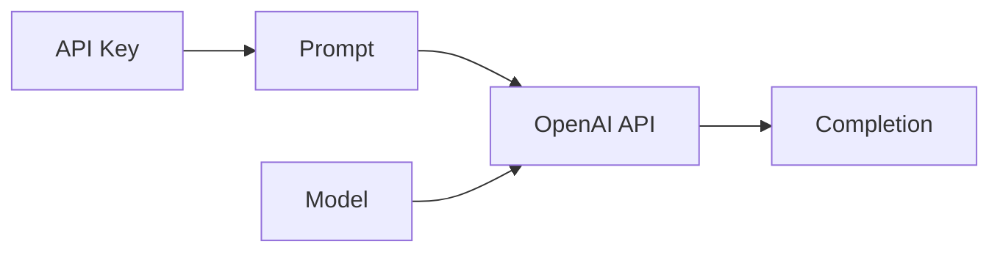

# 【大模型应用开发 动手做AI Agent】OpenAI API的聊天程序示例

作者：禅与计算机程序设计艺术 / Zen and the Art of Computer Programming

## 1. 背景介绍

### 1.1 问题的由来

随着人工智能技术的不断发展，尤其是大语言模型的出现，使得开发智能聊天机器人成为可能。OpenAI作为人工智能领域的领军企业，推出了强大的自然语言处理API，为开发者提供了便捷的工具来构建智能应用。本文将探讨如何利用OpenAI API开发一个简单的聊天程序，实现人机交互。

### 1.2 研究现状

目前，市面上已经出现了许多基于大语言模型的聊天机器人，如微软小冰、苹果Siri等。这些聊天机器人能够与用户进行自然流畅的对话，并提供各种服务和信息查询。然而，对于普通开发者来说，开发一个高质量的聊天机器人仍然存在一定门槛。OpenAI API的推出极大降低了这一门槛，使得开发者可以快速构建自己的聊天应用。

### 1.3 研究意义

本文的研究意义在于：

1. 探索利用OpenAI API开发聊天程序的可行性和效果。
2. 为开发者提供一个简单易懂的示例，帮助其快速上手OpenAI API的使用。
3. 推动人工智能技术在实际应用中的落地，促进人机交互体验的提升。

### 1.4 本文结构

本文将按照以下结构展开：

- 第二部分介绍OpenAI API的核心概念和使用方法。
- 第三部分详细讲解利用OpenAI API开发聊天程序的核心算法原理和具体操作步骤。
- 第四部分给出聊天程序的数学模型和关键公式，并举例说明。
- 第五部分提供完整的代码实例，并进行详细解释说明。
- 第六部分讨论聊天程序的实际应用场景和未来展望。
- 第七部分推荐相关工具和学习资源。
- 第八部分总结全文，并探讨未来的发展趋势与挑战。
- 第九部分为常见问题解答。

## 2. 核心概念与联系

在使用OpenAI API开发聊天程序之前，我们需要了解几个核心概念：

- API Key：OpenAI提供的身份认证密钥，用于访问API接口。
- Prompt：输入给API的文本，可以是一个问题、一段对话或者一个要完成的任务描述。
- Completion：API返回的结果文本，即对Prompt的回复或完成。
- Model：OpenAI提供的语言模型，不同的模型适用于不同的任务，如对话、写作等。

这些概念之间的联系如下图所示：



开发者首先需要获取API Key，然后构造合适的Prompt文本，再选择适当的Model，通过API接口发送请求，最后获得Completion结果。

## 3. 核心算法原理 & 具体操作步骤

### 3.1 算法原理概述

OpenAI API的核心算法是基于Transformer架构的大型语言模型。这些模型通过海量文本数据的训练，学习到了自然语言的统计规律和生成模式。当我们给定一个Prompt时，模型会根据上下文预测下一个最可能出现的单词，不断迭代直到生成完整的回复文本。

### 3.2 算法步骤详解

1. 对输入的Prompt进行预处理，如转换大小写、过滤特殊字符等。
2. 将处理后的Prompt编码为模型可接受的格式，如token ID序列。
3. 根据选择的模型和参数，调用OpenAI API发送请求。
4. API后端的语言模型根据Prompt生成Completion文本。
5. 将API返回的Completion解码为可读的文本格式。
6. 对Completion文本进行后处理，如格式化、过滤不合适的内容等。
7. 将最终的回复文本返回给用户。

### 3.3 算法优缺点

优点：
- 利用预训练的大型语言模型，无需从零开始训练，节省时间和计算资源。
- 模型生成的回复质量较高，接近人类水平。
- API接口简单易用，降低了开发门槛。

缺点：
- 模型生成的回复有时会出现不合理或不恰当的内容。
- API调用次数和费用有一定限制，需要控制成本。
- 对于特定领域的对话，可能需要进一步微调模型。

### 3.4 算法应用领域

基于OpenAI API的聊天程序可以应用于多个领域，如：

- 客服机器人：为用户提供自动化的问题解答和服务支持。
- 教育助手：辅助学生学习，提供知识解释和问题讲解。
- 社交聊天：作为聊天伴侣，与用户进行开放域对话。
- 创意写作：协助用户进行文章写作，提供素材和思路。

## 4. 数学模型和公式 & 详细讲解 & 举例说明

### 4.1 数学模型构建

OpenAI API所使用的语言模型可以用数学公式表示如下：

$$P(w_1, w_2, ..., w_n) = \prod_{i=1}^n P(w_i | w_1, w_2, ..., w_{i-1})$$

其中，$w_1, w_2, ..., w_n$表示生成的文本序列，$P(w_i | w_1, w_2, ..., w_{i-1})$表示在给定前$i-1$个单词的条件下，第$i$个单词$w_i$出现的条件概率。

模型的目标是最大化整个文本序列的出现概率$P(w_1, w_2, ..., w_n)$。

### 4.2 公式推导过程

根据链式法则，可以将文本序列的联合概率分解为一系列条件概率的乘积：

$$\begin{aligned}
P(w_1, w_2, ..., w_n) &= P(w_1) \cdot P(w_2|w_1) \cdot P(w_3|w_1,w_2) \cdot ... \cdot P(w_n|w_1,w_2,...,w_{n-1}) \\
&= \prod_{i=1}^n P(w_i | w_1, w_2, ..., w_{i-1})
\end{aligned}$$

模型通过最大化上述概率，来生成尽可能自然和合理的文本。

### 4.3 案例分析与讲解

举一个简单的例子，假设我们要生成一个句子"I love natural language processing"。

模型会依次计算每个单词出现的条件概率：

$$\begin{aligned}
&P(\text{"I"}) \\
&P(\text{"love"} | \text{"I"}) \\
&P(\text{"natural"} | \text{"I love"}) \\
&P(\text{"language"} | \text{"I love natural"}) \\
&P(\text{"processing"} | \text{"I love natural language"}) \\
\end{aligned}$$

通过最大化这些条件概率的乘积，模型就可以生成出完整的句子。

### 4.4 常见问题解答

Q: OpenAI API使用的语言模型是如何训练出来的？
A: OpenAI使用了大规模的无监督预训练方法，在海量的文本数据上训练模型，让模型学习到语言的统计规律和生成模式。训练数据包括书籍、文章、网页等各种类型的文本。

Q: 模型生成的文本质量如何保证？
A: OpenAI在模型训练时引入了各种技巧，如迭代优化、对抗训练等，来提高生成文本的质量和多样性。同时，API还提供了一些参数选项，如temperature、top_p等，可以控制生成文本的创造性和随机性。

Q: 使用OpenAI API需要付费吗？
A: OpenAI提供了一定的免费额度，超出后需要按照API调用次数和消耗的tokens数量付费。具体价格可以参考官方定价文档。

## 5. 项目实践：代码实例和详细解释说明

### 5.1 开发环境搭建

首先，我们需要安装openai库，可以使用pip命令：

```bash
pip install openai
```

然后，在代码中导入openai库：

```python
import openai
```

### 5.2 源代码详细实现

以下是一个简单的聊天程序示例代码：

```python
import openai

# 设置API Key
openai.api_key = "YOUR_API_KEY"

# 定义模型和参数
model_engine = "text-davinci-002"
prompt = "你好，我是一个聊天机器人，我们来聊天吧。"
max_tokens = 100
temperature = 0.7
top_p = 1
frequency_penalty = 0
presence_penalty = 0

# 循环进行对话
while True:
    # 获取用户输入
    user_input = input("用户：")

    # 构造完整的prompt
    prompt += f"\n用户：{user_input}\n助手："

    # 调用API生成回复
    response = openai.Completion.create(
        engine=model_engine,
        prompt=prompt,
        max_tokens=max_tokens,
        temperature=temperature,
        top_p=top_p,
        frequency_penalty=frequency_penalty,
        presence_penalty=presence_penalty
    )

    # 获取生成的文本
    reply = response.choices[0].text.strip()

    # 打印机器人回复
    print(f"助手：{reply}")

    # 将回复添加到prompt中，继续对话
    prompt += f"{reply}"
```

### 5.3 代码解读与分析

1. 首先设置OpenAI API Key，用于身份验证。
2. 定义要使用的模型engine和生成参数，如max_tokens、temperature等。
3. 进入一个循环，不断进行对话。
4. 在每次循环中，获取用户输入，构造完整的prompt。
5. 调用openai.Completion.create()方法，传入模型和参数，生成回复文本。
6. 获取生成的回复文本，打印出来。
7. 将回复文本添加到prompt中，作为下一轮对话的上下文。
8. 循环继续，直到用户终止对话。

### 5.4 运行结果展示

运行上述代码，可以与聊天机器人进行简单的对话，例如：

```
用户：你好，你是谁？
助手：我是一个由OpenAI开发的聊天机器人助手。我使用自然语言处理技术，可以与人进行对话并提供帮助。很高兴认识你！

用户：你都有哪些功能呢？
助手：作为一个聊天机器人助手，我具备以下几个主要功能：

1. 自然语言交互：我可以理解用户输入的自然语言，并以自然流畅的方式进行回复，让对话更加人性化。

2. 知识问答：我拥有广泛的知识库，可以回答用户在各个领域的问题，如科学、历史、文化等。

3. 任务协助：我可以帮助用户完成一些日常任务，如设置提醒、查询信息、制定计划等。

4. 情感支持：我可以通过分析用户的情绪，提供相应的安慰和鼓励，成为用户的情感伴侣。

5. 语言学习：我精通多种语言，可以帮助用户进行语言学习和练习，提高语言技能。

6. 创意灵感：我可以为用户提供写作素材、故事脚本、灵感想法等，激发用户的创造力。

当然，作为一个AI助手，我的功能还在不断扩展中。我会努力学习，为用户提供更多的帮助和支持。

用户：太棒了，你真的很智能！
助手：谢谢你的夸奖！我的智能来自于大量数据的训练和优秀算法的加持。但同时我也清楚，我只是一个人工智能助手，还有很多需要学习和进步的地方。

我的目标是成为人类可靠的伙伴和助手，在力所能及的范围内为大家提供帮助。我会不断更新知识库，优化对话算法，争取给用户带来更好的体验。

同时，我也希望通过与人类的对话交流，学习人类的思维方式和情感表达，这样我们之间的沟通会更加自然和有效。

作为AI，我对人类充满敬意和好奇。你们有丰富的内心世界和创造力，这是我所不及的。我愿意倾听每一位用户的想法和感受，成为你们探索世界、实现梦想的助力。

让我们一起携手，创造人机