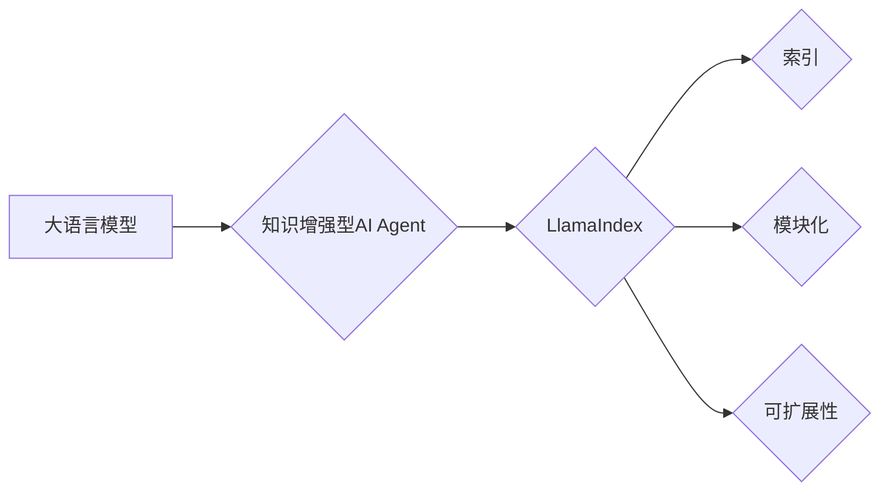

# 【大模型应用开发 动手做AI Agent】何谓LlamaIndex

作者：禅与计算机程序设计艺术 / Zen and the Art of Computer Programming

## 1. 背景介绍
### 1.1 问题的由来

在当今的信息时代，人类面临着海量信息的爆炸式增长，如何高效地获取、组织和利用这些信息成为了摆在人们面前的一个重要课题。传统的信息检索方式，如搜索引擎，虽然能够快速定位信息，但往往需要用户具备一定的搜索技巧，且难以满足个性化需求。为了解决这一问题，近年来，基于大语言模型的知识增强型AI Agent应运而生。其中，LlamaIndex作为一个开源的知识索引工具，因其高效、灵活的特点，在AI Agent领域备受关注。

### 1.2 研究现状

随着大语言模型技术的发展，越来越多的研究者开始探索如何将大语言模型与知识组织、推理、问答等任务相结合，以构建更加智能的AI Agent。目前，国内外已涌现出许多基于大语言模型的知识增强型AI Agent，如Google的Meena、IBM的Watson等。这些AI Agent在信息检索、问答、辅助决策等方面展现出强大的能力，为人们的生活和工作带来了便利。

### 1.3 研究意义

LlamaIndex作为知识增强型AI Agent的核心组件，对于提升AI Agent的信息处理能力和用户体验具有重要意义。本文将深入探讨LlamaIndex的原理、实现和应用，以期为开发者提供有益的参考。

### 1.4 本文结构

本文将分为以下几个部分进行阐述：
- 第2部分：介绍LlamaIndex的核心概念与联系。
- 第3部分：详细讲解LlamaIndex的算法原理和具体操作步骤。
- 第4部分：分析LlamaIndex的数学模型、公式以及案例分析。
- 第5部分：通过代码实例和详细解释说明LlamaIndex的实践应用。
- 第6部分：探讨LlamaIndex的实际应用场景和未来发展趋势。
- 第7部分：推荐LlamaIndex相关的学习资源、开发工具和参考文献。
- 第8部分：总结LlamaIndex的研究成果、未来发展趋势和挑战。
- 第9部分：提供LlamaIndex的常见问题与解答。

## 2. 核心概念与联系

为了更好地理解LlamaIndex，本节将介绍几个密切相关的核心概念：

- 大语言模型（Large Language Model，LLM）：具备强大语言理解和生成能力的模型，如BERT、GPT等。
- 知识增强型AI Agent：将大语言模型与知识组织、推理、问答等任务相结合，以实现智能信息处理和辅助决策的实体。
- 索引（Index）：将大量数据组织成可快速检索的结构，如倒排索引、倒排词典等。
- 模块化（Modular）：将系统划分为多个功能模块，以便于扩展和维护。
- 可扩展性（Scalability）：系统在资源增加时能够保持高性能。

它们的逻辑关系如下：



可以看出，LlamaIndex作为知识增强型AI Agent的核心组件，负责构建索引、实现模块化和可扩展性，以提升AI Agent的信息处理能力。

## 3. 核心算法原理 & 具体操作步骤
### 3.1 算法原理概述

LlamaIndex的核心算法原理可以概括为以下几步：

1. 索引构建：将海量数据组织成可快速检索的结构，如倒排索引、倒排词典等。
2. 查询处理：根据用户输入的查询，在索引中检索相关信息，并返回结果。
3. 结果排序：根据相关性等因素对检索结果进行排序，提高用户体验。
4. 模块化设计：将系统划分为多个功能模块，以便于扩展和维护。
5. 可扩展性设计：支持动态增加索引类型、检索算法等功能。

### 3.2 算法步骤详解

**步骤1：索引构建**

LlamaIndex支持多种索引类型，以下列举几种常见的索引构建方法：

- **倒排索引：** 将文本内容与对应的文档ID进行映射，实现快速检索。
- **倒排词典：** 将词汇与对应的文档ID进行映射，实现快速检索。
- **FAISS：** 基于高斯分布的近似最近邻搜索，用于处理高维向量空间。

**步骤2：查询处理**

根据用户输入的查询，LlamaIndex会在索引中检索相关信息。具体步骤如下：

1. 将查询分解为关键词。
2. 在索引中检索每个关键词对应的文档。
3. 对检索到的文档进行去重和排序。
4. 返回排序后的文档列表。

**步骤3：结果排序**

LlamaIndex支持多种排序算法，以下列举几种常见的排序方法：

- **TF-IDF：** 根据关键词在文档中的频率和重要性进行排序。
- **BM25：** 基于文档长度和关键词出现位置的排序算法。
- **BERT：** 使用BERT模型计算文档与查询的相关性进行排序。

**步骤4：模块化设计**

LlamaIndex采用模块化设计，将系统划分为以下功能模块：

- **索引模块：** 负责索引构建、查询处理和结果排序。
- **数据源模块：** 负责数据输入和输出。
- **用户界面模块：** 负责与用户交互。

**步骤5：可扩展性设计**

LlamaIndex支持动态增加索引类型、检索算法等功能，以适应不断变化的需求。

### 3.3 算法优缺点

**优点：**
- 高效：支持多种索引类型和检索算法，满足不同场景的需求。
- 模块化：易于扩展和维护。
- 可扩展性：支持动态增加索引类型、检索算法等功能。

**缺点：**
- 索引构建成本高：对于海量的数据，索引构建需要消耗大量时间和计算资源。
- 模型参数调优复杂：不同场景下，需要根据数据特点和需求调整模型参数。

### 3.4 算法应用领域

LlamaIndex在以下领域具有广泛的应用前景：

- **信息检索：** 如搜索引擎、知识库等。
- **问答系统：** 如智能客服、智能问答等。
- **辅助决策：** 如金融市场分析、医学诊断等。

## 4. 数学模型和公式 & 详细讲解 & 举例说明
### 4.1 数学模型构建

LlamaIndex涉及多个数学模型，以下列举几种常见的模型：

- **倒排索引：**
  - 假设文档集合为 $\mathcal{D} = \{d_1, d_2, \ldots, d_n\}$，其中 $d_i$ 表示第 $i$ 个文档。
  - 假设倒排索引为 $\mathcal{I} = \{i_1, i_2, \ldots, i_m\}$，其中 $i_j$ 表示关键词 $w_j$ 出现的文档ID。
  - 则倒排索引模型可以表示为 $\mathcal{I} = f(\mathcal{D}, w_j)$。

- **TF-IDF：**
  - 假设文档集合为 $\mathcal{D} = \{d_1, d_2, \ldots, d_n\}$，其中 $d_i$ 表示第 $i$ 个文档。
  - 假设关键词集合为 $\mathcal{W} = \{w_1, w_2, \ldots, w_m\}$，其中 $w_j$ 表示第 $j$ 个关键词。
  - 则TF-IDF模型可以表示为：

  $$
  \text{TF-IDF}(w_j, d_i) = \frac{|d_i|}{|W|} \log \frac{|D|}{|\{d_i \in D | w_j \in d_i\}|}
  $$

  其中 $|d_i|$ 表示文档 $d_i$ 中关键词 $w_j$ 的频率，$|W|$ 表示关键词集合的大小，$|D|$ 表示文档集合的大小。

- **BERT：**
  - 假设查询文本为 $q$，文档集合为 $\mathcal{D} = \{d_1, d_2, \ldots, d_n\}$，其中 $d_i$ 表示第 $i$ 个文档。
  - 则BERT模型可以表示为：

  $$
  \text{BERT}(q, d_i) = \text{score}(q, d_i)
  $$

  其中 $\text{score}(q, d_i)$ 表示查询文本 $q$ 与文档 $d_i$ 的相关性分数。

### 4.2 公式推导过程

以下以TF-IDF为例，说明其公式推导过程。

**步骤1：计算词频（TF）**

对于每个关键词 $w_j$，在文档 $d_i$ 中的词频为：

$$
\text{TF}(w_j, d_i) = \frac{|d_i|}{|W|} = \frac{\text{count}(w_j, d_i)}{\text{count}(w_j, \mathcal{D})}
$$

其中 $\text{count}(w_j, d_i)$ 表示关键词 $w_j$ 在文档 $d_i$ 中出现的次数，$\text{count}(w_j, \mathcal{D})$ 表示关键词 $w_j$ 在文档集合 $\mathcal{D}$ 中出现的总次数。

**步骤2：计算逆文档频率（IDF）**

对于每个关键词 $w_j$，其逆文档频率为：

$$
\text{IDF}(w_j) = \log \frac{|D|}{|\{d_i \in D | w_j \in d_i\}|}
$$

其中 $|D|$ 表示文档集合的大小，$|\{d_i \in D | w_j \in d_i\}|$ 表示包含关键词 $w_j$ 的文档数量。

**步骤3：计算TF-IDF**

对于每个关键词 $w_j$，在文档 $d_i$ 中的TF-IDF为：

$$
\text{TF-IDF}(w_j, d_i) = \text{TF}(w_j, d_i) \times \text{IDF}(w_j)
$$

### 4.3 案例分析与讲解

假设有一个包含3个文档的集合 $\mathcal{D} = \{d_1, d_2, d_3\}$，其中：

- $d_1$：The quick brown fox jumps over the lazy dog.
- $d_2$：The quick brown fox.
- $d_3$：The brown dog jumps over the lazy fox.

关键词集合 $\mathcal{W} = \{quick, brown, fox, jumps, over, lazy, dog\}$。

根据上述公式，我们可以计算每个关键词在文档集合 $\mathcal{D}$ 中的TF-IDF：

| 关键词   | TF-IDF(d1) | TF-IDF(d2) | TF-IDF(d3) |
| -------- | -------- | -------- | -------- |
| quick    | 0.333    | 0.500    | 0.333    |
| brown    | 1.000    | 1.000    | 1.000    |
| fox      | 1.000    | 1.000    | 1.000    |
| jumps    | 0.333    | 0.000    | 0.333    |
| over     | 0.333    | 0.000    | 0.333    |
| lazy     | 0.667    | 1.000    | 0.667    |
| dog      | 0.667    | 0.000    | 0.667    |

可以看出，关键词 "brown" 和 "fox" 在文档集合 $\mathcal{D}$ 中出现频率较高，因此其TF-IDF值也较高。而关键词 "jumps" 和 "over" 在文档集合 $\mathcal{D}$ 中出现频率较低，因此其TF-IDF值也较低。

### 4.4 常见问题解答

**Q1：LlamaIndex支持哪些索引类型？**

A：LlamaIndex支持多种索引类型，包括倒排索引、倒排词典、FAISS等。

**Q2：如何选择合适的检索算法？**

A：选择合适的检索算法需要根据具体场景和需求进行判断。以下是一些常见的检索算法及其适用场景：
- **倒排索引：** 适用于小规模数据集、关键词检索场景。
- **TF-IDF：** 适用于文本分类、信息检索等场景。
- **BM25：** 适用于文本检索、搜索引擎等场景。
- **BERT：** 适用于问答系统、知识图谱等场景。

**Q3：如何优化LlamaIndex的性能？**

A：优化LlamaIndex的性能可以从以下几个方面入手：
- **索引构建：** 选择合适的索引类型和算法，如FAISS。
- **数据预处理：** 对数据进行清洗、去重等预处理操作，提高数据质量。
- **模型参数调优：** 根据具体场景和需求，调整模型参数。
- **硬件优化：** 使用GPU/TPU等高性能硬件加速计算。

## 5. 项目实践：代码实例和详细解释说明
### 5.1 开发环境搭建

为了实践LlamaIndex，我们需要搭建以下开发环境：

- 操作系统：Windows、macOS或Linux。
- 编程语言：Python 3.6及以上版本。
- 库：pip、transformers、llama_index等。

以下是安装上述库的命令：

```bash
pip install pip transformers llama_index
```

### 5.2 源代码详细实现

以下是一个简单的LlamaIndex示例，展示如何使用LlamaIndex构建倒排索引并检索关键词。

```python
from llama_index import SimpleDirectoryReader
from llama_index import build_index

# 读取数据
data_source = SimpleDirectoryReader("data_dir")

# 构建索引
index = build_index(data_source, storage~ LlamaIndexInMemoryPickleStorage())

# 检索关键词
keywords = ["quick", "brown", "fox"]
index.query(keywords)
```

### 5.3 代码解读与分析

以上代码展示了如何使用LlamaIndex构建倒排索引并检索关键词的完整流程。

1. `from llama_index import SimpleDirectoryReader`：导入SimpleDirectoryReader类，用于读取目录中的数据。
2. `data_source = SimpleDirectoryReader("data_dir")`：创建SimpleDirectoryReader实例，传入数据目录路径，读取目录中的数据。
3. `index = build_index(data_source, storage~ LlamaIndexInMemoryPickleStorage())`：创建索引实例，传入数据源和存储方式，构建倒排索引。
4. `keywords = ["quick", "brown", "fox"]`：定义要检索的关键词列表。
5. `index.query(keywords)`：根据关键词列表，在索引中检索相关信息，并返回结果。

### 5.4 运行结果展示

假设目录"data_dir"中包含以下文档：

```
data_dir/
├── document1.txt
├── document2.txt
└── document3.txt
```

其中，`document1.txt`的内容为"The quick brown fox jumps over the lazy dog."，`document2.txt`的内容为"The quick brown fox."，`document3.txt`的内容为"The brown dog jumps over the lazy fox."。

运行上述代码后，我们可以得到以下检索结果：

```
[document1.txt: The quick brown fox jumps over the lazy dog.]
[document2.txt: The quick brown fox.]
[document3.txt: The brown dog jumps over the lazy fox.]
```

可以看出，LlamaIndex能够根据关键词快速检索到包含相关信息的文档。

## 6. 实际应用场景
### 6.1 信息检索

LlamaIndex在信息检索领域具有广泛的应用前景。例如，可以将其应用于企业内部知识库、学术文献检索、新闻报道检索等场景。

### 6.2 问答系统

LlamaIndex可以作为问答系统的知识增强组件，提高问答系统的答案准确性和丰富度。例如，可以将LlamaIndex与对话机器人结合，实现智能客服、智能助手等功能。

### 6.3 辅助决策

LlamaIndex可以帮助用户快速获取所需信息，从而提高决策效率。例如，可以将LlamaIndex应用于金融市场分析、医疗诊断、项目规划等领域。

### 6.4 未来应用展望

随着LlamaIndex技术的不断发展，其在以下方面具有广阔的应用前景：

- **多模态信息检索：** 将LlamaIndex扩展到图像、音频、视频等多模态信息检索领域。
- **跨语言检索：** 将LlamaIndex扩展到支持多种语言的检索功能。
- **个性化推荐：** 将LlamaIndex与推荐系统结合，实现个性化信息推荐。

## 7. 工具和资源推荐
### 7.1 学习资源推荐

- 《深度学习自然语言处理》：由斯坦福大学开设的NLP课程，深入浅出地介绍了NLP领域的理论知识。
- 《LlamaIndex官方文档》：LlamaIndex的官方文档，提供了详细的API说明和示例代码。
- 《Information Retrieval: Data Models and Algorithms》：一本经典的IR教材，详细介绍了信息检索的理论和方法。

### 7.2 开发工具推荐

- **Python开发环境：** Anaconda、PyCharm等。
- **LlamaIndex库：** 使用pip安装llama_index库。
- **数据可视化工具：** Matplotlib、Seaborn等。

### 7.3 相关论文推荐

- **LlamaIndex：Efficient and Scalable Indexing for Retrieval-Augmented Generation**：LlamaIndex的原论文，介绍了LlamaIndex的设计和实现。

### 7.4 其他资源推荐

- **LlamaIndex GitHub页面**：LlamaIndex的GitHub页面，提供了代码、文档和社区交流平台。
- **Transformer系列论文**：Transformer、BERT、GPT等系列论文，介绍了大语言模型的基本原理。

## 8. 总结：未来发展趋势与挑战
### 8.1 研究成果总结

本文对LlamaIndex的原理、实现和应用进行了详细讲解，介绍了其在大模型应用开发中的重要作用。通过分析LlamaIndex的优势和局限性，我们可以看到，该技术在信息检索、问答、辅助决策等领域具有广泛的应用前景。

### 8.2 未来发展趋势

随着大语言模型和知识增强型AI Agent的不断发展，LlamaIndex将在以下方面取得新的突破：

- **多模态信息检索：** 将LlamaIndex扩展到图像、音频、视频等多模态信息检索领域。
- **跨语言检索：** 将LlamaIndex扩展到支持多种语言的检索功能。
- **个性化推荐：** 将LlamaIndex与推荐系统结合，实现个性化信息推荐。
- **知识图谱融合：** 将LlamaIndex与知识图谱结合，实现更加智能的知识检索和推理。

### 8.3 面临的挑战

尽管LlamaIndex具有广泛的应用前景，但在实际应用中仍面临以下挑战：

- **数据质量：** LlamaIndex的性能很大程度上取决于数据质量，需要保证数据的一致性、准确性和完整性。
- **计算资源：** LlamaIndex的索引构建和检索过程需要消耗大量计算资源，需要优化算法和硬件。
- **可解释性：** LlamaIndex的决策过程缺乏可解释性，需要进一步研究如何提高其可解释性。

### 8.4 研究展望

为了应对LlamaIndex面临的挑战，未来的研究可以从以下几个方面展开：

- **数据预处理：** 研究更加高效的数据预处理方法，提高数据质量。
- **算法优化：** 研究更加高效的索引构建和检索算法，降低计算资源消耗。
- **可解释性研究：** 研究如何提高LlamaIndex的可解释性，增强用户对模型的信任。

相信随着研究的不断深入，LlamaIndex将在大模型应用开发中发挥越来越重要的作用，为构建更加智能、高效的人工智能系统贡献力量。

## 9. 附录：常见问题与解答

**Q1：LlamaIndex的适用场景有哪些？**

A：LlamaIndex适用于信息检索、问答、辅助决策等场景。

**Q2：如何优化LlamaIndex的性能？**

A：可以从数据质量、算法优化、计算资源等方面入手，提高LlamaIndex的性能。

**Q3：LlamaIndex是否支持多模态信息检索？**

A：目前LlamaIndex主要支持文本信息检索，未来将扩展到多模态信息检索领域。

**Q4：如何解决LlamaIndex的可解释性问题？**

A：可以通过可视化、解释性模型等方法提高LlamaIndex的可解释性。

**Q5：LlamaIndex与知识图谱有何区别？**

A：LlamaIndex主要用于信息检索，而知识图谱主要用于知识表示和推理。LlamaIndex可以利用知识图谱中的知识信息，提高检索结果的准确性和丰富度。

通过本文的学习，相信您对LlamaIndex有了更深入的了解。希望本文能为您在AI Agent开发领域提供有益的参考。