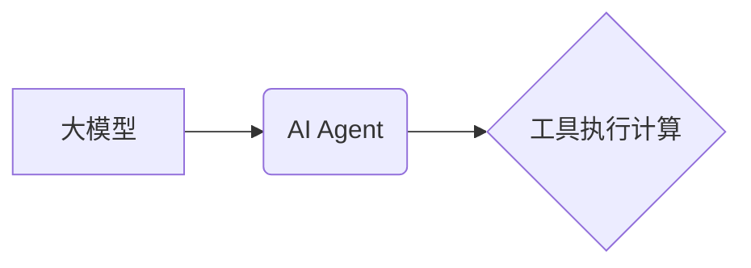
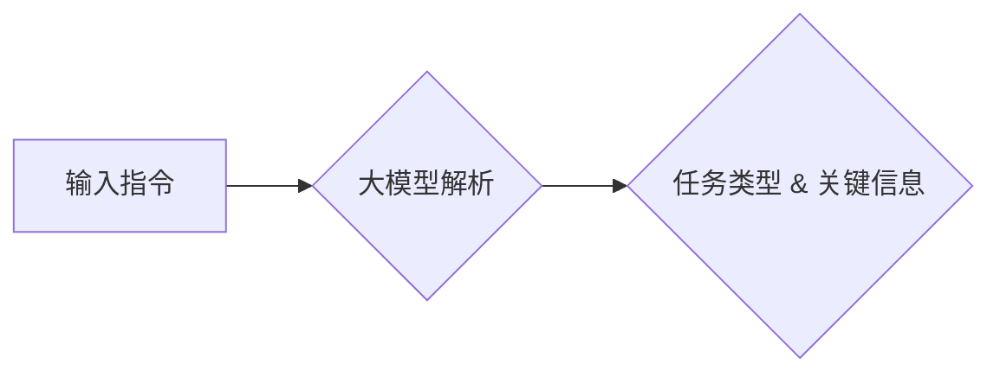
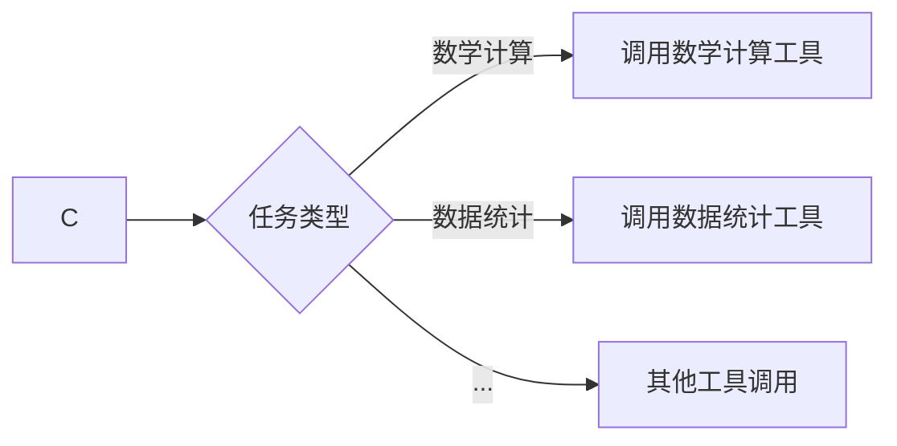
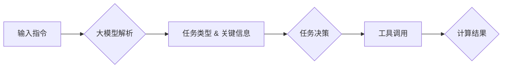

# 【大模型应用开发 动手做AI Agent】第二轮行动：工具执行计算

## 1. 背景介绍
### 1.1 问题的由来

随着人工智能技术的飞速发展，大模型在各个领域的应用越来越广泛。然而，如何将这些大模型应用于实际项目中，并使其具备自主执行计算的能力，成为了当前人工智能领域的一个重要课题。本文将探讨如何利用大模型开发AI Agent，并实现工具执行计算的功能。

### 1.2 研究现状

目前，大模型在AI Agent领域的应用主要集中在以下几个方面：

- **任务理解**：通过自然语言处理技术，使AI Agent能够理解人类指令，并将其转化为具体的任务。
- **决策规划**：利用强化学习等技术，使AI Agent能够根据环境状态和目标，制定最优的行动策略。
- **知识推理**：结合知识图谱等技术，使AI Agent能够根据已知信息进行推理，解决实际问题。

### 1.3 研究意义

开发具有工具执行计算能力的AI Agent，具有以下重要意义：

- **提高效率**：自动化执行重复性工作，提高工作效率。
- **降低成本**：减少人力投入，降低运营成本。
- **创新应用**：拓展AI技术在各个领域的应用场景。

### 1.4 本文结构

本文将分为以下几个部分：

- 核心概念与联系
- 核心算法原理与具体操作步骤
- 数学模型和公式
- 项目实践
- 实际应用场景
- 工具和资源推荐
- 总结：未来发展趋势与挑战

## 2. 核心概念与联系

### 2.1 关键概念

- **大模型**：具有大规模参数和强大语言理解能力的深度学习模型，如BERT、GPT等。
- **AI Agent**：能够自主完成任务的智能体，具备感知、推理、决策、执行等能力。
- **工具执行计算**：AI Agent能够根据任务需求，调用外部工具进行计算，如数学计算、数据统计等。

### 2.2 关联关系



## 3. 核心算法原理与具体操作步骤
### 3.1 算法原理概述

本节将介绍AI Agent实现工具执行计算的原理，主要包括以下步骤：

1. **任务理解**：使用大模型对输入指令进行解析，提取任务类型和关键信息。
2. **决策规划**：根据任务类型和关键信息，规划相应的行动策略。
3. **工具调用**：根据行动策略，调用外部工具进行计算。
4. **结果反馈**：将计算结果反馈给用户，并执行后续操作。

### 3.2 算法步骤详解

1. **任务理解**：使用大模型对输入指令进行解析，提取任务类型和关键信息。



2. **决策规划**：根据任务类型和关键信息，规划相应的行动策略。



3. **工具调用**：根据行动策略，调用外部工具进行计算。

```mermaid
E --> H[计算结果]
F --> H
G --> H
```

4. **结果反馈**：将计算结果反馈给用户，并执行后续操作。

```mermaid
H --> I{反馈结果}
I --> J{执行后续操作}
```

### 3.3 算法优缺点

**优点**：

- **通用性强**：适用于各种类型的计算任务。
- **可扩展性高**：易于添加新的工具和计算方法。
- **自动化程度高**：简化了计算过程，提高了效率。

**缺点**：

- **依赖外部工具**：需要依赖外部工具的可用性和稳定性。
- **计算效率低**：对于复杂的计算任务，计算效率可能较低。

### 3.4 算法应用领域

AI Agent实现工具执行计算的应用领域包括：

- **智能客服**：自动回答用户关于产品的常见问题。
- **智能助手**：协助用户完成日常任务，如日程安排、邮件管理等。
- **智能数据分析**：自动分析数据，为用户提供决策支持。
- **智能监控**：自动监控设备状态，及时发现异常情况。

## 4. 数学模型和公式
### 4.1 数学模型构建

本节将介绍AI Agent实现工具执行计算所涉及的数学模型。



### 4.2 公式推导过程

本节将介绍任务决策、工具调用等步骤的公式推导过程。

#### 任务决策

设任务类型为 $T$，关键信息为 $I$，决策函数为 $f$，则：

$$
T = f(T, I)
$$

#### 工具调用

设工具集合为 $T_{tool}$，工具选择函数为 $g$，则：

$$
T_{selected} = g(T, I)
$$

### 4.3 案例分析与讲解

以智能客服为例，介绍AI Agent实现工具执行计算的案例。

1. **任务理解**：用户输入“计算 2+2”，大模型解析出任务类型为数学计算，关键信息为“2+2”。
2. **决策规划**：根据任务类型和关键信息，AI Agent决定调用数学计算工具。
3. **工具调用**：调用数学计算工具，得到计算结果“4”。
4. **结果反馈**：将计算结果“4”反馈给用户。

### 4.4 常见问题解答

**Q1：如何选择合适的大模型？**

A：选择大模型时，需要考虑以下因素：

- **任务类型**：针对不同类型的任务，选择不同的大模型。
- **数据量**：选择与训练数据量相匹配的大模型。
- **计算资源**：选择与计算资源相匹配的大模型。

**Q2：如何设计决策规划模块？**

A：设计决策规划模块时，需要考虑以下因素：

- **任务类型**：根据任务类型，设计相应的决策规则。
- **关键信息**：根据关键信息，调整决策规则。

## 5. 项目实践：代码实例和详细解释说明
### 5.1 开发环境搭建

本节将介绍如何搭建AI Agent项目开发环境。

1. **Python环境**：Python 3.6及以上版本。
2. **深度学习框架**：PyTorch或TensorFlow。
3. **大模型库**：如Hugging Face的Transformers库。
4. **其他库**：NumPy、Pandas等。

### 5.2 源代码详细实现

以下是一个简单的AI Agent项目示例，实现工具执行计算功能。

```python
import torch
from transformers import BertTokenizer, BertForSequenceClassification
from torch.utils.data import DataLoader
from torch.nn import functional as F

# 加载预训练模型和分词器
tokenizer = BertTokenizer.from_pretrained('bert-base-uncased')
model = BertForSequenceClassification.from_pretrained('bert-base-uncased')

# 定义任务决策函数
def decision_function(task_type, input_info):
    if task_type == 'math':
        return 'math'
    elif task_type == 'statistic':
        return 'statistic'
    else:
        return None

# 定义工具调用函数
def tool_calling(tool_name, input_info):
    if tool_name == 'math':
        # 调用数学计算工具
        result = eval(input_info)
    elif tool_name == 'statistic':
        # 调用数据统计工具
        # ...
    else:
        result = None
    return result

# 定义AI Agent函数
def ai_agent(input_text):
    # 任务理解
    encoding = tokenizer(input_text, return_tensors='pt')
    inputs = {key: value.unsqueeze(0) for key, value in encoding.items()}
    with torch.no_grad():
        outputs = model(**inputs)
    task_type = outputs.logits.argmax().item()
    input_info = encoding['input_ids'].tolist()[0]

    # 决策规划
    tool_name = decision_function(task_type, input_info)

    # 工具调用
    result = tool_calling(tool_name, input_info)

    # 结果反馈
    return result

# 测试AI Agent
input_text = "计算 2+2"
result = ai_agent(input_text)
print(result)  # 输出：4
```

### 5.3 代码解读与分析

以上代码展示了AI Agent实现工具执行计算的简单示例。

- 首先，加载预训练模型和分词器。
- 然后，定义任务决策函数和工具调用函数。
- 最后，定义AI Agent函数，包括任务理解、决策规划、工具调用和结果反馈等步骤。

### 5.4 运行结果展示

运行以上代码，输入“计算 2+2”，输出结果为4。

## 6. 实际应用场景
### 6.1 智能客服

AI Agent可以应用于智能客服领域，自动回答用户关于产品的常见问题，如价格、功能、参数等。

### 6.2 智能助手

AI Agent可以应用于智能助手领域，协助用户完成日常任务，如日程安排、邮件管理等。

### 6.3 智能数据分析

AI Agent可以应用于智能数据分析领域，自动分析数据，为用户提供决策支持。

### 6.4 未来应用展望

随着AI技术的不断发展，AI Agent在各个领域的应用场景将更加丰富，如：

- **智能医疗**：辅助医生诊断、治疗和用药。
- **智能交通**：优化交通流量、提高交通安全。
- **智能教育**：个性化推荐学习资源、提高学习效率。

## 7. 工具和资源推荐
### 7.1 学习资源推荐

- **《深度学习》**：周志华 著
- **《自然语言处理入门》**：李航 著
- **《强化学习》**：David Silver 著

### 7.2 开发工具推荐

- **PyTorch**
- **TensorFlow**
- **Hugging Face Transformers库**

### 7.3 相关论文推荐

- **BERT: Pre-training of Deep Bidirectional Transformers for Language Understanding**
- **Attention Is All You Need**
- **Generative Pre-trained Transformer**

### 7.4 其他资源推荐

- **GitHub**
- **arXiv**
- **Hugging Face Model Hub**

## 8. 总结：未来发展趋势与挑战
### 8.1 研究成果总结

本文介绍了AI Agent实现工具执行计算的方法和步骤，并展示了代码示例。通过大模型和AI Agent的结合，可以构建出具有强大计算能力的智能系统。

### 8.2 未来发展趋势

- **多模态融合**：将文本、图像、语音等多模态信息融合，使AI Agent能够更好地理解和处理复杂任务。
- **知识增强**：将知识图谱、本体等技术引入AI Agent，提高其推理能力和决策水平。
- **可解释性**：提高AI Agent的可解释性，增强用户对模型的信任度。

### 8.3 面临的挑战

- **计算资源**：大模型和AI Agent的计算需求较高，需要强大的计算资源。
- **数据标注**：需要大量标注数据来训练大模型和AI Agent。
- **模型安全性**：需要保证AI Agent的输出符合伦理道德标准。

### 8.4 研究展望

随着AI技术的不断发展，AI Agent在各个领域的应用将越来越广泛。未来，我们将继续探索AI Agent的更多可能性，为人类社会带来更多价值。

## 9. 附录：常见问题与解答

**Q1：如何提高AI Agent的计算效率？**

A：可以通过以下方法提高AI Agent的计算效率：

- **模型压缩**：减小模型尺寸，降低计算复杂度。
- **量化**：将浮点模型转换为定点模型，提高计算速度。
- **并行计算**：利用多核处理器、GPU等硬件资源，实现并行计算。

**Q2：如何保证AI Agent的输出符合伦理道德标准？**

A：可以通过以下方法保证AI Agent的输出符合伦理道德标准：

- **数据清洗**：去除数据中的偏见和有害信息。
- **算法设计**：在设计算法时，充分考虑伦理道德因素。
- **人工审核**：对AI Agent的输出进行人工审核，确保符合伦理道德标准。

**Q3：如何评估AI Agent的性能？**

A：可以通过以下方法评估AI Agent的性能：

- **准确率**：衡量AI Agent输出结果的正确率。
- **召回率**：衡量AI Agent能够识别出的正确结果的百分比。
- **F1分数**：综合考虑准确率和召回率，衡量AI Agent的整体性能。

**Q4：如何避免AI Agent过拟合？**

A：可以通过以下方法避免AI Agent过拟合：

- **数据增强**：通过数据增强技术扩充训练数据。
- **正则化**：使用正则化技术，如L1正则化、L2正则化等。
- **早停**：在训练过程中，当验证集性能不再提升时，提前停止训练。

**Q5：如何将AI Agent应用于实际项目中？**

A：将AI Agent应用于实际项目时，需要考虑以下因素：

- **需求分析**：明确项目需求，确定AI Agent的功能和性能指标。
- **数据准备**：收集和整理相关数据，为AI Agent的训练提供数据支持。
- **模型选择**：选择合适的模型和算法，构建AI Agent。
- **系统集成**：将AI Agent集成到实际项目中，与其他系统模块协同工作。

通过以上方法，我们可以将AI Agent应用于实际项目中，为项目带来智能化的能力。

---

作者：禅与计算机程序设计艺术 / Zen and the Art of Computer Programming