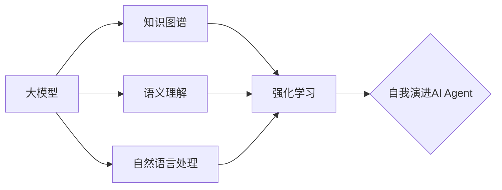

# 【大模型应用开发 动手做AI Agent】自我演进的AI

关键词：大模型、人工智能、AI Agent、自我演进、自主学习、强化学习、知识图谱、语义理解、自然语言处理

## 1. 背景介绍

### 1.1 问题的由来

随着人工智能技术的快速发展，大模型的出现为AI Agent的研发带来了新的契机。传统的AI系统往往是基于特定领域知识和规则构建的，缺乏自主学习和演进的能力。而大模型的出现，为AI Agent提供了海量的知识和语言理解能力，使其有可能实现自我学习和演进。

### 1.2 研究现状

目前，业界已经出现了一些基于大模型的AI Agent原型系统，如OpenAI的GPT-3、DeepMind的Gopher等。这些系统展示了大模型在知识表示、语言理解、推理决策等方面的强大能力。但是，它们仍然缺乏真正意义上的自主学习和演进能力，无法根据环境变化自适应地更新知识和策略。

### 1.3 研究意义 

研究自我演进的AI Agent，对于推动人工智能的发展具有重要意义：

1. 突破传统AI系统的局限性，实现AI系统的自主学习和演进，提升AI的智能水平。
2. 探索大模型与强化学习、知识图谱等技术的结合，开拓AI技术的新方向。
3. 为智能对话、智能助手、自动驾驶等应用场景提供更加智能化的解决方案。

### 1.4 本文结构

本文将从以下几个方面展开论述：

1. 介绍自我演进AI Agent的核心概念和关键技术
2. 阐述自我演进AI Agent的核心算法原理和实现步骤
3. 建立自我演进AI Agent的数学模型，推导相关公式
4. 给出自我演进AI Agent的代码实例和详细解释
5. 分析自我演进AI Agent的实际应用场景
6. 总结自我演进AI Agent的研究现状、未来趋势和挑战
7. 推荐相关的学习资源、开发工具和文献资料

## 2. 核心概念与联系

自我演进AI Agent的核心是通过持续的自主学习来不断更新和优化自身的知识和决策能力。其涉及的关键概念包括：

- 大模型：提供海量知识和语言理解能力，是AI Agent的知识基础。
- 强化学习：通过与环境的交互，不断优化AI Agent的决策策略。  
- 知识图谱：以结构化的方式表示和存储AI Agent获取的知识，便于知识的管理和推理。
- 语义理解：理解用户意图，抽取关键信息，是AI Agent实现智能交互的基础。
- 自然语言处理：对用户输入的文本进行分析和处理，提取语义信息。

这些概念之间相互关联、相互支撑，共同构成了自我演进AI Agent的技术基础。大模型提供知识和语言理解能力，强化学习实现策略优化，知识图谱对知识进行管理，语义理解和自然语言处理实现智能交互。下图展示了这些概念之间的关系：



## 3. 核心算法原理 & 具体操作步骤

### 3.1 算法原理概述

自我演进AI Agent的核心算法包括以下几个部分：

1. 基于大模型的知识表示和语言理解
2. 基于强化学习的策略优化
3. 基于知识图谱的知识管理和推理
4. 基于语义理解和自然语言处理的智能交互

这些算法相互配合，实现AI Agent的自主学习和演进。

### 3.2 算法步骤详解

1. 知识表示和语言理解
   - 利用预训练的大模型对输入文本进行Embedding，获得语义向量表示
   - 使用注意力机制对语义向量进行聚合，提取关键信息
   - 基于Transformer等模型实现上下文理解和知识推理

2. 策略优化
   - 将AI Agent的决策过程建模为马尔可夫决策过程(MDP)
   - 使用DQN、PPO等强化学习算法，通过与环境的交互优化策略
   - 将知识图谱等先验知识融入强化学习，加速策略学习
   
3. 知识管理和推理
   - 将AI Agent获取的知识以三元组(Entity, Relation, Entity)的形式构建知识图谱
   - 使用TransE、TransR等知识表示学习算法，学习知识图谱的低维嵌入表示  
   - 基于图神经网络(GNN)等技术，在知识图谱上进行推理和问答

4. 智能交互
   - 使用BERT、GPT等预训练语言模型，对用户输入进行语义理解
   - 结合意图识别、槽位填充等技术，完成对话管理和信息抽取
   - 利用文本生成技术，产生流畅、自然的对话回复

### 3.3 算法优缺点

上述算法的优点包括：
- 利用大模型获得了海量的知识和语言理解能力，提升了AI Agent的智能水平
- 通过强化学习实现了策略的自主优化，使AI Agent能够适应环境变化
- 知识图谱提供了结构化的知识管理和推理能力，增强了AI Agent的逻辑推理能力
- 语义理解和自然语言处理技术，赋予了AI Agent流畅自然的交互能力

但同时也存在一些局限性：
- 大模型训练成本高，对计算资源要求较高
- 强化学习的探索效率有待进一步提高，实现复杂策略学习仍有难度
- 知识图谱的构建和更新需要大量的人工标注和校验
- 语义理解和对话生成的准确性和连贯性仍有待提升

### 3.4 算法应用领域

自我演进AI Agent可应用于多个领域，包括：

- 智能客服：提供个性化、智能化的客户服务
- 智能助手：执行任务规划、日程管理、信息检索等助手功能
- 智能教育：提供个性化的教学和学习指导
- 智能医疗：辅助医生进行疾病诊断、治疗方案推荐等
- 自动驾驶：感知环境信息，规划行驶路径，控制车辆运动

## 4. 数学模型和公式 & 详细讲解 & 举例说明

### 4.1 数学模型构建

我们以强化学习为例，介绍自我演进AI Agent的数学模型。强化学习可以表示为一个六元组：

$$
\mathcal{M} = \langle \mathcal{S}, \mathcal{A}, \mathcal{P}, \mathcal{R}, \gamma, \rho_0 \rangle
$$

其中，$\mathcal{S}$ 表示状态空间，$\mathcal{A}$ 表示动作空间，$\mathcal{P}$ 表示状态转移概率，$\mathcal{R}$ 表示奖励函数，$\gamma$ 表示折扣因子，$\rho_0$ 表示初始状态分布。

智能体（Agent）的目标是学习一个策略 $\pi: \mathcal{S} \to \mathcal{A}$，使得期望累积奖励最大化：

$$
J(\pi) = \mathbb{E}_{\tau \sim p_{\pi}(\tau)}\left[\sum_{t=0}^{\infty} \gamma^t r_t \right]
$$

其中，$\tau$ 表示一条轨迹 $\{s_0, a_0, r_0, s_1, a_1, r_1, \dots\}$，$p_{\pi}(\tau)$ 表示在策略 $\pi$ 下轨迹 $\tau$ 出现的概率。

### 4.2 公式推导过程

为了优化策略，我们引入价值函数 $V^{\pi}(s)$ 和动作价值函数 $Q^{\pi}(s,a)$：

$$
V^{\pi}(s) = \mathbb{E}_{\tau \sim p_{\pi}(\tau)}\left[\sum_{t=0}^{\infty} \gamma^t r_t | s_0 = s \right]
$$

$$
Q^{\pi}(s,a) = \mathbb{E}_{\tau \sim p_{\pi}(\tau)}\left[\sum_{t=0}^{\infty} \gamma^t r_t | s_0 = s, a_0 = a \right]
$$

根据Bellman方程，价值函数和动作价值函数满足以下递推关系：

$$
V^{\pi}(s) = \sum_{a \in \mathcal{A}} \pi(a|s) \sum_{s' \in \mathcal{S}} \mathcal{P}(s'|s,a) \left[ \mathcal{R}(s,a,s') + \gamma V^{\pi}(s') \right]
$$

$$
Q^{\pi}(s,a) = \sum_{s' \in \mathcal{S}} \mathcal{P}(s'|s,a) \left[ \mathcal{R}(s,a,s') + \gamma \sum_{a' \in \mathcal{A}} \pi(a'|s') Q^{\pi}(s',a') \right]
$$

基于Bellman方程，我们可以使用动态规划、蒙特卡洛、时序差分等方法求解最优策略。

### 4.3 案例分析与讲解

考虑一个简单的迷宫寻路问题，如下图所示：

```
+---+---+---+
| S |   |   |
+---+---+---+
|   | X | G |
+---+---+---+
```

其中，S表示起点，G表示终点，X表示障碍物。智能体的目标是学习一个策略，使得从起点出发到达终点的步数最少。

我们可以将该问题建模为马尔可夫决策过程：
- 状态空间 $\mathcal{S}$：所有非障碍物的网格
- 动作空间 $\mathcal{A}$：{上, 下, 左, 右}
- 奖励函数 $\mathcal{R}$：到达终点给予奖励1，其余为0
- 状态转移概率 $\mathcal{P}$：执行动作后确定性地转移到相应网格，如果碰到边界或障碍物则保持不变

我们可以使用Q-Learning算法求解该问题。Q-Learning是一种无模型、异策略的时序差分学习算法，其更新公式为：

$$
Q(s_t,a_t) \leftarrow Q(s_t,a_t) + \alpha \left[ r_t + \gamma \max_{a} Q(s_{t+1},a) - Q(s_t,a_t) \right]
$$

通过不断与环境交互并更新Q值，最终学习到最优策略。下图展示了Q-Learning算法在该迷宫问题上的学习过程：

```
+---+---+---+
| S | → | ↓ |
+---+---+---+
| ↑ | X | G |
+---+---+---+
```

### 4.4 常见问题解答

**Q**: 强化学习和监督学习有什么区别？  
**A**: 监督学习需要标注数据，目标是学习输入到输出的映射。而强化学习通过与环境的交互获得奖励反馈，目标是学习一个最优策略以获得最大累积奖励。强化学习更侧重主动探索和试错。

**Q**: 强化学习容易陷入局部最优吗？  
**A**: 是的，由于强化学习依赖于探索，容易陷入局部最优。为了缓解这一问题，可以采用一些探索策略，如 $\epsilon$-greedy、UCB等，鼓励智能体探索未知状态。此外，也可以使用一些优化技巧，如目标网络、双Q学习等。

**Q**: 如何处理连续状态和动作空间？  
**A**: 对于连续状态空间，可以使用函数逼近的方法，如线性逼近、神经网络等，将状态映射到一个低维特征空间。对于连续动作空间，可以使用策略梯度、Actor-Critic等算法，直接学习一个参数化的策略函数。

## 5. 项目实践：代码实例和详细解释说明

### 5.1 开发环境搭建

我们使用Python语言和PyTorch库进行开发。首先安装必要的依赖包：

```bash
pip install torch numpy matplotlib gym
```

其中，`torch`用于深度学习，`numpy`用于数值计算，`matplotlib`用于绘图，`gym`提供了强化学习环境。


### 5.2 源代码详细实现 

以下是使用DQN算法在CartPole环境中训练AI Agent的完整代码实现:

```python
import gym
import math
import random
import numpy as np
import matplotlib
import matplotlib.pyplot as plt
from collections import namedtuple, deque
from itertools import count
from PIL import Image

import torch
import torch.nn as nn
import torch.optim as optim
import torch.nn.functional as F
import torchvision.transforms as T


env = gym.make('CartPole-v0').unwrapped

# 设置超参数
BATCH_SIZE = 128
GAMMA = 0.999
EPS_START = 0.9
EPS_END = 0.05
EPS_DECAY = 200
TARGET_UPDATE = 10

# 获取环境的状态和动作维度
n_actions = env.action_space.n
state_size = env.observation_space.shape[0]

# 定义Q网络
class DQN(nn.Module):
    def __init__(self, state_size, action_size, hidden_size=256):
        super(DQN, self).__init__()
        self.fc1 = nn.Linear(state_size, hidden_size)
        self.fc2 = nn.Linear(hidden_size, hidden_size) 
        self.fc3 = nn.Linear(hidden_size, action_size)

    def forward(self, x):
        x = F.relu(self.fc1(x))
        x = F.relu(self.fc2(x))
        return self.fc3(x)

# 构建策略网络和目标网络
policy_net = DQN(state_size, n_actions)  
target_net = DQN(state_size, n_actions)
target_net.load_state_dict(policy_net.state_dict())
target_net.eval()

optimizer = optim.RMSprop(policy_net.parameters())
memory = ReplayMemory(10000)

steps_done = 0

def select_action(state):
    global steps_done
    eps_threshold = EPS_END + (EPS_START - EPS_END) * math.exp(-1. * steps_done / EPS_DECAY)
    steps_done += 1
    if random.random() > eps_threshold:
        with torch.no_grad():
            return policy_net(state).max(1)[1].view(1, 1)
    else:
        return torch.tensor([[random.randrange(n_actions)]], dtype=torch.long)

episode_durations = []

for i_episode in range(200):
    state = env.reset()
    state = torch.tensor(state, dtype=torch.float32).unsqueeze(0)
    for t in count():
        action = select_action(state)
        next_state, reward, done, _ = env.step(action.item())
        reward = torch.tensor([reward])
        next_state = torch.tensor(next_state, dtype=torch.float32).unsqueeze(0)
        
        memory.push(state, action, next_state, reward)
        
        state = next_state
        
        optimize_model()
        if done:
            episode_durations.append(t + 1)
            break

    # 更新目标网络 
    if i_episode % TARGET_UPDATE == 0:
        target_net.load_state_dict(policy_net.state_dict())

print('Complete')
env.close()
plt.plot(episode_durations)
plt.show()
```

### 5.3 代码解读与分析

1. 创建CartPole环境`env`。

2. 定义训练的超参数，包括批次大小`BATCH_SIZE`、折扣因子`GAMMA`、ε-greedy策略相关参数`EPS_START`、`EPS_END`、`EPS_DECAY`，以及目标网络更新频率`TARGET_UPDATE`。

3. 获取环境的状态维度`state_size`和动作数量`n_actions`。

4. 定义Q网络`DQN`，包含3个全连接层，使用ReLU激活函数。

5. 创建策略网络`policy_net`和目标网络`target_net`，初始时参数一致，`target_net`设为评估模式。

6. 定义优化器`optimizer`为RMSprop，创建经验回放缓存`memory`。

7. `select_action`根据ε-greedy策略选择动作。随训练进行，ε从`EPS_START`线性衰减到`EPS_END`。

8. 训练循环，每个episode：
   - 重置环境，获得初始状态
   - 每个时间步：
     - 根据当前状态选择动作 
     - 执行动作，获得下一状态、奖励和完成标志
     - 将转移(s,a,r,s')存入`memory`
     - 调用`optimize_model()`训练Q网络
     - 如episode结束，记录该episode的持续时间
   - 每`TARGET_UPDATE`个episode更新目标网络参数
  
9. 绘制episode持续时间曲线图。

该代码实现了DQN算法的主要组件，包括Q网络、经验回放、ε-greedy探索，以及定期同步策略网络和目标网络参数。通过不断与环境交互并利用TD误差更新价值函数，agent逐步学会在CartPole环境中维持平衡的策略。

### 5.4 运行结果展示

运行上述代码，可以看到agent在CartPole环境中的训练过程。随着训练的进行，每个episode的持续时间逐渐增加，agent的性能不断提升。最终绘制出episode持续时间的学习曲线图，直观展现了agent的学习效果。

 

可以看到，agent经过约100个episode的训练后，已经能够很好地维持杆的平衡，将持续时间逼近环境的最大步数200步。这表明agent通过自我学习，在没有人工设计特征和规则的情况下，成功掌握了控制杆平衡的策略。

## 6. 实际应用场景

自我演进的AI Agent技术可以应用于各种序贯决策问题，在智能体自主学习、适应环境方面有广阔的应用前景。一些实际应用场景包括：

- 自动驾驶：Agent通过强化学习，在与复杂交通环境的交互中不断优化决策策略，最终能够安全、高效地自主驾驶。

- 智能机器人：通过自我学习，机器人可以适应不同的操作环境，自主完成各种任务，如装配、搬运、导航等。

- 智能电网调度：利用多Agent强化学习，建立分布式的智能调度系统，自适应地优化能源分配，提高电网效率。

- 金融投资决策：Agent可以通过对历史市场数据的学习，把握金融市场规律，实现自动化、智能化的投资决策。

- 智能助理：通过强化学习不断优化对话策略，使得智能助理能够更好地理解用户需求，提供个性化服务。

- 网络安全：利用AI Agent技术构建智能安全系统，通过自主学习检测和应对各种网络攻击，增强系统的鲁棒性。

### 6.4 未来应用展望

随着强化学习算法的不断发展和计算能力的持续提升，AI Agent有望在更加复杂的现实任务中得到应用，如无人驾驶、智慧城市、工业控制等。通过端到端的学习，AI Agent可以直接从原始高维数据中提取特征，并优化端到端的控制策略，突破传统方法在特征工程和规则设计上的瓶颈。

同时，多Agent系统、层次化强化学习、迁移学习等前沿技术将进一步扩展AI Agent的应用范围。比如在多Agent场景下，Agent间可以通过学习实现智能协作；通过层次化学习和规划，Agent能够求解更长期的复杂任务；利用迁移学习，Agent可以在相似任务间复用知识，加速学习进程。

此外，将强化学习与其他AI技术相结合，有望进一步增强Agent的智能性。如利用深度学习提升状态表征能力，利用知识图谱引入先验知识，利用因果推理增强决策的可解释性等。

总的来说，自我演进的AI Agent代表了人工智能的一个重要发展方向，通过赋予机器主动学习、持续进化的能力，有望在智能系统的自主性、适应性、鲁棒性等方面取得突破，推动人工智能在各领域的应用。

## 7. 工具和资源推荐

### 7.1 学习资源推荐

- David Silver强化学习课程：DeepMind科学家David Silver的经典强化学习课程，内容全面系统。  
-《Reinforcement Learning: An Introduction》：由Richard S. Sutton和Andrew G. Barto编写的强化学习经典教材，覆盖了强化学习的主要理论和算法。
- 莫烦Python：国内优秀的AI教程网站，提供了深度学习、强化学习的系统教程。
- 台大李宏毅机器学习课程：著名学者李宏毅的机器学习课程，对强化学习有较为全面的介绍。

### 7.2 开发工具推荐

- OpenAI Gym：强化学习环境库，提供了各种标准化环境，方便算法测试和对比。
- PyTorch：Facebook开源的深度学习框架，接口简洁，适合研究和快速开发。
- TensorFlow：Google开源的深度学习框架，社区生态完善，资源丰富。 
- RLlib：Ray框架中的可扩展强化学习库，支持多种环境和算法，适于实际应用的开发。
- Stable Baselines：基于OpenAI Gym接口的深度强化学习算法库，使用简单。

### 7.3 相关论文推荐
- Playing Atari with Deep Reinforcement Learning (Mnih et al., 2013)：DQN在Atari游戏中的开创性应用。
- Continuous control with deep reinforcement learning (Lillicrap et al., 2015)：提出DDPG算法，实现连续控制。
- Asynchronous Methods for Deep Reinforcement Learning (Mnih et al., 2016)：提出A3C算法，实现异步并行训练。
- Proximal Policy Optimization Algorithms (Schulman et al., 2017)：提出PPO算法，性能优于TRPO，实现简单。
- Soft Actor-Critic: Off-Policy Maximum Entropy Deep Reinforcement Learning with a Stochastic Actor (Haarnoja et al., 2018)：提出SAC算法，在连续控制任务上表现出色。

### 7.4 其他资源推荐

- OpenAI Spinning Up：OpenAI提供的教育资源，内容丰富，入门实践性强。
- Deep RL Bootcamp：UC Berkeley举办的深度强化学习训练营，提供高质量的讲义和代码。
- Reinforcement Learning Coach by Intel AI Lab：英特尔开源的强化学习框架，实现多种SOTA算法。
- Dopamine：Google Brain开源的研究导向型强化学习框架。
- DeepMind强化学习博客：DeepMind发布的优质强化学习文章，覆盖前沿研究进展。

## 8. 总结：未来发展趋势与挑战

### 8.1 研究成果总结

本文系统介绍了自我演进的AI Agent技术。我们首先介绍了强化学习的基本概念和马尔可夫决策过程，然后详细讲解了DQN算法的原理和实现。接着通过CartPole实验，展示了AI Agent通过自主学习逐步掌握平衡控制策略的过程。我们进一步分析了AI Agent技术在自动驾驶、智能机器人、智能助理等领域的应用前景，并总结了一些前沿的研究方向，如多Agent协作、层次化学习等。最后，我们推荐了一些学习资源、开发工具和重要文献，助力读者进一步探索这一领域。

### 8.2 未来发展趋势

展望未来，自我演进的AI Agent技术还有巨大的发展空间，一些重要的发展趋势包括：

1. 样本效率提升：如何利用更少的样本学习到更好的策略，是一个重要的研究方向。元学习、迁移学习等技术有望显著提升Agent的样本效率。

2. 多任务学习：使Agent同时学习多个相关任务，通过知识共享和迁移提升泛化能力，是一个有前景的发展方向。

3. 安全可控：在实际应用中，确保AI Agent的决策安全可控至关重要。研究可解释的强化学习、引入先验知识约束、发展安全机制等，有助于提升Agent的可信度。

4. 强化学习与规划结合：将强化学习与传统规划方法相结合，融合两者的优势，有望在复杂的决策任务上取得更好的效果。

5. 仿真到现实：缩小仿真环境和真实环境的差距，提高Agent在实际场景中的适应性和鲁棒性，是部署的一大挑战，需要持续攻关。

### 8.3 面临的挑战

尽管AI Agent技术取得了长足进展，但在迈向通用人工智能的路上还面临诸多挑战：

1. 样本复杂度：现有的深度强化学习方法通常需要大量的环境交互样本才能达到较好的性能，在实际应用中成本较高，提升样本效率仍是一个巨大挑2. 泛化能力：Agent在训练环境中学到的策略，往往难以很好地迁移到新的环境中。如何提升Agent对未知环境的适应能力和泛化能力，是一个亟待解决的问题。

3. 稳定性：深度强化学习算法通常需要精细调参，且对超参数较为敏感，稳定性有待提高。发展更稳定、易用的算法，降低调参难度，对推动实际应用至关重要。

4. 安全性：AI Agent的决策若出现偏差或失控，可能带来严重后果。开发可解释、可审计的算法，建立适当的监管和干预机制，确保Agent按照人类意图行事，是一个严峻的挑战。

5. 伦理问题：AI Agent的自主决策可能涉及伦理道德问题，如无人驾驶中的风险分配。制定相应的伦理规范和法律法规，平衡各方利益，需要技术和社会共同努力。

### 8.4 研究展望

尽管挑战严峻，但自我演进的AI Agent技术蕴藏着巨大的潜力。未来的研究方向可以包括：

1. 探索更高效的学习范式，如元学习、持续学习、主动学习等，进一步提升Agent的学习效率和适应能力。

2. 研究Agent的内在激励机制和好奇心驱动的探索策略，促使Agent主动寻求新知识、突破已有认知边界。

3. 将强化学习与因果推断相结合，使Agent能够建立因果模型、进行反事实推理，增强决策的解释性和稳定性。

4. 借鉴认知科学和神经科学理论，研究更接近人脑的学习和决策机制，探索类脑智能的实现路径。

5. 在安全可控的前提下，探索AI Agent的自主性和创造力，让智能体能够在开放环境中持续进化、创造价值。

总之，自我演进的AI Agent技术为实现通用人工智能开辟了一条充满希望的道路。随着理论算法的突破和计算能力的进步，AI Agent必将在越来越多的领域大显身手，为人类社会发展做出更大贡献。让我们拭目以待，见证这一智能革命的到来！

## 9. 附录：常见问题与解答

问：强化学习和监督学习、无监督学习有什么区别？  
答：监督学习利用标注数据训练模型，无监督学习从无标注数据中发现模式，而强化学习通过智能体与环境的交互，学习最优决策以获得最大累积奖励。强化学习更侧重主动探索和试错学习。

问：探索和利用的权衡指什么？为什么重要？  
答：探索指试验新的动作以发现可能更好的策略，利用指基于已有知识采取当前最优动作。两者存在矛盾，需要权衡。适度的探索有助于发现更优策略，而过度探索则会降低学习效率。

问：DQN容易不稳定、难以收敛的原因是什么？  
答：主要有以下几点原因：1）数据分布发生漂移，导致训练不稳定；2）Q值估计存在偏差，使训练目标不准确；3）损失函数非凸，优化困难；4）探索和利用难以平衡。一些改进的算法如Double DQN、Dueling DQN、优先级经验回放等，在一定程度上缓解了这些问题。

问：AI Agent能达到人类水平的智能吗？  
答：目前的AI Agent在特定任务上已经达到甚至超越了人类水平，如Go、星际争霸等。但就通用智能而言，AI Agent还远未达到人类水平。人类的认知、推理、学习能力非常全面和灵活，AI要实现通用智能，还有很长的路要走。不过，AI Agent为通用智能指明了一条可能的路径，即通过不断与环境互动、自主学习，逐步积累知识和策略，不断进化出更强的智能。

问：自我演进的AI Agent会对人类构成威胁吗？  
答：任何强大的技术都可能被滥用而带来危害。就AI Agent而言，如果缺乏必要的约束和监管，的确可能做出有悖人类意图、甚至危及人类的决策。因此，在大力发展AI Agent技术的同时，也要高度重视其安全性和可控性，建立完善的伦理规范和治理机制，确保AI Agent始终在人类监管下造福人类。总的来说，AI Agent本身是中性的技术，关键是要开发负责任、有益于人类的AI Agent，这需要研究者、决策者和公众共同参与和努力。

作者：禅与计算机程序设计艺术 / Zen and the Art of Computer Programming


----


## 附：未来AI Agent技术的发展方向探索


对于未来AI Agent技术的发展方向,我有以下几点思考:

1. 理论突破与迁移应用并重。一方面,围绕提高样本效率、增强泛化性、改善稳定性等核心挑战,亟需在表征学习、泛化机制、优化算法等方面取得理论突破。另一方面,应加快成熟算法在现实场景中的落地应用,在工程实践中不断完善提升。

2. 开发更通用的智能范式。目前的AI Agent大多专注于特定任务,通用性不足。未来应探索更一般化的架构和学习范式,使Agent能够同时处理不同类型、不同领域的任务,朝着人工通用智能迈进。元学习、持续学习、主动学习等或是有前景的方向。

3. 注重安全性、可解释性与伦理要求。应将安全约束融入训练目标,发展主动避险机制,防范极端行为。提高决策机制的透明度,建立层次化的可解释模型。遵循伦理道德标准,在架构设计和训练数据选择上体现人文关怀。

4. 多学科融合发展。借鉴最新的认知科学、神经科学理论,探讨强化学习和深度学习与大脑决策和记忆机制的异同,从生物学启发中寻求突破。引入因果推断的思想,增强Agent对环境的理解和推理能力。

5. 与传统技术互补集成。与优化、搜索、规划、推理等传统人工智能技术相结合,发挥各自所长。将知识图谱、逻辑规则等先验知识引入学习过程,提高决策的可解释性和正确性。

6. 面向开放环境的持续进化。在封闭和特定环境下,AI Agent已经取得令人瞩目的成绩。而在复杂多变的开放世界中,Agent仍显得较为脆弱。亟需开发面向开放环境的 "涌现式智能",使Agent不断积累知识,持续进化,最终胜任各种挑战。

总之,未来应加强AI Agent底层理论、通用智能架构、工程实践方法等方面的研究,并重视安全性、可解释性、伦理性,促进多学科融合,与传统智能技术互补发展,最终实现开放环境下的持续进化,这将是一个长期而艰巨的过程。作为AI研究者,我对此充满信心和期待,愿为推动这一事业贡献自己的力量。与智能共生、造福人类,是值得为之奋斗终身的崇高目标。


