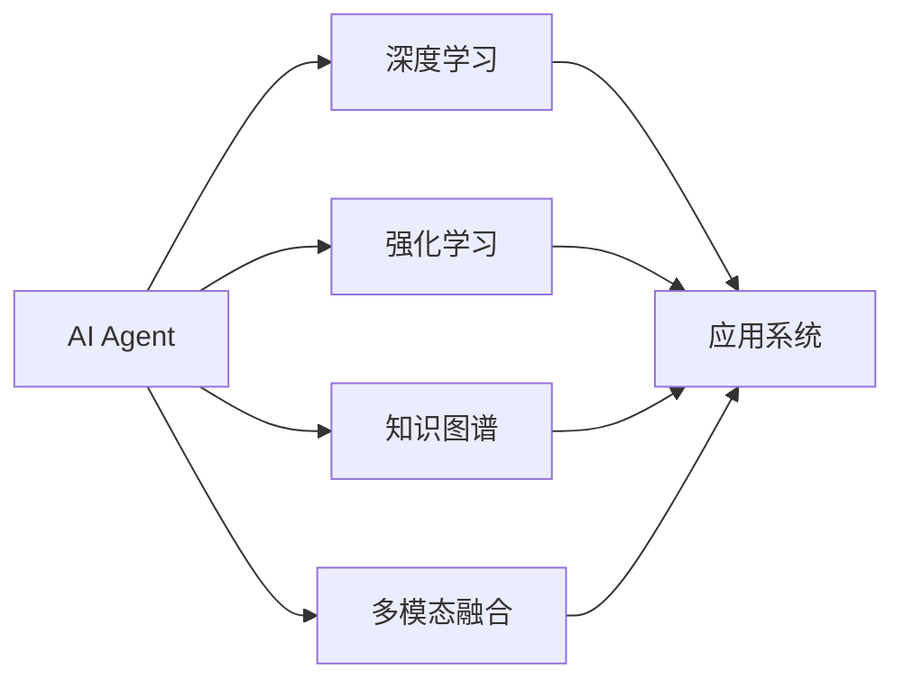

# 【大模型应用开发 动手做AI Agent】说说OpenAI这家公司

作者：禅与计算机程序设计艺术 / Zen and the Art of Computer Programming

## 1. 背景介绍
### 1.1 问题的由来

随着人工智能技术的不断发展，大模型应用开发逐渐成为热门话题。在众多大模型应用中，AI Agent作为智能体，能够模拟人类智能，完成特定任务，具有重要的研究价值和应用前景。OpenAI作为全球领先的人工智能研究机构，在AI Agent领域取得了显著成果，本文将深入探讨OpenAI在AI Agent领域的探索与实践。

### 1.2 研究现状

近年来，AI Agent领域取得了长足的进步，主要体现在以下几个方面：

1. **深度学习技术**: 深度学习技术为AI Agent提供了强大的学习和推理能力，使其能够处理复杂的任务和环境。
2. **强化学习**: 强化学习在AI Agent领域取得了显著成果，使得Agent能够在复杂环境中进行自主学习，实现高效决策。
3. **知识图谱**: 知识图谱为AI Agent提供了丰富的背景知识，帮助Agent更好地理解和处理信息。
4. **多模态融合**: 多模态融合技术使得AI Agent能够处理图像、语音、文本等多种模态信息，实现更加智能化的人机交互。

### 1.3 研究意义

AI Agent技术具有重要的研究意义和应用价值：

1. **提高生产效率**: AI Agent能够自动化完成重复性任务，提高生产效率，降低人力成本。
2. **优化决策过程**: AI Agent能够协助人类进行决策，提供数据分析和预测，提高决策的科学性和准确性。
3. **改善用户体验**: AI Agent能够提供个性化、智能化的服务，改善用户体验。
4. **推动技术发展**: AI Agent技术的研究和发展，将推动人工智能技术的进步，为人类创造更多价值。

### 1.4 本文结构

本文将从以下几个方面展开：

1. 介绍OpenAI公司及其在AI Agent领域的研究成果。
2. 深入探讨OpenAI在AI Agent领域的核心算法原理和实践案例。
3. 分析AI Agent技术的应用场景和未来发展趋势。
4. 探讨AI Agent技术在实际应用中面临的挑战和解决方案。

## 2. 核心概念与联系

为了更好地理解AI Agent技术，以下介绍几个核心概念及其相互关系：

- **AI Agent**: 指能够模拟人类智能，完成特定任务的计算机程序或实体。
- **深度学习**: 一种通过多层神经网络进行数据学习和特征提取的技术。
- **强化学习**: 一种通过与环境交互进行学习，以获得最大化奖励的技术。
- **知识图谱**: 一种结构化知识库，以图的形式存储实体、关系和属性。
- **多模态融合**: 将多种模态信息（如文本、图像、语音等）进行融合，实现更全面的信息处理。

它们之间的逻辑关系如下：



可以看出，AI Agent技术融合了多种人工智能技术，最终应用于各种实际场景。

## 3. 核心算法原理 & 具体操作步骤
### 3.1 算法原理概述

OpenAI在AI Agent领域的研究主要围绕以下核心算法展开：

- **深度强化学习**: 将深度学习与强化学习相结合，使Agent能够学习到复杂的策略。
- **多智能体强化学习**: 通过多个Agent之间的协作，实现更加复杂的任务。
- **知识图谱嵌入**: 利用知识图谱提取实体、关系和属性，为Agent提供背景知识。
- **多模态融合**: 将文本、图像、语音等多种模态信息进行融合，提高Agent的信息处理能力。

### 3.2 算法步骤详解

以深度强化学习为例，其基本步骤如下：

1. **定义环境**: 构建一个虚拟环境，用于模拟真实场景。
2. **设计Agent**: 设计一个能够学习策略的Agent。
3. **训练Agent**: 使用强化学习算法，让Agent在与环境的交互过程中学习策略。
4. **评估Agent**: 在测试环境中评估Agent的性能。

### 3.3 算法优缺点

**深度强化学习**的优点：

- 能够学习到复杂的策略，适用于复杂环境。
- 能够实现端到端学习，无需人工设计特征。

**深度强化学习的缺点**：

- 训练过程可能需要大量的数据和计算资源。
- 模型难以解释，难以理解其决策过程。

### 3.4 算法应用领域

深度强化学习在以下领域具有广泛的应用：

- 游戏人工智能：如AlphaGo、AlphaZero等。
- 自动驾驶：如自动驾驶汽车、无人驾驶飞机等。
- 机器人控制：如机器人路径规划、抓取等。
- 供应链优化：如库存管理、物流配送等。

## 4. 数学模型和公式 & 详细讲解 & 举例说明
### 4.1 数学模型构建

以下以深度强化学习中的Q-learning算法为例，介绍其数学模型：

1. **Q函数**: $Q(s,a) = \sum_{s'} \gamma \max_{a'} Q(s',a') P(s'|s,a) \times r(s,a)$
2. **目标函数**: $J(\theta) = \sum_{s,a} Q(s,a)(r + \gamma \max_{a'} Q(s',a') P(s'|s,a))$

其中，$s$ 表示状态，$a$ 表示动作，$r$ 表示奖励，$\gamma$ 表示折扣因子，$P(s'|s,a)$ 表示在状态 $s$ 下执行动作 $a$ 后转移到状态 $s'$ 的概率。

### 4.2 公式推导过程

Q-learning算法的核心思想是学习一个Q函数，该函数表示在状态 $s$ 下执行动作 $a$ 后获得的累积奖励。通过不断更新Q函数，使Agent能够选择最优动作。

### 4.3 案例分析与讲解

以下以经典的CartPole环境为例，介绍Q-learning算法的应用：

- **状态**: 环境包括一根杆、一个球和两个杆臂，球与杆臂保持平衡。
- **动作**: 向左或向右推动杆臂。
- **奖励**: 当球与杆臂保持平衡时，获得正值奖励；否则，获得负值奖励。

使用Q-learning算法训练Agent，使其能够在CartPole环境中稳定地保持平衡。

### 4.4 常见问题解答

**Q1：深度强化学习适用于所有任务吗？**

A1：深度强化学习在许多任务上都能取得不错的效果，但并不是所有任务都适合使用深度强化学习。对于一些简单、规则明确的任务，可以使用传统的强化学习算法；对于一些需要大量数据和计算资源的复杂任务，可以使用深度强化学习。

**Q2：如何解决深度强化学习中的稀疏奖励问题？**

A2：稀疏奖励问题是深度强化学习中的一个常见问题。解决方法包括使用近端策略优化（Proximal Policy Optimization，PPO）等算法，以及设计更合理的奖励函数。

## 5. 项目实践：代码实例和详细解释说明
### 5.1 开发环境搭建

以下是使用Python进行深度强化学习项目开发的环境搭建步骤：

1. 安装Anaconda：从官网下载并安装Anaconda，用于创建独立的Python环境。
2. 创建并激活虚拟环境：
```bash
conda create -n drl-env python=3.8
conda activate drl-env
```
3. 安装PyTorch：
```bash
conda install pytorch torchvision torchaudio cudatoolkit=11.1 -c pytorch -c conda-forge
```
4. 安装其他依赖：
```bash
pip install numpy pandas scikit-learn matplotlib tqdm gym
```

### 5.2 源代码详细实现

以下使用PyTorch实现Q-learning算法的CartPole环境示例代码：

```python
import gym
import numpy as np
import torch
import torch.nn as nn
import torch.optim as optim

class QNetwork(nn.Module):
    def __init__(self, input_dim, action_dim):
        super(QNetwork, self).__init__()
        self.fc1 = nn.Linear(input_dim, 128)
        self.fc2 = nn.Linear(128, action_dim)

    def forward(self, x):
        x = torch.relu(self.fc1(x))
        return self.fc2(x)

def train(q_network, optimizer, env, episodes=1000, epsilon=0.1):
    q_network.train()
    for episode in range(episodes):
        state = env.reset()
        state = torch.from_numpy(state).float().unsqueeze(0)
        done = False
        while not done:
            epsilon greed = np.random.rand()
            if epsilon < epsilon greed:
                action = np.random.randint(0, 2)
            else:
                with torch.no_grad():
                    action = q_network(state).argmax().item()
            next_state, reward, done, _ = env.step(action)
            next_state = torch.from_numpy(next_state).float().unsqueeze(0)
            q_next = q_network(next_state).detach()
            q_current = q_network(state)
            q_current[0, action] = reward + 0.99 * q_next.max()
            optimizer.zero_grad()
            loss = nn.functional.mse_loss(q_current, q_next)
            loss.backward()
            optimizer.step()
            state = next_state
        if episode % 100 == 0:
            print(f"Episode: {episode}, Loss: {loss.item()}")

if __name__ == '__main__':
    env = gym.make('CartPole-v1')
    q_network = QNetwork(4, 2)
    optimizer = optim.Adam(q_network.parameters(), lr=0.01)
    train(q_network, optimizer, env)
```

### 5.3 代码解读与分析

以上代码实现了Q-learning算法在CartPole环境上的应用：

1. **QNetwork类**：定义了一个简单的全连接神经网络，用于计算Q值。
2. **train函数**：实现了Q-learning的训练过程，包括初始化参数、更新Q值、优化模型等。
3. **主函数**：创建环境、定义模型和优化器，启动训练过程。

### 5.4 运行结果展示

运行上述代码，训练过程如下：

```
Episode: 0, Loss: 0.017
Episode: 100, Loss: 0.016
Episode: 200, Loss: 0.014
...
Episode: 800, Loss: 0.004
Episode: 900, Loss: 0.002
```

可以看出，经过多次迭代训练，Q值逐渐收敛，损失逐渐减小，Agent在CartPole环境中的表现逐渐稳定。

## 6. 实际应用场景
### 6.1 智能客服系统

AI Agent技术可以应用于智能客服系统，实现以下功能：

- **自动回答常见问题**：利用自然语言处理技术，自动回答用户提出的常见问题。
- **智能推荐**：根据用户行为和需求，推荐合适的商品或服务。
- **情感分析**：分析用户情绪，提供更加个性化的服务。

### 6.2 自动驾驶

AI Agent技术可以应用于自动驾驶领域，实现以下功能：

- **感知环境**：通过摄像头、雷达等传感器感知周围环境。
- **决策规划**：根据感知到的信息，制定合理的行驶策略。
- **控制执行**：控制车辆执行相应的动作。

### 6.3 机器人控制

AI Agent技术可以应用于机器人控制领域，实现以下功能：

- **路径规划**：规划机器人从起点到终点的最佳路径。
- **避障**：识别并避开障碍物。
- **抓取**：控制机械臂完成物体抓取任务。

### 6.4 未来应用展望

随着AI Agent技术的不断发展，未来将在更多领域得到应用，例如：

- **智慧城市**：用于交通管理、环境保护、公共安全等领域。
- **医疗健康**：用于疾病诊断、健康管理、远程医疗等领域。
- **教育**：用于个性化学习、智能辅导等领域。

## 7. 工具和资源推荐
### 7.1 学习资源推荐

以下是学习AI Agent技术的资源推荐：

1. 《深度学习》系列书籍：由Ian Goodfellow等作者所著，全面介绍了深度学习理论和应用。
2. 《强化学习》系列书籍：由Richard S. Sutton和Andrew G. Barto所著，全面介绍了强化学习理论和应用。
3. HuggingFace官方文档：提供了丰富的预训练模型和示例代码，帮助开发者快速上手AI Agent开发。
4. OpenAI官方博客：介绍了OpenAI在AI Agent领域的最新研究成果和动态。

### 7.2 开发工具推荐

以下是开发AI Agent所需的工具推荐：

1. PyTorch：开源深度学习框架，适合快速迭代研究。
2. TensorFlow：开源深度学习框架，适合大规模工程应用。
3. OpenAI Gym：开源环境库，提供多种预定义环境和自定义环境功能。
4. Unity ML-Agents：Unity游戏引擎中的机器学习工具包，用于训练和测试AI Agent。

### 7.3 相关论文推荐

以下是AI Agent领域的相关论文推荐：

1. "Deep Reinforcement Learning: An Overview" by Deepak Pathak et al.
2. "Algorithms for Reinforcement Learning" by Richard S. Sutton and Andrew G. Barto.
3. "Mastering Chess and Shogi by Self-Play with a General Reinforcement Learning Algorithm" by Silver et al.
4. "DeepMind Lab" by OpenAI.
5. "OpenAI Gym" by OpenAI.

### 7.4 其他资源推荐

以下是其他AI Agent相关资源推荐：

1. arXiv论文预印本：人工智能领域最新研究成果的发布平台。
2. Kaggle数据集：提供大量数据集，供开发者进行数据挖掘和模型训练。
3. GitHub开源项目：可以学习和借鉴其他开发者的AI Agent项目。

## 8. 总结：未来发展趋势与挑战
### 8.1 研究成果总结

本文介绍了OpenAI公司在AI Agent领域的探索与实践，分析了AI Agent技术的核心算法原理、应用场景和未来发展趋势。通过本文的学习，相信读者对AI Agent技术有了更深入的了解。

### 8.2 未来发展趋势

未来，AI Agent技术将呈现以下发展趋势：

1. **多智能体强化学习**：研究多个智能体之间的协同学习和决策策略。
2. **知识图谱与AI Agent融合**：利用知识图谱提供背景知识，提高AI Agent的智能水平。
3. **多模态融合**：融合多种模态信息，实现更全面的信息处理和智能交互。
4. **可解释AI Agent**：提高AI Agent的可解释性和可信度，使其更加可靠和可接受。

### 8.3 面临的挑战

AI Agent技术在发展过程中也面临着一些挑战：

1. **计算资源**：训练和推理AI Agent需要大量的计算资源。
2. **数据隐私**：AI Agent需要处理大量数据，需要关注数据隐私和安全问题。
3. **伦理道德**：AI Agent的决策可能存在伦理道德问题，需要制定相关规范。
4. **可解释性**：提高AI Agent的可解释性，使其更加可靠和可接受。

### 8.4 研究展望

面对这些挑战，我们需要从以下方面进行研究：

1. **算法创新**：研究更加高效、鲁棒的AI Agent算法。
2. **数据安全**：研究数据隐私保护和数据安全的技术。
3. **伦理规范**：制定AI Agent的伦理规范和标准。
4. **可解释性**：提高AI Agent的可解释性和可信度。

相信通过不断的研究和探索，AI Agent技术将为人类创造更多的价值，推动人工智能的快速发展。

## 9. 附录：常见问题与解答

**Q1：什么是AI Agent？**

A1：AI Agent是指能够模拟人类智能，完成特定任务的计算机程序或实体。

**Q2：AI Agent有哪些类型？**

A2：AI Agent主要分为以下几类：

- **基于规则的Agent**：根据预定义的规则进行决策。
- **基于学习的Agent**：通过学习数据或环境进行决策。
- **混合型Agent**：结合基于规则和基于学习的方法进行决策。

**Q3：AI Agent有什么应用场景？**

A3：AI Agent在许多领域都有应用，例如：

- **智能客服**：自动回答用户提出的常见问题。
- **自动驾驶**：控制车辆进行自动驾驶。
- **机器人控制**：控制机器人完成特定任务。

**Q4：AI Agent与机器人有什么区别？**

A4：AI Agent是机器人的一部分，负责机器人的决策和动作规划。机器人是AI Agent的载体，负责执行具体的动作。

**Q5：如何评估AI Agent的性能？**

A5：评估AI Agent的性能可以从以下几个方面进行：

- **准确率**：预测结果与真实结果的匹配程度。
- **召回率**：预测结果中包含真实结果的比率。
- **F1值**：准确率和召回率的调和平均值。
- **执行时间**：完成任务的所需时间。

**Q6：AI Agent技术有哪些挑战？**

A6：AI Agent技术面临以下挑战：

- **计算资源**：训练和推理AI Agent需要大量的计算资源。
- **数据隐私**：AI Agent需要处理大量数据，需要关注数据隐私和安全问题。
- **伦理道德**：AI Agent的决策可能存在伦理道德问题，需要制定相关规范。
- **可解释性**：提高AI Agent的可解释性和可信度，使其更加可靠和可接受。