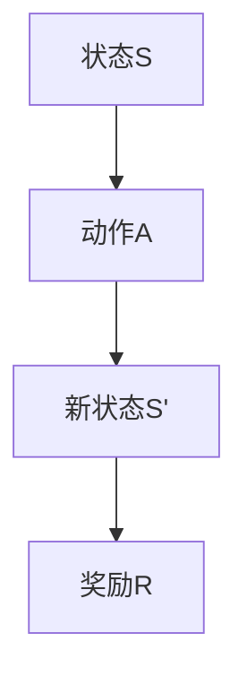
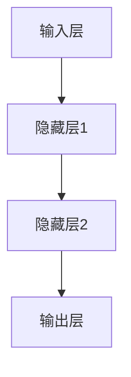

# 强化学习：在机器人技术中的应用

## 1.背景介绍

### 1.1 强化学习的起源与发展

强化学习（Reinforcement Learning, RL）是一种机器学习方法，旨在通过与环境的交互来学习最优策略。其起源可以追溯到20世纪50年代的行为心理学，特别是B.F.斯金纳的操作条件反射理论。随着计算机科学的发展，RL逐渐成为人工智能领域的重要研究方向。

### 1.2 机器人技术的兴起

机器人技术自20世纪中期以来迅速发展，从最初的工业机器人到如今的服务机器人、医疗机器人和无人驾驶汽车，机器人技术已经渗透到各个领域。机器人技术的发展离不开计算机科学、控制理论和传感技术的进步。

### 1.3 强化学习与机器人技术的结合

强化学习在机器人技术中的应用具有巨大的潜力。通过RL，机器人可以在复杂的环境中自主学习和优化行为策略，从而实现更高效、更智能的操作。这种结合不仅推动了机器人技术的发展，也为RL提供了丰富的应用场景。

## 2.核心概念与联系

### 2.1 强化学习的基本概念

#### 2.1.1 智能体与环境

在RL中，智能体（Agent）是执行动作并从环境中获取反馈的主体。环境（Environment）是智能体所处的外部世界，智能体通过与环境的交互来学习。

#### 2.1.2 状态、动作与奖励

状态（State）是环境在某一时刻的描述，动作（Action）是智能体在某一状态下采取的行为，奖励（Reward）是智能体从环境中获得的反馈信号。智能体的目标是通过选择合适的动作来最大化累积奖励。

#### 2.1.3 策略与价值函数

策略（Policy）是智能体在每个状态下选择动作的规则，价值函数（Value Function）是评估每个状态或状态-动作对的长期回报的函数。

### 2.2 机器人技术的基本概念

#### 2.2.1 传感器与执行器

传感器（Sensor）用于感知环境信息，执行器（Actuator）用于执行动作。传感器和执行器是机器人与外部世界交互的关键组件。

#### 2.2.2 控制系统

控制系统是机器人实现自主操作的核心，通过接收传感器数据并根据预定算法生成控制信号来驱动执行器。

### 2.3 强化学习与机器人技术的联系

RL与机器人技术的结合主要体现在以下几个方面：

- **自主学习**：通过RL，机器人可以在未知环境中自主学习最优策略。
- **适应性**：RL使机器人能够适应动态变化的环境。
- **优化**：RL可以优化机器人的操作效率和性能。

## 3.核心算法原理具体操作步骤

### 3.1 马尔可夫决策过程

马尔可夫决策过程（Markov Decision Process, MDP）是RL的数学基础。MDP由状态集、动作集、转移概率和奖励函数组成。



### 3.2 Q学习算法

Q学习是一种无模型的RL算法，通过更新Q值来学习最优策略。Q值表示在某一状态下采取某一动作的预期回报。

#### 3.2.1 Q值更新公式

$$
Q(s, a) \leftarrow Q(s, a) + \alpha [r + \gamma \max_{a'} Q(s', a') - Q(s, a)]
$$

其中，$\alpha$ 是学习率，$\gamma$ 是折扣因子，$r$ 是即时奖励，$s'$ 是新状态，$a'$ 是新动作。

### 3.3 深度Q网络

深度Q网络（Deep Q-Network, DQN）结合了深度学习和Q学习，通过神经网络来近似Q值函数。

#### 3.3.1 DQN的结构



#### 3.3.2 DQN的训练过程

1. 初始化经验回放池和Q网络。
2. 从经验回放池中随机抽取样本。
3. 使用样本更新Q网络。

## 4.数学模型和公式详细讲解举例说明

### 4.1 马尔可夫决策过程的数学模型

MDP由五元组 $(S, A, P, R, \gamma)$ 组成，其中：

- $S$ 是状态集。
- $A$ 是动作集。
- $P$ 是状态转移概率。
- $R$ 是奖励函数。
- $\gamma$ 是折扣因子。

### 4.2 Q学习的数学公式

Q学习的目标是找到最优Q值函数 $Q^*(s, a)$，使得在每个状态下选择的动作能够最大化累积奖励。Q值更新公式为：

$$
Q(s, a) \leftarrow Q(s, a) + \alpha [r + \gamma \max_{a'} Q(s', a') - Q(s, a)]
$$

### 4.3 深度Q网络的数学模型

DQN使用神经网络来近似Q值函数。神经网络的输入是状态 $s$，输出是每个动作的Q值。损失函数为：

$$
L(\theta) = \mathbb{E}[(r + \gamma \max_{a'} Q(s', a'; \theta^-) - Q(s, a; \theta))^2]
$$

其中，$\theta$ 是Q网络的参数，$\theta^-$ 是目标网络的参数。

## 5.项目实践：代码实例和详细解释说明

### 5.1 环境搭建

首先，我们需要安装必要的库：

```bash
pip install gym
pip install tensorflow
```

### 5.2 Q学习算法实现

以下是一个简单的Q学习算法实现：

```python
import gym
import numpy as np

env = gym.make('FrozenLake-v0')
Q = np.zeros([env.observation_space.n, env.action_space.n])
alpha = 0.1
gamma = 0.99
num_episodes = 1000

for i in range(num_episodes):
    state = env.reset()
    done = False
    while not done:
        action = np.argmax(Q[state, :] + np.random.randn(1, env.action_space.n) * (1. / (i + 1)))
        new_state, reward, done, _ = env.step(action)
        Q[state, action] = Q[state, action] + alpha * (reward + gamma * np.max(Q[new_state, :]) - Q[state, action])
        state = new_state

print("Q-Table:", Q)
```

### 5.3 深度Q网络实现

以下是一个简单的DQN实现：

```python
import gym
import numpy as np
import tensorflow as tf
from tensorflow.keras import layers

env = gym.make('CartPole-v1')
num_actions = env.action_space.n
num_states = env.observation_space.shape[0]

model = tf.keras.Sequential([
    layers.Dense(24, activation='relu', input_shape=(num_states,)),
    layers.Dense(24, activation='relu'),
    layers.Dense(num_actions, activation='linear')
])

model.compile(optimizer=tf.keras.optimizers.Adam(learning_rate=0.001), loss='mse')

def train_dqn(episodes):
    for e in range(episodes):
        state = env.reset()
        state = np.reshape(state, [1, num_states])
        done = False
        while not done:
            action = np.argmax(model.predict(state))
            next_state, reward, done, _ = env.step(action)
            next_state = np.reshape(next_state, [1, num_states])
            target = reward
            if not done:
                target = reward + 0.99 * np.amax(model.predict(next_state))
            target_f = model.predict(state)
            target_f[0][action] = target
            model.fit(state, target_f, epochs=1, verbose=0)
            state = next_state

train_dqn(1000)
```

## 6.实际应用场景

### 6.1 无人驾驶汽车

无人驾驶汽车需要在复杂的道路环境中自主决策。通过RL，无人驾驶汽车可以学习最优驾驶策略，提高行驶安全性和效率。

### 6.2 服务机器人

服务机器人需要在家庭或商业环境中执行各种任务。RL可以帮助服务机器人学习如何在不同环境中高效完成任务。

### 6.3 医疗机器人

医疗机器人需要在手术或护理过程中进行精确操作。RL可以优化医疗机器人的操作策略，提高医疗质量和安全性。

## 7.工具和资源推荐

### 7.1 开源库

- **OpenAI Gym**：一个用于开发和比较RL算法的工具包。
- **TensorFlow**：一个用于机器学习和深度学习的开源库。
- **PyTorch**：另一个流行的深度学习框架。

### 7.2 在线课程

- **Coursera**：提供多门关于RL和机器人技术的在线课程。
- **edX**：提供由顶尖大学和机构开设的RL课程。

### 7.3 书籍推荐

- **《强化学习：原理与实践》**：一本详细介绍RL理论和实践的书籍。
- **《机器人学：控制、感知与智能》**：一本全面介绍机器人技术的书籍。

## 8.总结：未来发展趋势与挑战

### 8.1 未来发展趋势

- **多智能体系统**：研究多个智能体之间的协作和竞争。
- **自适应RL算法**：开发能够适应动态环境变化的RL算法。
- **RL与其他技术的结合**：如RL与深度学习、迁移学习的结合。

### 8.2 挑战

- **计算资源需求**：RL算法通常需要大量的计算资源。
- **样本效率**：提高RL算法的样本效率是一个重要的研究方向。
- **安全性和可靠性**：确保RL算法在实际应用中的安全性和可靠性。

## 9.附录：常见问题与解答

### 9.1 什么是强化学习？

强化学习是一种通过与环境的交互来学习最优策略的机器学习方法。

### 9.2 强化学习在机器人技术中的应用有哪些？

强化学习在无人驾驶汽车、服务机器人和医疗机器人等领域有广泛应用。

### 9.3 如何开始学习强化学习？

可以通过在线课程、开源库和相关书籍来学习强化学习。

### 9.4 强化学习的主要挑战是什么？

主要挑战包括计算资源需求、样本效率和安全性与可靠性。

---

作者：禅与计算机程序设计艺术 / Zen and the Art of Computer Programming