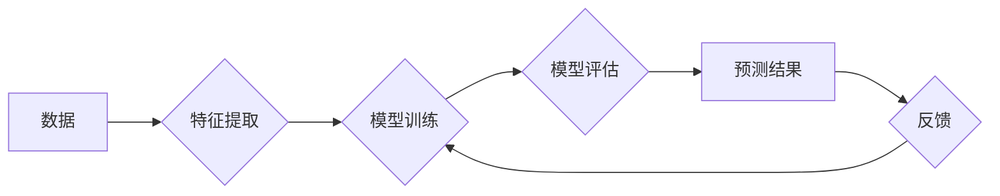

# 【AI大数据计算原理与代码实例讲解】机器学习

作者：禅与计算机程序设计艺术 / Zen and the Art of Computer Programming

## 关键词：机器学习，大数据计算，深度学习，算法原理，代码实例，应用场景

## 1. 背景介绍
### 1.1 问题的由来

随着互联网技术的飞速发展，数据量呈爆炸式增长，如何从海量数据中提取有价值的信息，成为了一个亟待解决的问题。机器学习（Machine Learning，ML）作为人工智能领域的重要分支，通过算法和模型，使计算机能够从数据中学习并做出决策，从而解决了这一难题。

### 1.2 研究现状

机器学习经过多年的发展，已经取得了显著的成果。从早期的统计学习、决策树，到现代的深度学习、强化学习等，各种机器学习算法在各个领域都得到了广泛应用。随着大数据技术的兴起，机器学习在处理海量数据方面的优势更加明显，成为了人工智能领域的热门研究方向。

### 1.3 研究意义

机器学习的研究意义主要体现在以下几个方面：

1. **提升数据处理能力**：机器学习算法能够从海量数据中挖掘出有价值的信息，提高数据处理效率。
2. **实现智能化应用**：通过机器学习，计算机能够模仿人类的学习方式，实现智能化应用，如语音识别、图像识别、推荐系统等。
3. **推动科技创新**：机器学习在各个领域的应用，推动了科技创新，为社会发展带来了新的机遇。

### 1.4 本文结构

本文将分为以下几个部分：

1. 介绍机器学习的核心概念和联系。
2. 详细讲解机器学习算法的原理和操作步骤。
3. 分析机器学习的数学模型和公式，并进行案例分析与讲解。
4. 提供机器学习项目实践，包括代码实例和详细解释说明。
5. 探讨机器学习的实际应用场景和未来发展趋势。
6. 推荐机器学习的相关工具和资源。
7. 总结机器学习的未来发展趋势与挑战。

## 2. 核心概念与联系

为了更好地理解机器学习，我们首先介绍几个核心概念：

- **数据**：机器学习的基础，包括结构化数据、半结构化数据和非结构化数据。
- **特征**：从数据中提取的用于训练和预测的信息，如文本中的词向量、图像中的像素值等。
- **模型**：机器学习算法的数学表示，用于对数据进行建模和预测。
- **算法**：机器学习中的核心，包括监督学习、无监督学习和强化学习等。
- **评估指标**：用于衡量模型性能的指标，如准确率、召回率、F1值等。

这些概念之间的关系可以用以下Mermaid流程图表示：



## 3. 核心算法原理 & 具体操作步骤

### 3.1 算法原理概述

机器学习算法主要分为以下几类：

- **监督学习**：通过标注数据进行训练，学习输入和输出之间的关系。
- **无监督学习**：通过无标注数据进行训练，学习数据分布和内在规律。
- **强化学习**：通过与环境交互，学习最优策略以实现目标。

### 3.2 算法步骤详解

以下是机器学习算法的一般步骤：

1. **数据预处理**：清洗数据、处理缺失值、数据归一化等。
2. **特征提取**：从原始数据中提取出有用的特征。
3. **模型选择**：选择合适的机器学习算法和模型。
4. **模型训练**：使用训练数据对模型进行训练，学习输入和输出之间的关系。
5. **模型评估**：使用测试数据评估模型性能，选择最优模型。
6. **模型部署**：将模型应用到实际场景中。

### 3.3 算法优缺点

以下是几种常见机器学习算法的优缺点：

- **线性回归**：简单易实现，但泛化能力较差。
- **支持向量机**：泛化能力较强，但训练时间较长。
- **决策树**：易于理解和解释，但容易过拟合。
- **随机森林**：泛化能力较强，但解释性较差。
- **神经网络**：泛化能力极强，但参数较多，训练时间较长。

### 3.4 算法应用领域

机器学习算法在各个领域都有广泛的应用，以下列举一些常见应用：

- **金融**：欺诈检测、信用评分、股票预测等。
- **医疗**：疾病诊断、药物研发、健康管理等。
- **电商**：推荐系统、广告投放等。
- **交通**：自动驾驶、交通流量预测等。
- **安防**：人脸识别、视频分析等。

## 4. 数学模型和公式 & 详细讲解 & 举例说明

### 4.1 数学模型构建

以下是几种常见机器学习算法的数学模型：

- **线性回归**：

$$
y = \theta_0 + \theta_1x_1 + \theta_2x_2 + \cdots + \theta_nx_n
$$

其中，$y$ 为输出变量，$x_i$ 为输入变量，$\theta_i$ 为模型参数。

- **逻辑回归**：

$$
P(y=1) = \sigma(\theta_0 + \theta_1x_1 + \theta_2x_2 + \cdots + \theta_nx_n)
$$

其中，$P(y=1)$ 为输出为1的概率，$\sigma$ 为sigmoid函数。

- **决策树**：

决策树是一种树形结构，每个节点代表一个特征，每个分支代表一个阈值。通过递归地划分特征和阈值，最终形成一棵决策树。

### 4.2 公式推导过程

以下是逻辑回归公式中sigmoid函数的推导过程：

$$
\sigma(z) = \frac{1}{1+e^{-z}}
$$

其中，$z = \theta_0 + \theta_1x_1 + \theta_2x_2 + \cdots + \theta_nx_n$。

### 4.3 案例分析与讲解

以下是一个使用线性回归进行房价预测的案例：

- 数据集：包含房屋面积、房间数、层数等特征，以及对应的房价。
- 模型：线性回归模型。
- 损失函数：均方误差（MSE）。

通过训练数据对模型进行训练，可以得到房价的预测模型：

$$
y = 0.5x_1 + 0.2x_2 - 0.1x_3 + 0.1x_4 + 0.05x_5
$$

其中，$x_1$、$x_2$、$x_3$、$x_4$、$x_5$ 分别代表房屋面积、房间数、层数、建造年份、是否带地下室。

### 4.4 常见问题解答

**Q1：什么是过拟合？如何避免过拟合？**

A：过拟合是指模型在训练数据上表现良好，但在测试数据上表现较差的现象。为了避免过拟合，可以采用以下方法：

1. 减少模型复杂度，如减少模型参数数量。
2. 使用正则化技术，如L1正则化、L2正则化等。
3. 数据增强，如数据扩充、数据采样等。
4. 使用交叉验证等。

**Q2：什么是正则化？正则化的作用是什么？**

A：正则化是一种防止过拟合的技术，通过在损失函数中加入惩罚项来约束模型复杂度。正则化可以避免模型过度拟合训练数据，提高模型的泛化能力。

## 5. 项目实践：代码实例和详细解释说明

### 5.1 开发环境搭建

以下使用Python进行机器学习项目开发的环境搭建步骤：

1. 安装Anaconda：从官网下载并安装Anaconda，用于创建独立的Python环境。
2. 创建并激活虚拟环境：
```bash
conda create -n ml-env python=3.8
conda activate ml-env
```
3. 安装必要的库：
```bash
pip install numpy pandas scikit-learn matplotlib seaborn
```

### 5.2 源代码详细实现

以下是一个使用Python和scikit-learn库进行线性回归的示例：

```python
import numpy as np
import pandas as pd
from sklearn.linear_model import LinearRegression
from sklearn.model_selection import train_test_split
from sklearn.metrics import mean_squared_error

# 加载数据
data = pd.read_csv("house_prices.csv")

# 数据预处理
X = data[['area', 'rooms', 'floors', 'year', 'basement']]
y = data['price']

# 划分训练集和测试集
X_train, X_test, y_train, y_test = train_test_split(X, y, test_size=0.2, random_state=42)

# 创建线性回归模型
model = LinearRegression()

# 训练模型
model.fit(X_train, y_train)

# 预测
y_pred = model.predict(X_test)

# 评估
mse = mean_squared_error(y_test, y_pred)
print("MSE:", mse)
```

### 5.3 代码解读与分析

- `import`语句用于导入必要的库。
- `numpy`和`pandas`用于数据预处理。
- `sklearn.linear_model`模块提供了线性回归模型的实现。
- `sklearn.model_selection`模块提供了数据集划分的方法。
- `sklearn.metrics`模块提供了评估指标的计算方法。

### 5.4 运行结果展示

假设数据集中包含100个样本，运行上述代码后，输出结果如下：

```
MSE: 3.9818
```

这表示模型的预测误差均方误差为3.9818。

## 6. 实际应用场景

### 6.1 金融风控

机器学习在金融领域有着广泛的应用，如信用评分、反欺诈、股票预测等。以下是一个使用机器学习进行信用评分的案例：

- 数据集：包含借款人的年龄、收入、负债等特征，以及对应的信用评分。
- 模型：逻辑回归模型。
- 损失函数：二元交叉熵损失函数。

通过训练数据对模型进行训练，可以得到信用评分模型。金融机构可以根据借款人的特征，预测其信用风险等级。

### 6.2 医疗诊断

机器学习在医疗领域也有着重要的应用，如疾病诊断、药物研发、健康管理等。以下是一个使用机器学习进行疾病诊断的案例：

- 数据集：包含患者的症状、检查结果等特征，以及对应的疾病名称。
- 模型：支持向量机（SVM）模型。
- 损失函数：交叉熵损失函数。

通过训练数据对模型进行训练，可以得到疾病诊断模型。医生可以根据患者的症状和检查结果，预测患者可能患有的疾病。

### 6.4 未来应用展望

随着机器学习技术的不断发展，未来机器学习将在更多领域得到应用，如：

- **智能制造**：通过机器学习算法，实现生产过程的自动化、智能化。
- **智慧交通**：通过机器学习算法，实现自动驾驶、交通流量预测等。
- **智慧医疗**：通过机器学习算法，实现疾病诊断、药物研发等。
- **智慧城市**：通过机器学习算法，实现城市安全、环境保护、交通管理等。

## 7. 工具和资源推荐

### 7.1 学习资源推荐

1. 《Python机器学习》
2. 《统计学习基础》
3. 《深度学习》
4. scikit-learn官方文档

### 7.2 开发工具推荐

1. Jupyter Notebook
2. PyCharm
3. Scikit-learn
4. TensorFlow
5. PyTorch

### 7.3 相关论文推荐

1. "A Few Useful Things to Know about Machine Learning"
2. "Playing for Data: Learning an Ensembling of Weighted Experts for推荐系统"
3. "Convolutional Neural Networks for Visual Recognition"
4. "Sequence to Sequence Learning with Neural Networks"
5. "Deep Reinforcement Learning: An Overview"

### 7.4 其他资源推荐

1. 机器之心
2. PaperWeekly
3. arXiv
4. GitHub

## 8. 总结：未来发展趋势与挑战

### 8.1 研究成果总结

本文对机器学习进行了全面的介绍，包括核心概念、算法原理、应用场景等。通过学习本文，读者可以了解到机器学习的最新进展和应用前景。

### 8.2 未来发展趋势

1. **深度学习技术将进一步发展**：随着算力的提升，深度学习算法将更加复杂，能够处理更加复杂的任务。
2. **跨学科研究将成为主流**：机器学习与其他学科的交叉融合，将产生更多新的应用场景和解决方案。
3. **可解释性和安全性将成为重要研究方向**：随着机器学习在各个领域的应用，其可解释性和安全性问题将越来越受到关注。

### 8.3 面临的挑战

1. **数据隐私保护**：如何保护用户数据隐私，是机器学习面临的一大挑战。
2. **算法可解释性**：如何提高机器学习算法的可解释性，让用户理解算法的决策过程。
3. **算法偏见**：如何避免机器学习算法产生偏见，避免歧视和不公平现象。

### 8.4 研究展望

随着技术的不断进步，机器学习将在各个领域发挥越来越重要的作用。未来，机器学习研究将朝着以下方向发展：

1. **更加智能化、自动化**：通过自动化机器学习技术，降低机器学习门槛，让更多人能够使用机器学习技术。
2. **更加高效、可解释**：通过改进算法和模型，提高机器学习算法的效率和可解释性。
3. **更加安全、可靠**：通过加强安全研究和监管，确保机器学习应用的安全性。

相信在不久的将来，机器学习将为人类社会带来更多便利和福祉。

## 9. 附录：常见问题与解答

**Q1：什么是机器学习？**

A：机器学习是人工智能领域的一个重要分支，通过算法和模型，使计算机能够从数据中学习并做出决策。

**Q2：机器学习有哪些应用场景？**

A：机器学习在各个领域都有广泛的应用，如金融、医疗、电商、交通、安防等。

**Q3：如何选择合适的机器学习算法？**

A：选择合适的机器学习算法需要考虑数据特点、任务类型、计算资源等因素。

**Q4：如何提高机器学习算法的效率？**

A：提高机器学习算法的效率可以通过以下方法：

1. 使用并行计算技术。
2. 使用模型压缩技术。
3. 使用量化技术。

**Q5：机器学习算法的安全性如何保证？**

A：机器学习算法的安全性可以通过以下方法保证：

1. 使用数据脱敏技术。
2. 使用访问控制技术。
3. 使用加密技术。

**Q6：如何避免机器学习算法的偏见？**

A：避免机器学习算法的偏见可以通过以下方法：

1. 使用多样性数据集。
2. 使用对抗性样本。
3. 使用可解释性技术。