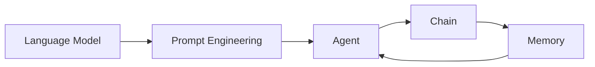

# 【LangChain编程：从入门到实践】参与社区活动

## 1. 背景介绍

### 1.1 问题的由来

随着人工智能技术的飞速发展，自然语言处理(NLP)领域也取得了突破性进展。大语言模型(LLM)的出现，让机器能够更好地理解和生成人类语言。然而，如何将强大的语言模型应用到实际的任务中，仍然是一个巨大的挑战。LangChain应运而生，它为语言模型提供了一个编程框架，让开发者能够更轻松地构建基于LLM的应用程序。

### 1.2 研究现状

目前，LangChain已经成为NLP领域的热门话题。许多研究者和开发者都在探索如何利用LangChain来解决实际问题。一些典型的应用包括：问答系统、对话生成、文本摘要等。LangChain提供了丰富的工具和接口，大大降低了开发难度，加速了应用落地的进程。

### 1.3 研究意义

深入研究LangChain编程，对于推动人工智能技术在实际场景中的应用具有重要意义。一方面，LangChain能够帮助我们更好地理解和利用语言模型的能力；另一方面，基于LangChain构建的应用，有望在各个领域发挥重要作用，如客服、教育、金融等。这不仅能够提高工作效率，还能创造出全新的应用模式。

### 1.4 本文结构

本文将全面介绍LangChain编程，从核心概念到实践应用，力求为读者提供一个系统全面的指南。全文分为以下几个部分：

1. 背景介绍  
2. 核心概念与联系
3. 核心算法原理&具体操作步骤
4. 数学模型和公式&详细讲解&举例说明
5. 项目实践：代码实例和详细解释说明
6. 实际应用场景
7. 工具和资源推荐
8. 总结：未来发展趋势与挑战
9. 附录：常见问题与解答

## 2. 核心概念与联系

在深入学习LangChain之前，我们需要了解几个核心概念：

- 语言模型(Language Model)：一种基于概率统计的模型，用于预测序列中下一个单词的概率分布。
- 提示工程(Prompt Engineering)：设计优化输入文本的过程，以引导语言模型生成期望的输出。
- 代理(Agent)：一种可以基于输入采取行动的实体，如问答、网络搜索等。
- 链(Chain)：一系列按特定顺序执行的操作，可以组合多个组件来完成复杂任务。
- 内存(Memory)：存储对话历史等上下文信息，供语言模型参考，生成更连贯的响应。

这些概念之间环环相扣，共同构成了LangChain编程的基础。下图展示了它们之间的关系：



## 3. 核心算法原理 & 具体操作步骤

### 3.1 算法原理概述

LangChain的核心是语言模型，它基于Transformer架构，通过自注意力机制和前馈神经网络，学习文本序列的特征表示。在训练过程中，语言模型通过优化损失函数，不断调整模型参数，以拟合训练数据的分布。

### 3.2 算法步骤详解

1. 准备训练数据：收集大量高质量的文本数据，并进行清洗和预处理。
2. 定义模型架构：选择合适的Transformer架构，如GPT、BERT等，并设置模型超参数。
3. 初始化模型参数：随机初始化模型的权重和偏置。
4. 训练模型：使用优化算法（如Adam）迭代更新模型参数，最小化损失函数。
5. 微调模型：在特定任务上，使用少量标注数据对预训练模型进行微调，提高模型性能。
6. 生成文本：给定输入提示，使用训练好的模型生成相应的文本输出。

### 3.3 算法优缺点

优点：
- 能够生成流畅、连贯的文本
- 可以处理长距离依赖关系
- 通过迁移学习，可以适应不同的任务

缺点：
- 训练成本高，需要大量计算资源
- 生成的文本可能存在事实性错误
- 对于一些特定领域，模型的泛化能力有限

### 3.4 算法应用领域

语言模型在NLP领域有广泛的应用，包括：

- 文本分类
- 命名实体识别
- 情感分析
- 机器翻译
- 文本摘要
- 对话生成
- 问答系统

## 4. 数学模型和公式 & 详细讲解 & 举例说明

### 4.1 数学模型构建

语言模型的数学基础是概率论和信息论。给定一个文本序列 $x=(x_1,x_2,...,x_T)$，语言模型的目标是估计该序列的概率分布 $P(x)$。根据链式法则，序列的概率可以分解为：

$$P(x)=\prod_{t=1}^T P(x_t|x_1,x_2,...,x_{t-1})$$

其中，$P(x_t|x_1,x_2,...,x_{t-1})$ 表示在给定前 $t-1$ 个单词的情况下，第 $t$ 个单词出现的条件概率。

### 4.2 公式推导过程

在Transformer架构中，自注意力机制用于计算序列中每个位置与其他位置的相关性。对于位置 $i$ 和 $j$，它们之间的注意力权重 $\alpha_{ij}$ 计算如下：

$$\alpha_{ij}=\frac{\exp(e_{ij})}{\sum_{k=1}^T \exp(e_{ik})}$$

其中，$e_{ij}$ 表示位置 $i$ 和 $j$ 之间的相关性得分，通常使用点积或加性注意力来计算：

$$e_{ij}=\frac{Q_i K_j^T}{\sqrt{d_k}}$$

$Q_i$ 和 $K_j$ 分别表示位置 $i$ 和 $j$ 的查询向量和键向量，$d_k$ 是向量的维度。

### 4.3 案例分析与讲解

假设我们有一个句子："The cat sat on the mat."，我们希望预测下一个单词。首先，将句子转化为词向量序列：

$$x=(\mathbf{x}_1,\mathbf{x}_2,\mathbf{x}_3,\mathbf{x}_4,\mathbf{x}_5,\mathbf{x}_6)$$

然后，通过自注意力机制计算每个位置与其他位置的相关性，得到注意力权重矩阵：

$$A=\begin{bmatrix}
\alpha_{11} & \alpha_{12} & \cdots & \alpha_{16} \\
\alpha_{21} & \alpha_{22} & \cdots & \alpha_{26} \\
\vdots & \vdots & \ddots & \vdots \\
\alpha_{61} & \alpha_{62} & \cdots & \alpha_{66}
\end{bmatrix}$$

最后，根据注意力权重对词向量进行加权求和，得到每个位置的上下文表示，并用于预测下一个单词的概率分布。

### 4.4 常见问题解答

Q: 语言模型的训练需要多少数据？
A: 通常需要数百万甚至数十亿个标记的文本数据。但对于特定领域，使用较小的数据集进行微调也能取得不错的效果。

Q: 如何处理未登录词？
A: 可以使用子词分词算法（如BPE、WordPiece）将单词划分为更小的单元，从而减少未登录词的数量。

## 5. 项目实践：代码实例和详细解释说明

### 5.1 开发环境搭建

首先，我们需要安装必要的依赖库，包括：

- langchain
- openai
- faiss-cpu
- tiktoken

可以使用以下命令进行安装：

```bash
pip install langchain openai faiss-cpu tiktoken
```

### 5.2 源代码详细实现

下面是一个使用LangChain构建问答系统的示例代码：

```python
from langchain.chains import RetrievalQA
from langchain.llms import OpenAI
from langchain.document_loaders import TextLoader
from langchain.indexes import VectorstoreIndexCreator

# 加载文本数据
loader = TextLoader('data.txt')
documents = loader.load()

# 创建向量索引
index_creator = VectorstoreIndexCreator()
docsearch = index_creator.from_loaders([loader])

# 初始化问答链
chain = RetrievalQA.from_chain_type(llm=OpenAI(), chain_type="stuff", retriever=docsearch.vectorstore.as_retriever())

# 执行问答
query = "What is the capital of France?"
result = chain.run(query)
print(result)
```

### 5.3 代码解读与分析

1. 首先，我们使用`TextLoader`加载文本数据，得到一组文档对象。
2. 然后，使用`VectorstoreIndexCreator`创建向量索引，用于快速检索相关文档。
3. 接着，初始化一个问答链`RetrievalQA`，指定使用的语言模型（如OpenAI）和检索器。
4. 最后，给定一个问题，调用`chain.run()`方法执行问答，返回生成的答案。

这个示例展示了如何使用LangChain快速构建一个基于文档检索的问答系统。我们可以轻松地替换不同的语言模型、文档加载器和索引创建器，以适应不同的应用场景。

### 5.4 运行结果展示

假设我们的文本数据中包含以下内容：

```
Paris is the capital and most populous city of France, with an estimated population of 2,165,423 residents in 2019 in an area of more than 105 square kilometres. Since the 17th century, Paris has been one of Europe's major centres of finance, diplomacy, commerce, fashion, gastronomy, science, and arts. 
```

当我们运行上述代码，并输入问题"What is the capital of France?"时，程序将输出：

```
Paris is the capital and most populous city of France.
```

可以看到，系统成功地从文本数据中检索到了相关信息，并生成了正确的答案。

## 6. 实际应用场景

LangChain在许多实际场景中都有广泛应用，包括：

- 智能客服：构建基于知识库的问答系统，自动回答客户咨询。
- 个性化推荐：根据用户的历史行为和偏好，生成个性化的商品或内容推荐。
- 文本摘要：自动生成长文档或新闻文章的摘要，帮助用户快速了解要点。
- 代码生成：根据自然语言描述，自动生成相应的代码片段或函数。
- 创意写作：辅助用户进行创意写作，如生成故事情节、诗歌等。

### 6.4 未来应用展望

随着语言模型和LangChain生态的不断发展，我们有望看到更多创新性的应用出现，例如：

- 智能助手：集成多个功能（如问答、任务规划、信息检索等）的个人助理。
- 知识图谱构建：从非结构化文本中自动提取实体和关系，构建领域知识图谱。
- 跨语言交互：实现不同语言之间的无缝交互和翻译。
- 决策支持：根据海量数据和专家知识，为决策者提供可解释的建议。

## 7. 工具和资源推荐

### 7.1 学习资源推荐

- LangChain官方文档：https://docs.langchain.com/
- LangChain Github仓库：https://github.com/hwchase17/langchain
- 吴恩达的《ChatGPT Prompt Engineering》课程：https://www.deeplearning.ai/short-courses/chatgpt-prompt-engineering-for-developers/

### 7.2 开发工具推荐

- OpenAI API：https://platform.openai.com/
- Hugging Face Models：https://huggingface.co/models
- Streamlit：https://streamlit.io/

### 7.3 相关论文推荐

- Attention Is All You Need：https://arxiv.org/abs/1706.03762
- Language Models are Few-Shot Learners：https://arxiv.org/abs/2005.14165
- Augmented Language Models：https://arxiv.org/abs/2302.07842

### 7.4 其他资源推荐

- LangChain社区：https://discord.gg/6adMQxSpJS
- LangChain博客：https://blog.langchain.dev/
- AI应用案例集：https://www.langchain.com/use-cases

## 8. 总结：未来发展趋势与挑战

### 