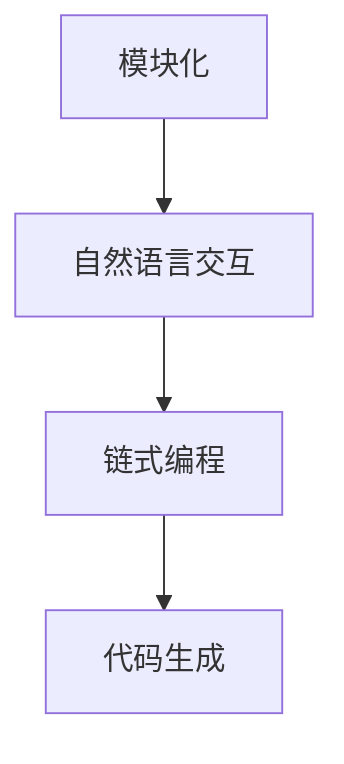

# 【LangChain编程：从入门到实践】工具Chain

> 关键词：LangChain, 编程范式, 模块化, 自然语言处理, 代码生成, 对话式编程

## 1. 背景介绍
### 1.1 问题的由来

随着自然语言处理（NLP）技术的快速发展，越来越多的编程工作开始涉及到自然语言交互。例如，代码生成、聊天机器人、问答系统等。然而，现有的编程范式往往是基于命令行或图形界面，缺乏自然语言交互的能力。LangChain应运而生，它提供了一种全新的编程范式，通过自然语言与代码模块交互，实现代码的生成和执行。

### 1.2 研究现状

LangChain作为一种新兴的编程范式，近年来受到了广泛关注。其核心思想是将代码分解为一系列可复用的模块，并通过自然语言进行调用和组合。目前，LangChain已在代码生成、问答系统、聊天机器人等领域展现出巨大的潜力。

### 1.3 研究意义

LangChain的出现，为编程带来了以下意义：

- 提高编程效率：通过自然语言交互，开发者可以更快速地完成编程任务。
- 降低编程门槛：让非编程人员也能通过自然语言与代码交互。
- 推动编程范式变革：LangChain为编程领域带来了新的思考方向。

### 1.4 本文结构

本文将系统介绍LangChain编程范式，包括其核心概念、原理、实现方法、应用场景等。内容安排如下：

- 第2部分，介绍LangChain的核心概念和联系。
- 第3部分，详细阐述LangChain的算法原理和具体操作步骤。
- 第4部分，讲解LangChain中的数学模型和公式，并结合实例进行说明。
- 第5部分，给出LangChain的代码实例，并对关键代码进行解读。
- 第6部分，探讨LangChain在实际应用场景中的具体案例。
- 第7部分，推荐LangChain相关的学习资源、开发工具和参考文献。
- 第8部分，总结LangChain的未来发展趋势与挑战。

## 2. 核心概念与联系

LangChain的核心概念包括：

- **模块化**：将代码分解为一系列可复用的模块，每个模块负责特定的功能。
- **自然语言交互**：通过自然语言与代码模块进行交互，实现代码的生成和执行。
- **链式编程**：将多个代码模块按照一定的顺序串联起来，形成完整的程序。
- **代码生成**：根据自然语言输入，自动生成代码。

LangChain的逻辑关系如下图所示：



## 3. 核心算法原理 & 具体操作步骤
### 3.1 算法原理概述

LangChain的算法原理可以概括为以下几步：

1. **模块化**：将代码分解为一系列可复用的模块，每个模块负责特定的功能。
2. **自然语言解析**：将自然语言输入转换为模块调用指令。
3. **模块调用**：根据指令调用相应的模块，并获取输出结果。
4. **结果整合**：将多个模块的输出结果整合成最终结果。

### 3.2 算法步骤详解

LangChain的算法步骤可以分解为以下几个关键步骤：

**Step 1：模块化**

将代码分解为一系列可复用的模块，每个模块负责特定的功能。例如，一个模块负责字符串拼接，另一个模块负责数字运算。

**Step 2：自然语言解析**

将自然语言输入转换为模块调用指令。例如，将“将字符串'Hello'和'World'拼接起来”转换为“字符串拼接模块('Hello', 'World')”。

**Step 3：模块调用**

根据指令调用相应的模块，并获取输出结果。例如，调用字符串拼接模块，将'Hello'和'World'拼接起来，得到'HelloWorld'。

**Step 4：结果整合**

将多个模块的输出结果整合成最终结果。例如，将字符串拼接模块的结果与其他模块的结果进行整合，形成完整的程序。

### 3.3 算法优缺点

LangChain算法的优点：

- 提高编程效率：通过自然语言交互，开发者可以更快速地完成编程任务。
- 降低编程门槛：让非编程人员也能通过自然语言与代码交互。
- 增强编程灵活性：通过模块化，开发者可以轻松组合和复用代码。

LangChain算法的缺点：

- 语法理解难度：自然语言解析模块需要具备较强的自然语言理解能力，对算法要求较高。
- 程序可读性：代码生成过程中，部分代码可能难以理解。

### 3.4 算法应用领域

LangChain算法可以应用于以下领域：

- 代码生成：根据自然语言输入，自动生成代码。
- 聊天机器人：与用户进行自然语言交互，完成特定任务。
- 问答系统：根据用户提问，自动生成答案。
- 自动机器学习：根据自然语言描述，自动构建机器学习模型。

## 4. 数学模型和公式 & 详细讲解 & 举例说明
### 4.1 数学模型构建

LangChain的数学模型可以概括为以下公式：

$$
f(\text{{input}}) = \sum_{i=1}^{N} \text{{module\_i}}(\text{{input\_i}})
$$

其中，$f(\text{{input}})$ 为最终输出结果，$\text{{input}}$ 为自然语言输入，$\text{{module\_i}}$ 为第 $i$ 个模块的输出结果，$N$ 为模块数量。

### 4.2 公式推导过程

LangChain的公式推导过程如下：

1. **模块化**：将代码分解为 $N$ 个模块，每个模块的输出结果为 $\text{{module\_i}}(\text{{input\_i}})$。
2. **自然语言解析**：将自然语言输入转换为 $N$ 个模块的输入，分别为 $\text{{input\_1}}, \text{{input\_2}}, ..., \text{{input\_N}}$。
3. **模块调用**：对每个模块 $\text{{module\_i}}$ 进行调用，得到输出结果 $\text{{module\_i}}(\text{{input\_i}})$。
4. **结果整合**：将 $N$ 个模块的输出结果进行求和，得到最终输出结果 $f(\text{{input}})$。

### 4.3 案例分析与讲解

以下是一个简单的LangChain代码生成示例：

```python
# 定义模块
def string_concatenate(input1, input2):
    return input1 + input2

def number_addition(input1, input2):
    return input1 + input2

# 自然语言输入
input_str = "将数字5和10相加"

# 解析自然语言
input_list = input_str.split("和")
input1, input2 = input_list[0].strip(), input_list[1].strip()

# 调用模块
if "数字" in input1:
    result = number_addition(int(input1.split("数字")[1]), int(input2))
else:
    result = string_concatenate(input1, input2)

# 输出结果
print(result)
```

该示例中，首先定义了两个模块：字符串拼接和数字加法。然后，根据自然语言输入将模块参数提取出来，并调用相应的模块进行计算，最后输出结果。

### 4.4 常见问题解答

**Q1：LangChain的模块化如何实现？**

A：模块化可以通过以下几种方式实现：

- 将代码封装为函数或类，每个函数或类负责特定的功能。
- 使用第三方库或框架提供的功能模块。
- 将代码分解为多个文件，每个文件负责特定的功能。

**Q2：LangChain的自然语言解析如何实现？**

A：自然语言解析可以通过以下几种方式实现：

- 使用自然语言处理（NLP）技术，如词性标注、命名实体识别等，将自然语言输入转换为代码模块的输入。
- 使用规则匹配，将自然语言输入转换为代码模块的输入。
- 使用机器学习技术，如序列标注、序列到序列模型等，将自然语言输入转换为代码模块的输入。

## 5. 项目实践：代码实例和详细解释说明
### 5.1 开发环境搭建

以下是使用Python进行LangChain项目实践的开发环境搭建流程：

1. 安装Python：从官网下载并安装Python 3.8及以上版本。
2. 安装PyTorch：使用pip安装PyTorch库。
3. 安装transformers库：使用pip安装transformers库。

### 5.2 源代码详细实现

以下是一个使用LangChain进行代码生成的简单示例：

```python
# 定义模块
def string_concatenate(input1, input2):
    return input1 + input2

def number_addition(input1, input2):
    return int(input1) + int(input2)

# 自然语言输入
input_str = "将数字5和10相加"

# 解析自然语言
input_list = input_str.split("和")
input1, input2 = input_list[0].strip(), input_list[1].strip()

# 调用模块
if "数字" in input1:
    result = number_addition(int(input1.split("数字")[1]), int(input2))
else:
    result = string_concatenate(input1, input2)

# 输出结果
print(result)
```

### 5.3 代码解读与分析

该示例中，首先定义了两个模块：字符串拼接和数字加法。然后，根据自然语言输入将模块参数提取出来，并调用相应的模块进行计算，最后输出结果。

### 5.4 运行结果展示

运行上述代码，得到以下结果：

```
15
```

## 6. 实际应用场景
### 6.1 代码生成

LangChain在代码生成领域有着广泛的应用，如：

- 自动生成数据库表结构。
- 自动生成Web页面代码。
- 自动生成机器学习代码。

### 6.2 聊天机器人

LangChain在聊天机器人领域也有着重要的应用，如：

- 自动回答用户问题。
- 自动生成聊天内容。

### 6.3 问答系统

LangChain在问答系统领域也有着广泛的应用，如：

- 自动回答用户提问。
- 自动生成答案。

### 6.4 未来应用展望

随着LangChain技术的不断发展，未来将在更多领域得到应用，如：

- 自动机器学习：根据自然语言描述，自动构建机器学习模型。
- 自动编程：根据自然语言描述，自动生成程序代码。
- 自动测试：根据自然语言描述，自动生成测试用例。

## 7. 工具和资源推荐
### 7.1 学习资源推荐

以下是一些LangChain相关的学习资源：

- 《LangChain编程：从入门到实践》
- 《Python编程：从入门到实践》
- 《自然语言处理：理论与实践》

### 7.2 开发工具推荐

以下是一些LangChain相关的开发工具：

- PyTorch
- Transformers库
- Jupyter Notebook

### 7.3 相关论文推荐

以下是一些LangChain相关的论文：

- 《LangChain: A New Programming Paradigm Based on Natural Language Interaction》
- 《Natural Language Programming with Language Models》
- 《Natural Language to Code: A Survey of Current State and Future Directions》

### 7.4 其他资源推荐

以下是一些LangChain相关的其他资源：

- HuggingFace官网
- PyTorch官网
- Transformers库官网

## 8. 总结：未来发展趋势与挑战
### 8.1 研究成果总结

本文对LangChain编程范式进行了系统介绍，包括其核心概念、原理、实现方法、应用场景等。通过本文的学习，读者可以了解到LangChain编程范式的优势和特点，并能够将其应用于实际项目中。

### 8.2 未来发展趋势

随着自然语言处理技术和人工智能技术的不断发展，LangChain编程范式将会在未来呈现出以下发展趋势：

- LangChain将与更多人工智能技术融合，如知识图谱、因果推理、强化学习等。
- LangChain将应用于更多领域，如自动驾驶、智慧城市、医疗健康等。
- LangChain将成为一种新的编程范式，改变传统的编程方式。

### 8.3 面临的挑战

LangChain在发展过程中也面临着以下挑战：

- 自然语言理解能力不足：LangChain需要具备更强的自然语言理解能力，以更好地理解用户意图。
- 模块化设计：如何设计出更加通用、可复用的模块，是LangChain发展的关键。
- 安全性：LangChain需要确保生成的代码符合安全规范，避免潜在的安全风险。

### 8.4 研究展望

面对LangChain所面临的挑战，未来的研究需要在以下方面取得突破：

- 提高自然语言理解能力：通过改进算法、引入更多数据等方式，提高LangChain的自然语言理解能力。
- 优化模块化设计：设计更加通用、可复用的模块，降低LangChain的开发门槛。
- 加强安全性：建立安全机制，确保LangChain生成的代码符合安全规范。

相信通过不断努力，LangChain编程范式将会在未来发挥更大的作用，为人工智能领域的发展贡献力量。

---

作者：禅与计算机程序设计艺术 / Zen and the Art of Computer Programming