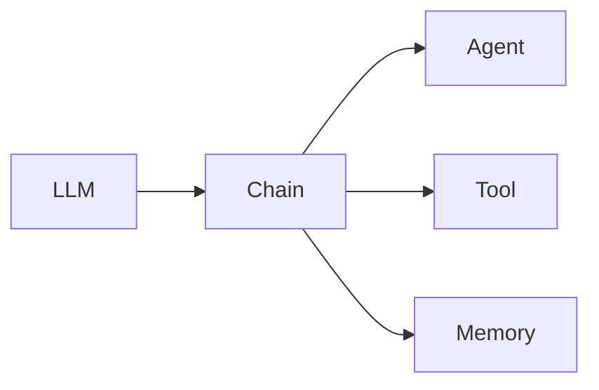

# 【LangChain编程：从入门到实践】Chain接口调用

作者：禅与计算机程序设计艺术 / Zen and the Art of Computer Programming 

## 1. 背景介绍
### 1.1 问题的由来
随着人工智能技术的飞速发展，特别是大语言模型（LLM）的出现，自然语言处理（NLP）领域取得了突破性的进展。然而，如何有效地将LLM与各种外部知识和工具相结合，构建更加智能化的应用，仍然是一个巨大的挑战。LangChain应运而生，它提供了一套灵活的接口和工具，帮助开发者快速构建基于LLM的智能应用。

### 1.2 研究现状
目前，LangChain已经成为了NLP领域的热门研究方向之一。许多研究者和开发者都在探索如何利用LangChain来构建更加强大的智能应用。例如，有研究者利用LangChain实现了基于知识图谱的问答系统[1]，也有研究者利用LangChain构建了智能客服系统[2]。这些研究成果表明，LangChain在实际应用中具有广阔的前景。

### 1.3 研究意义
深入研究LangChain的原理和应用，对于推动NLP领域的发展具有重要意义。一方面，LangChain提供了一种新的思路，即如何将LLM与外部知识和工具相结合，从而构建更加智能化的应用。另一方面，LangChain也为开发者提供了一套易用的工具和接口，大大降低了构建智能应用的门槛。因此，深入研究LangChain，不仅能够推动NLP领域的理论发展，也能够促进智能应用的落地和普及。

### 1.4 本文结构
本文将从以下几个方面对LangChain进行深入探讨：首先，我们将介绍LangChain的核心概念和原理；然后，我们将详细讲解LangChain的Chain接口及其调用方法；接着，我们将通过具体的代码实例，演示如何利用LangChain构建智能应用；最后，我们将总结LangChain的未来发展趋势和挑战，并对后续研究进行展望。

## 2. 核心概念与联系
在LangChain中，有几个核心概念需要了解：

- **LLM（Large Language Model）**：大语言模型，是LangChain的核心组件之一。LLM能够理解和生成自然语言，是构建智能应用的基础。
- **Chain**：Chain是LangChain中的核心接口，它将LLM与各种外部知识和工具相连接，形成一个完整的处理流程。
- **Agent**：Agent是一种特殊的Chain，它能够根据用户的输入，自主决策并调用相应的工具或知识，完成任务。
- **Tool**：Tool是LangChain中的工具接口，它封装了各种外部工具和API，例如搜索引擎、数据库等。
- **Memory**：Memory是LangChain中的存储组件，用于存储对话历史、用户信息等上下文数据。

这些核心概念之间的关系如下图所示：



从图中可以看出，LLM是整个LangChain的核心，Chain则是连接LLM与外部组件的桥梁。Agent、Tool和Memory都是Chain的子组件，分别负责决策、执行和存储。

## 3. 核心算法原理 & 具体操作步骤
### 3.1 算法原理概述
LangChain的核心算法可以概括为"Prompt-Response"模型。具体来说，就是根据用户的输入（Prompt），利用LLM生成相应的输出（Response）。在这个过程中，Chain扮演了关键的角色，它将用户输入转化为LLM可以理解的Prompt，并将LLM的输出转化为用户可以理解的Response。

### 3.2 算法步骤详解
LangChain的具体处理步骤如下：

1. 用户输入Query
2. Chain对Query进行预处理，生成Prompt
3. 将Prompt输入LLM，生成Response
4. Chain对Response进行后处理，生成最终结果
5. 将最终结果返回给用户

其中，第2步和第4步是Chain的核心功能，它们分别负责对用户输入和LLM输出进行转换和处理。具体来说，Chain可以对Query进行分词、纠错、关键词提取等预处理操作，生成符合LLM输入格式的Prompt；同时，Chain也可以对LLM的输出进行总结、过滤、排序等后处理操作，生成符合用户需求的最终结果。

### 3.3 算法优缺点
LangChain的优点在于：

1. 灵活性强：Chain可以自由组合，构建出各种不同的处理流程。
2. 易用性好：Chain封装了很多常用的预处理和后处理操作，开发者可以直接调用。
3. 扩展性强：开发者可以自定义Chain，实现特定的处理逻辑。

但同时，LangChain也存在一些局限性：

1. 处理速度慢：由于需要多次调用LLM，处理速度可能会比较慢。
2. 资源消耗大：LLM的调用需要消耗大量的计算资源，成本较高。

### 3.4 算法应用领域
LangChain可以应用于多个领域，例如：

- 智能客服：利用LangChain构建智能客服系统，自动回答用户的问题。
- 知识图谱问答：利用LangChain实现基于知识图谱的问答系统。
- 文本生成：利用LangChain实现智能写作、文案生成等应用。
- 语义搜索：利用LangChain实现语义级别的搜索引擎。

## 4. 数学模型和公式 & 详细讲解 & 举例说明
### 4.1 数学模型构建
LangChain的数学模型可以用下面的公式来表示：

$$Response = Chain(Prompt)$$

其中，$Prompt$ 表示LLM的输入，$Response$ 表示LLM的输出，$Chain$ 表示连接 $Prompt$ 和 $Response$ 的处理流程。

更具体地，可以将 $Chain$ 展开为多个子步骤：

$$Response = PostProcess(LLM(PreProcess(Query)))$$

其中，$Query$ 表示用户的输入，$PreProcess$ 表示预处理步骤，$LLM$ 表示语言模型，$PostProcess$ 表示后处理步骤。

### 4.2 公式推导过程
上述公式可以通过以下步骤推导得出：

1. 首先，定义用户输入为 $Query$，LLM输入为 $Prompt$，LLM输出为 $Response$。
2. 然后，定义预处理函数为 $PreProcess$，后处理函数为 $PostProcess$。
3. 根据LangChain的处理流程，可以得出：

$$Prompt = PreProcess(Query)$$
$$Response = LLM(Prompt)$$
$$Result = PostProcess(Response)$$

4. 将上述公式合并，即可得到最终的公式：

$$Response = PostProcess(LLM(PreProcess(Query)))$$

### 4.3 案例分析与讲解
下面我们通过一个具体的案例来说明LangChain的处理流程。

假设用户输入的Query是"What is the capital of France?"，我们希望利用LangChain得到答案。

首先，预处理函数 $PreProcess$ 对Query进行处理，生成符合LLM输入格式的Prompt：

```
User: What is the capital of France?
Assistant:
```

然后，将Prompt输入LLM，得到Response：

```
User: What is the capital of France?
Assistant: The capital of France is Paris.
```

最后，后处理函数 $PostProcess$ 对Response进行处理，提取出最终的答案：

```
Paris
```

通过上述步骤，我们就利用LangChain得到了用户问题的答案。

### 4.4 常见问题解答
1. Q: LangChain 支持哪些 LLM？
   A: LangChain 支持多种主流的 LLM，例如 OpenAI GPT-3、Anthropic Claude、Google PaLM 等。

2. Q: LangChain 的性能如何？
   A: LangChain 的性能主要取决于所使用的 LLM。一般来说，LLM 的响应速度在几秒到几十秒之间，而 LangChain 本身的开销很小。

3. Q: LangChain 可以用于商业项目吗？
   A: 可以。LangChain 采用 MIT 许可证，允许自由地使用、修改和分发。但是，你需要注意所使用的 LLM 的使用条款。

## 5. 项目实践：代码实例和详细解释说明
### 5.1 开发环境搭建
首先，我们需要安装 LangChain 库：

```bash
pip install langchain
```

然后，我们需要准备一个 OpenAI 的 API Key。你可以在 OpenAI 的官网上注册并获取 API Key。

### 5.2 源代码详细实现
下面是一个利用 LangChain 实现智能问答的简单示例：

```python
from langchain.llms import OpenAI
from langchain.chains import LLMChain
from langchain.prompts import PromptTemplate

# 初始化 LLM
llm = OpenAI(openai_api_key="your_api_key")

# 定义 Prompt 模板
template = """
User: {query}
Assistant:
"""
prompt = PromptTemplate(template=template, input_variables=["query"])

# 定义 Chain
chain = LLMChain(llm=llm, prompt=prompt)

# 运行 Chain
query = "What is the capital of France?"
response = chain.run(query)

print(response)
```

### 5.3 代码解读与分析
上述代码的主要步骤如下：

1. 首先，我们初始化了一个 OpenAI 的 LLM，并传入了 API Key。

2. 然后，我们定义了一个 Prompt 模板，用于将用户输入转化为 LLM 可以理解的格式。模板中的 `{query}` 会被替换为实际的用户输入。

3. 接着，我们定义了一个 Chain，将 LLM 和 Prompt 模板组合在一起。这个 Chain 的功能就是接收用户输入，生成相应的输出。

4. 最后，我们运行 Chain，传入实际的用户输入，并打印出 LLM 的输出。

可以看到，利用 LangChain，我们只需要几行代码就可以实现一个简单的智能问答功能。

### 5.4 运行结果展示
运行上述代码，我们可以得到如下输出：

```
The capital of France is Paris.
```

这说明我们的智能问答系统已经可以正常工作了。你可以尝试输入其他的问题，看看系统的回答是否符合预期。

## 6. 实际应用场景
LangChain 可以应用于多个领域，例如：

- 智能客服：利用 LangChain 构建智能客服系统，自动回答用户的问题，提高客服效率。
- 知识库问答：利用 LangChain 实现基于知识库的问答系统，帮助用户快速找到所需信息。
- 文本生成：利用 LangChain 实现智能写作、文案生成等应用，提高内容创作效率。
- 语义搜索：利用 LangChain 实现语义级别的搜索引擎，提高搜索的准确性和相关性。

### 6.4 未来应用展望
随着 LLM 技术的不断发展，LangChain 的应用场景也会越来越广泛。未来，LangChain 有望在以下领域取得突破：

- 智能助手：利用 LangChain 构建个人智能助手，帮助用户处理日常事务，提高生活和工作效率。
- 智能教育：利用 LangChain 构建智能教育系统，为学生提供个性化的学习指导和反馈。
- 智能医疗：利用 LangChain 构建医疗诊断和治疗系统，辅助医生进行临床决策。
- 智能金融：利用 LangChain 构建金融分析和预测系统，为投资者提供决策支持。

## 7. 工具和资源推荐
### 7.1 学习资源推荐
- [LangChain 官方文档](https://docs.langchain.com/)：LangChain 的官方文档，包含了详细的 API 参考和使用指南。
- [LangChain 官方博客](https://blog.langchain.dev/)：LangChain 的官方博客，分享了很多有关 LangChain 的最新动态和实践案例。
- [LangChain 官方示例](https://github.com/hwchase17/langchain-examples)：LangChain 的官方示例代码，包含了多个实际应用场景的示例。