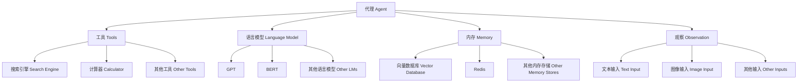

# 【LangChain编程：从入门到实践】LangChain中的代理

## 1. 背景介绍

### 1.1 问题的由来

在当今的数字时代,人工智能(AI)技术已经渗透到各个领域,成为推动科技创新和提高生产效率的重要驱动力。随着AI系统的不断发展,如何更好地利用AI助手来简化复杂任务,提高工作效率,成为了一个亟待解决的问题。

传统的AI系统通常是单一功能的,无法灵活地处理多种类型的任务。例如,一个对话AI助手可能只能回答简单的问题,而无法执行更复杂的任务,如数据分析或文本生成。这种局限性严重影响了AI系统的实用性和可扩展性。

### 1.2 研究现状

为了解决这一问题,研究人员提出了代理(Agent)的概念,旨在构建一种通用的AI系统,能够灵活地组合和协调多种功能,完成复杂的任务。代理是一种智能系统,可以根据用户的需求,选择合适的工具和资源,并有效地利用它们来完成目标任务。

LangChain是一个强大的Python库,专门用于构建代理系统。它提供了一系列模块和工具,可以轻松地集成不同的语言模型、知识库和其他AI组件,从而构建出高度灵活和可扩展的代理系统。

### 1.3 研究意义

LangChain中的代理具有广泛的应用前景,可以用于各种场景,如智能助手、自动化工作流、决策支持系统等。通过代理,我们可以将人工智能的能力发挥到极致,实现更高效、更智能的工作方式。

此外,研究LangChain中的代理也有助于推动代理系统的发展,探索新的架构和算法,提高代理系统的性能和可靠性。这对于推进人工智能技术的发展具有重要意义。

### 1.4 本文结构

本文将全面介绍LangChain中的代理系统,包括以下主要内容:

1. 核心概念与联系
2. 核心算法原理与具体操作步骤
3. 数学模型和公式详细讲解与案例分析
4. 项目实践:代码实例和详细解释说明
5. 实际应用场景
6. 工具和资源推荐
7. 总结:未来发展趋势与挑战
8. 附录:常见问题与解答

## 2. 核心概念与联系

在深入探讨LangChain中的代理系统之前,我们需要先了解一些核心概念及其相互关系。

1. **代理(Agent)**: 代理是LangChain中的核心概念,它是一个智能系统,能够根据用户的需求选择合适的工具和资源,并有效地利用它们来完成目标任务。代理通过与语言模型、工具、内存和观察进行交互,实现任务的完成。

2. **工具(Tools)**: 工具是代理可以利用的各种资源和功能,如搜索引擎、计算器、API等。代理可以根据任务需求选择合适的工具,并将它们组合使用以完成复杂的任务。

3. **语言模型(Language Model)**: 语言模型是代理的核心部分,它提供了自然语言理解和生成的能力。常见的语言模型包括GPT、BERT等。代理通过与语言模型的交互,理解用户的需求并生成相应的响应。

4. **内存(Memory)**: 内存用于存储代理在执行任务过程中的中间状态和结果。常见的内存存储方式包括向量数据库、Redis等。内存可以帮助代理保持任务的连续性和一致性。

5. **观察(Observation)**: 观察是代理获取任务相关信息的来源,可以是文本输入、图像输入或其他形式的输入。代理通过分析观察,理解任务需求并做出相应的响应。

这些核心概念之间存在着紧密的联系和互动。代理作为中心,通过与工具、语言模型、内存和观察的协作,实现了复杂任务的完成。理解这些概念及其关系,对于掌握LangChain中的代理系统至关重要。

## 3. 核心算法原理与具体操作步骤

### 3.1 算法原理概述

LangChain中的代理系统采用了一种基于决策循环的算法,该算法的核心思想是:代理持续地观察环境,根据观察结果和当前状态选择合适的行动,执行行动并更新状态,然后重复这个过程,直到完成目标任务。

这个算法可以概括为以下几个关键步骤:

1. **观察(Observation)**: 代理从环境中获取相关信息,如用户输入、知识库数据等。

2. **思考(Thinking)**: 代理基于当前状态和观察结果,通过语言模型进行推理和决策,选择合适的行动。

3. **行动(Action)**: 代理执行选定的行动,如调用工具、与用户交互等。

4. **更新(Update)**: 代理根据行动的结果更新内部状态和内存。

5. **重复(Repeat)**: 代理重复上述步骤,直到完成目标任务或达到终止条件。

该算法的优点在于它具有很强的灵活性和可扩展性。代理可以根据任务需求动态选择和组合不同的工具和资源,从而适应各种复杂场景。此外,通过持续的观察、思考和行动循环,代理可以逐步完成复杂的任务,并根据反馈不断优化自身的决策过程。

### 3.2 算法步骤详解

下面我们将详细解释LangChain中代理系统算法的具体步骤:

1. **初始化**

   在初始化阶段,代理系统会设置初始状态、加载语言模型、内存和可用工具等。这个过程通常由开发者根据具体需求进行配置。

2. **获取观察(Observation)**

   代理从环境中获取相关信息,如用户输入的文本、图像或其他形式的数据。这些观察将作为代理决策的依据。

3. **生成思考(Thinking)序列**

   代理将观察结果和当前状态输入到语言模型中,生成一系列可能的思考序列。这些思考序列描述了代理可以采取的行动路径。

4. **评估和选择行动(Action)**

   代理评估每个思考序列的质量和可行性,并选择最优的行动序列。评估过程可以考虑多种因素,如行动的预期效果、成本、风险等。

5. **执行行动序列**

   代理按照选定的行动序列依次执行每个行动,如调用工具、与用户交互等。在执行过程中,代理会根据实际情况动态调整行动序列。

6. **更新状态和内存**

   代理根据行动的结果更新内部状态和内存,以保持任务的连续性和一致性。更新后的状态和内存将用于下一次迭代。

7. **检查终止条件**

   代理检查是否已经完成目标任务或达到其他终止条件。如果条件满足,则算法终止;否则,重复上述步骤。

该算法的核心在于代理通过与语言模型的交互,生成并评估多个可能的行动路径,选择最优路径执行,并根据反馈不断优化决策过程。这种基于决策循环的方法赋予了代理系统强大的灵活性和适应性,使其能够应对复杂的任务场景。

### 3.3 算法优缺点

LangChain中的代理系统算法具有以下优点:

1. **灵活性强**: 代理可以根据任务需求动态选择和组合不同的工具和资源,适应各种复杂场景。

2. **可扩展性好**: 算法的模块化设计使得代理系统易于扩展和集成新的组件,如语言模型、工具等。

3. **决策过程透明**: 代理的决策过程是可解释的,用户可以追踪代理的思考和行动路径。

4. **持续优化**: 通过不断的观察、思考和行动循环,代理可以根据反馈持续优化自身的决策过程。

然而,该算法也存在一些缺点和挑战:

1. **计算开销大**: 生成和评估多个行动路径需要大量的计算资源,尤其是在处理复杂任务时。

2. **决策质量依赖语言模型**: 代理的决策质量在很大程度上取决于语言模型的性能和知识覆盖范围。

3. **可能出现不一致或矛盾的行为**: 由于代理的决策过程是动态的,在某些情况下可能会出现不一致或矛盾的行为。

4. **安全性和可靠性挑战**: 代理系统涉及多个组件的集成,需要确保整个系统的安全性和可靠性。

5. **缺乏长期记忆和学习能力**: 当前的代理系统通常缺乏持久的长期记忆和学习能力,无法从过去的经验中积累知识。

尽管存在一些挑战,但LangChain中的代理系统算法仍然是一种强大的方法,可以有效地解决复杂的任务场景。未来的研究和发展将继续致力于提高算法的性能、可解释性和可靠性。

### 3.4 算法应用领域

LangChain中的代理系统算法具有广泛的应用前景,可以用于各种场景,包括但不限于:

1. **智能助手**: 代理可以作为智能助手,根据用户的需求执行各种任务,如问答、任务规划、决策支持等。

2. **自动化工作流**: 代理可以用于自动化复杂的工作流程,如数据处理、文档生成、业务流程自动化等。

3. **决策支持系统**: 代理可以作为决策支持系统,通过收集和分析相关信息,为决策者提供建议和支持。

4. **知识管理系统**: 代理可以用于构建智能知识管理系统,帮助组织有效地管理和利用知识资源。

5. **教育和学习辅助**: 代理可以作为智能教育助手,根据学习者的需求提供个性化的学习资源和指导。

6. **科研助手**: 代理可以辅助科研人员进行文献检索、数据分析、实验设计等工作。

7. **个人生产力工具**: 代理可以作为个人生产力工具,帮助用户管理任务、日程安排、信息查找等。

8. **智能系统集成**: 代理可以用于集成和协调多个智能系统,实现更复杂的功能和任务。

总的来说,LangChain中的代理系统算法为构建灵活、智能的AI系统提供了强大的支持,在各个领域都有广阔的应用前景。随着技术的不断发展,代理系统的应用场景将会越来越丰富。

## 4. 数学模型和公式详细讲解与举例说明

### 4.1 数学模型构建

在LangChain中的代理系统中,数学模型主要用于评估和选择行动序列。具体来说,我们可以将行动序列评估问题建模为一个马尔可夫决策过程(Markov Decision Process, MDP)。

马尔可夫决策过程是一种广泛用于强化学习和决策理论的数学框架。它由以下几个要素组成:

- **状态集合(State Space) $\mathcal{S}$**: 代表系统可能处于的所有状态。在代理系统中,状态可以包括代理的内部状态、观察结果等。

- **行动集合(Action Space) $\mathcal{A}$**: 代表代理可以执行的所有行动,如调用工具、与用户交互等。

- **转移概率(Transition Probability) $\mathcal{P}_{ss'}^a$**: 表示在状态 $s$ 下执行行动 $a$ 后,转移到状态 $