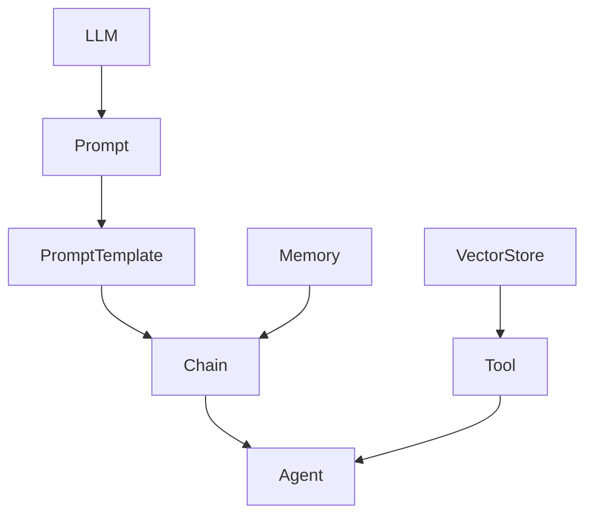

# 【LangChain编程：从入门到实践】batch

## 1. 背景介绍
### 1.1 问题的由来
随着人工智能技术的飞速发展，自然语言处理(NLP)和大语言模型(LLM)在各个领域得到了广泛应用。然而，如何高效地使用LLM来构建智能应用，仍然是一个巨大的挑战。开发者需要编写大量的胶水代码来集成不同的模型和工具，这不仅耗时耗力，而且容易出错。

### 1.2 研究现状 
目前已经有一些开源框架和工具，如Hugging Face的Transformers库，OpenAI的GPT系列模型等，可以帮助开发者更容易地使用LLM。但是，这些工具主要关注于模型训练和推理，缺乏对整个应用开发流程的支持。

最近，一个名为LangChain的开源项目引起了广泛关注。LangChain是一个用于构建LLM应用的开发框架，它提供了一系列工具和组件，可以帮助开发者更轻松地集成LLM，构建端到端的应用。

### 1.3 研究意义
LangChain的出现，为LLM应用开发带来了新的思路和方法。深入研究LangChain的原理和实践，对于推动LLM技术在各个领域的应用具有重要意义。通过总结LangChain的最佳实践和应用案例，可以帮助更多开发者快速上手，提高开发效率和质量。

### 1.4 本文结构
本文将全面介绍LangChain框架，包括其核心概念、工作原理、关键组件、最佳实践等。通过理论与实践相结合的方式，帮助读者系统地掌握如何使用LangChain进行LLM应用开发。

全文分为9个章节：
1. 背景介绍  
2. 核心概念与联系
3. 核心算法原理与具体操作步骤
4. 数学模型和公式详解与举例说明
5. 项目实践：代码实例和详细解释说明
6. 实际应用场景
7. 工具和资源推荐
8. 总结：未来发展趋势与挑战
9. 附录：常见问题与解答

## 2. 核心概念与联系

在深入学习LangChain之前，我们需要了解其核心概念和它们之间的联系。下面是LangChain的一些关键概念：

- **LLM**：大语言模型(Large Language Model)，如GPT-3、PaLM等，是LangChain的核心组件之一。LLM可以用于文本生成、问答、摘要等任务。

- **Prompt**：提示，指输入给LLM的文本，引导LLM生成所需的输出。设计好的Prompt可以显著提高LLM的效果。

- **Prompt Template**：提示模板，一种定义Prompt结构的方式，可以包含变量，方便动态生成Prompt。

- **Chain**：链，将多个组件(如LLM、Prompt等)组合在一起，形成一个可执行的工作流。Chain可以实现更复杂的应用逻辑。

- **Agent**：代理，一种特殊的Chain，可以根据用户输入，动态选择和执行子Chain，实现更智能的交互。

- **Memory**：记忆，指在多轮对话中保存和使用上下文信息的机制，可以让LLM根据对话历史生成更连贯的响应。

- **Tool**：工具，指可以与LLM配合使用的外部函数或API，如搜索引擎、计算器等，可以增强LLM的能力。

- **Vector Store**：向量存储，一种将文本转换为向量并高效检索的技术，常用于构建知识库、语义搜索等。

下图展示了这些核心概念之间的关系：



从图中可以看出，LLM和Prompt是最基础的组件，PromptTemplate用于定义Prompt，Chain将多个组件组合起来，Agent是一种特殊的Chain，Memory用于管理上下文信息，Tool和VectorStore可以增强LLM的功能。理解这些概念之间的联系，对于使用LangChain进行开发非常重要。

## 3. 核心算法原理 & 具体操作步骤
### 3.1 算法原理概述
LangChain的核心算法主要包括两部分：Prompt优化和Chain构建。

Prompt优化指根据任务目标，设计出高质量的Prompt，引导LLM生成所需的输出。一个好的Prompt需要包含清晰的指令、必要的上下文信息、期望的格式等。常见的Prompt优化技术有：

- 少样本学习(Few-shot Learning)：在Prompt中提供少量示例，让LLM学习并模仿。
- 链式思考(Chain-of-Thought)：引导LLM逐步推理，得出最终答案。
- 零样本学习(Zero-shot Learning)：无需示例，直接给出明确指令。

Chain构建指将多个组件组合成一个工作流，实现端到端的应用。常见的Chain类型有：

- 顺序链(Sequential Chain)：按顺序执行多个子Chain。
- 路由链(Router Chain)：根据条件选择执行不同的子Chain。
- 转换链(Transform Chain)：对输入进行转换，再传递给下一个组件。

### 3.2 算法步骤详解
下面以一个问答应用为例，详细介绍LangChain的开发步骤。

1. 定义Prompt模板
   
首先，我们需要定义一个Prompt模板，用于动态生成Prompt。例如：

```python
from langchain import PromptTemplate

template = """
根据以下背景信息，请回答问题。如果无法从背景信息中得到答案，请说"不知道"。

背景信息：
{context}

问题：{question}

回答：
"""

prompt = PromptTemplate(
    input_variables=["context", "question"],
    template=template,
)
```

这里定义了一个包含`context`和`question`两个变量的Prompt模板。

2. 加载语言模型

接下来，我们需要加载一个预训练的语言模型，如OpenAI的GPT-3：

```python
from langchain.llms import OpenAI

llm = OpenAI(temperature=0)
```

3. 构建Chain

然后，我们可以将Prompt和LLM组合成一个Chain：

```python
from langchain.chains import LLMChain

chain = LLMChain(llm=llm, prompt=prompt)
```

4. 执行Chain

最后，我们可以传入具体的`context`和`question`，执行Chain得到答案：

```python
context = "LangChain是一个用于开发LLM应用的框架。"
question = "LangChain是用来做什么的？"

result = chain.run(context=context, question=question)
print(result)
```

输出：
```
LangChain是一个用于开发LLM（大语言模型）应用的框架。
```

以上就是使用LangChain进行问答应用开发的基本步骤。实际应用中，我们还可以加入更多的组件，如知识库、搜索引擎等，构建更加复杂和智能的Chain。

### 3.3 算法优缺点
LangChain的优点包括：

- 提供了一套统一的接口和规范，方便集成不同的LLM和工具。
- 支持Prompt优化和Chain构建，可以实现复杂的应用逻辑。
- 自带多种常用组件，如Memory、Tool等，减少开发工作量。
- 代码简洁易读，容易上手和扩展。

但LangChain也有一些局限性：

- 部分高级功能仍在开发中，文档和示例不够完善。
- 对于非常复杂的应用，可能需要开发者手动实现某些组件。
- 性能优化方面还有待加强，需要开发者自行权衡速度和效果。

### 3.4 算法应用领域
LangChain可以用于构建各种LLM应用，包括但不限于：

- 智能问答、客服机器人
- 文本摘要、内容生成
- 代码辅助、编程助手
- 数据分析、报告生成
- 知识库构建、语义搜索

总之，LangChain为LLM应用开发提供了一套灵活、强大的工具，有助于加速LLM技术的落地和应用。

## 4. 数学模型和公式 & 详细讲解 & 举例说明
### 4.1 数学模型构建
LangChain本身并不涉及复杂的数学模型，主要是对LLM的封装和组合。但在使用LLM时，我们需要了解其背后的数学原理，即Transformer模型。

Transformer是一种基于自注意力机制(Self-Attention)的神经网络结构，可以高效地处理序列数据。其核心思想是：通过注意力机制，让序列中的每个元素与其他元素建立联系，从而捕捉到全局的依赖关系。

具体来说，Transformer包含两个主要组件：Encoder和Decoder。Encoder用于将输入序列编码为隐向量，Decoder根据隐向量生成输出序列。

### 4.2 公式推导过程
以下是Transformer中Self-Attention的计算公式：

$$
Attention(Q,K,V) = softmax(\frac{QK^T}{\sqrt{d_k}})V
$$

其中，$Q$、$K$、$V$分别表示Query、Key、Value矩阵，$d_k$是Key向量的维度。

这个公式可以分为三个步骤：

1. 计算Query和Key的点积，得到注意力分数(Attention Scores)：

$$
score_{ij} = \frac{q_i \cdot k_j}{\sqrt{d_k}}
$$

其中，$q_i$和$k_j$分别是$Q$和$K$的第$i$行和第$j$列。

2. 对注意力分数进行Softmax归一化，得到注意力权重(Attention Weights)：

$$
\alpha_{ij} = \frac{exp(score_{ij})}{\sum_j exp(score_{ij})}
$$

3. 用注意力权重对Value进行加权求和，得到输出：

$$
out_i = \sum_j \alpha_{ij} v_j
$$

其中，$v_j$是$V$的第$j$列。

以上就是Self-Attention的数学推导过程。通过这种方式，Transformer可以高效地捕捉序列中的长距离依赖关系，实现并行计算。

### 4.3 案例分析与讲解
下面我们以一个简单的例子来说明Self-Attention的计算过程。

假设有一个输入序列：["I", "love", "LangChain"]，我们要计算"love"这个词的表示。

首先，将输入序列转换为Query、Key、Value矩阵：

$$
Q = K = V = 
\begin{bmatrix}
q_I \ q_{love} \ q_{LangChain}
\end{bmatrix}
$$

然后，计算"love"与其他词的注意力分数：

$$
score_{love,I} = \frac{q_{love} \cdot k_I}{\sqrt{d_k}} \
score_{love,love} = \frac{q_{love} \cdot k_{love}}{\sqrt{d_k}} \
score_{love,LangChain} = \frac{q_{love} \cdot k_{LangChain}}{\sqrt{d_k}}
$$

接着，对注意力分数进行Softmax归一化：

$$
\alpha_{love,I} = \frac{exp(score_{love,I})}{exp(score_{love,I}) + exp(score_{love,love}) + exp(score_{love,LangChain})} \
\alpha_{love,love} = \frac{exp(score_{love,love})}{exp(score_{love,I}) + exp(score_{love,love}) + exp(score_{love,LangChain})} \
\alpha_{love,LangChain} = \frac{exp(score_{love,LangChain})}{exp(score_{love,I}) + exp(score_{love,love}) + exp(score_{love,LangChain})}
$$

最后，用注意力权重对Value进行加权求和：

$$
out_{love} = \alpha_{love,I} v_I + \alpha_{love,love} v_{love} + \alpha_{love,LangChain} v_{LangChain}
$$

通过Self-Attention，"love"这个词的表示不仅包含了自身的信息，还融合了与其他词的关系，从而得到了更加准确和全面的语义表示。

### 4.4 常见问题解答
1. Self-Attention是否可以捕捉位置信息？

答：原始的Self-Attention是位置无关的，无法捕捉词序信息。为了解决这个问题，Transformer引入了位置编码(Positional Encoding)，将位置信息嵌入到输入表示中。

2. Self-Attention的计算复杂度是多少？

答：假设序列长度为$n$，隐向量维度为$d$，则Self-Attention的时间复