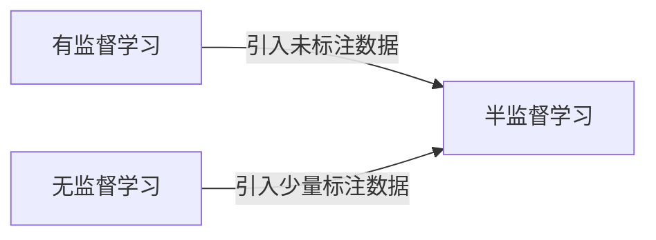

# 半监督学习 (Semi-supervised Learning)

关键词：半监督学习、无监督学习、有监督学习、生成式模型、判别式模型、自训练、协同训练、图半监督学习

## 1. 背景介绍
### 1.1 问题的由来
在机器学习领域,数据标注一直是一个非常耗时耗力的过程。尤其是在大数据时代,海量的数据对于人工标注来说几乎是不可能完成的任务。然而,大量的未标注数据却很容易获得。如何利用这些未标注数据来改善模型的性能,是机器学习研究的一个重要课题。

### 1.2 研究现状
半监督学习正是为解决这一问题而提出的一种学习范式。与传统的有监督学习和无监督学习不同,半监督学习同时利用了标注数据和未标注数据进行模型训练。目前,半监督学习已经在文本分类、语音识别、图像分类等多个领域取得了显著的效果。

### 1.3 研究意义
半监督学习的研究意义主要体现在以下几个方面:

1. 降低标注成本:利用未标注数据可以大幅减少人工标注的工作量,节省时间和金钱成本。
2. 提高模型泛化能力:引入未标注数据有助于模型学习到更加一般的特征,从而提高模型的泛化能力。
3. 挖掘数据内在结构:半监督学习可以挖掘数据内在的结构信息,发现有价值的模式和知识。

### 1.4 本文结构
本文将全面介绍半监督学习的相关内容。第2节介绍半监督学习的核心概念;第3节讲解几种主要的半监督学习算法原理;第4节给出半监督学习的数学模型和公式推导;第5节通过代码实例演示半监督学习的具体实现;第6节总结半监督学习的实际应用场景;第7节推荐半监督学习的相关工具和资源;第8节对全文进行总结并展望未来的研究方向;第9节列出了一些常见问题解答。

## 2. 核心概念与联系
半监督学习是介于有监督学习和无监督学习之间的一种学习范式。它利用少量的标注数据和大量的未标注数据来训练模型。与此相关的几个核心概念如下:

- 有监督学习:所有训练样本都有标注信息,目标是学习一个映射函数f:X→Y。
- 无监督学习:训练样本都没有标注信息,目标是发现数据的内在结构和规律。
- 生成式模型:由数据生成的过程,估计联合分布P(X,Y)。常见的有高斯混合模型等。
- 判别式模型:由数据到标签的判别过程,估计条件分布P(Y|X)。常见的有支持向量机等。

下图展示了半监督学习与有监督、无监督学习的关系:



半监督学习的思路是利用未标注数据揭示数据的内在结构,再利用标注数据指导模型的学习方向。通过有监督信息和无监督信息的结合,半监督模型能够比单独使用二者任意一种获得更好的性能。

## 3. 核心算法原理 & 具体操作步骤
半监督学习主要分为生成式方法和判别式方法两大类。下面分别介绍几种常见算法的原理和步骤。

### 3.1 自训练 (Self-training)
自训练是一种简单直观的半监督学习方法。其基本思路是用标注数据训练一个初始模型,然后用该模型对未标注数据进行预测,将置信度高的样本加入到训练集中,再重新训练模型。这一过程不断迭代,直到未标注数据全部用尽或达到一定次数。

算法步骤如下:
1. 用标注数据训练一个初始模型f0
2. 对未标注数据进行预测,得到预测标签
3. 选择置信度最高的一部分样本,将其加入训练集
4. 用新的训练集重新训练模型,得到f1
5. 重复2-4步,直到达到停止条件

### 3.2 协同训练 (Co-training) 
协同训练利用数据的多视图特性,从不同视角训练多个模型,然后让它们互相学习,达到协同提升的效果。

算法步骤如下:  
1. 将数据集分成两个视图V1和V2
2. 用标注数据在V1和V2上分别训练模型f1和f2
3. 用f1对V2未标注数据预测,将置信度高的样本加入V2训练集
4. 用f2对V1未标注数据预测,将置信度高的样本加入V1训练集  
5. 在新的训练集上重新训练f1和f2
6. 重复3-5步,直到达到停止条件

### 3.3 图半监督学习 (Graph-based SSL)
图半监督学习基于流形假设,即高维数据在局部上是光滑的,相似的样本应该有相似的标签。它通过构建一个图来表示数据之间的相似性,并利用图的结构进行标签传播。

算法步骤如下:
1. 用所有数据构建一个图G=(V,E),V为样本集,E为边集
2. 计算图的邻接矩阵W,其中wij表示样本i和j的相似度
3. 计算图拉普拉斯矩阵L=D-W,其中D为对角矩阵,dii=Σjwij
4. 初始化标签矩阵Y,已标注样本为真实标签,未标注样本为0
5. 迭代更新Y,直到收敛:Y←αLY+(1-α)Y0,其中Y0为初始标签矩阵
6. 对Y进行归一化,得到最终的标签

### 3.4 算法优缺点
- 自训练:简单易实现,但容易受噪声样本影响,导致错误累积。
- 协同训练:可以利用数据的多视图互补信息,但需要满足视图独立和充分的假设。  
- 图半监督学习:可以挖掘数据的内在流形结构,但计算复杂度较高。

### 3.5 算法应用领域
半监督学习在多个领域都有广泛应用,如:
- 文本分类:利用少量标注文本和大量未标注文本进行分类
- 语音识别:利用少量标注语音和大量未标注语音进行建模
- 图像标注:利用少量标注图像对大量未标注图像自动标注
- 网页分类:利用少量分类网页对海量网页进行分类
- 生物信息:利用少量已知功能的基因对新基因功能进行注释

## 4. 数学模型和公式 & 详细讲解 & 举例说明
半监督学习可以从生成式和判别式两个角度建立数学模型。这里以生成式的高斯混合模型和判别式的支持向量机为例进行说明。

### 4.1 生成式高斯混合模型
假设数据由k个高斯分布混合而成,每个分布对应一个类别,则样本x的生成概率为:

$$
P(x)=\sum_{i=1}^k\alpha_iN(x|\mu_i,\Sigma_i)
$$

其中$\alpha_i$为第i个分布的混合系数,$N(x|\mu_i,\Sigma_i)$为第i个高斯分布的概率密度函数。

假设已标注样本为$D_l=\{(x_1,y_1),...,(x_l,y_l)\}$,未标注样本为$D_u=\{x_{l+1},...,x_{l+u}\}$,则半监督高斯混合模型的对数似然函数为:

$$
\mathcal{L}=\sum_{(x,y)\in D_l}\log P(x,y)+\sum_{x\in D_u}\log P(x)
$$

其中第一项是有标注数据的对数似然,第二项是未标注数据的对数似然。通过最大化$\mathcal{L}$,可以得到模型参数$\{\alpha_i,\mu_i,\Sigma_i\}$的估计值。

### 4.2 判别式支持向量机
支持向量机(SVM)是一种经典的判别式模型,其目标是在特征空间中找到一个最大间隔超平面,将不同类别的样本分开。引入松弛变量$\xi_i$后,半监督SVM的优化目标可以表示为:

$$
\min_{w,b,\xi}\frac{1}{2}\|w\|^2+C_l\sum_{i=1}^l\xi_i+C_u\sum_{j=l+1}^{l+u}\xi_j \
s.t. \ y_i(w^Tx_i+b)\ge1-\xi_i, \forall (x_i,y_i)\in D_l \
|w^Tx_j+b|\ge1-\xi_j, \forall x_j\in D_u \
\xi_i\ge0, \forall i=1,...,l+u
$$

其中$w$和$b$为超平面参数,$C_l$和$C_u$分别控制有标注数据和未标注数据的松弛程度。可以看出,半监督SVM在最小化经验风险(有标注数据)的同时,也最小化了结构风险(未标注数据)。

### 4.3 案例分析与讲解
下面以一个二分类问题为例,直观展示半监督学习的效果。如下图所示,圆形和三角形表示两个类别,实心点为已标注样本,空心点为未标注样本。

```
+-------------------------+
|                         |
|  Δ   ○   ○             |
|     ●    ○             |
|  ○   ●  ○   ○   Δ  ○  |  
|    ○   ○   Δ    ○      |
|                 ○   ○  |
|                         |
+-------------------------+
```

假设我们用高斯混合模型和支持向量机分别建模,并逐步加入未标注样本进行训练,得到的决策边界如下图所示:

```
+-------------------------+     +-------------------------+     +-------------------------+
|                         |     |                         |     |                         |
|  Δ   ○   ○             |     |  Δ   ○   ○             |     |  Δ   ○   ○             |
|     ●    ○             |     |     ●    ○             |     |     ●    ○             |
|  ○   ●  ○   ○   Δ  ○  |     |  ○   ●  ○   ○   Δ  ○  |     |  ○   ●  ○   ○   Δ  ○  |
|    ○   ○   Δ    ○      |     |    ○   ○   Δ    ○      |     |    ○   ○   Δ    ○      |
|        \        ○   ○  |     |           \     ○   ○  |     |                 ○   ○  |
|         \               |     |            \            |     |                \        |
+-------------------------+     +-------------------------+     +-------------------------+
  有监督高斯混合模型               半监督高斯混合模型                 半监督支持向量机
```

可以看出,未标注样本为高斯混合模型提供了更多的分布信息,使决策边界更加平滑合理。而半监督SVM不仅利用了未标注样本的结构信息,还兼顾了分类间隔最大化,因此获得了最优的分类边界。

### 4.4 常见问题解答
Q: 半监督学习适用于哪些情况?

A: 半监督学习适用于以下情况:
1. 标注数据昂贵,未标注数据容易获得
2. 标注数据量较少,未标注数据量较大 
3. 数据分布符合半监督学习的假设,如聚类假设、流形假设等

Q: 半监督学习的主要挑战是什么?

A: 半监督学习的主要挑战包括:
1. 未标注数据的质量难以保证,噪声和离群点会影响学习效果
2. 模型对半监督学习假设的依赖性较强,假设不成立时性能会下降
3. 算法的计算复杂度较高,尤其是图半监督学习,难以应用于大规模数据
4. 缺乏统一的理论框架,不同的半监督学习方法之间缺乏可比性

## 5. 项目实践：代码实例和详细解释说明
下面以Python为例,演示半监督学习的代码实现。我们以经典的MNIST手写数字识别任务为例,用自训练和标准支持向量机进行对比实验。

### 5.1 开发环境