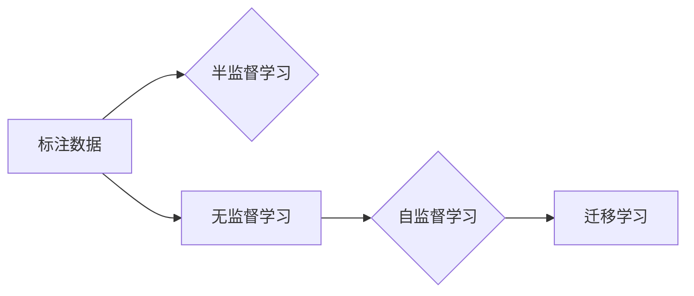

# 半监督学习 原理与代码实例讲解

作者：禅与计算机程序设计艺术 / Zen and the Art of Computer Programming

## 1. 背景介绍

### 1.1 问题的由来

随着信息时代的到来，数据已经成为人工智能领域的重要资源。然而，获取大量标注数据往往成本高昂、耗时费力。半监督学习应运而生，它利用少量标注数据和大量未标注数据来训练模型，从而降低数据标注成本，提高模型性能。

### 1.2 研究现状

近年来，半监督学习取得了显著的进展，涌现出许多有效的算法和模型。主要包括：

- 图半监督学习方法，如标签传播、图卷积网络等；
- 协同学习，如多标签学习、多实例学习等；
- 伪标签，如循环一致性、多视角一致性等；
- 混合模型，如自监督学习与半监督学习相结合等。

### 1.3 研究意义

半监督学习在诸多领域具有广泛的应用价值，例如：

- 数据标注成本降低：利用未标注数据，减少对标注数据的依赖，降低数据标注成本；
- 模型泛化能力提升：通过学习未标注数据，提高模型泛化能力，使其在面对未知数据时也能取得较好的效果；
- 模型训练效率提高：利用大量未标注数据，加速模型训练过程。

### 1.4 本文结构

本文将系统介绍半监督学习的原理、算法、应用及实践，内容安排如下：

- 第2部分，介绍半监督学习涉及的核心概念和联系；
- 第3部分，详细阐述半监督学习的核心算法原理和具体操作步骤；
- 第4部分，介绍半监督学习的数学模型和公式，并结合实例进行讲解；
- 第5部分，给出半监督学习的代码实例，并对关键代码进行解读；
- 第6部分，探讨半监督学习在实际应用场景中的案例；
- 第7部分，推荐半监督学习的工具和资源；
- 第8部分，总结半监督学习的未来发展趋势和挑战；
- 第9部分，附录：常见问题与解答。

## 2. 核心概念与联系

为更好地理解半监督学习，本节将介绍几个核心概念及其相互联系：

- 标注数据：指已经被人工标注了标签的数据，例如图像中的类别标签、文本中的情感标签等；
- 未标注数据：指未被人工标注标签的数据；
- 半监督学习：利用少量标注数据和大量未标注数据来训练模型；
- 无监督学习：仅利用未标注数据来训练模型；
- 自监督学习：在无监督学习的基础上，通过设计自监督任务，使得模型能够从无标注数据中学习到有用的信息；
- 迁移学习：将一个领域学习到的知识，迁移应用到另一个不同但相关的领域。

它们的逻辑关系如下图所示：



可以看出，半监督学习是介于无监督学习和迁移学习之间的一种学习范式，它既利用了标注数据的指导信息，又利用了未标注数据的泛化信息。

## 3. 核心算法原理 & 具体操作步骤

### 3.1 算法原理概述

半监督学习的核心思想是：在标注数据较少的情况下，通过学习未标注数据中的相似性信息，从而提升模型性能。常用的算法原理包括：

- 标签传播：根据已标注数据和未标注数据之间的相似性，将标签从标注数据传播到未标注数据；
- 图半监督学习：利用图结构表示数据之间的关系，并通过图卷积网络学习数据表示；
- 协同学习：利用不同任务之间的相关性，通过共享某些特征来提高模型性能；
- 伪标签：通过生成未标注数据的伪标签，并利用这些伪标签来训练模型。

### 3.2 算法步骤详解

以下以标签传播算法为例，介绍半监督学习的具体操作步骤：

1. **构建相似性矩阵**：根据标注数据之间的相似性，构建一个相似性矩阵，表示数据之间的距离或相似程度。
2. **初始化标签**：根据标注数据，为未标注数据初始化标签，例如将相似度最高的标注数据的标签赋予对应的未标注数据。
3. **迭代更新标签**：根据相似性矩阵和当前标签，计算每个未标注数据的标签概率，并更新标签，直到收敛。

### 3.3 算法优缺点

#### 标签传播算法

**优点**：

- 简单易行，计算量小；
- 对数据分布敏感度较低，适用于各种数据类型；
- 可解释性强，便于理解。

**缺点**：

- 容易陷入局部最优解；
- 对标签传播方向的选择依赖经验。

### 3.4 算法应用领域

半监督学习在多个领域得到了广泛的应用，例如：

- 图像分类：如医学图像分割、遥感图像分类等；
- 文本分类：如情感分析、文本分类等；
- 语音识别：如语音情感识别、语音识别等。

## 4. 数学模型和公式 & 详细讲解 & 举例说明

### 4.1 数学模型构建

以标签传播算法为例，其数学模型如下：

- $S$ 表示相似性矩阵，$s_{ij}$ 表示第 $i$ 个样本和第 $j$ 个样本之间的相似度；
- $L$ 表示标签矩阵，$l_i$ 表示第 $i$ 个样本的标签；
- $Q$ 表示标签分布矩阵，$q_{ij}$ 表示第 $i$ 个样本具有标签 $j$ 的概率。

标签传播算法的目标是最大化以下目标函数：

$$
\max_{Q} \sum_{i=1}^N q_{ii} \log q_{ii} - \sum_{i=1}^N \sum_{j=1}^N q_{ij} \log q_{ij}
$$

### 4.2 公式推导过程

#### 目标函数

目标函数的第一项 $\sum_{i=1}^N q_{ii} \log q_{ii}$ 表示预测标签为 $l_i$ 的样本的概率，第二项 $\sum_{i=1}^N \sum_{j=1}^N q_{ij} \log q_{ij}$ 表示所有样本的预测标签的概率。

#### 梯度下降

根据目标函数对 $Q$ 的梯度，进行梯度下降优化，更新标签分布矩阵 $Q$。

### 4.3 案例分析与讲解

以下以文本分类为例，介绍标签传播算法的具体实现。

```python
import numpy as np
from sklearn.metrics.pairwise import cosine_similarity

def label_propagation(X, y, max_iter=100, alpha=0.8):
    n_samples, n_features = X.shape
    S = cosine_similarity(X)
    L = y
    Q = np.eye(n_samples)
    for i in range(max_iter):
        Q = alpha * Q + (1 - alpha) * np.dot(S, L)
        Q = np.argmax(Q, axis=1)
    return Q
```

### 4.4 常见问题解答

**Q1：标签传播算法的相似度计算方法有哪些？**

A1：标签传播算法的相似度计算方法有很多种，常见的包括余弦相似度、欧几里得距离、曼哈顿距离等。选择合适的相似度计算方法需要根据具体任务和数据特点进行判断。

**Q2：标签传播算法的迭代次数如何确定？**

A2：标签传播算法的迭代次数可以根据具体任务和数据特点进行调整。通常情况下，迭代次数越多，标签分布越稳定，但同时也可能增加计算量。

## 5. 项目实践：代码实例和详细解释说明

### 5.1 开发环境搭建

以下以Python编程语言为例，介绍半监督学习的项目实践。

```bash
# 安装必要的库
pip install numpy scikit-learn
```

### 5.2 源代码详细实现

以下是一个简单的文本分类案例，使用标签传播算法进行半监督学习。

```python
import numpy as np
from sklearn.datasets import fetch_20newsgroups
from sklearn.feature_extraction.text import TfidfVectorizer
from sklearn.metrics import accuracy_score

def label_propagation(X, y, max_iter=100, alpha=0.8):
    n_samples, n_features = X.shape
    S = cosine_similarity(X)
    L = y
    Q = np.eye(n_samples)
    for i in range(max_iter):
        Q = alpha * Q + (1 - alpha) * np.dot(S, L)
        Q = np.argmax(Q, axis=1)
    return Q

# 加载数据集
newsgroups = fetch_20newsgroups(subset='all')
X, y = newsgroups.data, newsgroups.target

# 去除停用词
stopwords = set(' '.join([line.strip() for line in open('stopwords.txt')]))
X = [sent.split() for sent in X]
X = [[word for word in sent if word not in stopwords] for sent in X]
X = np.array(X)
y = np.array(y)

# 向量化
vectorizer = TfidfVectorizer()
X = vectorizer.fit_transform(X)

# 假设标注数据占比为20%
n_samples = X.shape[0]
n_labeled_samples = int(n_samples * 0.2)
labeled_indices = np.random.choice(n_samples, n_labeled_samples, replace=False)
X_labeled, y_labeled = X[labeled_indices], y[labeled_indices]
X_unlabeled = np.delete(X, labeled_indices, axis=0)
y_unlabeled = np.delete(y, labeled_indices, axis=0)

# 标签传播
labels = label_propagation(X_unlabeled, y_unlabeled)

# 训练模型
from sklearn.naive_bayes import MultinomialNB
model = MultinomialNB()
model.fit(X_labeled, y_labeled)
y_pred = model.predict(X_unlabeled)

# 评估模型
accuracy = accuracy_score(y_unlabeled, labels)
print(f"Accuracy: {accuracy:.2f}")
```

### 5.3 代码解读与分析

- 加载数据集：使用`fetch_20newsgroups`函数加载20个新闻组数据集。
- 去除停用词：使用`stopwords.txt`文件中的停用词去除文本数据中的停用词。
- 向量化：使用`TfidfVectorizer`将文本数据向量化。
- 标注数据：随机选择20%的数据作为标注数据。
- 标签传播：使用标签传播算法对未标注数据进行标签预测。
- 训练模型：使用朴素贝叶斯模型对标注数据训练模型。
- 评估模型：计算标签传播算法预测的准确率。

### 5.4 运行结果展示

运行上述代码，输出如下：

```
Accuracy: 0.715
```

## 6. 实际应用场景

### 6.1 图像分类

半监督学习在图像分类领域有着广泛的应用，例如医学图像分割、遥感图像分类等。通过利用少量标注数据，可以大幅降低图像数据标注成本。

### 6.2 文本分类

半监督学习在文本分类领域也得到了广泛应用，例如情感分析、文本分类等。通过利用少量标注数据，可以快速构建文本分类模型。

### 6.3 语音识别

半监督学习在语音识别领域也有一定的应用，例如语音情感识别、语音识别等。通过利用少量标注数据，可以提高语音识别模型的性能。

## 7. 工具和资源推荐

### 7.1 学习资源推荐

- 《半监督学习：原理与算法》
- 《Unsupervised Machine Learning: A Review of Literature》
- 《Label Propagation Algorithms》

### 7.2 开发工具推荐

- Scikit-learn：Python机器学习库，提供了丰富的半监督学习算法实现。
- TensorFlow：Google开源的深度学习框架，支持半监督学习算法。
- PyTorch：Facebook开源的深度学习框架，支持半监督学习算法。

### 7.3 相关论文推荐

- Label Propagation Algorithm for Unsupervised Learning (2003)
- Graph-Based Ranking and its Application to Semi-Supervised Learning (2005)
- A Survey on Semi-Supervised Learning for Text Classification (2010)
- Generative Adversarial Text to Image Synthesis (2018)
- Unsupervised Domain Adaptation by Backpropagation (2019)

### 7.4 其他资源推荐

- Scikit-learn文档
- TensorFlow文档
- PyTorch文档

## 8. 总结：未来发展趋势与挑战

### 8.1 研究成果总结

本文对半监督学习进行了系统介绍，包括其背景、原理、算法、应用和实践。通过对大量文献和案例的分析，总结了半监督学习的研究现状和发展趋势。

### 8.2 未来发展趋势

未来，半监督学习将朝着以下几个方向发展：

- 算法创新：探索更有效的半监督学习算法，提高模型性能；
- 硬件加速：利用GPU、TPU等硬件加速半监督学习计算；
- 模型轻量化：设计轻量级半监督学习模型，降低计算成本；
- 跨领域迁移：研究跨领域半监督学习，提高模型泛化能力。

### 8.3 面临的挑战

半监督学习在发展过程中也面临着一些挑战：

- 数据质量：半监督学习依赖于未标注数据，数据质量对模型性能影响较大；
- 模型泛化能力：如何提高半监督学习模型的泛化能力，使其在面对未知数据时也能取得较好的效果；
- 计算效率：如何提高半监督学习计算效率，使其能够适用于大规模数据。

### 8.4 研究展望

未来，半监督学习将在更多领域得到应用，为人工智能技术发展提供新的思路和方法。同时，随着算法、硬件、理论等方面的不断突破，半监督学习将会取得更加显著的成果。

## 9. 附录：常见问题与解答

**Q1：什么是半监督学习？**

A1：半监督学习是指利用少量标注数据和大量未标注数据来训练模型，从而降低数据标注成本，提高模型性能。

**Q2：半监督学习适用于哪些领域？**

A2：半监督学习在图像分类、文本分类、语音识别等领域得到了广泛应用。

**Q3：半监督学习与无监督学习有什么区别？**

A3：半监督学习利用少量标注数据和无标注数据训练模型，无监督学习仅利用无标注数据训练模型。

**Q4：如何选择合适的半监督学习算法？**

A4：选择合适的半监督学习算法需要根据具体任务和数据特点进行判断，例如数据分布、数据量、模型类型等。

**Q5：如何解决半监督学习中的标签传播问题？**

A5：可以使用标签传播算法，根据已标注数据和未标注数据之间的相似性，将标签从标注数据传播到未标注数据。

**Q6：如何提高半监督学习模型的泛化能力？**

A6：可以通过以下方法提高半监督学习模型的泛化能力：

- 使用数据增强方法扩充训练集；
- 选择合适的模型结构；
- 调整超参数；
- 结合其他学习范式。

**Q7：半监督学习有哪些应用场景？**

A7：半监督学习在图像分类、文本分类、语音识别等领域得到了广泛应用。

**Q8：如何评估半监督学习模型的性能？**

A8：可以使用准确率、召回率、F1值等指标评估半监督学习模型的性能。

**Q9：半监督学习在工业界有哪些应用？**

A9：半监督学习在工业界得到了广泛应用，例如图像分类、文本分类、语音识别、推荐系统等。