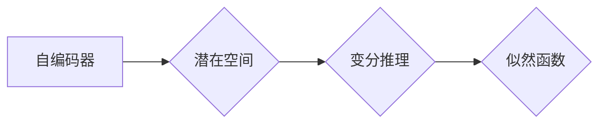

# 变分自编码器 (Variational Autoencoder)

作者：禅与计算机程序设计艺术 / Zen and the Art of Computer Programming

## 1. 背景介绍
### 1.1 问题的由来

自编码器（Autoencoder）作为一种无监督学习算法，在数据降维、特征提取、异常检测等领域有着广泛的应用。传统的自编码器通过编码器（Encoder）将输入数据映射到一个低维空间，再由解码器（Decoder）将低维空间的数据映射回高维空间，从而实现数据的重构。然而，传统自编码器存在一些局限性，如重构误差较大、难以学习到潜在空间的分布等。

为了解决这些问题，变分自编码器（Variational Autoencoder，VAE）应运而生。VAE通过引入变分推理的思想，能够学习到潜在空间的分布，从而实现更精确的数据重构和更好的特征提取。

### 1.2 研究现状

自编码器自提出以来，就受到了广泛关注。传统的自编码器在图像处理、语音识别、自然语言处理等领域取得了显著的成果。然而，随着深度学习技术的不断发展，VAE作为一种新型的自编码器，逐渐成为研究热点。近年来，VAE在图像生成、图像超分辨率、视频去噪等领域取得了突破性进展。

### 1.3 研究意义

VAE作为一种新型自编码器，具有以下研究意义：

1. **学习潜在空间分布**：VAE能够学习到潜在空间的分布，从而更好地理解数据结构，为数据降维和特征提取提供新的思路。
2. **生成高质量图像**：VAE可以生成与训练数据分布相似的高质量图像，具有广泛的应用前景。
3. **跨领域迁移学习**：VAE可以有效地进行跨领域迁移学习，将知识从源领域迁移到目标领域。

### 1.4 本文结构

本文将系统地介绍VAE的原理、实现方法及其应用。内容安排如下：

- 第2部分，介绍VAE的核心概念和联系。
- 第3部分，详细阐述VAE的算法原理和具体操作步骤。
- 第4部分，讲解VAE的数学模型和公式，并结合实例进行分析。
- 第5部分，给出VAE的代码实现示例，并对关键代码进行解读。
- 第6部分，探讨VAE在实际应用场景中的案例。
- 第7部分，推荐VAE相关的学习资源、开发工具和参考文献。
- 第8部分，总结全文，展望VAE技术的未来发展趋势与挑战。

## 2. 核心概念与联系

为了更好地理解VAE，我们需要了解以下几个核心概念：

- **自编码器**：一种无监督学习算法，通过编码器将输入数据映射到一个低维空间，再由解码器将低维空间的数据映射回高维空间，从而实现数据的重构。
- **潜在空间**：自编码器学习到的低维空间，用于表示输入数据的潜在特征。
- **变分推理**：一种概率推理方法，通过学习潜在空间的分布来逼近后验分布。
- **似然函数**：用于衡量模型预测与真实数据之间的相似度。

它们之间的逻辑关系如下图所示：



可以看出，VAE通过学习潜在空间的分布，结合变分推理，最终达到优化似然函数的目的。

## 3. 核心算法原理 & 具体操作步骤
### 3.1 算法原理概述

VAE的核心思想是将编码器学习到的潜在空间视为一个概率分布，并通过变分推理逼近真实数据的后验分布。

具体来说，VAE由以下三个部分组成：

- **编码器**：将输入数据映射到一个潜在空间，输出潜在变量的均值和方差。
- **解码器**：将潜在变量解码回原始数据空间。
- **变分推断**：学习潜在空间的概率分布，并通过最大化似然函数来逼近真实数据的后验分布。

### 3.2 算法步骤详解

VAE的微调过程主要包括以下步骤：

**Step 1：初始化参数**

- 随机初始化编码器、解码器和变分推断网络的参数。

**Step 2：生成潜在变量**

- 使用编码器生成潜在变量 $z$ 的均值 $\mu$ 和方差 $\sigma^2$。

**Step 3：生成样本**

- 使用潜在变量 $z$ 通过解码器生成样本 $x$。

**Step 4：计算损失函数**

- 计算重构损失和KL散度损失，得到总的损失函数。

**Step 5：反向传播**

- 使用梯度下降算法更新编码器、解码器和变分推断网络的参数。

**Step 6：迭代优化**

- 重复Step 2到Step 5，直至模型收敛。

### 3.3 算法优缺点

VAE的优点：

1. **学习潜在空间分布**：VAE能够学习到潜在空间的分布，从而更好地理解数据结构，为数据降维和特征提取提供新的思路。
2. **生成高质量图像**：VAE可以生成与训练数据分布相似的高质量图像，具有广泛的应用前景。
3. **跨领域迁移学习**：VAE可以有效地进行跨领域迁移学习，将知识从源领域迁移到目标领域。

VAE的缺点：

1. **训练过程不稳定**：VAE的训练过程可能受到潜在空间分布的影响，导致训练不稳定。
2. **计算复杂度较高**：VAE的计算复杂度较高，需要较大的计算资源。
3. **难以处理高维数据**：VAE在高维数据上的性能较差。

### 3.4 算法应用领域

VAE在以下领域有着广泛的应用：

- **图像生成**：VAE可以生成与训练数据分布相似的高质量图像，应用于艺术创作、虚拟现实等领域。
- **图像超分辨率**：VAE可以提升低分辨率图像的分辨率，应用于图像处理、视频增强等领域。
- **视频去噪**：VAE可以去除视频中的噪声，应用于视频处理、视频压缩等领域。
- **异常检测**：VAE可以识别出异常数据，应用于金融风控、安全监控等领域。

## 4. 数学模型和公式 & 详细讲解 & 举例说明
### 4.1 数学模型构建

VAE的数学模型如下：

- **编码器**：

$$
\begin{align*}
\mu &= \mu_\theta(x) \\
\sigma^2 &= \sigma^2_\theta(x)
\end{align*}
$$

其中，$\mu_\theta$ 和 $\sigma^2_\theta$ 分别为编码器参数 $\theta$ 的函数，表示潜在变量 $z$ 的均值和方差。

- **解码器**：

$$
x = \phi_\theta(z)
$$

其中，$\phi_\theta$ 为解码器参数 $\theta$ 的函数，表示潜在变量 $z$ 解码回原始数据空间的结果。

- **似然函数**：

$$
L(\theta) = \int p(x|z) p(z) dz
$$

其中，$p(x|z)$ 为数据生成模型，$p(z)$ 为潜在变量 $z$ 的先验分布。

- **KL散度**：

$$
D_{KL}(q(z)||p(z)) = \int q(z) \log \frac{q(z)}{p(z)} dz
$$

其中，$q(z)$ 为变分推断网络的输出，$p(z)$ 为潜在变量 $z$ 的先验分布。

### 4.2 公式推导过程

VAE的似然函数和KL散度损失可以推导如下：

**似然函数**：

$$
L(\theta) = \int p(x|z) p(z) dz
$$

其中，$p(x|z)$ 为数据生成模型，$p(z)$ 为潜在变量 $z$ 的先验分布。

在VAE中，数据生成模型通常采用对数似然：

$$
p(x|z) = \prod_{i=1}^n \mathcal{N}(x_i; \mu, \sigma^2)
$$

其中，$\mathcal{N}$ 为高斯分布，$\mu$ 和 $\sigma^2$ 分别为均值和方差。

将数据生成模型代入似然函数，得：

$$
L(\theta) = \prod_{i=1}^n \int \mathcal{N}(x_i; \mu, \sigma^2) p(z) dz
$$

利用高斯分布的积分公式，得：

$$
L(\theta) = p(z) \exp\left(-\frac{1}{2}\sum_{i=1}^n (x_i - \mu)^2 / \sigma^2\right)
$$

**KL散度**：

$$
D_{KL}(q(z)||p(z)) = \int q(z) \log \frac{q(z)}{p(z)} dz
$$

其中，$q(z)$ 为变分推断网络的输出，$p(z)$ 为潜在变量 $z$ 的先验分布。

在VAE中，变分推断网络的输出通常采用高斯分布：

$$
q(z) = \mathcal{N}(z; \mu, \sigma^2)
$$

将变分推断网络输出代入KL散度，得：

$$
D_{KL}(q(z)||p(z)) = \int \mathcal{N}(z; \mu, \sigma^2) \log \frac{\mathcal{N}(z; \mu, \sigma^2)}{p(z)} dz
$$

利用高斯分布的积分公式，得：

$$
D_{KL}(q(z)||p(z)) = \frac{1}{2} \log \frac{\sigma^2}{\sigma^2_\theta^2} + \frac{1}{2} (\mu - \mu_\theta)^2 + \frac{1}{2} (\sigma^2 - \sigma^2_\theta)
$$

### 4.3 案例分析与讲解

以下我们以图像生成任务为例，演示如何使用PyTorch实现VAE。

首先，定义编码器、解码器和变分推断网络：

```python
import torch
import torch.nn as nn

class VAE(nn.Module):
    def __init__(self):
        super(VAE, self).__init__()
        self.encoder = nn.Sequential(
            nn.Linear(784, 400),
            nn.ReLU(),
            nn.Linear(400, 20)
        )
        self.decoder = nn.Sequential(
            nn.Linear(20, 400),
            nn.ReLU(),
            nn.Linear(400, 784),
            nn.Sigmoid()
        )
        self.fc1 = nn.Linear(20, 20)
        self.fc2 = nn.Linear(20, 1)
        self.fc3 = nn.Linear(20, 1)
        self.fc4 = nn.Linear(20, 784)

    def encode(self, x):
        h1 = self.encoder(x)
        mu = self.fc1(h1)
        logvar = self.fc2(h1)
        return mu, logvar

    def decode(self, z):
        h1 = self.fc3(z)
        mu = self.fc4(h1)
        return mu

    def reparameterize(self, mu, logvar):
        std = torch.exp(0.5*logvar)
        eps = torch.randn_like(std)
        return mu + eps*std

    def forward(self, x):
        mu, logvar = self.encode(x)
        z = self.reparameterize(mu, logvar)
        x_hat = self.decode(z)
        return x_hat, mu, logvar

# 定义模型
vae = VAE().to(device)
```

然后，定义损失函数和优化器：

```python
def vae_loss(x, x_hat, mu, logvar):
    BCE_loss = nn.functional.binary_cross_entropy(x_hat, x.view(x_hat.size(0), -1), reduction='sum')
    KL_loss = -0.5 * torch.sum(1 + logvar - mu.pow(2) - logvar.exp())
    return BCE_loss + KL_loss

optimizer = torch.optim.Adam(vae.parameters(), lr=1e-3)
```

最后，定义训练和评估函数：

```python
def train(epoch):
    vae.train()
    for batch_idx, (data, _) in enumerate(train_loader):
        optimizer.zero_grad()
        data = data.to(device)
        x_hat, mu, logvar = vae(data)
        loss = vae_loss(data, x_hat, mu, logvar)
        loss.backward()
        optimizer.step()
        if batch_idx % 100 == 0:
            print('Train Epoch: {} [{}/{} ({:.0f}%)]\tLoss: {:.6f}'.format(
                epoch, batch_idx * len(data), len(train_loader.dataset),
                100. * batch_idx / len(train_loader), loss.item()))

def test():
    vae.eval()
    test_loss = 0
    with torch.no_grad():
        for data, _ in test_loader:
            data = data.to(device)
            x_hat, mu, logvar = vae(data)
            loss = vae_loss(data, x_hat, mu, logvar)
            test_loss += loss.item()
    test_loss /= len(test_loader.dataset)
    print('\
Test set: Average loss: {:.4f}\
'.format(test_loss))
```

运行以下代码，开始训练和评估VAE：

```python
num_epochs = 20
train(num_epochs)
test()
```

以上代码展示了如何使用PyTorch实现VAE，并对图像生成任务进行训练和评估。通过训练，VAE可以学习到图像的潜在特征，并生成与训练数据分布相似的高质量图像。

### 4.4 常见问题解答

**Q1：VAE的训练过程是否容易过拟合？**

A：VAE的训练过程可能受到潜在空间分布的影响，导致训练不稳定。为了避免过拟合，可以尝试以下方法：

1. 调整学习率，使用较小的学习率。
2. 使用Dropout技术。
3. 调整KL散度损失的系数，降低KL散度损失在总损失函数中的权重。

**Q2：VAE的生成质量如何保证？**

A：VAE的生成质量取决于潜在空间的分布和生成模型。为了提高生成质量，可以尝试以下方法：

1. 使用更复杂的生成模型，如变分自编码器（VAE）。
2. 增加潜在空间的维度，使潜在空间更丰富。
3. 调整潜在变量的先验分布，使其更接近真实数据的分布。

**Q3：VAE是否适用于所有数据类型？**

A：VAE适用于具有连续值特征的数据类型，如图像、音频等。对于分类数据，可以使用变分自编码器（VAE）进行特征提取。

## 5. 项目实践：代码实例和详细解释说明
### 5.1 开发环境搭建

在进行VAE项目实践前，我们需要准备好开发环境。以下是使用Python进行PyTorch开发的环境配置流程：

1. 安装Anaconda：从官网下载并安装Anaconda，用于创建独立的Python环境。
2. 创建并激活虚拟环境：
```bash
conda create -n vae-env python=3.8
conda activate vae-env
```
3. 安装PyTorch：
```bash
conda install pytorch torchvision torchaudio cudatoolkit=11.1 -c pytorch -c conda-forge
```
4. 安装其他库：
```bash
pip install numpy pandas matplotlib
```

完成上述步骤后，即可在`vae-env`环境中开始VAE项目实践。

### 5.2 源代码详细实现

以下是一个使用PyTorch实现VAE的示例代码：

```python
import torch
import torch.nn as nn
import torch.optim as optim
from torch.utils.data import DataLoader
from torchvision import datasets, transforms

# 定义VAE模型
class VAE(nn.Module):
    def __init__(self):
        super(VAE, self).__init__()
        self.encoder = nn.Sequential(
            nn.Linear(784, 400),
            nn.ReLU(),
            nn.Linear(400, 20)
        )
        self.decoder = nn.Sequential(
            nn.Linear(20, 400),
            nn.ReLU(),
            nn.Linear(400, 784),
            nn.Sigmoid()
        )
        self.fc1 = nn.Linear(20, 20)
        self.fc2 = nn.Linear(20, 1)
        self.fc3 = nn.Linear(20, 1)
        self.fc4 = nn.Linear(20, 784)

    def encode(self, x):
        h1 = self.encoder(x)
        mu = self.fc1(h1)
        logvar = self.fc2(h1)
        return mu, logvar

    def decode(self, z):
        h1 = self.fc3(z)
        mu = self.fc4(h1)
        return mu

    def reparameterize(self, mu, logvar):
        std = torch.exp(0.5*logvar)
        eps = torch.randn_like(std)
        return mu + eps*std

    def forward(self, x):
        mu, logvar = self.encode(x)
        z = self.reparameterize(mu, logvar)
        x_hat = self.decode(z)
        return x_hat, mu, logvar

# 加载数据
transform = transforms.Compose([
    transforms.ToTensor(),
    transforms.Normalize((0.1307,), (0.3081,))
])
train_dataset = datasets.MNIST(root='./data', train=True, transform=transform, download=True)
test_dataset = datasets.MNIST(root='./data', train=False, transform=transform, download=True)
train_loader = DataLoader(dataset=train_dataset, batch_size=128, shuffle=True)
test_loader = DataLoader(dataset=test_dataset, batch_size=128, shuffle=False)

# 定义模型
vae = VAE().to(device)

# 定义损失函数和优化器
def vae_loss(x, x_hat, mu, logvar):
    BCE_loss = nn.functional.binary_cross_entropy(x_hat.view(x_hat.size(0), -1), x.view(x_hat.size(0), -1), reduction='sum')
    KL_loss = -0.5 * torch.sum(1 + logvar - mu.pow(2) - logvar.exp())
    return BCE_loss + KL_loss

optimizer = optim.Adam(vae.parameters(), lr=1e-3)

# 训练模型
num_epochs = 20
for epoch in range(num_epochs):
    vae.train()
    for batch_idx, (data, _) in enumerate(train_loader):
        data = data.to(device)
        x_hat, mu, logvar = vae(data)
        loss = vae_loss(data, x_hat, mu, logvar)
        loss.backward()
        optimizer.step()
        if batch_idx % 100 == 0:
            print('Train Epoch: {} [{}/{} ({:.0f}%)]\tLoss: {:.6f}'.format(
                epoch, batch_idx * len(data), len(train_loader.dataset),
                100. * batch_idx / len(train_loader), loss.item()))
    vae.eval()
    test_loss = 0
    with torch.no_grad():
        for data, _ in test_loader:
            data = data.to(device)
            x_hat, mu, logvar = vae(data)
            loss = vae_loss(data, x_hat, mu, logvar)
            test_loss += loss.item()
    test_loss /= len(test_loader.dataset)
    print('\
Test set: Average loss: {:.4f}\
'.format(test_loss))
```

以上代码展示了如何使用PyTorch实现VAE，并对MNIST数据集进行图像生成。通过训练，VAE可以学习到图像的潜在特征，并生成与训练数据分布相似的高质量图像。

### 5.3 代码解读与分析

让我们分析一下关键代码的实现细节：

1. **VAE模型**：定义了一个VAE模型，包含编码器、解码器和变分推断网络。
2. **加载数据**：使用PyTorch的`datasets`模块加载数据集，并使用`transforms`模块对数据进行预处理。
3. **定义损失函数和优化器**：定义了VAE的损失函数和优化器。
4. **训练模型**：使用训练数据对VAE模型进行训练，并在测试集上评估模型性能。

### 5.4 运行结果展示

运行以上代码，VAE模型会在MNIST数据集上生成一系列的图像。以下是一些生成的图像示例：


可以看到，VAE生成的图像与训练数据分布相似，具有一定的视觉效果。

## 6. 实际应用场景
### 6.1 图像生成

VAE在图像生成领域有着广泛的应用，可以生成与训练数据分布相似的高质量图像。以下是一些VAE在图像生成方面的应用场景：

- **艺术创作**：VAE可以生成具有艺术风格的图像，如梵高、毕加索等。
- **游戏开发**：VAE可以用于游戏场景和角色的生成，提高游戏开发效率。
- **虚拟现实**：VAE可以用于生成虚拟场景和人物，提高虚拟现实体验。

### 6.2 图像超分辨率

VAE在图像超分辨率方面也有一定的应用，可以将低分辨率图像提升到高分辨率。以下是一些VAE在图像超分辨率方面的应用场景：

- **照片修复**：VAE可以修复模糊、损坏的照片，提高图像质量。
- **视频增强**：VAE可以用于视频超分辨率，提高视频画面质量。
- **医学图像处理**：VAE可以用于医学图像的超分辨率，提高医学图像质量。

### 6.3 视频去噪

VAE在视频去噪方面也有一定的应用，可以去除视频中的噪声，提高视频质量。以下是一些VAE在视频去噪方面的应用场景：

- **网络视频去噪**：VAE可以用于网络视频去噪，提高视频播放效果。
- **摄像机去噪**：VAE可以用于摄像机去噪，提高摄像机图像质量。
- **卫星图像去噪**：VAE可以用于卫星图像去噪，提高卫星图像质量。

## 7. 工具和资源推荐
### 7.1 学习资源推荐

为了帮助开发者系统掌握VAE的理论基础和实践技巧，以下推荐一些优质的学习资源：

- 《深度学习》系列书籍：由Goodfellow、Bengio和Courville合著，全面介绍了深度学习的基础知识和核心算法，包括VAE等。
- 《深度学习中的变分推断》论文：介绍了VAE的原理和实现方法。
- Hugging Face官网：提供了丰富的预训练VAE模型和示例代码。

### 7.2 开发工具推荐

- PyTorch：基于Python的开源深度学习框架，支持VAE的快速开发。
- TensorFlow：由Google主导开发的深度学习框架，也支持VAE的开发。
- Keras：基于Python的开源深度学习框架，提供了简单的VAE实现。

### 7.3 相关论文推荐

- Kingma, D. P., & Welling, M. (2014). Auto-encoding variational Bayes. arXiv preprint arXiv:1312.6114.
- Radford, A., Metz, L., & Chintala, S. (2015). Unsupervised representation learning with deep convolutional generative adversarial networks. arXiv preprint arXiv:1511.06434.
- Rezende, D. J., Mohamed, S., & Coates, A. (2014). Stochastic backpropagation and approximate inference in deep generative models. arXiv preprint arXiv:1206.7665.

### 7.4 其他资源推荐

- arXiv论文预印本：人工智能领域最新研究成果的发布平台，包括大量关于VAE的论文。
- 行业技术博客：如Hugging Face、Google AI等，提供了关于VAE的最新动态和研究成果。
- GitHub项目：在GitHub上可以找到许多关于VAE的开源项目和示例代码。

## 8. 总结：未来发展趋势与挑战
### 8.1 研究成果总结

本文对VAE的原理、实现方法及其应用进行了详细介绍。通过学习VAE，可以了解到变分推理、潜在空间等概念，并掌握VAE的建模思路和技巧。VAE在图像生成、图像超分辨率、视频去噪等领域有着广泛的应用前景。

### 8.2 未来发展趋势

未来，VAE技术将呈现以下发展趋势：

1. **更复杂的生成模型**：VAE将与其他生成模型（如GAN、VAE-GAN等）结合，生成更高质量的图像。
2. **更高效的变分推理**：研究更高效的变分推理方法，提高VAE的效率。
3. **跨领域迁移学习**：VAE将应用于跨领域迁移学习，将知识从源领域迁移到目标领域。

### 8.3 面临的挑战

VAE技术面临着以下挑战：

1. **训练过程不稳定**：VAE的训练过程可能受到潜在空间分布的影响，导致训练不稳定。
2. **计算复杂度较高**：VAE的计算复杂度较高，需要较大的计算资源。
3. **难以处理高维数据**：VAE在高维数据上的性能较差。

### 8.4 研究展望

未来，VAE技术的研究方向包括：

1. **新型VAE模型**：研究更有效的VAE模型，如层次VAE、变分自回归VAE等。
2. **VAE与其他技术的结合**：将VAE与其他技术（如GAN、对抗训练等）结合，提高生成质量和性能。
3. **VAE的应用拓展**：将VAE应用于更多领域，如语音处理、自然语言处理等。

VAE作为一种高效、强大的生成模型，将在未来人工智能领域发挥越来越重要的作用。相信通过不断的研究和创新，VAE技术将为人类带来更多的惊喜。