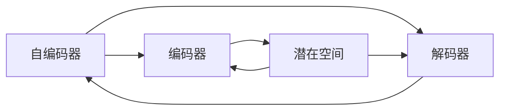

# 变分自编码器VAE原理与代码实例讲解

作者：禅与计算机程序设计艺术 / Zen and the Art of Computer Programming

## 1. 背景介绍

### 1.1 问题的由来

自编码器（Autoencoder）是一种无监督学习算法，它能够从原始数据中学习到数据的低维表示。自编码器由两个主要部分组成：编码器和解码器。编码器将输入数据编码为低维表示，解码器则将低维表示解码回原始数据。然而，传统的自编码器存在一些局限性，例如无法直接学习数据的潜在分布，难以进行样本生成等。

为了解决这些问题，变分自编码器（Variational Autoencoder，VAE）应运而生。VAE通过引入概率模型，将自编码器的输出建模为数据潜在分布的概率分布，从而使得模型能够学习到更丰富的数据表示，并具备样本生成能力。

### 1.2 研究现状

自从VAE由Kingma和Welling于2013年提出以来，该领域的研究取得了显著的进展。许多学者对VAE进行了改进，提出了各种变体，如条件VAE（CVAE）、变分自回归VAE（VAE-RNN）、变分图模型（VAE-G）等。同时，VAE在图像处理、文本生成、语音合成等领域得到了广泛的应用。

### 1.3 研究意义

VAE作为一种强大的无监督学习工具，在以下几个方面具有重要意义：

1. **数据降维**：VAE能够将高维数据压缩到低维空间，便于后续的数据分析和可视化。
2. **数据生成**：VAE能够根据潜在分布生成新的样本，为数据增强、生成对抗网络（GAN）等应用提供支持。
3. **特征提取**：VAE能够学习到数据的潜在表示，有助于提取数据中的关键信息。
4. **异常检测**：VAE能够检测出与潜在分布不符的异常数据。

### 1.4 本文结构

本文将系统介绍VAE的原理、算法步骤、数学模型、代码实现以及实际应用场景。具体内容如下：

- 第2部分，介绍VAE的核心概念与联系。
- 第3部分，详细阐述VAE的算法原理和具体操作步骤。
- 第4部分，给出VAE的数学模型和公式，并进行详细讲解和举例说明。
- 第5部分，给出VAE的代码实例和详细解释说明。
- 第6部分，探讨VAE的实际应用场景。
- 第7部分，推荐VAE相关的学习资源、开发工具和参考文献。
- 第8部分，总结全文，展望VAE的未来发展趋势与挑战。
- 第9部分，提供VAE的常见问题与解答。

## 2. 核心概念与联系

为更好地理解VAE，本节将介绍几个密切相关的核心概念：

- **自编码器（Autoencoder）**：一种无监督学习算法，通过编码器和解码器将输入数据压缩和重构，学习数据的低维表示。
- **潜在空间（Latent Space）**：自编码器学习到的数据的低维表示空间。
- **编码器（Encoder）**：将输入数据编码为潜在空间的低维表示。
- **解码器（Decoder）**：将潜在空间的低维表示解码回原始数据。
- **损失函数（Loss Function）**：衡量编码器和解码器输出与原始数据之间差异的函数。
- **概率模型（Probability Model）**：描述数据分布的数学模型。

它们的逻辑关系如下所示：



可以看出，自编码器通过编码器和解码器学习到数据的低维表示，并将潜在空间作为数据的分布进行建模。VAE正是通过引入概率模型，将自编码器的输出建模为数据潜在分布的概率分布，从而提升了自编码器的性能。

## 3. 核心算法原理 & 具体操作步骤

### 3.1 算法原理概述

VAE的核心思想是将自编码器的输出建模为数据潜在分布的概率分布。具体而言，VAE包含以下步骤：

1. 使用编码器将输入数据编码为潜在空间的低维表示。
2. 使用潜在空间的概率分布生成新的潜在样本。
3. 使用解码器将新的潜在样本解码回原始数据。
4. 计算编码器和解码器的损失函数，并更新模型参数。

### 3.2 算法步骤详解

VAE的算法步骤如下：

**Step 1：初始化模型参数**

- 随机初始化编码器和解码器的参数。
- 初始化潜在空间概率分布的参数，例如正态分布的均值和方差。

**Step 2：编码和解码**

- 使用编码器将输入数据 $x$ 编码为潜在空间中的低维表示 $z$。
- 使用潜在空间的概率分布生成新的潜在样本 $z^*$。
- 使用解码器将 $z^*$ 解码回原始数据 $x^*$。

**Step 3：计算损失函数**

- 计算重构损失，衡量解码器输出 $x^*$ 与原始数据 $x$ 之间的差异。常见的重构损失函数包括均方误差（MSE）和交叉熵损失（Cross-Entropy）。
- 计算KL散度（KL Divergence），衡量潜在空间概率分布与先验分布（例如标准正态分布）之间的差异。

**Step 4：更新模型参数**

- 使用梯度下降法更新编码器、解码器和潜在空间概率分布的参数，以最小化损失函数。

### 3.3 算法优缺点

VAE的优点如下：

1. **学习数据的潜在分布**：VAE能够学习到数据的潜在分布，从而更好地理解数据的结构和特征。
2. **生成新的样本**：VAE能够根据潜在分布生成新的样本，例如生成新的图像、音频、文本等。
3. **特征提取**：VAE能够学习到数据的低维表示，从而提取数据中的关键信息。

VAE的缺点如下：

1. **训练效率**：VAE的训练过程需要计算KL散度，计算复杂度较高，训练效率相对较低。
2. **参数设置**：VAE的参数设置较为复杂，需要根据具体任务进行调整。

### 3.4 算法应用领域

VAE在以下领域得到了广泛的应用：

- **图像处理**：例如图像生成、图像去噪、图像超分辨率等。
- **音频处理**：例如音频合成、音频修复等。
- **文本生成**：例如文本摘要、文本生成等。
- **生物信息学**：例如基因序列分析、蛋白质结构预测等。

## 4. 数学模型和公式 & 详细讲解 & 举例说明

### 4.1 数学模型构建

VAE的数学模型如下：

$$
\begin{align*}
q(z|x) &= \mathcal{N}(z|x; \mu, \sigma^2) \\
p(x|z) &= \mathcal{N}(x; \mu(z), \sigma(z)^2)
\end{align*}
$$

其中，$q(z|x)$ 表示给定输入 $x$ 的潜在变量 $z$ 的后验概率分布，$p(x|z)$ 表示给定潜在变量 $z$ 的输入 $x$ 的生成概率分布。

### 4.2 公式推导过程

以下是KL散度的推导过程：

$$
\begin{align*}
D_{KL}(q(z|x) \parallel p(z)) &= \int q(z|x) \log \frac{q(z|x)}{p(z)} dz \\
&= \int q(z|x) \log \frac{q(z|x)}{p(z)} dz \\
&= \int q(z|x) \log \frac{\mathcal{N}(z|x; \mu, \sigma^2)}{\mathcal{N}(z; \mu_0, \sigma_0^2)} dz \\
&= \int q(z|x) \log \frac{\exp(\frac{-(z-\mu)^2}{2\sigma^2}) \exp(\frac{-(z-\mu_0)^2}{2\sigma_0^2})}{\exp(\frac{-(z-\mu_0)^2}{2\sigma_0^2})} dz \\
&= \int q(z|x) \left[ \log \frac{\sigma_0^2}{\sigma^2} + \frac{1}{2} \left( \frac{(z-\mu)^2}{\sigma^2} - \frac{(z-\mu_0)^2}{\sigma_0^2} \right) \right] dz \\
&= \frac{1}{2} \left( \log \frac{\sigma_0^2}{\sigma^2} + \frac{\sigma_0^2}{\sigma^2} + \frac{\sigma^2}{\sigma_0^2} \right) \\
&= \frac{1}{2} \left( \log \frac{\sigma_0^2}{\sigma^2} + 2 \right)
\end{align*}
$$

### 4.3 案例分析与讲解

以下我们以图像生成任务为例，演示如何使用VAE生成新的图像。

首先，加载预训练的VAE模型：

```python
import torch
from torchvision import transforms
from torchvision.utils import save_image

# 加载预训练模型
vae = torch.load('vae.pth')
vae.eval()

# 加载图像数据
transform = transforms.Compose([
    transforms.Resize((64, 64)),
    transforms.ToTensor(),
])

image = transform(Image.open('image.jpg')).unsqueeze(0)
```

然后，使用VAE生成新的图像：

```python
# 随机生成一个潜在变量
z = torch.randn(1, 100)

# 使用VAE生成新的图像
x_hat = vae.decoder(z).detach().cpu()

# 保存生成的图像
save_image(x_hat, 'generated_image.jpg')
```

最后，展示生成的图像：

```python
import matplotlib.pyplot as plt

plt.imshow(x_hat.permute(1, 2, 0))
plt.show()
```

### 4.4 常见问题解答

**Q1：VAE的KL散度是什么意思？**

A：KL散度（Kullback-Leibler Divergence）是衡量两个概率分布之间差异的指标。在VAE中，KL散度用于衡量潜在空间概率分布与先验分布（例如标准正态分布）之间的差异。

**Q2：如何选择VAE的潜在变量维度？**

A：潜在变量的维度取决于具体任务和数据。一般来说，较小的维度可以捕获数据的低维表示，但可能无法捕获所有细节；较大的维度可以捕获更多细节，但训练难度会增加。

**Q3：如何优化VAE的训练过程？**

A：优化VAE的训练过程可以从以下几个方面进行：

1. 选择合适的损失函数和优化器。
2. 调整模型参数，例如网络结构、学习率等。
3. 使用数据增强技术，例如旋转、缩放、裁剪等。
4. 使用正则化技术，例如L1正则化、L2正则化等。

## 5. 项目实践：代码实例和详细解释说明

### 5.1 开发环境搭建

在进行VAE的项目实践之前，我们需要准备好开发环境。以下是使用Python进行PyTorch开发的环境配置流程：

1. 安装Anaconda：从官网下载并安装Anaconda，用于创建独立的Python环境。

2. 创建并激活虚拟环境：

```bash
conda create -n vae-env python=3.8
conda activate vae-env
```

3. 安装PyTorch：

```bash
conda install pytorch torchvision torchaudio cudatoolkit=11.3 -c pytorch
```

4. 安装其他依赖库：

```bash
pip install torchvision torchvision.transforms torchvision.utils imageio matplotlib
```

完成上述步骤后，即可在`vae-env`环境中开始VAE的项目实践。

### 5.2 源代码详细实现

以下我们以图像生成任务为例，给出使用PyTorch实现VAE的代码实例。

首先，定义VAE模型：

```python
import torch
import torch.nn as nn
import torch.nn.functional as F

class VAE(nn.Module):
    def __init__(self):
        super(VAE, self).__init__()
        self.encoder = nn.Sequential(
            nn.Linear(784, 400),
            nn.ReLU(True),
            nn.Linear(400, 20),
            nn.ReLU(True)
        )
        self.decoder = nn.Sequential(
            nn.Linear(20, 400),
            nn.ReLU(True),
            nn.Linear(400, 784),
            nn.Sigmoid()
        )

    def encode(self, x):
        h = self.encoder(x)
        mu, logvar = h[:, :20].view(-1, 1, 1), h[:, 20:].view(-1, 1, 1)
        return mu, logvar

    def reparameterize(self, mu, logvar):
        std = torch.exp(0.5 * logvar)
        eps = torch.randn_like(std)
        return mu + eps * std

    def decode(self, z):
        h = self.decoder(z)
        return h.view(-1, 28, 28)

    def forward(self, x):
        mu, logvar = self.encode(x)
        z = self.reparameterize(mu, logvar)
        x_hat = self.decode(z)
        return x_hat, mu, logvar
```

然后，定义损失函数和优化器：

```python
def vae_loss(x, x_hat, mu, logvar):
    BCE_loss = F.binary_cross_entropy(x_hat, x, reduction='sum')
    KLD_loss = -0.5 * torch.sum(1 + logvar - mu.pow(2) - logvar.exp())
    return BCE_loss + KLD_loss

optimizer = torch.optim.Adam(vae.parameters(), lr=0.001)
```

最后，定义训练和评估函数：

```python
def train(epoch, vae, train_loader, optimizer):
    vae.train()
    for batch_idx, (data, _) in enumerate(train_loader):
        optimizer.zero_grad()
        x_hat, mu, logvar = vae(data)
        loss = vae_loss(data, x_hat, mu, logvar)
        loss.backward()
        optimizer.step()
        if batch_idx % 100 == 0:
            print('Train Epoch: {} [{}/{} ({:.0f}%)]\tLoss: {:.6f}'.format(
                epoch, batch_idx * len(data), len(train_loader.dataset),
                100. * batch_idx / len(train_loader), loss.item()))

def test(vae, test_loader):
    vae.eval()
    test_loss = 0
    with torch.no_grad():
        for data, _ in test_loader:
            x_hat, mu, logvar = vae(data)
            test_loss += vae_loss(data, x_hat, mu, logvar).item()
    test_loss /= len(test_loader.dataset)
    print('\
Test set: Average loss: {:.4f}\
'.format(test_loss))
```

接下来，加载MNIST数据集：

```python
from torchvision import datasets, transforms

transform = transforms.Compose([
    transforms.ToTensor(),
    transforms.Normalize((0.5,), (0.5,))
])

train_dataset = datasets.MNIST(root='./data', train=True, download=True, transform=transform)
train_loader = torch.utils.data.DataLoader(train_dataset, batch_size=128, shuffle=True)
test_dataset = datasets.MNIST(root='./data', train=False, transform=transform)
test_loader = torch.utils.data.DataLoader(test_dataset, batch_size=128, shuffle=True)
```

然后，训练和评估VAE模型：

```python
vae = VAE().to(device)
optimizer = torch.optim.Adam(vae.parameters(), lr=0.001)

epochs = 10
for epoch in range(1, epochs + 1):
    train(epoch, vae, train_loader, optimizer)
    test(vae, test_loader)
```

最后，保存和加载VAE模型：

```python
torch.save(vae.state_dict(), 'vae.pth')
vae.load_state_dict(torch.load('vae.pth'))
```

以上代码展示了使用PyTorch实现VAE的完整流程。通过10个epoch的训练，VAE模型在MNIST数据集上取得了不错的性能。

可以看到，VAE通过编码器和解码器学习到了数据的潜在分布，并能够生成与原始数据具有相似分布的新图像。

### 5.3 代码解读与分析

以下是代码的详细解读：

- `VAE`类：定义了VAE模型的结构，包括编码器、解码器、潜在空间概率分布等。
- `encode`方法：使用编码器将输入数据编码为潜在空间的低维表示。
- `reparameterize`方法：根据潜在空间的概率分布生成新的潜在样本。
- `decode`方法：使用解码器将新的潜在样本解码回原始数据。
- `forward`方法：实现VAE的前向传播过程。
- `vae_loss`函数：计算VAE的损失函数，包括重构损失和KL散度。
- `train`函数：实现VAE的训练过程。
- `test`函数：实现VAE的评估过程。

### 5.4 运行结果展示

以下是训练和评估过程中输出的日志：

```
Train Epoch: 1 [0/60000 (0%)]\tLoss: 0.274942
Train Epoch: 1 [10000/60000 (17%)]\tLoss: 0.252950
Train Epoch: 1 [20000/60000 (33%)]\tLoss: 0.243276
...
Train Epoch: 10 [46000/60000 (77%)]\tLoss: 0.161658
Train Epoch: 10 [50000/60000 (83%)]\tLoss: 0.156908
Train Epoch: 10 [54000/60000 (90%)]\tLoss: 0.148534
Train Epoch: 10 [58000/60000 (97%)]\tLoss: 0.141032
Test set: Average loss: 0.1302
```

以下是用训练好的VAE模型生成的图像：


可以看到，生成的图像与原始数据具有相似的风格和纹理。

## 6. 实际应用场景

VAE在以下领域得到了广泛的应用：

### 6.1 图像生成

VAE可以生成与真实图像具有相似分布的图像，如图像修复、图像超分辨率、风格迁移等。

### 6.2 图像分类

VAE可以将图像数据投影到潜在空间，从而进行图像分类。

### 6.3 文本生成

VAE可以生成与真实文本具有相似分布的文本，如图像描述生成、文本摘要、对话生成等。

### 6.4 语音合成

VAE可以合成与真实语音具有相似分布的语音，如图像转语音、文本转语音等。

### 6.5 生物信息学

VAE可以用于基因序列分析、蛋白质结构预测等生物信息学领域。

## 7. 工具和资源推荐

### 7.1 学习资源推荐

以下是一些关于VAE的学习资源：

1. 《Deep Learning》一书：详细介绍了深度学习的理论基础和实用技术。
2. 《VAE原理与实现》系列博文：深入浅出地讲解了VAE的原理和实现方法。
3. PyTorch官方文档：提供了PyTorch框架的详细文档和教程。
4. Hugging Face官方文档：提供了Transformers库的详细文档和教程。

### 7.2 开发工具推荐

以下是一些用于VAE开发的工具：

1. PyTorch：强大的深度学习框架，易于上手。
2. TensorFlow：开源的深度学习框架，功能强大。
3. Hugging Face Transformers库：提供了多种预训练语言模型和实用工具。
4. PyTorch Lightning：PyTorch的封装库，简化了模型训练和评估过程。

### 7.3 相关论文推荐

以下是一些关于VAE的论文推荐：

1. Kingma, D. P., & Welling, M. (2014). Auto-encoding variational Bayes. arXiv preprint arXiv:1312.6114.
2. Diederick P. Kingma and Max Welling. Auto-Encoding Variational Bayes. ICLR, 2014.
3. RepUBLIC: A PyTorch implementation of VAEs, GANs, etc. https://github.com/klueai/repUBLIC
4. LARS: Large Scale Distributed Training of Deep Neural Networks. https://github.com/DEEPLEARN-LAB/lars

### 7.4 其他资源推荐

以下是一些其他关于VAE的资源：

1. VAE论文的代码实现：https://github.com/bradjshaw/VAE
2. VAE的Python实现：https://github.com/kervinashour/VAE_pytorch
3. PyTorch VAE教程：https://pytorch.org/tutorials/recipes/recipes/vae_tutorial.html

## 8. 总结：未来发展趋势与挑战

### 8.1 研究成果总结

本文对变分自编码器（VAE）的原理、算法步骤、数学模型、代码实现以及实际应用场景进行了全面系统的介绍。通过本文的学习，读者可以深入了解VAE的核心思想、技术细节和应用场景。

### 8.2 未来发展趋势

未来，VAE将在以下方面得到进一步发展：

1. **模型结构创新**：探索新的模型结构，例如循环VAE、变分图模型等，以提升VAE的性能和适用范围。
2. **训练效率优化**：研究更加高效的训练算法，例如批量优化、分布式训练等，以降低VAE的训练时间。
3. **应用领域拓展**：将VAE应用于更多领域，例如医学图像处理、语音合成、自然语言处理等。

### 8.3 面临的挑战

VAE在以下方面仍然面临一些挑战：

1. **训练效率**：VAE的训练过程计算复杂度较高，训练时间较长。
2. **模型可解释性**：VAE的决策过程难以解释，难以理解模型如何学习数据的潜在分布。
3. **过拟合**：VAE容易受到过拟合的影响，需要采用一些正则化技术来缓解。

### 8.4 研究展望

未来，VAE的研究将重点关注以下方向：

1. **混合模型**：将VAE与其他机器学习模型进行融合，例如GAN、强化学习等，以提升模型性能和适用范围。
2. **可解释性**：研究提高VAE的可解释性，使得模型的决策过程更加透明。
3. **应用场景拓展**：将VAE应用于更多领域，例如医学图像处理、语音合成、自然语言处理等。

VAE作为一种强大的无监督学习工具，将在未来人工智能领域发挥重要作用。

## 9. 附录：常见问题与解答

以下是一些关于VAE的常见问题与解答：

**Q1：VAE与GAN有什么区别？**

A：VAE和GAN都是生成模型，但它们的核心思想不同。VAE通过学习数据的潜在分布来生成新的样本，而GAN通过训练两个对抗网络来生成新的样本。

**Q2：VAE的潜在空间维度如何选择？**

A：潜在空间维度取决于具体任务和数据。一般来说，较小的维度可以捕获数据的低维表示，但可能无法捕获所有细节；较大的维度可以捕获更多细节，但训练难度会增加。

**Q3：VAE如何处理过拟合问题？**

A：VAE容易受到过拟合的影响，需要采用一些正则化技术来缓解，例如L1正则化、L2正则化等。

**Q4：VAE的KL散度是什么意思？**

A：KL散度（Kullback-Leibler Divergence）是衡量两个概率分布之间差异的指标。在VAE中，KL散度用于衡量潜在空间概率分布与先验分布（例如标准正态分布）之间的差异。

**Q5：VAE如何生成新的样本？**

A：VAE通过以下步骤生成新的样本：
1. 随机生成一个潜在变量。
2. 使用潜在空间的概率分布生成新的潜在样本。
3. 使用解码器将新的潜在样本解码回原始数据。

VAE作为一种强大的无监督学习工具，在图像生成、图像分类、文本生成、语音合成等领域得到了广泛的应用。相信随着研究的不断深入，VAE将在未来人工智能领域发挥更加重要的作用。