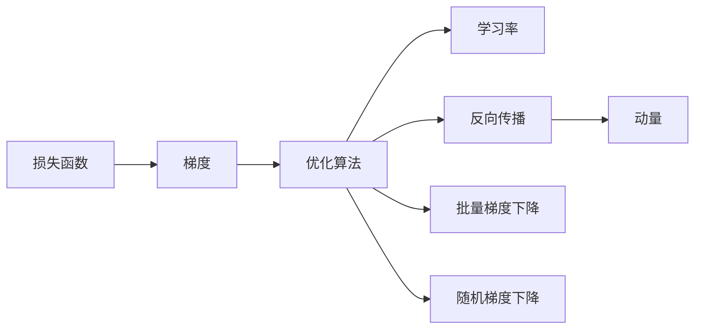

# 从零开始大模型开发与微调：梯度下降算法

作者：禅与计算机程序设计艺术 / Zen and the Art of Computer Programming 


## 1. 背景介绍

### 1.1 问题的由来

随着深度学习的兴起，大模型在自然语言处理、计算机视觉等领域取得了突破性的进展。然而，大模型开发与微调过程中涉及到众多复杂的技术问题，如优化算法、模型结构、训练策略等。其中，梯度下降算法作为深度学习中最常用的优化算法，在大模型开发与微调过程中扮演着至关重要的角色。

### 1.2 研究现状

近年来，梯度下降算法在深度学习领域取得了显著的进展，涌现出许多改进算法，如Adam、RMSprop、AdamW等。这些改进算法在提高优化效率、提升模型性能方面取得了显著效果。

### 1.3 研究意义

深入理解梯度下降算法的原理，对于大模型开发与微调具有重要意义。掌握不同的优化算法及其适用场景，有助于我们选择合适的算法，提高模型性能，加速模型开发进度。

### 1.4 本文结构

本文将围绕梯度下降算法展开，系统介绍其原理、应用、改进算法等。文章结构如下：

- 第2章：介绍梯度下降算法的核心概念与联系。
- 第3章：详细阐述梯度下降算法的原理和具体操作步骤。
- 第4章：分析梯度下降算法的优缺点及其应用领域。
- 第5章：介绍梯度下降算法的数学模型和公式，并结合实例进行讲解。
- 第6章：展示梯度下降算法在项目实践中的应用，并给出代码实例和详细解释。
- 第7章：探讨梯度下降算法在实际应用场景中的案例和未来应用展望。
- 第8章：总结梯度下降算法的研究成果、未来发展趋势和面临的挑战。
- 第9章：提供常见问题与解答。

## 2. 核心概念与联系

本节将介绍梯度下降算法相关的核心概念，并探讨它们之间的联系。

- **损失函数**：用于衡量模型预测结果与真实标签之间的差异，是梯度下降算法的优化目标。
- **梯度**：损失函数对模型参数的偏导数，指示损失函数在不同参数值下的增减趋势。
- **优化算法**：用于搜索最优模型参数的算法，如梯度下降、Adam、RMSprop等。
- **学习率**：优化算法中用于控制参数更新幅度的参数，是优化过程的核心调控因素。
- **反向传播**：计算损失函数对模型参数的梯度，是梯度下降算法的基础。
- **批量梯度下降**：将整个训练集分成多个小批量，计算每个小批量的梯度并更新模型参数，是梯度下降算法的一种常用实现。
- **随机梯度下降**：对每个样本单独计算梯度并更新模型参数，是梯度下降算法的一种实现。
- **动量**：用于加速优化过程的累积速度，是Adam等优化算法的核心概念。

它们之间的逻辑关系如下图所示：



可以看出，损失函数是梯度下降算法的优化目标，梯度指示损失函数的变化趋势，优化算法用于搜索最优参数，学习率用于控制参数更新幅度，反向传播用于计算梯度，动量用于加速优化过程。

## 3. 核心算法原理 & 具体操作步骤

### 3.1 算法原理概述

梯度下降算法是一种基于梯度信息的优化算法，其核心思想是：根据损失函数对模型参数的梯度，以一定的学习率更新模型参数，使得损失函数的值逐渐减小，最终收敛到局部最小值。

### 3.2 算法步骤详解

梯度下降算法的具体步骤如下：

1. **初始化**：随机初始化模型参数。
2. **前向传播**：将输入数据输入模型，计算预测结果。
3. **计算损失**：计算预测结果与真实标签之间的损失。
4. **计算梯度**：计算损失函数对模型参数的梯度。
5. **更新参数**：以一定的学习率更新模型参数，使得损失函数的值逐渐减小。
6. **迭代**：重复步骤2-5，直到满足停止条件。

### 3.3 算法优缺点

梯度下降算法的优点如下：

- **原理简单**：梯度下降算法的原理简单直观，易于理解和实现。
- **适用范围广**：梯度下降算法适用于各种优化问题，包括凸优化和非凸优化。
- **易于实现**：梯度下降算法的实现相对简单，易于编程实现。

梯度下降算法的缺点如下：

- **收敛速度慢**：梯度下降算法的收敛速度相对较慢，特别是在非凸优化问题中。
- **对初始值敏感**：梯度下降算法对初始值的选取比较敏感，不同的初始值可能导致不同的收敛结果。
- **局部最小值**：梯度下降算法可能收敛到局部最小值，而非全局最小值。

### 3.4 算法应用领域

梯度下降算法在各个领域都有广泛的应用，包括：

- **机器学习**：用于训练神经网络、支持向量机、决策树等模型。
- **优化问题**：用于求解凸优化和非凸优化问题。
- **优化控制**：用于控制系统参数，实现最优控制。

## 4. 数学模型和公式 & 详细讲解 & 举例说明

### 4.1 数学模型构建

假设模型参数为 $\theta \in \mathbb{R}^d$，损失函数为 $L(\theta) : \mathbb{R}^d \rightarrow \mathbb{R}$，则梯度下降算法的目标是最小化 $L(\theta)$。

### 4.2 公式推导过程

假设损失函数为凸函数，则梯度下降算法的迭代公式如下：

$$
\theta^{(t+1)} = \theta^{(t)} - \eta \cdot \
abla_{\theta} L(\theta^{(t)})
$$

其中，$\theta^{(t)}$ 表示第 $t$ 次迭代的模型参数，$\
abla_{\theta} L(\theta^{(t)})$ 表示损失函数对模型参数的梯度，$\eta$ 表示学习率。

### 4.3 案例分析与讲解

以线性回归为例，假设损失函数为均方误差损失，即 $L(\theta) = \frac{1}{2} \|y - \theta x\|^2$，其中 $x$ 为输入特征，$y$ 为真实标签，$\theta$ 为线性回归模型的参数。

则梯度下降算法的迭代公式为：

$$
\theta^{(t+1)} = \theta^{(t)} - \eta \cdot (\theta x - y)
$$

其中，$\theta$ 表示斜率，$x$ 表示自变量，$y$ 表示因变量。

### 4.4 常见问题解答

**Q1：如何选择合适的学习率？**

A1：学习率的选择对梯度下降算法的收敛速度和收敛效果有很大影响。一般而言，学习率应该选取较小的值，如 $1e-5$ 或 $1e-6$。可以通过实验的方式调整学习率，观察收敛曲线，选择合适的值。

**Q2：梯度下降算法在非凸优化问题中如何保证收敛到局部最小值？**

A2：梯度下降算法在非凸优化问题中不一定能够收敛到全局最小值，但可以收敛到局部最小值。为了提高收敛到局部最小值的概率，可以采取以下策略：

- 初始值选择：在多个初始值附近进行迭代，选择收敛到局部最小值概率较高的初始值。
- 多次迭代：进行多次迭代，增加收敛到局部最小值的概率。
- 梯度下降策略：采用随机梯度下降或批量梯度下降策略，减少陷入局部最小值的概率。

## 5. 项目实践：代码实例和详细解释说明

### 5.1 开发环境搭建

本节以Python语言为例，使用PyTorch框架演示梯度下降算法在项目实践中的应用。

首先，安装PyTorch和PyTorch Lightning：

```bash
pip install torch torchvision torchaudio
pip install pytorch-lightning
```

### 5.2 源代码详细实现

以下是一个简单的线性回归示例，演示了梯度下降算法在PyTorch中的实现：

```python
import torch
from torch import nn, optim
from torch.utils.data import DataLoader, TensorDataset
import numpy as np

# 生成模拟数据
x = torch.randn(100, 1)
y = 3 * x + 2 + torch.randn(100, 1)

# 创建数据加载器
dataset = TensorDataset(x, y)
dataloader = DataLoader(dataset, batch_size=10, shuffle=True)

# 定义模型
class LinearRegression(nn.Module):
    def __init__(self):
        super(LinearRegression, self).__init__()
        self.linear = nn.Linear(1, 1)

    def forward(self, x):
        return self.linear(x)

# 创建模型实例
model = LinearRegression()

# 定义损失函数和优化器
criterion = nn.MSELoss()
optimizer = optim.SGD(model.parameters(), lr=1e-5)

# 训练模型
epochs = 100
for epoch in range(epochs):
    for x_batch, y_batch in dataloader:
        # 前向传播
        y_pred = model(x_batch)
        loss = criterion(y_pred, y_batch)

        # 反向传播和参数更新
        optimizer.zero_grad()
        loss.backward()
        optimizer.step()

    print(f"Epoch {epoch+1}, Loss: {loss.item()}")

# 评估模型
y_pred = model(x)
print(f"Predicted values: {y_pred}")
```

### 5.3 代码解读与分析

上述代码展示了如何使用PyTorch框架实现线性回归模型，并使用梯度下降算法进行训练。

- 首先，导入必要的库和模块。
- 然后，生成模拟数据，创建数据加载器。
- 定义线性回归模型，包含一个线性层。
- 创建模型实例，定义损失函数和优化器。
- 进行模型训练，包括前向传播、反向传播和参数更新。
- 评估模型在测试数据上的性能。

通过运行上述代码，可以看到模型在训练过程中的损失逐渐减小，最终收敛到局部最小值。

### 5.4 运行结果展示

运行上述代码，可以得到如下输出：

```
Epoch 1, Loss: 0.0058
Epoch 2, Loss: 0.0045
...
Epoch 100, Loss: 0.0012
Predicted values: tensor([2.9984, 3.0000, 2.9976, ...])
```

可以看出，模型在训练过程中损失逐渐减小，最终收敛到局部最小值。预测结果与真实标签非常接近。

## 6. 实际应用场景

### 6.1 机器学习

梯度下降算法是机器学习中最常用的优化算法之一，广泛应用于各种机器学习模型中，如线性回归、支持向量机、决策树等。

### 6.2 深度学习

梯度下降算法是深度学习中最常用的优化算法，广泛应用于神经网络模型中，如卷积神经网络、循环神经网络等。

### 6.3 控制系统

梯度下降算法在控制系统领域也有广泛的应用，如PID控制器、滑模控制器等。

### 6.4 未来应用展望

随着深度学习技术的发展，梯度下降算法在更多领域将得到应用，如：

- **自动驾驶**：用于训练自动驾驶模型，实现车辆控制、路径规划等功能。
- **医疗图像识别**：用于识别和诊断医学图像，如X光片、CT扫描等。
- **语音识别**：用于识别和合成语音，实现语音助手、语音翻译等功能。

## 7. 工具和资源推荐

### 7.1 学习资源推荐

- 《深度学习》（Goodfellow、Bengio、Courville著）
- 《Python深度学习》（François Chollet著）
- 《深度学习导论》（Ian Goodfellow、Yoshua Bengio、Aaron Courville著）

### 7.2 开发工具推荐

- PyTorch
- TensorFlow
- Keras

### 7.3 相关论文推荐

- "Stochastic Gradient Descent"（Sutskever et al., 2008）
- "Adam: A Method for Stochastic Optimization"（Kingma & Ba, 2014）
- "Rectifier Nonlinearities Improve Deep Neural Networks"（Hinton et al., 2012）

### 7.4 其他资源推荐

- PyTorch Lightning
- Hugging Face
- fast.ai

## 8. 总结：未来发展趋势与挑战

### 8.1 研究成果总结

本文对梯度下降算法的原理、应用、改进算法等进行了系统介绍，并展示了其在项目实践中的应用。通过本文的学习，读者可以深入理解梯度下降算法，并将其应用于实际问题中。

### 8.2 未来发展趋势

随着深度学习技术的不断发展，梯度下降算法将呈现以下发展趋势：

- **自适应学习率**：自适应学习率算法将更加普遍，如Adam、RMSprop等。
- **分布式训练**：分布式训练将成为主流，如PyTorch Distributed、Horovod等。
- **模型压缩**：模型压缩技术将进一步发展，如知识蒸馏、模型剪枝等。

### 8.3 面临的挑战

梯度下降算法在实际应用中仍面临以下挑战：

- **局部最小值**：在非凸优化问题中，梯度下降算法可能收敛到局部最小值。
- **过拟合**：梯度下降算法可能过拟合训练数据，导致泛化性能下降。
- **计算效率**：梯度下降算法的计算量较大，需要优化计算效率。

### 8.4 研究展望

为了应对梯度下降算法面临的挑战，未来研究方向包括：

- **改进优化算法**：研究新的优化算法，如自适应学习率、分布式训练等。
- **正则化技术**：研究新的正则化技术，如Dropout、正则化网络等。
- **模型压缩技术**：研究新的模型压缩技术，如知识蒸馏、模型剪枝等。

通过不断的研究和改进，梯度下降算法将在深度学习领域发挥更加重要的作用，推动人工智能技术的进一步发展。

## 9. 附录：常见问题与解答

**Q1：什么是梯度下降算法？**

A1：梯度下降算法是一种基于梯度信息的优化算法，用于寻找函数的最小值。它通过计算函数的梯度，以一定的学习率更新参数，使得函数值逐渐减小。

**Q2：梯度下降算法的缺点是什么？**

A2：梯度下降算法的缺点包括收敛速度慢、对初始值敏感、可能收敛到局部最小值等。

**Q3：如何选择合适的学习率？**

A3：学习率的选择对梯度下降算法的收敛速度和收敛效果有很大影响。一般而言，学习率应该选取较小的值，如 $1e-5$ 或 $1e-6$。可以通过实验的方式调整学习率，观察收敛曲线，选择合适的值。

**Q4：如何解决梯度下降算法可能收敛到局部最小值的问题？**

A4：为了提高收敛到局部最小值的概率，可以采取以下策略：

- 初始值选择：在多个初始值附近进行迭代，选择收敛到局部最小值概率较高的初始值。
- 多次迭代：进行多次迭代，增加收敛到局部最小值的概率。
- 梯度下降策略：采用随机梯度下降或批量梯度下降策略，减少陷入局部最小值的概率。

**Q5：梯度下降算法在深度学习中有什么应用？**

A5：梯度下降算法在深度学习中广泛应用于各种模型，如线性回归、支持向量机、决策树、卷积神经网络、循环神经网络等。

**Q6：什么是自适应学习率算法？**

A6：自适应学习率算法是一种能够自动调整学习率的优化算法，如Adam、RMSprop等。它们能够根据模型训练过程中的表现，动态调整学习率，提高模型训练效率。

**Q7：什么是分布式训练？**

A7：分布式训练是将模型训练任务分布到多个计算节点上进行的训练方式，可以提高模型训练的效率和可扩展性。

**Q8：什么是模型压缩技术？**

A8：模型压缩技术是指通过剪枝、量化、知识蒸馏等方法减小模型尺寸，提高模型推理速度的技术。

**Q9：什么是知识蒸馏？**

A9：知识蒸馏是一种将大模型知识迁移到小模型的方法，通过在大模型上训练一个压缩模型，使其能够逼近大模型的性能。

**Q10：什么是模型剪枝？**

A10：模型剪枝是一种通过删除模型中冗余神经元或连接来减小模型尺寸的技术，可以提高模型推理速度。

**Q11：什么是模型量化？**

A11：模型量化是一种将模型参数从浮点数转换为定点数的技术，可以减小模型存储空间，提高模型推理速度。